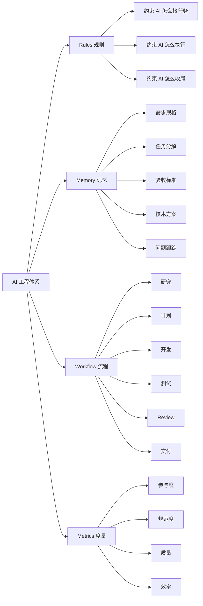
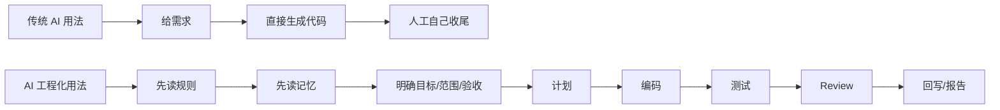
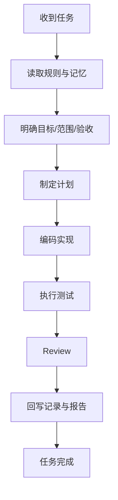
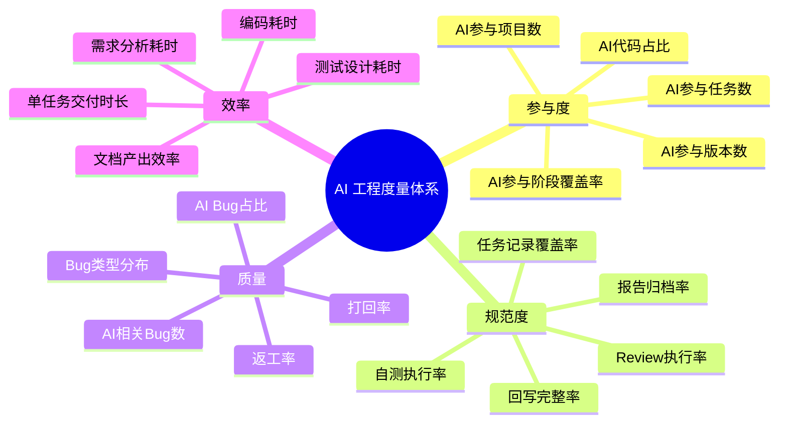

# AI 工程下一步：从“会写代码”到“按体系交付”

> **结论先行：**  
> AI 工程的下一步，不是“让 AI 多写点代码”，而是把 AI 参与研发这件事，变成**可度量、可审计、可复盘、可复制**的工程体系。

- --

* *==过去我们讨论 AI 编程，关注的是“AI 能不能写”。  
接下来真正值得投入的，是“AI 怎么按工程体系工作”。==**  

* *==团队如果只把 AI 当成一个临时工具，最终只能得到零散的提效；  
但如果把 AI 纳入规则、记忆、流程和度量体系里，得到的就是可复制的组织能力。==**  

* *==这才是 AI Coding 真正的下半场。==**

# 一、为什么现在必须谈 AI 工程

AI Coding 已经从“个人效率工具”进入“团队普遍使用”的阶段。

现在真正的问题，不再是：

- AI 能不能写代码
- 模型够不够强
- 哪个工具更好用

而是：

- AI 参与研发如何标准化
- AI 产出如何可追踪、可审计
- AI 质量如何量化
- AI 是否真的提效
- 团队流程是否需要为 AI 升级

换句话说，团队下一步真正要建设的，不是“AI 使用习惯”，而是：

> **面向 AI 协作研发的规范、流程、记忆体系、评估体系。**

- --

# 二、我们真正要解决的问题

## 2.1 当前团队常见现象

很多团队已经开始使用 AI 写代码、生成测试、辅助写文档，但整体还停留在“个人自发使用”的阶段，典型问题包括：

| 问题 | 现象 | 后果 |
|---|---|---|
| AI 参与不透明 | 谁用了 AI、在哪个阶段用了，不清楚 | 无法评估价值 |
| AI 产出不可追踪 | 代码、测试、文档没有明确标识 | 无法审计 |
| AI 质量不可量化 | 只能凭感觉说“还行” | 无法建立管理闭环 |
| AI 工作不规范 | 有时先计划，有时直接写，有时不测 | 结果不可控 |
| AI 经验无法沉淀 | 当前会话做过什么，下一个 AI 不知道 | 重复劳动、重复踩坑 |

- --

## 2.2 下一步建设目标

团队要建设的，不是“AI 会不会写代码”，而是以下六件事：

| 目标 | 说明 |
|---|---|
| 标准化 | 统一 AI 接任务、执行、测试、交付方式 |
| 可追踪 | 知道 AI 参与了哪些项目、版本、任务、代码 |
| 可审计 | 知道 AI 是否按规范做了计划、测试、Review、回写 |
| 可量化 | 能统计 AI 的参与度、质量、提效情况 |
| 可复盘 | 能回看 AI 产出的问题、收益和趋势 |
| 可复制 | 一套方法可在多个项目、多个团队复用 |

- --

# 三、AI 工程体系的核心框架

## 3.1 四个支柱

AI 工程体系的核心，不是某一个模型或某一个工具，而是四个支柱：

- **Rules**：规则
- **Memory**：记忆
- **Workflow**：流程
- **Metrics**：度量



- --

## 3.2 四个支柱分别解决什么问题

| 支柱 | 核心问题 | 作用 |
|---|---|---|
| Rules | AI 应该怎么做事 | 把开发规范 AI 化 |
| Memory | AI 如何跨会话连续工作 | 把过程文档变成工作记忆 |
| Workflow | AI 如何按步骤完成任务 | 把研发流程固化 |
| Metrics | AI 是否真的创造价值 | 把 AI 使用效果量化 |

- --

# 四、Rules：以前约束人，现在约束 AI

## 4.1 Rules 的本质

> **Rules 的本质，是“开发规范的 AI 化”。**

过去开发规范约束的是：

- 人怎么接需求
- 人怎么写代码
- 人怎么提测
- 人怎么交付

现在 Rules 约束的是：

- AI 怎么接任务
- AI 怎么读上下文
- AI 怎么计划
- AI 怎么进入编码
- AI 怎么处理阻塞
- AI 怎么测试
- AI 怎么回写
- AI 怎么结束任务

- --

## 4.2 Rules 的实际作用

Rules 的作用不是“让 AI 更谨慎”，而是让 AI 的工作方式变得**稳定、可控、可复用**。

### 典型场景映射

| 场景 | 应加载规则 | 作用 |
|---|---|---|
| 收到新任务 | `02-before-action.md` | 先看需求、范围、验收，不直接编码 |
| 正在写代码 | `04-how-to-work.md` | 按阶段工作，不跳步骤 |
| 遇到阻塞 | `05-when-stuck.md` | 记录问题、给方案，不瞎改 |
| 开始测试 / Review | `06-testing-and-review.md` | 强制验证与审查 |
| 任务结束 | `07-after-done.md` | 强制回写、补证据、补报告 |
| 涉及前端体验 | `11-product-thinking.md` | 防止只做功能、不顾体验 |

- --

## 4.3 Rules 的价值

Rules 的真正目标，是让 AI 从“代码生成器”升级成“开发伙伴”。



- --

# 五、Memory：以前是文档副产品，现在是 AI 工作记忆

## 5.1 Memory 的本质

> **Memory 的本质，是 AI 跨会话协作的持续上下文层。**

对人来说，很多文档以前只是项目管理副产品。  
对 AI 来说，这些文档是：

- 下一次继续工作的唯一依据
- 当前状态的唯一真相
- 历史问题的唯一证据链

- --

## 5.2 关键 memory 文档及其意义

| 文档 | 对 AI 来说是什么 | 不维护的后果 |
|---|---|---|
| 需求规格 | 需求的唯一定义 | 下一个 AI 按错误理解继续做 |
| 任务分解 | 当前进度的唯一真相 | 下一个 AI 不知道做到哪一步 |
| 验收标准 | 完成的唯一判据 | AI 不知道什么算“完成” |
| 技术方案 | 实现边界和路径依据 | 后续实现偏离设计 |
| 问题跟踪 | 已知坑的唯一记录 | 同样的问题反复踩 |
| 变更记录 | 历史修改证据 | 复盘时找不到依据 |
| 测试记录 | 验证结果证据 | 说“测过了”但无法证明 |

- --

## 5.3 为什么必须“写下来”
AI 的一个根本限制是：

> 当前会话的 AI，不等于下一次会话的 AI。

所以：

- “我记住了”没有意义
- “下次应该还知道”不可靠
- **只有写入 Memory，才算真正沉淀**

- --

# 六、Workflow：让 AI 按流程做事，而不是临场发挥

## 6.1 标准流程建议

AI 在研发中的标准流程，不应该是“收到任务 -> 直接写代码”，而应该是：



- --

## 6.2 每个阶段应产出什么

| 阶段 | 输出物 | 是否必须 |
|---|---|---|
| 研究 | 研究结论 / 技术分析 | 大任务建议有 |
| 计划 | 任务拆解 / 实施计划 | 大任务必须 |
| 开发 | 代码变更 | 必须 |
| 测试 | 测试记录 / 报告 | 必须 |
| Review | 审查结论 | 必须 |
| 收尾 | 变更记录 / 验收证据 / 回滚方案 | 必须 |

- --

## 6.3 Workflow 的价值
Workflow 让 AI 的工作不再依赖“当前模型状态”或“临场发挥”，而变成：

- 可复用
- 可复制
- 可交接
- 可检查

- --

# 七、即时回写机制：AI 不是做完就算，而是做完必须回写

## 7.1 原则

> **AI 任务没有“做完但没记录”，只有“做完并回写”。**

如果没有回写，就没有连续性。  
如果没有连续性，就谈不上 AI 工程。

- --

## 7.2 回写规则

| 做了什么 | 必须立即做 |
|---|---|
| 修复了 Bug | 更新 `问题跟踪.md` + 更新 `任务分解.md` |
| 运行了测试 | 更新 `验收标准.md` + 更新 `测试记录.md` |
| 完成了任务 | `任务分解.md` 标记 `[x]` + 验收补证据 |
| 新增了文件 | 更新 `项目结构.md` |
| 改了 API | 更新接口文档 + 检查前端调用 + 更新变更记录 |
| 做了 Review | 留下 Review 结论 |
| 有风险发现 | 更新 `风险清单.md` / `问题跟踪.md` |

- --

## 7.3 回写机制解决什么问题

| 没有回写 | 有回写 |
|---|---|
| AI 每次都像重新开始 | AI 可以继承上下文 |
| 问题靠人记忆 | 问题有证据链 |
| 任务状态模糊 | 任务状态清晰 |
| Bug 容易重复踩 | 历史坑可复用 |
| 测试做没做说不清 | 测试结果可追踪 |

- --

# 八、Metrics：最终必须拿数据说话

## 8.1 指标体系总览

AI 工程度量体系建议拆成四层：

- **参与度**
- **规范度**
- **质量**
- **效率**



- --

## 8.2 参与度指标

| 指标 | 说明 |
|---|---|
| AI参与项目数 | 有 AI 参与记录的项目数量 |
| AI参与版本数 | 有 AI 参与记录的版本数量 |
| AI参与任务数 | 明确标记 AI 参与的任务数量 |
| AI参与阶段覆盖率 | AI 在需求/方案/开发/测试/Review/文档等阶段的覆盖情况 |
| AI代码产出占比 | AI 生成/修改代码行数 / 总代码变更行数 |
| AI测试产出占比 | AI 新增/修改测试代码行数 / 总测试变更行数 |
| AI文档产出占比 | AI 新增/修改文档行数 / 总文档变更行数 |

- --

## 8.3 规范度指标

| 指标 | 说明 |
|---|---|
| AI任务日志覆盖率 | AI 任务是否留下完整任务记录 |
| AI计划覆盖率 | AI 任务是否先做计划 |
| AI自测执行率 | AI 编码后是否做了自测 |
| AI Review 执行率 | AI 是否完成 Review 流程 |
| AI报告归档率 | AI 是否输出报告并归档 |
| AI回写完整率 | 是否更新任务/验收/变更/测试/问题文档 |

- --

## 8.4 质量指标

| 指标 | 说明 |
|---|---|
| AI相关 Bug 数 | 与 AI 产出直接相关的缺陷数 |
| AI Bug 占比 | AI 相关 Bug / 总 Bug |
| AI Bug 类型分布 | 需求理解错误、边界遗漏、逻辑错误、测试不足等 |
| AI代码打回率 | AI 相关任务被 Review 打回的比例 |
| AI返工率 | AI 任务发生返工的比例 |
| AI平均返工次数 | AI 任务平均返工次数 |
| AI缺陷修复周期 | AI 缺陷从发现到关闭的平均时长 |

- --

## 8.5 效率指标

| 指标 | 说明 |
|---|---|
| 单任务平均交付时长 | 一个任务从开始到完成的平均耗时 |
| 需求分析耗时变化 | AI 引入前后分析阶段耗时变化 |
| 技术方案耗时变化 | AI 引入前后方案阶段耗时变化 |
| 开发耗时变化 | AI 引入前后编码阶段耗时变化 |
| 测试设计效率 | 测试产出效率变化 |
| 文档沉淀效率 | 文档输出效率变化 |
| 人均交付能力变化 | 每人每迭代交付能力变化 |

- --

# 九、团队下一步真正该建设什么

## 9.1 建立 AI 原生工程目录：`.agent/`

真正值得建设的，不是更多 prompt，而是一套可落地的 AI 原生工程目录。

```text
.agent/
├── project.md
├── rules/
├── memory/
├── workflows/
├── templates/
├── scripts/
├── runtime/
├── triggers/
├── metrics/
└── reports/
```

- --

## 9.2 各目录职责

| 目录 | 作用 |
|---|---|
| `project.md` | 项目配置与 AI 工作边界 |
| `rules/` | AI 行为规则 |
| `memory/` | AI 长期工作记忆 |
| `workflows/` | 标准任务流 |
| `templates/` | 标准交付模板 |
| `scripts/` | 自动化脚本 |
| `runtime/` | OpenClaw / OpenCode 运行约束 |
| `triggers/` | 任务场景触发器 |
| `metrics/` | AI 工程度量指标 |
| `reports/` | AI 交付结果归档 |

- --

## 9.3 为什么是 `.agent/`
因为这套结构不是为了“让人看起来更规范”，而是为了让 AI 在项目中真正有：

- 规则可读
- 记忆可继承
- 流程可执行
- 结果可证明

- --

# 十、团队落地路径建议

## 第一阶段：先让 AI 有规则和记忆
目标：
- 建 `rules`
- 建 `memory`
- 建最小工作流

重点：
- 不求一步到位
- 先让 AI 不再裸奔

- --

## 第二阶段：让 AI 结果可追踪
目标：
- AI 任务加标签
- AI 交付必须有报告
- AI 任务必须回写

重点：
- 所有 AI 参与工作必须留下痕迹

- --

## 第三阶段：让 AI 价值可度量
目标：
- 建 metrics
- 建采集脚本
- 周期性统计

重点：
- 不再靠感觉评价 AI
- 开始用数据说话

- --

## 第四阶段：让 AI 工程可复制
目标：
- 模板化
- 标准化
- 多项目复用

重点：
- 从单点试点，走向组织方法

- --

# 十一、最终主张

## 11.1 三条核心判断

1. **AI 编程的下一步，不是更强的模型，而是更强的工程约束。**
2. **团队真正需要建设的，不是“AI 会不会写代码”，而是“AI 如何按规范做事”。**
3. **Rules 是 AI 的工作规范，Memory 是 AI 的持续记忆，Workflow 是 AI 的执行流程，Metrics 是 AI 的结果证明。**

- --

## 11.2 最终结论

> 只有当 AI 的参与被规则约束、被记忆承接、被流程驱动、被指标衡量时，AI 才真正从“代码生成器”变成“工程生产力”。

- --

### **业务研发的AI Coding专家知识分层**

对于Code Agent，我们可以把他看成一个新入职的基础十分扎实的高级全栈程序员。虽然他基本功、知识面十分扎实，依然无法直接上手一个企业级的需求。想象一下，我们让他完成一个商品审核需求，他知道修改哪个代码仓库、这里可能依赖商品中心、依赖BUC用户中心吗？——肯定不知道。所以，我们可以看看他要能上手这样的业务需求，能写代码需要了解哪些东西，并希望培养成为领域内顶级程序员。

1. 基础技术层面：

1. 技术栈规范。如后端的Java、Spring，前端框架等（这是内化能力，已经是大模型强项）。
2. **基础设施规范**。如公司中间件使用、微服务框架、单元化架构、网关接入（如MTOP）、OA系统基建（BUC\ACL\BPMS）等。
3. **应用选型及其分层规范**。比如普通单体应用、Serverless、FaaS等分类规范，及其分别对应的代码分层建议等。
4. **代码质量规范**。如基本代码规范、单测规范等。
5. CI/CD平台和流程。如Aone、O2、摩天轮等平台及其对应的CI/CD流程。
6. **安全合规规范**。如公司的数据安全规范等。
7. **解决方案经验**。比如消息重试机制解决最终数据一致性问题、tair version解决分布式并发问题等等经验案例。

2. 业务层面：

1. **整体业务架构**。如电商业务核心领域（商家、商品、会员、交易、营销等）的整体产品架构（包括涉及的应用）、核心领域模型，以及核心业务流程、核心API、技术框架、技术规范等。这条在实际场景中对一线开发也许不是必选，但在AI加持下，我们想要的是顶级的程序员，那么他应该要有所了解。
2. **细分业务架构**。该程序员自己所负责的具体细分业务领域（比如百补业务、国补、3C数码行业等细分领域）领域知识、产品架构（包括涉及的应用），以及核心业务流程、核心服务、技术框架、技术规范等。

3. 团队层面：

1. 团队开发规范。所在团队自己的开发规范、开发习惯等——这点在理想AI Coding情况下也许不再需要，因为开发规范应该跟着公司整体的规范以及业务架构走（即应跟着组织走）。

4. 代码仓库层面：

1. **仓库代码架构**：对代码仓库的熟悉和理解，比如项目概要、项目结构、技术栈、API、功能模块、数据模型、部署配置等一系列关键信息。（对应deepwiki、artifact7等）

2. **仓库代码索引**：用于对于需求理解后，需要对项目代码进行粗略的定位。（对应codebase）

3. **精确代码定位**：真正进行编码时，需要基于对现有代码进行准确地增删改。（对应抽象语法树等）

   

这里只是按照经验做的梳理，不一定完备和准确，但至少是这种思路，这些专家知识是需要分层的。一个新入职的程序员，有了上面这些信息，一般就可以开始尝试干活写代码了，而对于AI Coding来说也是如此（主要是加粗的这些部分），对于一些小需求甚至是只需其中部分信息。
