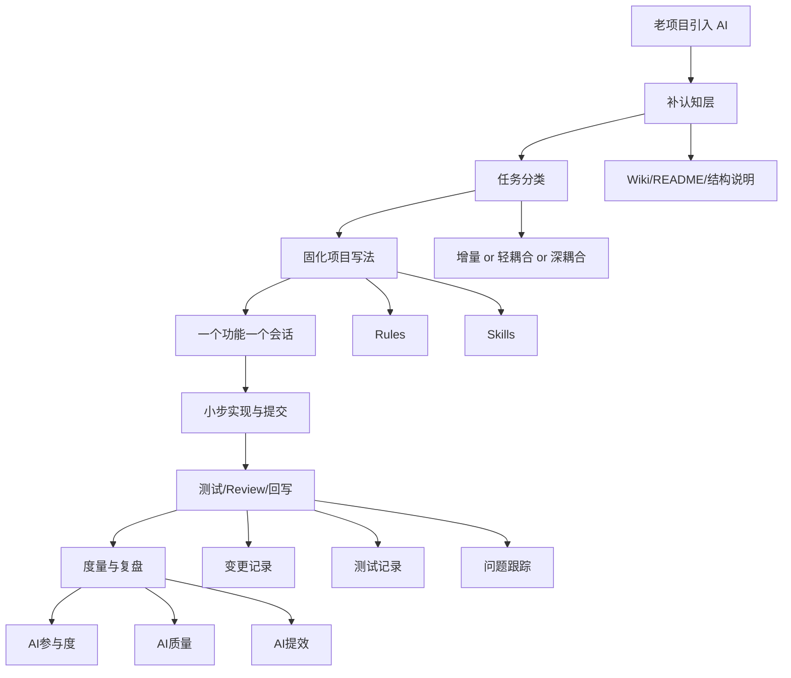
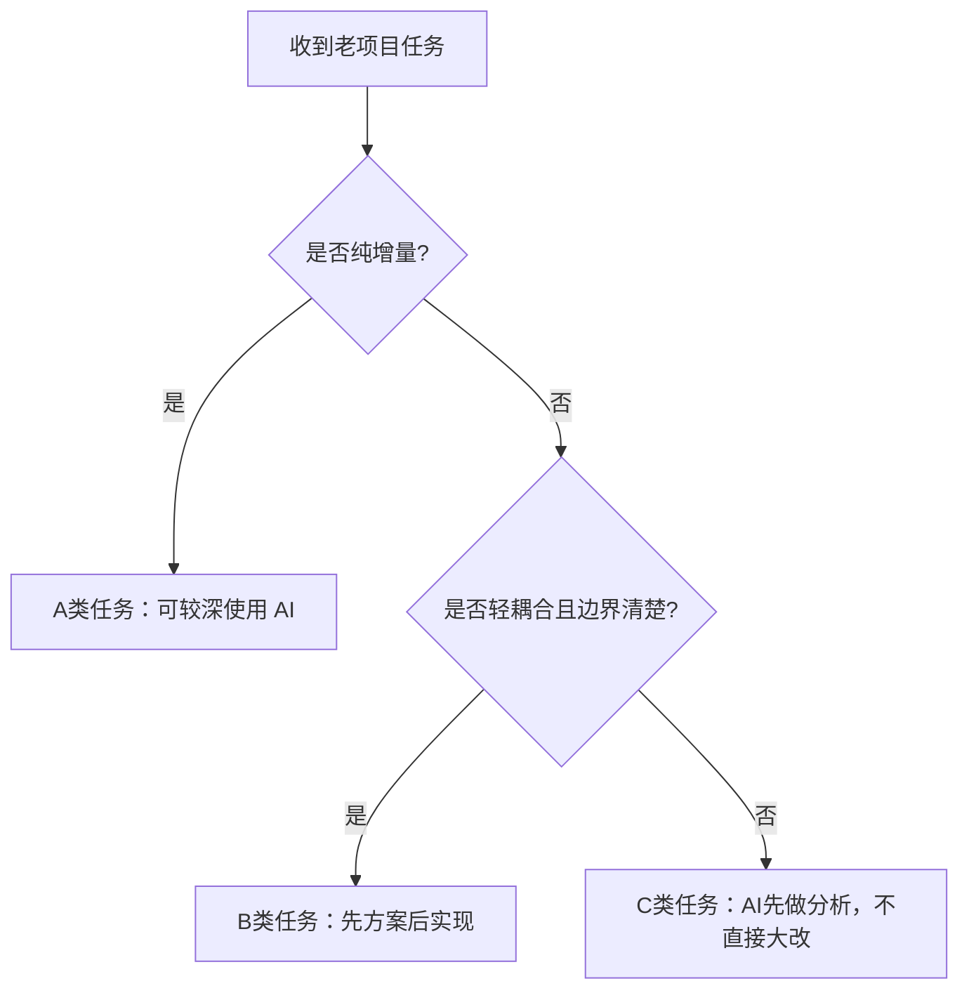
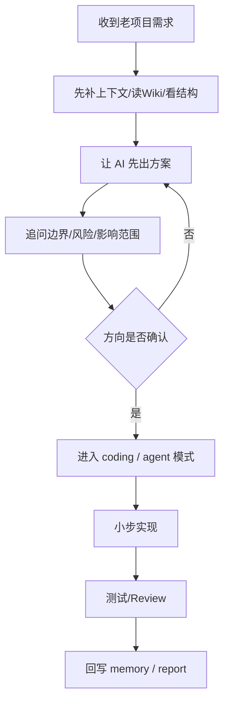
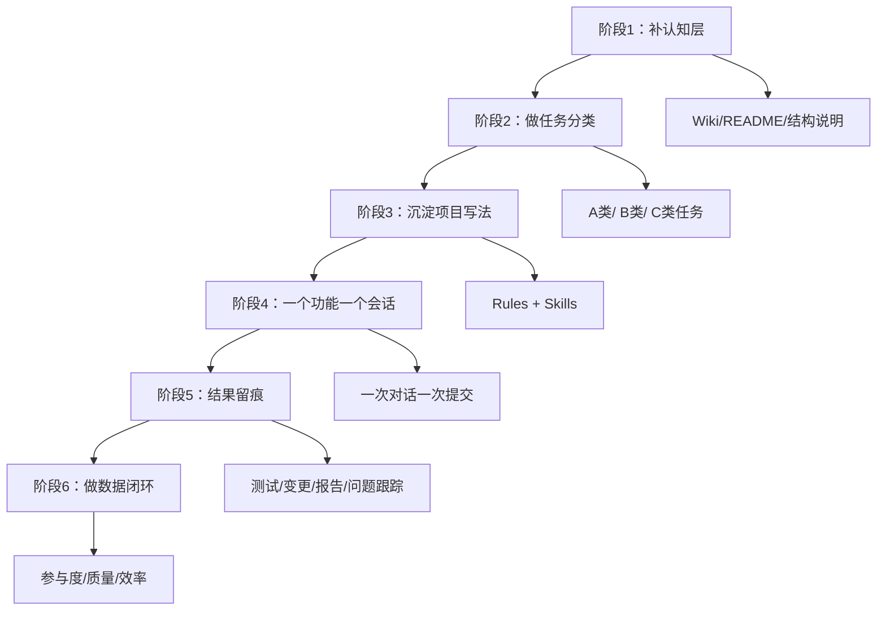

# 老项目 AI 介入指南  
* *——如何在存量系统中安全、可控地引入 AI 工程体系**

> **核心结论：**  
> 老项目引入 AI，不应该从“让 AI 直接改代码”开始，  
> 而应该从“先让 AI 看懂系统、再限制改动边界、再固化项目写法、再小步交付、最后做数据闭环”开始。  
>  
> 换句话说，老项目里导入 AI，重点不是“写得更快”，而是**改得更稳、可控、可回滚、可复盘**。

- --

# 一、为什么老项目比新项目更需要“AI 介入方法”

在新项目里，AI 的默认工程习惯往往还能凑合使用。  
但在老项目里，情况通常完全不同：

- 历史代码多
- 模块边界不清晰
- 存在大量隐式规则
- 特殊写法与“最佳实践”不一致
- 核心链路耦合重
- 维护经验大量掌握在少数人脑子里

这导致一个现实问题：

> **AI 在老项目里，不怕“不会写”，最怕“看不懂却开始写”。**

- --

## 1.1 老项目中 AI 介入最容易踩的坑

| 风险点 | 典型表现 | 后果 |
|---|---|---|
| 上下文不完整 | AI 只看到局部代码，没看到系统边界 | 改动方向错误 |
| 顺手优化 | 本来只改一个小功能，却顺手改了一片旧逻辑 | 回滚困难 |
| 误用通用写法 | AI 用默认最佳实践替代项目约定 | Review 打回率高 |
| 改动半径失控 | 一个功能牵出多个模块修改 | 排查成本高 |
| 不留痕 | 修改后没有记录目标、风险、验证结果 | 无法复盘 |
| 不做测试 | 只看代码“像是对的” | 问题后置到联调/线上 |

- --

## 1.2 老项目导入 AI 的真正目标

老项目引入 AI，不是为了追求“更多代码由 AI 写”，而是为了实现以下 5 件事：

1. **让 AI 看懂系统**
2. **让 AI 只在清晰边界内工作**
3. **让 AI 按项目自己的方式写代码**
4. **让 AI 的交付过程可追踪、可验证**
5. **让 AI 的价值最终可以被度量**

- --

# 二、老项目导入 AI 的总原则

## 2.1 六条总原则

| 原则 | 解释 |
|---|---|
| 先认知，后编码 | 先让 AI 理解项目，再让它动代码 |
| 先局部，后扩展 | 先从小范围试点，再扩大介入范围 |
| 先规范，后生成 | 先整理项目写法和规则，再让 AI 写 |
| 先问边界，再改实现 | 先分析影响范围与风险，再进入编码 |
| 先小步，后迭代 | 一个功能一次对话，一次提交 |
| 先沉淀，再复制 | 每次实践后沉淀为文档、Skill、规则 |

- --

## 2.2 一张总览图



- --

# 三、第一步：先补“认知层”，不要一上来就让 AI 改代码

这是老项目成功率最高的一步，也是最容易被忽视的一步。

## 3.1 为什么先补 Wiki / README / 项目说明

在老项目中，AI 最大的问题往往不是“能力不足”，而是**信息不足**。

AI 如果不知道这些内容，就只能按通用模式猜：

- 项目是干什么的
- 模块是怎么拆的
- 哪些是核心链路
- 哪些是边缘能力
- 哪些历史写法必须遵守
- 哪些代码“看起来老”，但实际不能动

所以在老项目里，第一步不是 coding，而是：

> **先补一层能让 AI 理解项目的认知材料。**

- --

## 3.2 老项目建议先补哪些内容

| 内容 | 作用 | 建议存放位置 |
|---|---|---|
| 项目目标 | 让 AI 理解业务价值 | Wiki / `.agent/project.md` |
| 模块结构 | 让 AI 识别边界 | README / `项目结构.md` |
| 核心链路 | 让 AI 知道哪些逻辑不能乱碰 | `技术方案.md` |
| 边缘能力 | 让 AI 知道哪些部分适合增量扩展 | `项目结构.md` |
| 历史特殊约定 | 防止 AI 用“通用最佳实践”误伤系统 | `问题跟踪.md` / Skill |
| 关键依赖关系 | 识别改动牵连面 | `技术方案.md` |

- --

## 3.3 这一步在 AI 工程体系里对应什么

如果用我们前面那套 `.agent` 体系来看，这一步本质上是在构建 **Memory 层**：

```text
.agent/
└── memory/
    ├── 01-需求规格.md
    ├── 04-技术方案.md
    ├── 05-问题跟踪.md
    ├── 08-项目结构.md
    └── 10-依赖与环境.md
```

也就是说：

> 你说的“先补 Wiki”，在工程化方法里，本质上就是“先补 AI 的工作记忆”。

接手了一个维护了多年的老项目，连文档都没有，别急着写代码。先把AI当“文档工程师”用，先来个提示词问一遍。

```
本项目是一个xxx系统。请基于现有代码，帮我梳理并总结：
1. 系统整体架构
2. 核心领域模型（关键概念、对象、业务术语）
3. 主要模块划分及依赖关系
4. 技术栈清单（框架、中间件、数据库）
5. 核心业务流程与数据流向
6. 数据模型（ER关系简述）
请将这份分析报告写入 docs/reports/system-architecture-analysis.md。
```

这份报告虽然不能替代真正的架构文档，但能帮你快速建立认知地图。在了解了这些背景后，你再提出的增量开发需求，才不会因为违反了原有系统的某些“潜规则”而导致Bug。

- --

# 四、第二步：新功能先判断——增量，还是耦合

这是老项目里最关键的决策动作之一。

## 4.1 为什么必须先分类型
不是所有老项目任务都适合让 AI 直接写代码。  
如果任务本身属于高耦合、高风险、高历史负担类型，那 AI 一上来直接改，风险非常高。

所以在 AI 进入编码前，必须先回答：

1. 这是纯增量功能吗？
2. 是否必须与旧逻辑耦合？
3. 改动半径多大？
4. 是否能通过新类/新模块隔离？
5. 如果必须侵入，是否能做到最小改动？

- --

## 4.2 建议把任务分成三类

| 类型 | 特征 | AI 介入建议 |
|---|---|---|
| A 类：纯增量 | 新业务、新接口、新模块 | 可高比例使用 AI |
| B 类：轻耦合 | 需要复用旧逻辑，但边界清楚 | 先分析方案，再小步实现 |
| C 类：深耦合 | 核心链路、历史逻辑、改动半径大 | AI 只做分析/辅助，不直接大改 |

- --

## 4.3 一个判断图



- --

## 4.4 在 `.agent` 体系中的落点
这一步建议固化到：

- `rules/02-before-action.md`
- `rules/04-how-to-work.md`
- `memory/04-技术方案.md`

本质上是：

> **先做“改动分类”，再决定 AI 的介入深度。**

- --

# 五、第三步：把“项目写法”沉淀成 Skill，而不是靠 AI 临场猜

这一条是老项目里提升 AI 成功率最大的杠杆之一。

## 5.1 为什么老项目特别需要 Skill
新项目里，AI 靠通用工程习惯也许还能先写个七八分像。  
但老项目往往有大量**项目私有写法**：

- 查询构建方式
- ORM / JPA / DAO 封装规则
- 异常怎么抛
- 返回结构如何统一
- 日志在哪一层打
- DTO / VO / Entity 怎么映射
- 哪些类能直接调用，哪些必须走 Service / Facade
- 哪些工具类必须复用

如果这些约束不显式告诉 AI，AI 就会按自己的默认风格写。结果通常是：

- 代码看起来没错
- 但不符合项目习惯
- Review 成本高
- 打回率高
- 返工率高

- --

## 5.2 Skill 的真正作用
Skill 不是为了“增加功能”，而是为了：

> **把项目私有工程约束显式化、可复用化。**

- --

## 5.3 哪些内容最适合做成 Skill

| 内容 | 是否建议做 Skill | 原因 |
|---|---|---|
| 查询构建方式 | 是 | 高频、易偏航 |
| 异常体系 | 是 | 统一性强 |
| 返回结构规范 | 是 | 影响整个 API 风格 |
| 日志规范 | 是 | 易分散、易漏 |
| DTO/VO 映射规则 | 是 | 容易写出不符合项目习惯的结构 |
| 分层调用规则 | 是 | 防止 AI 跨层直调 |
| 测试写法约定 | 是 | 直接影响测试质量 |
| 接口兼容策略 | 是 | 老项目中很关键 |

- --

## 5.4 Rules 和 Skill 的关系
这两者建议这么分工：

| 层次 | 作用 |
|---|---|
| Rules | 约束“应该怎么做” |
| Skill | 复用“具体怎么做” |

也就是说：

> **Rules 负责约束，Skill 负责复用。**

这个组合，才是老项目里 AI 可控生成代码的关键。

- --

# 六、第四步：一个功能一个对话，本质上是在控制上下文污染

你总结的这条非常重要，而且应该制度化。

## 6.1 老项目里为什么更要控制会话边界
在老项目中，AI 一旦上下文太长、任务太杂，就容易：

- 忘记原始目标
- 顺手优化
- 修改无关代码
- 把多个问题混在一起
- 给后续定位和回滚带来巨大成本

所以“一个功能一个对话”的本质是：

> **控制任务边界、控制上下文范围、控制改动半径。**

- --

## 6.2 建议直接固化成规则

### 老项目 AI 会话规则
- 一个功能 / 一个子功能 / 一个问题点，对应一个独立会话
- 单会话只处理一个明确目标
- 单会话尽量控制在安全上下文范围内
- 会话结束必须回写结论和状态

- --

## 6.3 推荐流程图


- --

## 6.4 在 `.agent` 体系中的落点
建议放到：
- `runtime/opencode.md`
- `runtime/handoff.md`
- `rules/04-how-to-work.md`

因为它本质上属于：
- 上下文控制规则
- 多会话交接规则
- 小步交付规则

- --

# 七、第五步：先问方案，再让 AI 改代码

这是老项目中最稳的介入方式。

## 7.1 为什么不能一上来就让 AI 写
在老项目里，真正昂贵的不是“写代码”这一步，而是：

- 判断边界
- 识别影响范围
- 识别历史包袱
- 识别潜在风险
- 确定最小改动路径

如果这些没看清，AI 写得再快，也只是在加速错误。

- --

## 7.2 推荐的老项目工作模式
### Phase 1：先分析
让 AI 先做这些事：
- 理解功能目标
- 分析影响范围
- 列出改动点
- 标出潜在风险
- 给出 2~3 个实现方案

### Phase 2：再决策
由人来确认：
- 方向是否正确
- 改动范围是否可接受
- 是否会波及核心链路
- 是否真的值得动旧代码

### Phase 3：最后执行
确认没问题后，再切换到：
- Agent 模式
- Coding 模式
- 子代理执行模式

- --

## 7.3 这套方式的流程图



- --

## 7.4 和前面那套体系怎么结合
这部分对应：
- `rules/02-before-action.md`
- `workflows/feature-delivery.md`
- `runtime/openclaw.md`
- `runtime/opencode.md`

本质上是：

> **老项目默认模式，不是“直接执行”，而是“先方案、后编码”。**

- --

# 八、第六步：坚持最小功能提交，本质上是在控制回滚成本

## 8.1 为什么老项目更需要“小步提交”
老项目里，一旦 AI 改动半径失控，问题会非常难排查：

- 很难快速定位是哪次改动引发的
- 很难回滚到干净状态
- 很难判断是新功能问题，还是顺手改动引发的问题
- 很难做责任归因和问题复盘

所以：

> **老项目里，AI 最怕的不是“写得慢”，而是“顺手多改”。**

- --

## 8.2 建议固化成团队规则

### 老项目 AI 提交规则
- 一个小功能，一次对话
- 一个小功能，一次提交
- 一次提交只解决一个明确问题
- 非必要，不顺手优化
- 非必要，不跨模块修改
- 非必要，不做结构性重构

- --

## 8.3 推荐表述
这条建议直接写进：
- `rules/04-how-to-work.md`
- `rules/07-after-done.md`

让 AI 始终遵循：

> **最小功能、最小改动、最小提交、最小回滚成本。**

- --

# 九、结合 AI 工程体系，老项目如何分阶段介入

下面给一套更完整、可执行的介入路径。

- --

## 阶段 1：补认知层
### 目标
让 AI 先看懂系统，而不是直接改系统。

### 要做的事
- 补项目 Wiki / README
- 补核心模块说明
- 补关键链路说明
- 补历史特殊约定
- 补依赖关系与边界

### 对应到 `.agent`
- `project.md`
- `memory/04-技术方案.md`
- `memory/08-项目结构.md`
- `memory/05-问题跟踪.md`

- --

## 阶段 2：做任务分类
### 目标
决定任务适不适合让 AI 深度介入。

### 要做的事
- 区分 A/B/C 三类任务
- 判断是否纯增量
- 判断是否可最小改动
- 判断是否适合 agent 直接执行

### 对应到 `.agent`
- `rules/02-before-action.md`
- `memory/04-技术方案.md`

- --

## 阶段 3：沉淀项目私有写法
### 目标
让 AI 按项目方式写，而不是按默认方式写。

### 要做的事
- 把查询方式沉淀成 Skill
- 把异常体系沉淀成 Skill
- 把日志规则沉淀成 Skill
- 把统一返回结构沉淀成 Skill
- 把测试写法沉淀成 Skill

### 对应到 `.agent`
- `runtime/skill-routing.md`
- `rules/00-main.md`
- 项目 Skill 目录

- --

## 阶段 4：一个功能一个会话，小步推进
### 目标
控制上下文、控制任务边界、控制改动半径。

### 要做的事
- 一个功能一个会话
- 一个子功能一个提交
- 超过安全范围就拆
- 每轮结束后回写状态

### 对应到 `.agent`
- `runtime/opencode.md`
- `runtime/handoff.md`
- `triggers/done.md`

- --

## 阶段 5：每次结果必须留痕
### 目标
让 AI 每次参与都有证据链。

### 要做的事
- 更新任务分解
- 更新验收标准
- 更新变更记录
- 更新测试记录
- 更新问题跟踪
- 输出 feature / bugfix / review report

### 对应到 `.agent`
- `memory/*.md`
- `reports/`
- `templates/`

- --

## 阶段 6：开始做数据闭环
### 目标
从“感觉 AI 有帮助”升级成“知道 AI 带来了什么”。

### 最先采的指标
- AI参与任务数
- AI代码占比
- AI自测执行率
- AI Review 执行率
- AI报告归档率
- AI Bug 占比
- AI打回率

### 对应到 `.agent`
- `metrics/`
- `scripts/collect-ai-metrics.sh`

- --

# 十、老项目 AI 介入六阶段总览图



- --

# 十一、给团队的可执行建议

如果要把这套思路讲给团队，建议不要一上来讲很大，而是先落这 5 条。

## 11.1 五条最值得先执行的规则

| 规则 | 说明 |
|---|---|
| 先补上下文，不要直接改代码 | 没有认知层，AI 改得越快越危险 |
| 先判断任务类型，再决定 AI 介入深度 | 不是所有老项目任务都适合直接 coding |
| 把项目私有写法做成 Skill | 降低偏航、提高贴合度 |
| 一个功能一个会话，一个功能一次提交 | 防止改动半径失控 |
| 每次 AI 参与都必须留痕 | 没有留痕，就无法管理 |

- --

## 11.2 最小试点建议
如果要在一个老项目里试点，可以这样开始：

### 第 1 周
- 补 README / Wiki / 项目结构说明
- 补 `.agent/project.md`
- 补 `需求规格 / 任务分解 / 验收标准`

### 第 2 周
- 挑一个 A 类纯增量任务试点
- 先方案、后编码
- 每次改动都留 report

### 第 3 周
- 沉淀 1~2 个核心 Skill
- 比如查询规范 / 异常规范 / 返回结构规范

### 第 4 周
- 开始统计 AI 参与度和规范执行率
- 做第一次小复盘

- --

# 十二、这套方法和我们之前搭建的体系是什么关系

你的经验和前面那套 `.agent + rules + memory + workflow + metrics` 方法，不是两套平行方法，而是上下两层关系。

## 你的经验解决的是
* *老项目里怎么“安全介入” AI**

## 前面的体系解决的是
* *介入之后怎么把方法制度化、模板化、可复制化**

所以：

- 你这套更偏实战节奏
- 前面那套更偏长期工程框架

两者结合起来，才完整。

- --

# 十三、最终结论

老项目引入 AI，不是让 AI 更大胆，而是让 AI 更有边界。  
不是让 AI 更快下场，而是先让 AI 看懂系统、按项目方式工作、按小步节奏交付。  
当这些做法再被 **Rules、Memory、Workflow、Metrics** 固化下来，老项目里的 AI 才真正：

- 可控
- 可用
- 可复盘
- 可复制

- --

# 十四、一句话总结

> 老项目里导入 AI，核心不是“让 AI 帮你多写代码”，  
> 而是“让 AI 先理解系统、按项目规则做事、按最小改动原则交付，并把全过程纳入工程化管理”。  
>  
> 只有这样，AI 才不会成为老项目的风险放大器，而会真正成为老项目演进的稳定增量。
