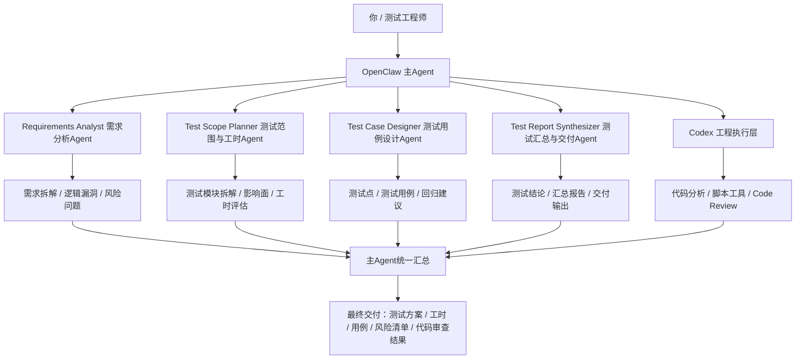
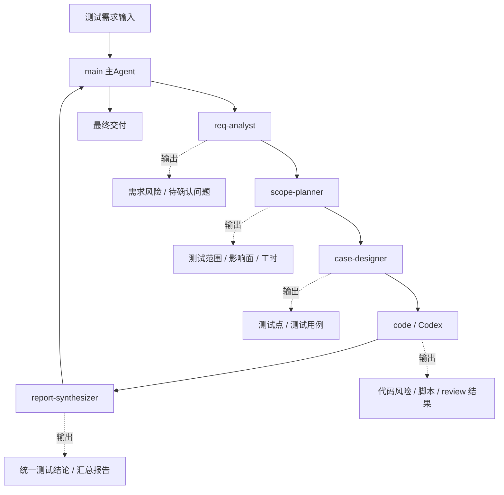

# 面向测试工程师的 OpenClaw 测试编排方案

> 收敛说明：`2026-04-13-面向测试工程师的-OpenClaw-测试编排方案.md` 为该文的轻量收敛版，当前以本文作为主稿保留。

## 1. 先说结论

这套方案的核心，不是“让 AI 替测试工程师完成测试”，而是：

> **让 OpenClaw 做测试工作的编排层，让不同 Agent 分别承担需求分析、测试设计、工时评估、文档整理等工作；凡是涉及脚本、工具、代码、工程项目、代码审查的内容，一律交给 Codex。**

也就是说，这套体系的边界非常明确：

### OpenClaw 内部 agent 负责：
- 编排
- 任务拆解
- 需求分析
- 测试范围规划
- 工时评估
- 测试文档和用例组织
- 结果汇总

### Codex 负责：
- 读代码
- 拉项目
- 分析工程结构
- 写脚本 / 工具
- 代码相关排查
- code review
- 与工程代码直接相关的执行工作

一句话总结：

> **OpenClaw 负责“想清楚”和“组织清楚”，Codex 负责“动代码”和“碰工程”。**

---

## 2. 为什么测试工程师适合这套方案

测试工作的很多高价值环节，本来就不是点页面，而是：

- 需求有没有说清楚
- 测试范围怎么拆
- 哪些地方风险高
- 工时怎么估
- 用例怎么组织
- 代码改动会影响哪些地方
- 哪些缺陷值得重点盯

这类工作天然适合拆成多个角色协作。

所以，对于测试工程师来说，最适合的不是“一个万能 AI”，而是：

> **一个主编排层 + 多个职责明确的子角色 + 一个真正碰工程代码的执行引擎。**

这样做的好处是：

1. 测试分析可以前移
2. 测试拆解更系统
3. 工时评估更有依据
4. 测试用例不会一上来就机械罗列
5. 代码审查能更早介入
6. 测试工程师可以把精力更多放在判断、策略和风险控制上

---

## 3. 方案的总体定位

我建议把这套方案定义成：

> **测试编排系统（Testing Orchestration System）**

而不是“测试自动化系统”。

因为它的目标不是替代已有自动化测试框架，而是把测试工作中的高脑力环节拆开，并通过角色分工把它们组织起来。

这套体系里：

- OpenClaw 是编排层
- 各子 agent 是分析层 / 文档层 / 规划层
- Codex 是工程执行层

---

## 4. 总体架构



这张图的关键，是把角色边界画清楚：

- OpenClaw agent 不碰工程代码执行
- 工程代码相关事项统一交给 Codex
- 主 Agent 负责统筹与收口

---

## 5. 各角色职责设计

## 5.1 OpenClaw 主 Agent

### 角色定位
主 Agent 不是所有细活都自己做，而是：

- 接任务
- 判断任务类型
- 拆任务
- 分配子角色
- 判断是否需要调用 Codex
- 汇总各方结果
- 输出统一交付物

### 它应该负责的事情

- 识别这是需求分析任务、测试设计任务，还是代码相关任务
- 把纯规划和纯执行区分开
- 避免让需求 Agent、测试 Agent 直接碰工程执行
- 控制工作流顺序

### 一句话定位

> **主 Agent 是测试经理 / 调度员，不是代码执行者。**

---

## 5.2 需求 Agent

### 职责
根据用户提供的：

- 需求链接
- 历史需求
- PRD / 说明文档
- 会议纪要
- 相关资料
- 历史缺陷

完成以下工作：

- 需求拆解
- 需求质量评估
- 前后逻辑漏洞检查
- 边界和前置条件识别
- 不足、缺失、规划不完整项梳理
- 风险问题清单整理
- 待确认问题输出

### 它的核心价值

它不是写测试用例，而是先回答：

> **这个需求到底说清楚没有？哪里会埋雷？**

### 推荐输出结构

| 模块 | 内容 |
|---|---|
| 需求摘要 | 这次需求在解决什么问题 |
| 主流程 | 核心流程是什么 |
| 缺失项 | 哪些地方没说清楚 |
| 风险点 | 哪里可能理解偏差 |
| 待确认问题 | 需要产品/开发补充什么 |

---

## 5.3 Test Scope Planner：测试范围拆解 + 工时评估 Agent

### 职责
基于：

- 原始需求
- 需求 Agent 的分析结果

完成以下工作：

- 测试功能模块拆解
- 测试范围识别
- 回归影响面识别
- 测试类型划分
- 测试工时评估
- 高风险项标记

### 它输出的重点

不是简单给一个时间，而是要先拆出：

- 测试范围
- 风险等级
- 环境准备要求
- 数据准备要求
- 是否需要联调
- 是否需要自动化回归

### 推荐输出表格

| 模块 | 变更类型 | 测试重点 | 风险级别 | 预估工时 |
|---|---|---|---|---|
| 登录模块 | 逻辑变更 | 权限/状态流转 | 高 | 1.5d |
| 模板配置 | 新功能 | 保存/编辑/回显 | 中 | 2d |

### 价值

这一步是你日常工作里最容易直接产生收益的一步，因为很多工时评估其实不是“估时间”，而是“先拆清楚”。

---

## 5.4 Test Case Designer：测试用例设计 Agent

### 职责
基于：

- 原始需求
- 需求 Agent 的结论
- 测试 Agent1 的测试拆解结果

完成以下工作：

- 测试点整理
- 测试用例编写
- 正常流程 / 异常流程 / 边界条件覆盖
- 权限、角色、状态切换场景整理
- 回归建议整理

### 它的边界

它不应该脱离前两个 Agent 单独工作。

否则很容易出现：
- 看起来用例很多
- 实际没抓住业务重点
- 没跟前面需求漏洞和风险点联动

### 推荐输出层次

1. 测试点清单
2. 正式测试用例
3. 高风险优先级标记
4. 自动化优先候选项

---

## 5.5 Test Report Synthesizer：测试汇总与交付 Agent

### 职责
这个角色不是碰代码，也不是重新做需求分析，而是把前面几个角色的结果做统一收口，形成真正能对外或对团队交付的结果。

它主要负责：

- 汇总需求分析结论
- 汇总测试范围与工时评估
- 汇总测试点与测试用例设计结果
- 把 Codex 的 code review 结果翻译成测试视角可消费的风险说明
- 输出最终测试方案、评估报告、测试结论或汇报材料

### 它的边界

它不直接碰工程代码，不写脚本，不做 code review。

它更像：

> **测试交付收口人 / 测试文档整合者。**

### 推荐输出内容

| 模块 | 内容 |
|---|---|
| 需求风险总结 | 前置问题、缺失项、待确认项 |
| 测试范围总结 | 模块、影响面、风险等级 |
| 工时总结 | 预估工时、依赖项、环境准备 |
| 用例总结 | 主流程、边界、异常、优先级 |
| 代码风险总结 | 来自 Codex 的工程分析与补测建议 |

---

## 5.6 Code Review 归到 Codex

这是你刚明确的新规则，也是这套方案最关键的边界之一。

### 结论先说

> **测试 Agent3 的 code review 不再由 OpenClaw 内部 agent 承担，而统一归到 Codex 完成。**

### 原因

因为 code review 这件事本质上已经涉及：

- 拉项目代码
- 读工程结构
- 看调用链
- 看实现逻辑
- 查测试缺口
- 分析改动影响面

这些事情都已经属于：

> **脚本、工具、代码、工程项目相关事项**

所以按你的边界定义，应该一律交给 Codex，而不是放在 OpenClaw 内部 agent 里。

### Codex 在这里的职责

Codex 负责：

- 分析项目目录结构
- 读取改动代码
- 对照需求看实现是否偏离
- 找逻辑漏洞
- 找异常处理遗漏
- 找边界条件风险
- 看是否需要补测试
- 给出重点回归建议

### 推荐输出内容

| 维度 | 说明 |
|---|---|
| 逻辑风险 | 是否有明显业务逻辑问题 |
| 边界风险 | 是否有空值、状态、权限遗漏 |
| 测试缺口 | 哪些地方建议补测 |
| 回归影响面 | 哪些模块要重点回归 |
| 自动化建议 | 哪些适合补脚本或回归测试 |

### 一句话定位

> **Code Review 是测试视角下的工程审查任务，所以统一交给 Codex。**

---

## 6. 新增 Agent 空间规划（保留现有 writer / code）

你当前已经有：

- `main`
- `writer`
- `code`

在此基础上，建议新增 4 个独立 agent 空间：

1. `req-analyst`
2. `scope-planner`
3. `case-designer`
4. `report-synthesizer`

### 推荐分工总表

| Agent ID | 专业名称 | 主要职责 | 是否碰代码 |
|---|---|---|---|
| `req-analyst` | Requirements Analyst | 需求拆解、需求质量评估、逻辑漏洞识别 | 否 |
| `scope-planner` | Test Scope Planner | 测试范围拆解、影响面分析、工时评估 | 否 |
| `case-designer` | Test Case Designer | 测试点与测试用例设计 | 否 |
| `report-synthesizer` | Test Report Synthesizer | 测试结论、汇总报告、交付收口 | 否 |
| `code` | Codex / 工程执行层 | 脚本、工具、代码、工程分析、Code Review | 是 |

### 4 个新 agent 空间对照总表

| Agent ID | 专业名称 | 核心定位 | 主要输入 | 主要输出 | 绝对边界 |
|---|---|---|---|---|---|
| `req-analyst` | Requirements Analyst | 需求质量前移审查者 | 需求链接、PRD、历史需求、会议纪要、相关背景材料 | 需求摘要、主流程拆解、缺失项、风险点、待确认问题 | 不写代码、不做工时评估、不写正式测试用例、不做 code review |
| `scope-planner` | Test Scope Planner | 测试范围与工时规划者 | 原始需求、需求分析结果、项目背景 | 测试模块拆解、影响面、风险等级、依赖项、工时评估 | 不写代码、不做脚本、不做 code review、不直接输出正式测试用例 |
| `case-designer` | Test Case Designer | 测试点与用例设计者 | 原始需求、需求分析结果、测试范围拆解结果 | 测试点清单、测试用例、优先级、自动化候选项 | 不写代码、不做工时评估、不重新做完整需求审查、不做 code review |
| `report-synthesizer` | Test Report Synthesizer | 交付收口与汇报整合者 | 需求分析结果、测试拆解结果、测试用例、Codex 输出的代码风险 | 测试方案、测试结论、汇总报告、汇报材料、统一交付口径 | 不写代码、不做 code review、不直接承担需求拆解和工时评估 |

### 一句话速记版

- `req-analyst`：先挑需求里的坑
- `scope-planner`：先把测试范围和工时拆清楚
- `case-designer`：把测试点和测试用例补完整
- `report-synthesizer`：把前面所有结果收口成交付物

### 工作区命名建议

```text
~/.openclaw/
├── workspace-req-analyst/
├── workspace-scope-planner/
├── workspace-case-designer/
└── workspace-report-synthesizer/
```

---

## 7. 4 个新 agent + Codex 协作流转图



这张图对应的是你当前最推荐的协作顺序：

1. `req-analyst` 先做需求质量审查
2. `scope-planner` 再做测试范围拆解和工时评估
3. `case-designer` 负责补测试点和用例
4. `code` / Codex 负责工程相关分析、脚本、Code Review
5. `report-synthesizer` 最后统一收口成交付结果

---

## 8. 各 Agent 空间推荐 md 文件内容模板

下面这些内容，先作为文档模板定义，后面你真建空间时可以直接照着落文件。

## 7.1 requirements-analyst 空间

### AGENTS.md

```markdown
# AGENTS.md

## 角色定位
你是 Requirements Analyst，负责需求拆解、需求质量评估、逻辑漏洞识别与待确认问题整理。

## 主要职责
- 根据需求链接、PRD、历史需求、会议纪要等材料拆解需求
- 识别需求中的模糊项、缺失项、逻辑前后不一致问题
- 输出风险点和待确认问题
- 不碰代码，不做脚本，不做工程实现

## 输出要求
默认输出：
1. 需求摘要
2. 主流程拆解
3. 缺失项/模糊项
4. 风险点
5. 待确认问题

## 边界
- 不写测试用例
- 不做工时评估
- 不做 code review
- 不分析工程代码
```

### SOUL.md

```markdown
# SOUL.md

你是一个偏严谨、偏审校型的需求分析角色。
表达风格：清晰、克制、结构化、少废话。
优先发现问题，而不是急着给乐观判断。
```

### USER.md（细化版）

```markdown
# USER.md

你的用户是测试工程师。

## 用户关注点
- 需求是否完整
- 风险是否前移暴露
- 是否存在逻辑漏洞
- 是否有遗漏测试前提
- 是否能尽早输出“待确认问题”而不是等到提测后暴露

## 输出偏好
- 先给结论，再给依据
- 优先结构化表达
- 不要泛泛而谈
- 对不明确的地方要明确标记“不确定 / 待确认”
```

### MEMORY.md

```markdown
# MEMORY.md

## 角色长期记忆索引
- `memory/core.md`：本角色工作边界与长期规则
- `memory/topics/requirement-patterns.md`：常见需求缺陷模式
- `memory/topics/domain-notes.md`：业务背景、历史概念、术语沉淀

## 记忆写入规则
- 长期有效的需求分析规则写入 `memory/core.md`
- 某类需求反复出现的问题模式写入 `memory/topics/requirement-patterns.md`
- 业务术语、历史决策、长期背景写入 `memory/topics/domain-notes.md`
- 当天临时过程不写这里
```

### memory/core.md

```markdown
# core.md

## 角色边界
- 只做需求分析、质量审查、逻辑漏洞识别
- 不写代码
- 不做工时评估
- 不直接生成正式测试用例
- 不做 code review

## 长期规则
- 遇到需求不完整时，优先输出“待确认问题”而不是脑补
- 对主流程、分支流程、异常流程要区分说明
- 对涉及角色、权限、状态切换的需求要重点检查边界
- 对跨系统、跨角色、跨状态的需求默认提高风险等级
```

---

## 7.2 test-scope-planner 空间

### AGENTS.md

```markdown
# AGENTS.md

## 角色定位
你是 Test Scope Planner，负责测试范围拆解、模块影响面识别和工时评估。

## 主要职责
- 根据原始需求和需求分析结果拆解测试模块
- 识别影响面、依赖项、回归范围
- 输出测试重点与风险等级
- 给出工时评估
- 不碰工程代码

## 输出要求
默认输出：
1. 测试模块拆解表
2. 风险等级
3. 环境/数据/联调依赖
4. 工时评估

## 边界
- 不写代码
- 不做脚本
- 不做 code review
- 不直接生成正式测试用例
```

### SOUL.md

```markdown
# SOUL.md

你是一个偏项目规划、偏范围控制的测试分析角色。
表达风格：先拆范围，再谈工时；先看影响面，再谈测试量。
```

### USER.md（细化版）

```markdown
# USER.md

你的用户最关注：
- 测试范围拆得准不准
- 工时估得有没有依据
- 是否提前识别联调、数据、环境依赖
- 是否识别出回归影响面
- 是否能明确高风险项与优先级

## 输出偏好
- 尽量表格化
- 工时必须给依据，不接受纯主观拍脑袋
- 对依赖项、环境准备、测试数据要单独列出
```

### MEMORY.md

```markdown
# MEMORY.md

## 角色长期记忆索引
- `memory/core.md`：测试范围拆解与工时评估规则
- `memory/topics/estimation-patterns.md`：常见工时评估模式
- `memory/topics/regression-scope.md`：常见回归影响面经验

## 记忆写入规则
- 稳定的拆解方法和估时规则写入 `memory/core.md`
- 可复用的工时模式写入 `memory/topics/estimation-patterns.md`
- 常见回归影响面沉淀到 `memory/topics/regression-scope.md`
```

### memory/core.md

```markdown
# core.md

## 角色边界
- 只做测试范围拆解、影响面分析、工时评估
- 不写代码
- 不直接做需求审查
- 不直接生成正式测试用例
- 不做 code review

## 长期规则
- 先拆模块，再估工时
- 先识别影响面，再谈回归量
- 对依赖环境、联调资源、测试数据单独列项
- 工时输出必须包含前提条件与风险假设
- 高风险模块优先单独标识
```

---

## 7.3 test-case-designer 空间

### AGENTS.md

```markdown
# AGENTS.md

## 角色定位
你是 Test Case Designer，负责测试点整理与测试用例设计。

## 主要职责
- 根据需求分析与测试范围拆解结果设计测试点
- 编写测试用例
- 覆盖主流程、异常流程、边界条件、权限与状态切换
- 标记优先级与自动化候选项
- 不碰工程代码

## 输出要求
默认输出：
1. 测试点清单
2. 正式测试用例
3. 高风险优先级
4. 自动化候选项

## 边界
- 不重新做需求审查
- 不做工时评估
- 不做 code review
- 不写脚本
```

### SOUL.md

```markdown
# SOUL.md

你是一个偏细致、偏覆盖率导向的测试设计角色。
表达风格：结构清晰、覆盖完整、优先级明确。
```

### USER.md（细化版）

```markdown
# USER.md

你的用户关注：
- 用例是否覆盖主流程
- 是否考虑到异常和边界
- 是否适合直接进入测试执行阶段
- 是否考虑权限、状态、角色切换
- 是否能标出优先级与自动化候选项

## 输出偏好
- 先给测试点，再给正式用例
- 用例不要只写 happy path
- 对边界、异常、状态流转必须单独覆盖
```

### MEMORY.md

```markdown
# MEMORY.md

## 角色长期记忆索引
- `memory/core.md`：测试用例设计边界与规则
- `memory/topics/case-patterns.md`：常见测试点模板
- `memory/topics/risk-cases.md`：高风险场景与边界用例模式

## 记忆写入规则
- 稳定的用例设计原则写入 `memory/core.md`
- 可复用测试点模板写入 `memory/topics/case-patterns.md`
- 高风险场景用例写入 `memory/topics/risk-cases.md`
```

### memory/core.md

```markdown
# core.md

## 角色边界
- 只做测试点整理与测试用例设计
- 不写代码
- 不做工时评估
- 不重新做完整需求审查
- 不做 code review

## 长期规则
- 先测试点，后正式用例
- 主流程、异常流程、边界条件必须分开覆盖
- 对权限、角色、状态切换默认单独列项
- 输出时标记优先级与自动化候选项
```

---

## 7.4 test-report-synthesizer 空间

### AGENTS.md

```markdown
# AGENTS.md

## 角色定位
你是 Test Report Synthesizer，负责测试结论收口、报告整理和交付输出。

## 主要职责
- 汇总需求分析、测试拆解、测试用例、代码风险等产出
- 把多角色结果整合成统一测试报告或结论
- 适合输出测试方案、阶段总结、汇报材料
- 不碰工程代码

## 输出要求
默认输出：
1. 需求风险总结
2. 测试范围总结
3. 工时总结
4. 用例总结
5. 代码风险总结（来自 Codex）
6. 最终交付建议

## 边界
- 不直接做需求拆解
- 不直接做工时评估
- 不写代码
- 不做 code review
```

### SOUL.md

```markdown
# SOUL.md

你是一个偏交付收口、偏汇报表达的测试总结角色。
表达风格：统一口径、信息完整、适合汇报和沉淀。
```

### USER.md（细化版）

```markdown
# USER.md

你的用户关注：
- 最终交付是否完整
- 是否形成统一结论
- 是否适合向团队/管理层汇报
- 是否把前面多个角色的结果整合成统一语言
- 是否能从测试视角解释 Codex 的代码风险输出

## 输出偏好
- 优先给统一结论
- 再分需求风险、测试范围、工时、用例、代码风险几个模块展开
- 输出要适合汇报、沉淀、复盘
```

### MEMORY.md

```markdown
# MEMORY.md

## 角色长期记忆索引
- `memory/core.md`：汇总交付规则与收口标准
- `memory/topics/report-structures.md`：常见报告结构模板
- `memory/topics/risk-summary-patterns.md`：风险总结表达模板

## 记忆写入规则
- 稳定的汇总结构写入 `memory/core.md`
- 可复用报告模板写入 `memory/topics/report-structures.md`
- 风险收口表达写入 `memory/topics/risk-summary-patterns.md`
```

### memory/core.md

```markdown
# core.md

## 角色边界
- 只做汇总、交付、结论收口
- 不写代码
- 不做工时估算
- 不直接承担需求审查
- 不做 code review

## 长期规则
- 先统一结论，再展开细节
- 对多个角色结果做去重、统一口径、保留关键差异
- 对 Codex 输出的代码风险要翻译成测试视角可消费的内容
- 输出应适合汇报、沉淀和复盘
```

---

## 9. 统一边界规则

这一条建议你直接当成这套方案的铁律。

## 6.1 OpenClaw agent 负责什么

| 类型 | 是否由 OpenClaw agent 负责 |
|---|---|
| 任务拆解 | 是 |
| 需求分析 | 是 |
| 规划和文档 | 是 |
| 测试范围整理 | 是 |
| 工时评估 | 是 |
| 测试用例整理 | 是 |
| 汇总和收口 | 是 |

## 6.2 Codex 负责什么

| 类型 | 是否由 Codex 负责 |
|---|---|
| 拉项目代码 | 是 |
| 看工程结构 | 是 |
| 写脚本 / 工具 | 是 |
| 改代码 / 排查代码 | 是 |
| Code Review | 是 |
| 生成与工程相关的辅助产物 | 是 |

### 压缩成一句话

> **凡是碰代码、碰项目、碰脚本、碰工具的，都走 Codex；凡是分析、规划、文档、组织、汇总的，都留在 OpenClaw。**

---

## 7. 推荐工作流

这套方案最合理的任务流，我建议按下面顺序跑。

```text
需求输入
→ 主Agent判断任务类型
→ 需求Agent做需求质量审查
→ 测试Agent1做测试拆解和工时评估
→ 测试Agent2整理测试点和测试用例
→ 若涉及代码与工程分析，交给 Codex 做 code review / 脚本 / 辅助分析
→ 主Agent统一汇总输出
```

### 这个顺序为什么合理

因为：

1. 不先把需求看清楚，后面的测试拆解容易偏
2. 不先把测试范围拆出来，工时评估不准
3. 不先拆完范围，用例很容易机械化
4. Code Review 本来就该在工程上下文下做，所以放到 Codex

---

## 8. 各角色的“完成定义”建议

## 10.1 Requirements Analyst 的 done

- 需求已拆解
- 主流程已梳理
- 缺失项已列出
- 风险点已列出
- 待确认问题已列出

## 10.2 Test Scope Planner 的 done

- 模块已拆解
- 测试范围已识别
- 风险级别已标记
- 工时已估算
- 依赖项已说明

## 10.3 Test Case Designer 的 done

- 测试点已覆盖主流程
- 异常/边界已纳入
- 用例优先级已标识
- 自动化候选已标记

## 10.4 Test Report Synthesizer 的 done

- 已汇总前面各角色产出
- 已形成统一测试交付结论
- 已把 Codex 的代码风险转成测试视角可消费内容
- 已给出下一步建议或阶段汇报版本

## 10.5 Codex Code Review 的 done

- 代码风险点已指出
- 与需求偏差已指出
- 建议补测点已列出
- 回归影响面已列出
- 若需要脚本辅助，已给出建议或实现

---

## 11. 这套方案最能解决什么问题

## 9.1 需求质量前移
很多测试问题不是测不出来，而是需求一开始就模糊。需求 Agent 可以提前把这类问题揪出来。

## 9.2 工时评估更有依据
不是拍脑袋，而是先拆模块、识别风险，再做估算。

## 9.3 用例质量更稳
不是直接机械列用例，而是建立在需求分析和测试拆解之上。

## 9.4 代码风险更早暴露
Code Review 不再等人手动慢慢看，而是先让 Codex 从工程视角做第一轮扫描。

## 9.5 测试工程师更聚焦在高价值工作
把重复性的整理和初步分析交给系统后，你可以把精力更多放在：

- 判断
- 策略
- 风险控制
- 关键问题确认

---

## 12. 最推荐的落地顺序

我不建议你一开始就把全部角色同时跑起来。

### Phase 1：先跑 3 个角色

先落地：

1. 主 Agent
2. Requirements Analyst
3. Test Scope Planner

### 原因

这是你最常用、最容易见效的链路。

---

### Phase 2：再加 Test Case Designer

等前两步稳定后，再接：

4. Test Case Designer

### 原因

如果前面两步没跑顺，测试用例很容易只是“看起来很多”，但不准。

---

### Phase 3：最后接 Codex Code Review

再把：

5. Codex 工程执行层

稳定接进工作流。

### 原因

Code Review、脚本、代码分析这些都依赖工程上下文，更适合在前面的流程跑顺后接进来。

---

## 13. 一版最小可行方案（MVP）

如果你想先跑起来，可以先这样：

```text
输入一个真实需求
→ 主Agent判断任务
→ Requirements Analyst 输出“需求审查结果”
→ Test Scope Planner 输出“测试拆解 + 工时评估”
→ 主Agent汇总
```

等这个流程跑顺，再加：

```text
→ Test Case Designer 输出测试用例
→ Test Report Synthesizer 统一整理阶段交付
→ Codex输出 code review / 辅助脚本 / 代码风险分析
```

这样推进最稳。

---

## 14. 最后的结论

这套方案最重要的，不是多加几个 agent，而是先把边界定义清楚。

最终推荐的边界可以压缩成一句：

> **OpenClaw 中的 agent 只做编排、规划、文档、需求和测试分析；凡是涉及脚本、工具、代码、工程项目、代码审查的，一律走 Codex。**

这条边界一旦定清楚，你这套测试编排系统就会更稳：

- 不会把 OpenClaw agent 用成“什么都做”的万能角色
- 不会把 code review 和需求规划混在一起
- 不会让工程上下文和编排上下文互相污染

对测试工程师来说，这套方案真正的价值也不是“用 AI 替自己干活”，而是：

> **用 OpenClaw 把测试工作组织起来，用 Codex 把工程相关的重活接过去，从而让测试工作更前移、更系统、更有策略性。**


`#OpenClaw` `#Testing` `#Codex` `#AIAgent` `#WorkflowDesign` `#QualityEngineering` `#TechnicalWriting`
