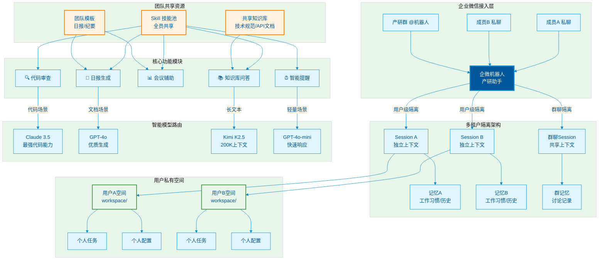

# 产研团队企微机器人部署手册

> **文档版本**: v1.1  
> **适用对象**: OpenClaw 单实例多租户架构  
> **部署目标**: 产研团队（第一个试点机器人）  
> **服务器路径**: `/root/.openclaw`  
> **兼容性**: 与现有 `workspace` 空间并存，互不干扰  

- --

## 🗺️ 产研助手架构概览



### 🎯 核心特点

| 特性 | 说明 | 价值 |
|------|------|------|
| **🔐 用户级隔离** | 对话、记忆、任务完全隔离 | 保护个人隐私，多人使用不串数据 |
| **🤝 团队级共享** | Skill、模板、知识库共享 | 统一团队能力，降低重复配置 |
| **🧠 智能路由** | 按场景自动选择最优模型 | 平衡成本与效果，代码用Claude/日常用Mini |
| **📁 自动空间** | 首次使用自动创建个人空间 | 零配置上手，开箱即用 |
| **🏗️ 多空间共存** | 与现有workspace并行运行 | 平滑扩展，不影响已有业务 |

- --

## 📋 文档索引

1. [可用模型列表](#1-可用模型列表)
2. [目录共存方案](#2-目录共存方案)
3. [部署顺序说明](#3-部署顺序说明)
4. [一键初始化脚本](#4-一键初始化脚本)
5. [配置文件模板](#5-配置文件模板)
6. [企微机器人对接步骤](#6-企微机器人对接步骤)
7. [隔离策略详解](#7-隔离策略详解)
8. [成员使用指南](#8-成员使用指南)
9. [故障排查](#9-故障排查)
10. [多空间运行模式](#10-多空间运行模式可选)

- --

## 1. 可用模型列表

根据当前 OpenClaw 实例配置，可用模型如下：

| 模型ID | 名称 | 上下文长度 | 适用场景 | 备注 |
|--------|------|-----------|---------|------|
| `tencentcodingplan/kimi-k2.5` | **Kimi K2.5** | 200K | 长文本处理、中文场景 | ⭐ 当前默认 |
| `gpt-4o` | **GPT-4o** | 128K | 文档生成、多模态 | 推理能力强 |
| `gpt-4o-mini` | **GPT-4o Mini** | 128K | 日常对话、快速响应 | 性价比高 |
| `claude-3-5-sonnet` | **Claude 3.5 Sonnet** | 200K | 代码审查、复杂分析 | 代码能力最强 |

### 模型路由策略（推荐）

```yaml
场景 → 推荐模型
─────────────────────────────────────
日常聊天/简单问答    → GPT-4o Mini
日报/文档生成        → GPT-4o
代码审查/技术方案    → Claude 3.5 Sonnet
超长文本/知识库查询   → Kimi K2.5
```

- --

## 2. 目录共存方案

### 2.1 核心原则

* *新团队空间与现有 workspace 完全隔离，互不干扰**

```
/root/.openclaw/
│
├── workspace/                    # ⭐ 现有运行中的空间（保持不变）
│   ├── config.yaml
│   ├── skills/
│   ├── shared/
│   └── ...                       # 原有内容完全不受影响
│
├── teams/                        # 🆕 新增团队空间根目录（全新创建）
│   └── chanpin/                  # 产研团队（第一个新空间）
│       ├── config.yaml           # 独立配置
│       ├── skills/               # 独立 Skill 池
│       ├── shared/               # 团队共享文件
│       └── users/                # 用户私有空间（自动创建）
│
└── 产研团队机器人部署手册.md     # 本手册
```

### 2.2 共存保证

| 保证项 | 说明 |
|--------|------|
| ✅ 路径隔离 | 新空间在 `teams/chanpin/`，现有在 `workspace/` |
| ✅ 配置隔离 | 独立的 `config.yaml`，互不影响 |
| ✅ Skill 隔离 | 独立的 `skills/` 目录，可差异化配置 |
| ✅ 用户隔离 | 用户数据存储在不同路径 |
| ✅ 运行隔离 | 可选择独立启动或统一路由 |

- --

## 3. 部署顺序说明

### ✅ 推荐顺序：目录 → 机器人 → 配置 → 启动 → 邀请

| 步骤 | 操作内容 | 执行位置 | 耗时 |
|-----|---------|---------|------|
| **Step 1** | 创建 `teams/chanpin/` 目录结构 | OpenClaw 服务器 | 2分钟 |
| **Step 2** | 企微后台创建「产研助手」机器人 | 企业微信管理后台 | 5分钟 |
| **Step 3** | 获取密钥并回填配置 | OpenClaw 服务器 | 3分钟 |
| **Step 4** | 启动/重启 OpenClaw | OpenClaw 服务器 | 1分钟 |
| **Step 5** | 企微后台验证 Webhook | 企业微信管理后台 | 2分钟 |
| **Step 6** | 邀请团队成员使用 | 企业微信 | 即时 |

### ❌ 避免的错误

- **不要** 修改现有 `workspace/` 目录内容
- **不要** 覆盖现有 `config.yaml`
- **不要** 删除或移动现有 Skill 文件

- --

## 4. 一键初始化脚本

在 OpenClaw 服务器上执行：

```bash
# !/bin/bash
# ============================================
# 产研团队机器人 - 一键初始化脚本
# 注意：在 /root/.openclaw 下执行，不影响现有 workspace
# ============================================

set -e

# 配置变量（适配你的路径）
TEAM_ID="chanpin"
TEAM_NAME="产研助手"
BASE_DIR="/root/.openclaw/teams/${TEAM_ID}"

echo "🚀 开始初始化 ${TEAM_NAME} 工作空间..."
echo "📍 基础目录: ${BASE_DIR}"
echo ""

# 检查现有 workspace 是否存在
if [ -d "/root/.openclaw/workspace" ]; then
    echo "✅ 检测到现有 workspace，将保持不受影响"
    echo "   位置: /root/.openclaw/workspace"
    echo ""
fi

# 1. 创建团队目录结构（全新目录，与 workspace 隔离）
echo "📁 创建团队目录结构..."
mkdir -p ${BASE_DIR}/{skills,shared/{templates,assets,knowledge,configs},users}

# 2. 创建 Skill 目录
mkdir -p ${BASE_DIR}/skills/{code_review,git_helper,doc_gen,meeting_notes,daily_report}

# 3. 创建日报 Skill
cat > ${BASE_DIR}/skills/daily_report/skill.yaml << 'SKILL_EOF'
name: "daily_report"
description: "生成个人或团队日报"
version: "1.0.0"
triggers:
  - "生成日报"
  - "写日报"
  - "daily report"
actions:
  generate:
    template: "shared/templates/daily_report.md"
    output_format: "markdown"
  schedule:
    enabled: true
    default_time: "17:30"
    reminder: "⏰ 该写日报啦，需要我帮你生成模板吗？"
SKILL_EOF

# 4. 创建日报模板
cat > ${BASE_DIR}/shared/templates/daily_report.md << 'TEMPLATE_EOF'
# {{date}} 工作日报

## 今日完成
- 

## 进行中
- 

## 明日计划
- 

## 阻塞/风险
- 

## 需要的支持
- 

- --
📅 生成时间：{{datetime}}
🤖 由产研助手自动生成
TEMPLATE_EOF

# 5. 创建代码审查 Skill
cat > ${BASE_DIR}/skills/code_review/skill.yaml << 'SKILL_EOF'
name: "code_review"
description: "辅助代码审查，检查常见问题和优化建议"
version: "1.0.0"
triggers:
  - "review"
  - "审查代码"
  - "code review"
  - "cr"
context:
  shared_knowledge:
    - "shared/knowledge/code_standards.md"
actions:
  analyze:
    check_list:
      - "命名规范"
      - "异常处理"
      - "性能隐患"
      - "安全漏洞"
      - "可读性"
    output: "structured"
SKILL_EOF

# 6. 创建代码规范模板
cat > ${BASE_DIR}/shared/knowledge/code_standards.md << 'KNOWLEDGE_EOF'
# 产研团队代码规范

## Python 规范
- 使用 PEP 8 风格
- 函数长度不超过 50 行
- 必须包含类型注解

## 命名规范
- 函数：snake_case
- 类：PascalCase
- 常量：UPPER_CASE

## Git 提交规范
- feat: 新功能
- fix: 修复
- docs: 文档
- refactor: 重构
EOF

# 7. 设置权限
chmod -R 755 ${BASE_DIR}

echo "✅ 团队空间创建完成！"
echo ""
echo "📊 新空间位置: ${BASE_DIR}"
echo "📊 现有空间位置: /root/.openclaw/workspace（未改动）"
echo ""
echo "新空间目录结构:"
find ${BASE_DIR} -maxdepth 3 -type d | sed 's|^/root/.openclaw/||' | sort

echo ""
echo "➡️  下一步:"
echo "   1. 查看手册 第5章 获取 config.yaml 模板"
echo "   2. 在企微后台创建「产研助手」机器人"
echo "   3. 填入密钥并启动"
echo ""
echo "⚠️  重要提示: 新空间完全独立，现有 workspace 继续正常运行"
```

### 执行方式

```bash
# SSH 登录服务器
ssh root@your-tencent-cloud-ip

# 进入目录
cd /root/.openclaw

# 创建并执行脚本
vim init_chanpin.sh
# [粘贴上面的脚本内容]
chmod +x init_chanpin.sh
./init_chanpin.sh
```

- --

## 5. 配置文件模板

创建文件：`/root/.openclaw/teams/chanpin/config.yaml`

```yaml
# ============================================
# 产研团队机器人配置
# 服务器路径: /root/.openclaw/teams/chanpin
# 注意: 此配置完全独立于 /root/.openclaw/workspace
# ============================================

robot:
  name: "产研助手"
  id: "chanpin"
  description: "产研团队日常工作助手 - 代码审查、日报生成、会议辅助"
  
  # 企业微信对接配置
  # ⚠️ 以下值需从企微后台获取后填入
  wecom:
    webhook_path: "/wecom/chanpin"           # 接收消息路径
    token: "${WECOM_TOKEN}"                   # 消息加密 Token
    encoding_aes_key: "${WECOM_AES_KEY}"      # 消息加密密钥
    corp_id: "${WECOM_CORP_ID}"               # 企业ID
    agent_id: "${WECOM_AGENT_ID}"             # 应用ID
    secret: "${WECOM_SECRET}"                 # 应用密钥

# ============================================
# 模型配置
# ============================================

model:
  # 可用模型列表
  available:
    - id: "tencentcodingplan/kimi-k2.5"
      name: "Kimi K2.5"
      context: "200k"
      default: true
      
    - id: "gpt-4o"
      name: "GPT-4o"
      context: "128k"
      
    - id: "gpt-4o-mini"
      name: "GPT-4o Mini"
      context: "128k"
      
    - id: "claude-3-5-sonnet"
      name: "Claude 3.5 Sonnet"
      context: "200k"
  
  # 场景路由策略
  routing:
    default: "tencentcodingplan/kimi-k2.5"
    code_review: "claude-3-5-sonnet"        # 代码审查用 Claude
    doc_gen: "gpt-4o"                        # 文档生成用 GPT-4o
    chat: "gpt-4o-mini"                      # 日常对话用轻量模型
    long_context: "tencentcodingplan/kimi-k2.5"

# ============================================
# 会话与隔离配置
# ============================================

session:
  # 隔离策略
  isolation: "user_strict"                   # 用户级严格隔离
  timeout: 7200                              # 2小时无操作清理
  max_history: 50                            # 保留50轮对话
  
memory:
  # 个人记忆隔离
  user_memory: true
  # 团队共享记忆
  shared_memory: true
  shared_topics:
    - "技术规范"
    - "项目进度"
    - "常用链接"
    - "API文档"

# ============================================
# 工作空间配置（关键：指向新空间）
# ============================================

workspace:
  base_path: "/root/.openclaw/teams/chanpin"  # ⭐ 指向新空间，非 workspace
  user_subdir: "users/{user_id}"             # 个人目录模板
  shared_dir: "shared"                       # 共享目录
  
  # 自动创建用户空间
  auto_create: true
  
  # 空间限制
  max_user_size: "100MB"                     # 单个用户空间上限
  allowed_extensions: 
    - ".md"
    - ".json"
    - ".py"
    - ".txt"
    - ".yaml"
    - ".yml"

# ============================================
# Skill 配置（关键：指向新空间的 Skill）
# ============================================

skills:
  path: "/root/.openclaw/teams/chanpin/skills"  # ⭐ 独立的 Skill 目录
  auto_reload: true                             # 开发时自动重载
  
  # 默认启用的 Skill
  default_skills:
    - code_review
    - git_helper
    - doc_gen
    - daily_report
    - meeting_notes

# ============================================
# 任务调度配置
# ============================================

scheduler:
  enabled: true
  
  # 任务隔离级别
  task_isolation: "user"                     # 用户只能看到自己的任务
  
  # 团队广播任务（全体成员可见）
  broadcast_tasks:
    - name: "daily_standup"
      schedule: "0 10 * * 1-5"               # 工作日10点
      message: "⏰ 各位，记得更新今日站会内容"
      
    - name: "weekly_summary"
      schedule: "0 17 * * 5"                 # 周五17点
      message: "📊 周五啦，记得填写本周周报"
```

- --

## 6. 企微机器人对接步骤

### Step 1: 创建自建应用

1. 登录 [企业微信管理后台](https://work.weixin.qq.com/wework_admin)
2. 进入 **应用管理** → **自建** → **创建应用**
3. 填写应用信息：
   - **应用名称**: `产研助手`
   - **应用介绍**: `产研团队日常工作助手，支持代码审查、日报生成、会议辅助`
   - **可见范围**: 选择「产研部门」或指定成员
4. 上传应用图标（可选）
5. 点击 **创建应用**

### Step 2: 获取关键参数

创建成功后，在应用详情页获取：

| 参数名 | 位置 | 说明 |
|--------|------|------|
| **AgentId** | 应用详情页顶部 | 应用唯一ID |
| **Secret** | 应用详情页 → 查看 | 应用密钥（只显示一次，务必保存） |

### Step 3: 配置接收消息

1. 在应用详情页 → **接收消息** → **设置API**
2. 填写以下信息：
   - **URL**: `http://your-domain/wecom/chanpin`
     - 替换 `your-domain` 为你的腾讯云服务器域名或IP
     - 确保端口 80/443 可访问
   - **Token**: 点击「随机获取」，复制保存
   - **EncodingAESKey**: 点击「随机获取」，复制保存
   - **消息加解密方式**: 选择「安全模式」
3. 先不要点击保存！先完成 Step 4

### Step 4: 配置环境变量

在 OpenClaw 服务器上：

```bash
# 编辑环境变量
vim /etc/profile.d/openclaw.sh

# 填入以下内容（替换为实际值）
export WECOM_TOKEN="从企微后台获取的Token"
export WECOM_AES_KEY="从企微后台获取的EncodingAESKey"
export WECOM_CORP_ID="你的企业ID（在[我的企业]页面查看）"
export WECOM_AGENT_ID="产研助手的AgentId"
export WECOM_SECRET="产研助手的Secret"

# 保存并生效
source /etc/profile.d/openclaw.sh
```

### Step 5: 启动 OpenClaw

```bash
# 方式1：重启现有服务（如果支持多配置）
systemctl restart openclaw

# 方式2：单独启动新空间（推荐，见第10章）
openclaw server --config /root/.openclaw/teams/chanpin/config.yaml --port 8081

# 检查日志确认启动成功
tail -f /var/log/openclaw.log
```

### Step 6: 验证 Webhook

1. 返回企微后台的「接收消息」设置页面
2. 点击 **保存**
3. 如果显示 **验证通过** ✅，说明对接成功！
4. 如果显示 **请求失败** ❌，检查：
   - 服务器防火墙是否放行 80/443 端口
   - URL 是否可公网访问
   - OpenClaw 服务是否正常运行

### Step 7: 邀请成员使用

1. 在企微后台 → 应用详情 → **可见范围**
2. 添加产研团队成员
3. 成员将在企业微信看到「产研助手」应用

- --

## 7. 隔离策略详解

### 7.1 完全隔离的资源（用户级）

| 资源类型 | 隔离方式 | 说明 |
|---------|---------|------|
| **对话上下文** | Session Key 隔离 | `chanpin:user_001:conv_xxx` |
| **个人记忆** | user_id 过滤 | 工作习惯、历史记录完全私有 |
| **定时任务** | owner 字段隔离 | 只能管理自己创建的任务 |
| **私有文件** | 用户子目录 | `users/{user_id}/workspace/` |

### 7.2 团队共享的资源

| 资源类型 | 共享范围 | 说明 |
|---------|---------|------|
| **Skill 能力** | 全体成员 | 代码审查、日报生成等共用 |
| **共享文件** | 全体成员 | `shared/` 目录下的模板、知识库 |
| **团队广播** | 全体成员 | 站会提醒等全员通知 |
| **共享记忆** | 全体成员 | 技术规范、项目进度等 |

### 7.3 隔离机制原理

```python
# OpenClaw 内部隔离逻辑示意

def get_session_key(user_id, robot_id, conversation_id):
    """生成唯一的 Session Key"""
    return f"{robot_id}:{user_id}:{conversation_id}"
    # 示例: chanpin:zhangsan:conv_abc123

def get_user_workspace(user_id, robot_id):
    """获取用户工作目录"""
    return f"teams/{robot_id}/users/{user_id}"
    # 示例: teams/chanpin/users/zhangsan

def query_memory(query, user_id, robot_id, include_shared=False):
    """查询记忆（自动隔离）"""
    filters = {"user_id": user_id, "robot_id": robot_id}
    if include_shared:
        filters["shared"] = True
    return db.search(query, filters)
```

- --

## 8. 成员使用指南

### 8.1 私聊使用（个人场景）

成员在企业微信中搜索「产研助手」，发起私聊：

| 功能 | 指令示例 | 响应 |
|------|---------|------|
| 生成日报 | `生成日报` / `写日报` | 自动填充模板 |
| 代码审查 | `review` + 粘贴代码 | 按规范检查 |
| 设置提醒 | `每天10点提醒我开站会` | 创建定时任务 |
| 查询文档 | `查找Redis部署文档` | 搜索知识库 |
| 会议纪要 | `记录会议: 讨论了API优化` | 整理纪要格式 |

### 8.2 群聊使用（团队协作）

在产研群中 @产研助手：

| 场景 | 指令示例 |
|------|---------|
| 团队日报汇总 | `@产研助手 生成团队日报` |
| 技术问答 | `@产研助手 怎么排查Redis连接池耗尽？` |
| 会议提醒 | `@产研助手 10分钟后开会` |

### 8.3 个人空间自动创建

成员 **首次** 与机器人交互时：

```
成员A首次发送消息 → 自动创建 /root/.openclaw/teams/chanpin/users/member_a/
                   → 自动初始化个人配置
                   → 自动创建独立 Session
                   → 回复: "欢迎加入产研团队！你的个人助手已就绪"
```

- --

## 9. 故障排查

### 9.1 Webhook 验证失败

| 现象 | 可能原因 | 解决方案 |
|------|---------|---------|
| 请求超时 | 服务器防火墙拦截 | 开放 80/443 端口 |
| URL 不可达 | 域名解析错误 | 检查 DNS 配置 |
| 验证失败 | Token 不匹配 | 检查环境变量配置 |

### 9.2 成员收不到消息

```bash
# 检查日志
tail -f /var/log/openclaw.log | grep -i "chanpin"

# 检查环境变量是否生效
echo $WECOM_TOKEN
echo $WECOM_AGENT_ID

# 重启服务
systemctl restart openclaw
```

### 9.3 会话串了（严重）

如果成员A能看到成员B的对话内容：

```bash
# 检查隔离配置
grep "isolation" /root/.openclaw/teams/chanpin/config.yaml

# 应为
session:
  isolation: "user_strict"

# 如果不是，立即修正并重启
```

### 9.4 现有 workspace 受影响

```bash
# 检查现有空间是否完整
ls -la /root/.openclaw/workspace/

# 检查配置文件是否存在
cat /root/.openclaw/workspace/config.yaml | head -20

# 如果误删，从备份恢复（如有）
# 或联系 OpenClaw 支持
```

### 9.5 常用检查命令

```bash
# 检查目录权限
ls -la /root/.openclaw/
ls -la /root/.openclaw/workspace/
ls -la /root/.openclaw/teams/chanpin/

# 检查配置文件语法
cat /root/.openclaw/teams/chanpin/config.yaml | head -50

# 查看 OpenClaw 进程
ps aux | grep openclaw

# 检查端口监听
netstat -tlnp | grep -E "8080|8081"
```

- --

## 10. 多空间运行模式（可选）

根据你的 OpenClaw 版本，选择适合的模式：

### 模式A：独立端口运行（推荐，兼容性最好）

```bash
# 现有 workspace 继续在 8080 运行（不变）
# 新产研团队单独在 8081 运行

# 启动新空间
openclaw server \
  --config /root/.openclaw/teams/chanpin/config.yaml \
  --port 8081

# Nginx 反向代理配置示例
server {
    listen 80;
    server_name your-domain;
    
    location /wecom/workspace {
        proxy_pass http://127.0.0.1:8080;
    }
    
    location /wecom/chanpin {
        proxy_pass http://127.0.0.1:8081;
    }
}
```

### 模式B：统一服务多配置（需 OpenClaw 支持）

```yaml
# 在主配置中增加多空间路由
# /root/.openclaw/config.yaml

multi_tenant: true

spaces:
  workspace:
    name: "默认空间"
    config: "/root/.openclaw/workspace/config.yaml"
    path: "/root/.openclaw/workspace"
    wecom_path: "/wecom/workspace"
  
  chanpin:
    name: "产研助手"
    config: "/root/.openclaw/teams/chanpin/config.yaml"
    path: "/root/.openclaw/teams/chanpin"
    wecom_path: "/wecom/chanpin"
```

### 模式C：Docker 多容器（完全隔离）

```yaml
# docker-compose.yaml
version: '3'
services:
  openclaw-workspace:
    image: openclaw:latest
    volumes:
      - /root/.openclaw/workspace:/app/workspace
    ports:
      - "8080:8080"
    
  openclaw-chanpin:
    image: openclaw:latest
    volumes:
      - /root/.openclaw/teams/chanpin:/app/workspace
    ports:
      - "8081:8080"
    environment:
      - WECOM_TOKEN=${WECOM_TOKEN}
      - WECOM_AES_KEY=${WECOM_AES_KEY}
```

- --

## 📌 附录

### A. 环境变量速查表

| 变量名 | 获取位置 | 示例值 |
|--------|---------|--------|
| `WECOM_TOKEN` | 接收消息设置 → Token | `abc123def456` |
| `WECOM_AES_KEY` | 接收消息设置 → EncodingAESKey | `abcdefghijklmnopqrstuvwxyz0123456789ABCDEF0` |
| `WECOM_CORP_ID` | 我的企业 → 企业ID | `ww1234567890abcdef` |
| `WECOM_AGENT_ID` | 应用详情页 | `1000002` |
| `WECOM_SECRET` | 应用详情页 → 查看 | `abcdefghijklmnopqrstuvwxyzABCDEF` |

### B. 目录权限参考

```bash
# 推荐权限设置
chmod 755 /root/.openclaw/workspace          # 现有空间
chmod 755 /root/.openclaw/teams              # 团队根目录
chmod 755 /root/.openclaw/teams/chanpin      # 产研团队空间
chmod 755 /root/.openclaw/teams/chanpin/skills
chmod 700 /root/.openclaw/teams/chanpin/users  # 用户目录由系统自动管理
```

### C. 扩展其他团队

当需要接入第二个机器人（如销售团队）：

```bash
# 复制配置
cp -r /root/.openclaw/teams/chanpin /root/.openclaw/teams/xiaoshou

# 修改配置
vim /root/.openclaw/teams/xiaoshou/config.yaml
# - robot.id: "xiaoshou"
# - robot.name: "销售助手"
# - wecom.webhook_path: "/wecom/xiaoshou"

# 删除不需要的 Skill，添加销售专用 Skill
rm -rf /root/.openclaw/teams/xiaoshou/skills/code_review
mkdir /root/.openclaw/teams/xiaoshou/skills/crm_helper

# 创建新的企微应用「销售助手」
# 重复 第6章 的对接步骤
```

### D. 关键路径对照表

| 用途 | 现有空间路径 | 新团队空间路径 |
|------|-------------|---------------|
| 根目录 | `/root/.openclaw/workspace` | `/root/.openclaw/teams/chanpin` |
| 配置文件 | `workspace/config.yaml` | `teams/chanpin/config.yaml` |
| Skill 目录 | `workspace/skills/` | `teams/chanpin/skills/` |
| 共享文件 | `workspace/shared/` | `teams/chanpin/shared/` |
| 用户目录 | `workspace/users/` | `teams/chanpin/users/` |

- --

* *文档维护**: 当模型列表或架构变更时更新此文档

* *兼容性声明**: 本方案确保与现有 `/root/.openclaw/workspace` 完全隔离，互不影响

* *最后更新**: 2026-04-07
