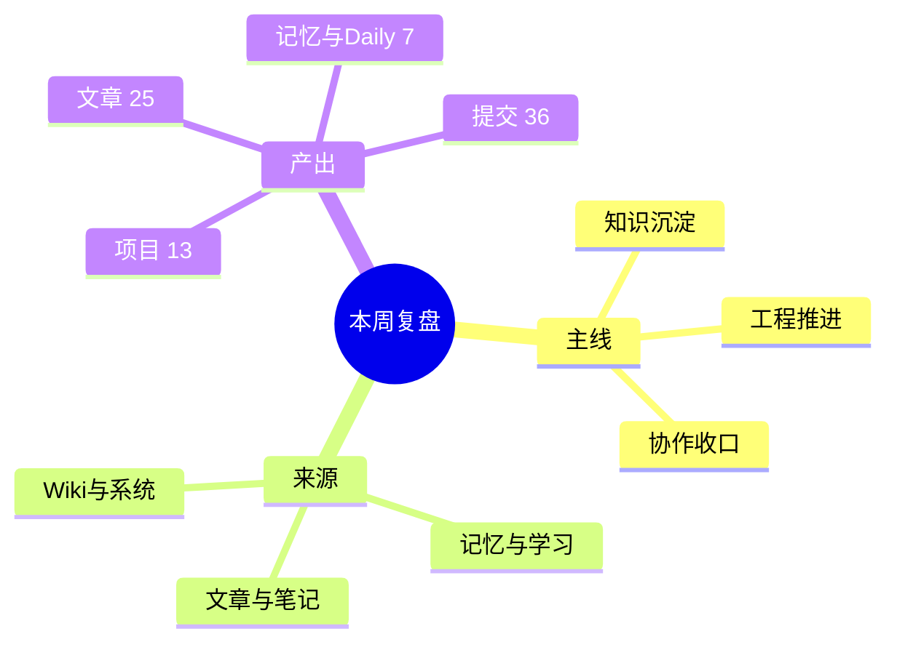

# 2026-04-12 周复盘：这周我把企微、Hermes、Obsidian 串起来了：从治理到协作，从知识到自动化

---

## 一、本周一句话总结

这周的主线很清楚：继续把 OpenClaw + Obsidian 的知识闭环工程化，同时把企微团队空间推进到可治理、可扩展、可复制部署，同时补齐 OpenClaw / Hermes / Obsidian 的协作口径。

## 二、本周主线

- 这周的主线很清楚：继续把 OpenClaw + Obsidian 的知识闭环工程化，同时把企微团队空间推进到可治理、可扩展、可复制部署，同时补齐 OpenClaw / Hermes / Obsidian 的协作口径。




## 本周检索与整理来源（规则说明）

本周复盘的内容从以下来源检索并整理：

- **01-Articles/**：文章、手册、演讲稿、PPT 等正式输出（25 项）
- **02-Notes/**：笔记、草稿、临时记录（27 项）
- **04-Memory/**：记忆、决策、经验、项目状态（5 项）
- **71-Wiki/**：结构化知识、概念、洞察（2 项）
- **70-RAW/**：原始素材、剪藏、音频、报告（402 项）
- **90-System/**：系统文档、规则、配置（11 项）
- **05-Daily/**：每日记录、周期产出（2 项）
- **03-Projects/**：项目、脚本、工程资产（13 项）

整理原则：优先从记忆、学习、笔记、文章、知识体系中提取可复用内容；保留证据链，不随意覆盖；优先增量追加，避免破坏性整理。

## 三、本周任务归类

| 类别      | 本周动作                          |
| ------- | ----------------------------- |
| 方案与知识沉淀 | 文章/手册类产出 25 项                 |
| 工程与脚本推进 | 项目/脚本相关产出 13 项，git 提交 36 条    |
| 记忆与复盘维护 | 记忆/Daily/笔记/学习/Wiki 相关变更 36 项 |

### A. 方案与知识沉淀
- 持续输出文章、手册、演讲稿、PPT 或复盘类文档
- 把阶段性结论沉淀成可复用内容资产
### B. 工程与脚本推进
- 推进脚本、部署器、自动化任务或工作流实现
- 用 git 提交把临时动作收敛成可复用工程资产
### C. 记忆、笔记与知识体系维护
- 持续补齐记忆、规则、流程和边界说明
- 从 04-Memory/（记忆）、.learnings/（学习）、02-Notes/（笔记）、71-Wiki/（知识）中检索并整理本周内容
- 让“真实生效口径”逐步清晰，减少配置幻觉和重复试错

## 四、本周主要工作任务与主题

### 1. 企微团队空间：治理、权限、可复制部署

- **主题：** 把企微团队空间做成可治理、可扩展、可复制部署的 AI 工作台

- **具体任务：**

  - 团队空间目录分层设计（共享/私有/记忆/报告/技能/脚本）

  - 用户空间初始化脚本化

  - 管理员/普通用户权限模型

  - cron 元数据管理与链路联动

  - wecom-v61-deployer 部署器连续迭代（v6.1~v6.7）

  - 部署验收清单与失败提示

  - 演讲稿、公众号版、PPT 版多版本输出

- **来源：** 01-Articles/、02-Notes/、03-Projects/、90-System/、git 提交

### 2. OpenClaw / Hermes / Obsidian 协作：配置、模型、入口

- **主题：** 补齐 OpenClaw / Hermes / Obsidian 的协作口径

- **具体任务：**

  - Hermes 配置文件修正（model.default / fallback / smart_model_routing / delegation）

  - OpenClaw 主入口与 Hermes 本地执行层分工澄清

  - 共享工作区与桥接方案梳理

  - Hermes CLI 验证与调试

- **来源：** 01-Articles/、02-Notes/、04-Memory/、git 提交

### 3. 知识库与周复盘：自动生成、格式规范、来源整理

- **主题：** 周复盘自动生成，从多来源检索整理

- **具体任务：**

  - weekly_review_generate.py 自动生成器实现

  - 加入 mermaid、表格、代码块格式要求

  - 加入来源整理规则（从记忆、learning、01-Articles、02-Notes、本周任务、日志、wiki沉淀中检索）

  - 一键生成脚本 `run_weekly_review.sh`

  - launchd 定时任务配置（尝试解决 macOS TCC/权限问题）

- **来源：** 04-Memory/、90-System/、80-Tools/、05-Daily/、git 提交


## 五、关键产出

- 2026-04-05-Droid Pilot：把Android UI自动化交给Agent，自己只管说人话
- 2026-04-06-gstack：一个人也能像20人团队那样交付的AI软件工厂
- 2026-04-06-别再调Prompt了-我用一套Markdown让OpenClaw40天越用越聪明
- 2026-04-06-用-OpenClaw-管理-Obsidian：让吃灰知识库重新运转
- 2026-04-08-Karpathy-LLM-Wiki-实战：用-OpenClaw-改造-Obsidian-打造可复利知识闭环-v2
- 2026-04-08-Karpathy-LLM-Wiki-实战：用-OpenClaw-改造-Obsidian-打造可复利知识闭环
- 2026-04-08-用OpenClaw把Obsidian改造成LLM-Wiki的工程化落地方案-v3.1
- 2026-04-08-用OpenClaw把Obsidian改造成LLM-Wiki的工程化落地方案-v3
- 2026-04-08-用OpenClaw把Obsidian改造成LLM-Wiki的工程化落地方案-v4
- 2026-04-10-公众号版-把企微团队空间做成可治理可扩展的AI工作台
- 2026-04-10-把企微团队空间做成可治理可扩展的AI工作台
- 2026-04-10-演讲稿-把企微团队空间做成AI工作台
- 2026-04-10-现场演讲稿-把企微团队空间做成可治理的AI工作台
- 2026-04-11-Hermes agent 高级玩法
- 2026-04-11-OpenClaw-Hermes-Obsidian-共享工作区方案

### 本周关键提交

```text
2026-04-12 | a6a720e | refine: make weekly review clean for direct publishing
2026-04-12 | 6a9a926 | feat: add popular title and recommended tags for wechat public account
2026-04-12 | 049e045 | feat: add weekly main tasks and topics section
2026-04-12 | 9cbdc90 | feat: add weekly review sources from memory, learnings, notes, articles, wiki, etc.
2026-04-12 | fa41dcd | feat: add one-click script to run weekly review manually
2026-04-12 | 00ce730 | fix: make weekly review script executable and launchd-friendly
2026-04-12 | 7fc49d5 | fix: launch weekly review via ~/Library/Scripts wrapper
2026-04-12 | 7d94414 | docs: add weekly review for 2026-04-12 with mermaid, tables, and code blocks
2026-04-12 | ffc7a25 | fix: point weekly launchd job to user bin wrapper
2026-04-12 | f40dafb | fix: wrap weekly review job for launchd compatibility
2026-04-12 | cf7a692 | fix: run weekly review directly via python in launchd
2026-04-12 | ad2fd20 | fix: make weekly launchd job run under zsh login shell
```

## 六、经验与结论

### 1. 先把稳定边界写死，再持续扩功能
边界一旦清楚，后面的新增能力才不容易越做越乱。
### 2. 自动化默认非破坏性
先保证可复核、可追踪、可回滚，再逐步开放更激进的自动整理。
### 3. 当前真实生效路径，优先级高于理想设计图
排障和扩展时，先区分“目标方案”和“当前真的在跑的链路”。
### 4. 能复制部署，才算真的进入工程阶段
能不能跨环境复用，比“这次手工跑通”更重要。

## 七、不足与待补点

### 1. 版本和表达材料可能继续分叉
同主题如果同时维护文章版、手册版、演讲版、PPT 版，后面容易出现重复维护。
### 2. daily 记录如果偏薄，周复盘就仍然会依赖反推
这会增加整理成本，也会丢掉一些过程信息。
### 3. 某些协作链路可能仍未完全稳定
方案和骨架有了，不代表默认使用路径已经完全闭环。

## 八、下周建议重点

### 建议重点 1：收敛主线文档
把同主题的多版本材料收敛成一个主线总纲，其它版本尽量围绕它派生。
### 建议重点 2：继续把部署或自动化做成可验收安装器
优先补安装后检查、失败提示、权限缺失提示和回滚路径。
### 建议重点 3：补 daily 机制
把每日推进、结论、问题、明日动作写稳，后面的周报会轻很多。

## 九、给自己的复盘结论

这周不是单点推进，而是在把零散动作继续收口成一个更稳定、可复用、可长期积累的工作系统。


## 十、本周有感而发

- **企微治理这块儿**：

  以前以为做个机器人进群聊就能当 AI 助手了，这周才发现——

  没有空间隔离、没有权限边界、没有分层记忆，机器人就是一个群聊裸奔的「话痨工具人」。

- **Hermes 这块儿**：

  配置 Hermes 配置了半天，结果发现：

  最稳定的配置不是配得有多全，而是「当前真正在跑的那个路径」；

  再花哨的 fallback/路由/委派，如果当前真在跑的链路挂了，那就是玄学。

- **周复盘这块儿**：

  写周复盘生成器写了一周，写了改、改了再改——

  最后发现：最能打的周复盘，不是格式最全的那个，而是「直接把这周干了啥说清楚」的那个。

- **Overall**：

  这周最大的感受是：

  所谓的「AI 工作流」，不是给 AI 写几百行提示词，而是「给 AI 搭个稳定的台子」；

  台子搭稳了，剩下的就是让它别瞎折腾就行。

## 附：本周产出计数

| 指标 | 数值 |
|---|---:|
| 文章产出 | 25 |
| 笔记/草稿 | 27 |
| 学习/经验 | 0 |
| 记忆更新 | 5 |
| Wiki 更新 | 2 |
| 原始素材 | 402 |
| 系统文档 | 11 |
| 项目/脚本产出 | 13 |
| Daily记录 | 2 |
| git 提交数 | 36 |

---

#AI助手 #OpenClaw #Hermes #Obsidian #企微 #AI工作台 #知识管理 #自动化 #工程实践
