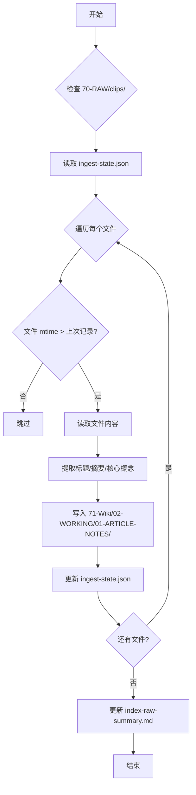

# Alan-Workspace LLM Wiki 专业 Wiki 编译器优化方案

## 一句话总结
当前 Alan-Workspace 的 LLM Wiki 已有“三层知识架构、个人事务层、Apple 提醒事项集成、每日工时自动填报”，但缺少**“从 70-RAW/ 增量编译成 71-Wiki/01-READING/ 的专业 Wiki 编译器”**，可以借鉴提示词中的“Wiki 编译器”功能，做一个轻量可落地的优化。

---

## 一、当前现状（已有内容）

### 1.1 目录结构
| 目录 | 用途 | 现状 |
|---|---|---|
| `70-RAW/` | 只读原始资料（clips/reports/audio） | ✅ 已有，400+ 篇剪藏 |
| `71-Wiki/01-READING/` | 实际阅读层（DOMAINS/TOPICS/ENTITIES/PATTERNS/DIGESTS） | ✅ 已有，三层结构 |
| `71-Wiki/02-WORKING/` | AI 工作间（原始输入、草稿、候选内容） | ✅ 已有 |
| `71-Wiki/99-SYSTEM/` | Pipeline 内部（索引/报告/状态） | ✅ 已有 |
| `00-Inbox/todo-backlog.md` | 待办唯一真相源（P0/P1/P2/P3） | ✅ 已有 |
| `10-PERSONAL-OPS/` | 个人事务层（每日驾驶舱/计划/待办/复盘/日志/工时） | ✅ 已有 |
| `09-Reports/` | Lint/巡检报告 | ✅ 已有 |
| `80-Tools/automations/` | 自动化脚本 | ✅ 已有，但缺少“Wiki 编译器” |

### 1.2 已有自动化脚本
| 脚本 | 作用 |
|---|---|
| `inbox_auto_normalize.py` | 00-Inbox/ 规范化（frontmatter/移动/重命名） |
| `wiki_link_suggest.py` | 更新 71-Wiki/ 页面的 `## Related` 区块 |
| `wiki_lint.py` | 扩展版 Wiki Lint（孤岛页/断链/格式/脏文件） |
| `daily_brief.py` | 生成每日驾驶舱（Personal Ops 版） |
| `brain-to-reminders.sh` | 推送到 Apple Reminders（极简版） |
| `daily-timesheet-minimal.py` | 极简版每日工时记录 |

---

## 二、优化方向：专业 Wiki 编译器（轻量可落地）

### 2.1 核心功能（借鉴提示词）
| 功能 | 优先级 | 说明 |
|---|---|---|
| **1. 读取 70-RAW/** | P0 | 支持 Markdown 和图片 |
| **2. 增量编译** | P0 | 只处理新文件或有变化的文件，不要重写整个 wiki |
| **3. 为每份 raw 资料生成** | P0 | 标题、摘要、核心概念列表 |
| **4. 写百科式文章（concept-xxx.md）** | P1 | 解释关键概念，并添加双向链接 概念名 |
| **5. 创建或更新 INDEX.md** | P0 | 列出所有文档摘要和链接 |
| **6. 自动发现概念之间的关系，添加 backlinks** | P1 | 概念互链 |
| **7. 处理图片** | P2 | 描述图片内容并链接到对应文章 |
| **8. 保持干净的 Markdown 格式** | P0 | 规范 frontmatter、无冗余 |

---

### 2.2 轻量实现方案（分阶段）

#### Stage 1（本周）：增量编译 + INDEX.md + 摘要生成
- **新增脚本**：`80-Tools/automations/wiki_ingest.py`
- **输入**：`70-RAW/clips/`（新文件或 mtime 变化的文件）
- **状态记录**：`71-Wiki/99-SYSTEM/04-JOB-STATE/ingest-state.json`（记录已处理文件的 mtime）
- **输出**：
  - `71-Wiki/02-WORKING/01-ARTICLE-NOTES/<YYYY-MM-DD-标题>.md`（原始摘要 + 核心概念列表）
  - `71-Wiki/99-SYSTEM/01-INDEXES/index-raw-summary.md`（列出所有 raw 摘要和链接）
- **动作**：
  - 读取 raw 文件名和内容
  - 提取标题、摘要（前 300 字）、核心概念（关键词提取）
  - 只处理 mtime > 上次记录的文件
  - 更新 state.json

#### Stage 2（下两周）：concept-xxx.md 生成 + 双向链接
- **扩展脚本**：`wiki_ingest.py`
- **输出**：
  - `71-Wiki/01-READING/01-DOMAINS/concept-<概念名>.md`（百科式文章，解释关键概念）
  - 自动添加双向链接：`概念名`
- **动作**：
  - 从 02-WORKING/01-ARTICLE-NOTES/ 中提取核心概念
  - 为每个概念生成一个 concept-xxx.md
  - 在文章之间添加双向链接

#### Stage 3（可选）：图片处理
- **扩展脚本**：`wiki_ingest.py`
- **动作**：
  - 识别 70-RAW/assets/ 中的图片
  - 描述图片内容（可选：用 multimodal 模型）
  - 链接到对应文章

---

## 三、wiki_ingest.py 设计（Stage 1）

### 3.1 脚本签名
```python
#!/usr/bin/env /usr/bin/python3
"""Wiki Ingest: incremental compiler from 70-RAW/ to 71-Wiki/02-WORKING/01-ARTICLE-NOTES/."""
```

### 3.2 核心逻辑


### 3.3 核心概念提取（极简版，不用 LLM）
- **关键词规则**：
  - 大写字母开头的词（如 LLM、Wiki、Obsidian、OpenClaw）
  - 括号里的定义（如 **三层架构**：Raw / Wiki / Schema）
  - 高频词（词频 > 3）
- **输出**：`- [ ] 概念名`（放到 02-WORKING/01-ARTICLE-NOTES/ 里的“核心概念”节）

---

## 四、索引文件格式（index-raw-summary.md）
```markdown
---
title: Raw Summary Index
aliases: []
category: System
created: 2026-04-13 HH:mm
updated: 2026-04-13 HH:mm
tags: [LLMWiki, Index]
---

# Raw Summary Index

## 2026-04-13 新增
- 2026-04-13-xxx：摘要（前 300 字）

## 2026-04-12 新增
- 2026-04-12-xxx：摘要（前 300 字）
```

---

## 五、与当前配置的整合
- **Raw 来源**：`70-RAW/`（只读，不修改）
- **工作层输出**：`71-Wiki/02-WORKING/01-ARTICLE-NOTES/`（AI 工作间，人工可审核）
- **阅读层输出**：`71-Wiki/01-READING/01-DOMAINS/concept-xxx.md`（Stage 2 后）
- **索引**：`71-Wiki/99-SYSTEM/01-INDEXES/index-raw-summary.md`
- **状态记录**：`71-Wiki/99-SYSTEM/04-JOB-STATE/ingest-state.json`
- **一键脚本**：`80-Tools/automations/run-wiki-ingest.sh`

---

## 六、下一步（从哪开始？）
1. **先做 Stage 1**：`wiki_ingest.py` + `run-wiki-ingest.sh` + `ingest-state.json`
2. **再做 Stage 2**：concept-xxx.md 生成 + 双向链接
3. **最后做 Stage 3**（可选）：图片处理

---

## References
- LLM Wiki
- [LLM Wiki 完整体系搭建与功能介绍](/articles/2026-04-13-Alan-Workspace-LLM-Wiki-%E5%AE%8C%E6%95%B4%E4%BD%93%E7%B3%BB%E6%90%AD%E5%BB%BA%E4%B8%8E%E5%8A%9F%E8%83%BD%E4%BB%8B%E7%BB%8D-df4e0532/)
