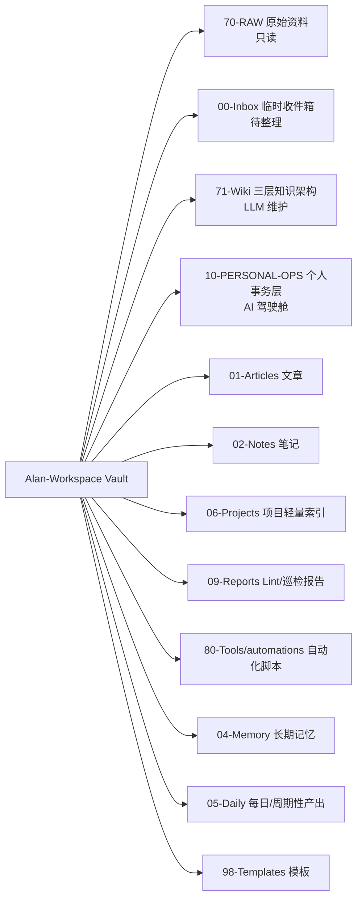
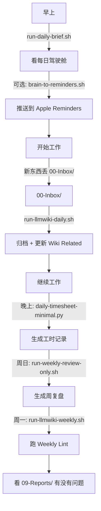

# Alan-Workspace LLM Wiki 完整体系搭建与功能介绍

## 一句话总结
Alan-Workspace 是一套基于 OpenClaw + Obsidian 的 LLM Wiki 完整体系：轻量落地、可复用、可扩展，借鉴了 Obsidian-Brain-OS 的三层知识架构、个人事务层、Apple 提醒事项集成和每日工时自动填报。

---

## 目录结构总览

---

## 一、核心架构

### 1.1 三层知识架构（借鉴 Obsidian-Brain-OS）

| 层级 | 目录 | 用途 | 说明 |
|---|---|---|---|
| **READING 阅读层** | `71-Wiki/01-READING/` | 实际阅读的内容 | 精炼后的知识，你直接看这里 |
| → 子层级 | `01-DOMAINS/` | 领域知识 | 原 `concepts/`，概念、定义、领域知识 |
| → | `02-TOPICS/` | 主题聚合 | 原 `insights/`，洞察、判断、对比、综述 |
| → | `03-ENTITIES/` | 实体 | 原 `entities/`，公司、产品、工具、人物 |
| → | `03-PATTERNS/` | 模式卡片 | 已验证的模式、最佳实践 |
| → | `04-DIGESTS/` | 日/周摘要 | 自动生成的摘要，从这里开始阅读 |
| **WORKING 工作层** | `71-Wiki/02-WORKING/` | AI 的工作间 | 原始输入、草稿、候选内容，**不要直接看这里** |
| → 子层级 | `01-ARTICLE-NOTES/` | 原始文章输入 | 从 70-RAW/ 或 00-Inbox/ 来的原始输入 |
| → | `02-PATTERN-CANDIDATES/` | 模式候选 | 审核中的模式，还没到 READING/ |
| → | `03-TOPIC-DRAFTS/` | 主题草稿 | 进行中的主题页面 |
| → | `04-RESEARCH-QUESTIONS/` | 开放研究问题 | 需要深入研究的方向 |
| **SYSTEM 系统层** | `71-Wiki/99-SYSTEM/` | Pipeline 内部 | 仅 AI 可读，自动生成的索引、报告、状态 |

---

### 1.2 个人事务层（Personal Ops）

| 目录 | 用途 | 说明 |
|---|---|---|
| `10-PERSONAL-OPS/01-DAILY-BRIEFS/` | 每日驾驶舱 | 每天早上生成，告诉你今天怎么打 |
| `10-PERSONAL-OPS/02-PLANS-AND-SCHEDULES/` | 周计划/月计划 | 周一/每月 1 号生成 |
| `10-PERSONAL-OPS/03-TODOS-AND-FOLLOWUPS/` | 待办/承诺/进度/决策 | 当前承诺事项、进度看板、决策队列 |
| `10-PERSONAL-OPS/04-REVIEWS-AND-RETROS/` | 复盘 | 周复盘、月复盘 |
| `10-PERSONAL-OPS/05-OPS-LOGS/` | 日常日志 | 频道历史、每日进度、复盘快照 |
| `10-PERSONAL-OPS/06-TIMESHEETS/` | 工时记录 | 每日工时自动填报（极简版） |

---

### 1.3 待办唯一真相源

- **文件**：`00-Inbox/todo-backlog.md`
- **优先级体系**：
  - **P0**：今天必须完成 → 出现在今日 Top 3
  - **P1**：本周推进 → 排入周计划
  - **P2**：本月安排 → 加入月里程碑
  - **P3**：需要判断 → 留在待办池直到评估

---

## 二、自动化脚本清单

| 脚本 | 作用 | 推荐运行频率 |
|---|---|---|
| `run-all.sh` | 一键运行全部（Daily + Weekly） | 周日/周一 |
| `run-llmwiki-daily.sh` | LLM Wiki 日常整理（Inbox 规范化 + Related 推荐） | 每天 |
| `run-llmwiki-weekly.sh` | LLM Wiki 每周整理（Weekly Lint） | 每周一 |
| `run-weekly-review-only.sh` | 只生成周复盘 | 每周日 |
| `run-wiki-lint.sh` | 一键跑扩展版 Wiki Lint（孤岛页/断链/格式/脏文件） | 每周/按需 |
| `run-daily-brief.sh` | 一键生成每日驾驶舱（Personal Ops 版） | 每天早上 |
| `brain-to-reminders.sh` | 将今日 P0/P1 推送到 Apple Reminders（需要 `remindctl`） | 每天早上（可选） |
| `daily-timesheet-minimal.py` | 极简版每日工时记录（扫描今日 git 提交） | 每天晚上（可选） |
| `writer_agent.py` | 单一写入入口（保证 git commit） | 按需 |

---

## 三、核心功能说明

### 3.1 LLM Wiki 日常整理（`inbox_auto_normalize.py` + `wiki_link_suggest.py`）
- **输入**：`00-Inbox/` 下的 Markdown 文件
- **动作 1**：规范化 frontmatter（title/aliases/category/created/updated/tags）
- **动作 2**：自动判断类型（note/article/wiki），移动到对应目录（02-Notes/ / 01-Articles/ / 71-Wiki/insights/）
- **动作 3**：自动重命名为“日期+标题”格式
- **动作 4**：更新 71-Wiki/ 下所有页面的 `## Related` 区块（关键词 overlap 计算，互相链接）
- **输出**：归档后的文件 + 更新后的 Wiki 页面

---

### 3.2 扩展版 Wiki Lint（`wiki_lint.py`）
- **检查项**：
  - 孤岛页（no inbound links）
  - index.md 缺失条目
  - 断链（链接 指向不存在的文件）
  - 缺失 frontmatter（title/category/created/updated）
  - 脏文件（未命名/临时/副本文件）
- **输出**：`09-Reports/YYYYMMDD-weekly-lint.md`

---

### 3.3 个人事务层每日驾驶舱（`daily_brief.py`）
- **输入**：
  - `00-Inbox/todo-backlog.md`（P0/P1/P2/P3）
  - 最近 3 天 git 提交
- **输出结构**：
  1. 今天最重要的 3 件事
  2. 今天必须推进但不必做完
  3. 今天等待反馈 / 需要催办
  4. 今天需要拍板的事
  5. 今天可委派的事
  6. 低能量时可做的小事
  7. 今天明确不做
  8. 今日提醒
  9. 最近 3 天 git 提交
- **输出文件**：`10-PERSONAL-OPS/01-DAILY-BRIEFS/daily-briefing.md`

---

### 3.4 Apple 提醒事项集成（`brain-to-reminders.sh`）
- **依赖**：`remindctl`（需从 https://github.com/nicholasgasior/remindctl 安装）
- **输入**：`00-Inbox/todo-backlog.md` 中的 P0/P1
- **动作**：推送到 Apple Reminders “Brain今日” 列表，截止时间设为当天 21:00
- **去重**：已存在的事项跳过

---

### 3.5 每日工时自动填报（极简版）（`daily-timesheet-minimal.py`）
- **输入**：今日 git 提交（当前 repo）
- **输出**：`10-PERSONAL-OPS/06-TIMESHEETS/timesheet-YYYY-MM-DD.md`
- **结构**：
  - 今日 git 提交
  - 手动补充（可选）

---

## 四、使用流程（推荐）

---

## 五、关键配置文件

| 文件 | 作用 | 位置 |
|---|---|---|
| `AGENTS.md` | 运行规则 / 开机 SOP | Vault 根目录 |
| `SOUL.md` | 说话方式 / 输出形态 | Vault 根目录 |
| `USER.md` | 用户偏好 / 免打扰 | Vault 根目录 |
| `MEMORY.md` | 长期记忆（精炼） | Vault 根目录 |
| `TOOLS.md` | 环境字典 / 别名表 | Vault 根目录 |
| `00-Inbox/todo-backlog.md` | 待办唯一真相源 | 00-Inbox/ |

---

## 六、References
- Obsidian-Brain-OS 总览
- LLM Wiki
