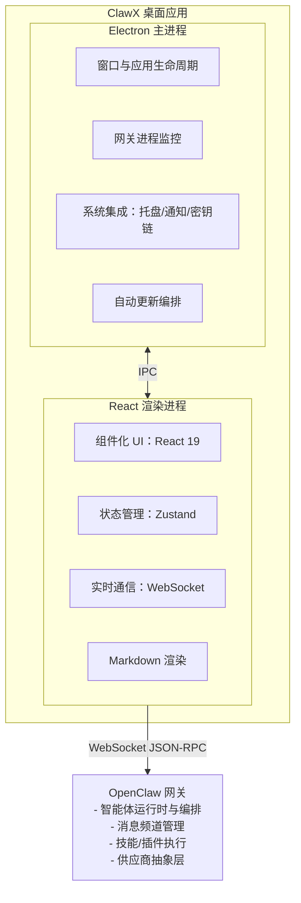

> 图片资源未同步：未命名图片

# ClawX：把 OpenClaw 智能体从命令行搬到桌面

OpenClaw 这东西，懂的人都懂：能力像开挂。

但现实也很直白：**强归强，CLI 一上来就把一半人劝退**。

- 配置文件一堆，参数像兵书目录
- 网关进程、浏览器 profile、权限隔离，随便一个点就能把人卡住
- 结果就是：团队里只有“军师型选手”能玩得转，其他人只能围观

ClawX 干的事很简单：

> 把 OpenClaw 那套“指挥作战”的能力，搬进桌面 UI，让普通人也能上手，不用背命令。

---

## 1）ClawX 是什么

ClawX 是 OpenClaw 智能体的桌面客户端。

它不想再造一个聊天框，而是把 OpenClaw 的核心能力（频道、技能、定时任务、进程管理、供应商配置）做成一套**看得见、点得动、错了能定位**的桌面工作台。

---

## 2）为什么要做桌面化：命令行不是门槛，是“协作断层”

很多团队不是不会用 AI，而是**用不起来**：

| 痛点 | 典型后果 | ClawX 的解法 |
|---|---|---|
| 命令行配置复杂 | 只有少数人能操作，协作靠“口口相传” | 引导式向导 + 可视化配置 |
| 手动改配置文件 | 一改就炸，炸了还不知道哪行错 | UI 实时校验 + 结构化编辑 |
| 网关/进程管理繁琐 | 状态不可控，挂了就“全军覆没” | 自动管理网关生命周期 |
| 多供应商切换麻烦 | Key/环境乱成一锅粥 | 统一供应商面板 |
| 技能/插件安装复杂 | “想用但不会装”，最后放弃 | 内置技能市场与管理 |

一句话总结：**把“能跑”变成“能用”，把“能用”变成“能团队化”。**

---

## 3）ClawX 内置 OpenClaw 核心：别让用户先装一堆再对齐版本

ClawX 的一个关键点是：

- 不要求你先单独安装 OpenClaw
- 运行时直接嵌进应用里
- 目标是“装完就能跑”

同时它强调跟上游 OpenClaw 严格同步：

- 新功能能跟
- 稳定性修复能跟
- 技能生态兼容性更可控

对用户来说，少掉一类体力活：**桌面端和 CLI 之间不再需要你手动对版本、对配置。**

---

## 4）功能怎么用：按真实路径讲，不按卖点堆

### 4.1 零配置门槛：第一次就能开打
- 安装后走向导：语言/地区、供应商 Key、技能包
- 目标：第一次对话/第一次任务不需要终端

### 4.2 聊天：只是入口，不是主角
- 多会话上下文
- 消息历史
- Markdown 富文本

### 4.3 多频道：一套工作台带多支小队
- 每个频道独立运行
- 适合把“个人助手 / 团队助手 / 监控助手”拆开，互不污染

### 4.4 定时任务：让智能体 7×24 站岗
- 定义触发器、间隔
- 把“日报/监控/同步/汇总”这种重复活，直接交给定时任务

### 4.5 技能系统：把能力写成模块，别靠复制粘贴提示词
- 浏览、安装、管理技能
- 能力像插件一样组合

### 4.6 供应商集成：把密钥管理当正经事
- 多供应商（OpenAI/Anthropic 等）
- 凭证进系统原生密钥链（比写配置文件安全得多）

---

## 5）系统架构：三段式，谁管谁别搞混

ClawX 用的是“桌面常见但靠谱”的分层：

- **Electron 主进程**：管窗口、系统集成、网关进程、自动更新
- **React 渲染进程**：管 UI、状态、实时交互
- **OpenClaw 网关**：管智能体运行时、编排、频道、技能、供应商抽象

两条通信链路：

- **IPC**：Electron 主进程 ↔ 渲染进程
- **WebSocket(JSON-RPC)**：ClawX ↔ OpenClaw 网关

### 架构图（Mermaid 版）

### 设计原则（别写在墙上，写进实现里）

- **进程隔离**：高负载时 UI 也别卡死
- **优雅恢复**：指数退避重连，别动不动全断
- **安全存储**：Key 和敏感数据交给系统安全存储
- **热重载**：开发模式 UI 改了就生效，不要每次重启网关

---

## 6）使用场景：把“酷功能”落到具体活

### 🤖 个人 AI 助手
问答、写邮件、总结文档、处理日常任务——全部在桌面里完成。

### 📊 自动化监控
定时智能体盯新闻、盯价格、盯事件，然后推送到你设定的渠道。

### 💻 开发者效率工具
代码审查、文档生成、重复编码任务自动化（尤其适合把流程沉淀成技能）。

### 🔄 工作流自动化
把多个技能串成流水线：处理数据、转换内容、触发动作——可视化编排。

---

#OpenClaw #ClawX #AI智能体 #自动化
