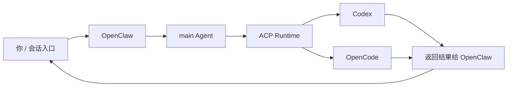
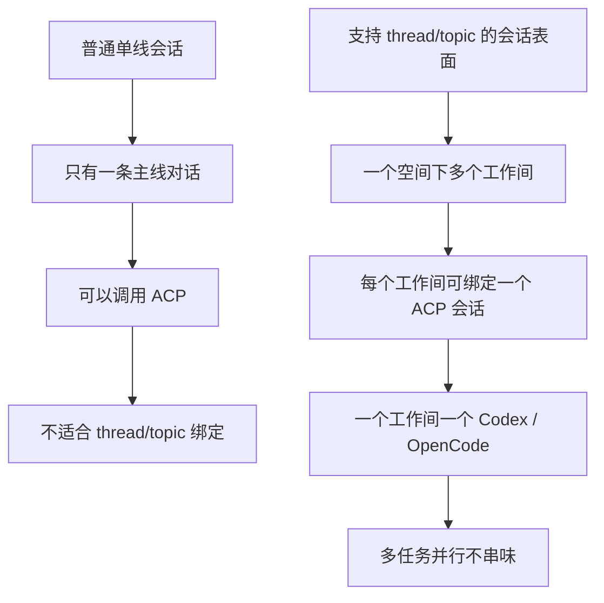

# OpenClaw + Codex 实战入门：怎么调、怎么用、什么时候该上多线程工作间

## 1. 先说结论

如果只说最实用的结论，可以记这三句：

1. **你现在已经可以在 OpenClaw 里调用 ACP 的 Codex / OpenCode 了。**
2. **在普通单线会话里也能用 ACP，只是不能天然享受 thread/topic 绑定带来的隔离感。**
3. **想体验“一个线程绑定一个 Codex”的高级玩法，需要切到支持 thread/topic 的会话表面。**

也就是说，ACP 并不是必须等到 thread/topic 才能用。thread/topic 只是更高级、更适合并行多任务的一种使用形态。

---

## 2. 什么是 ACP

在 OpenClaw 里，可以把 ACP 理解成：

> **把外部编码代理接进 OpenClaw 的一层运行时桥接。**

你现在本地已经有：

- `codex`
- `opencode`

这意味着 OpenClaw 后面可以不只是自己回答问题，还可以把某些任务交给这些 ACP agent 去执行。

从使用视角看，它的价值主要是两件事：

- 让 OpenClaw 成为**统一入口**
- 让 Codex / OpenCode 成为**背后干活的执行引擎**

所以你可以把它理解成这种关系：

```text
你 → OpenClaw（主入口） → ACP agent（Codex / OpenCode）
```

---

## 3. 你当前这套环境的状态

基于你当前本机情况，可以归纳成这样：

| 项目 | 当前状态 |
|---|---|
| OpenClaw | 已安装并在运行 |
| ACP | 已启用 |
| 默认 ACP agent | `codex` |
| 已放行 agent | `codex`、`opencode` |
| 本地 Codex | 已安装 |
| 本地 OpenCode | 已安装 |
| 单线会话里直接用 ACP | 可以 |
| thread/topic 绑定 | 需要支持 thread/topic 的会话表面 |

所以最重要的一句是：

> **基础 ACP 接线已经到位，剩下主要是“怎么用更顺手”。**

---

## 4. ACP 安装与配置步骤详情

这一节专门补你最关心的：如果本地已经有 `codex` 和 `opencode`，OpenClaw 这边到底怎么接上。

### 4.1 前提条件

先确认这几件事：

| 检查项 | 说明 |
|---|---|
| OpenClaw 已安装 | `openclaw` 命令可用 |
| OpenClaw gateway 正常运行 | `openclaw status` 正常 |
| 本地 `codex` 已安装 | `codex --version` 可执行 |
| 本地 `opencode` 已安装 | `opencode --version` 可执行 |

### 4.2 核心配置思路

OpenClaw 这边需要做的，本质上就是 4 件事：

1. 启用 ACP
2. 开启 ACP dispatch
3. 设置默认 ACP agent
4. 配置允许使用的 agent 白名单

### 4.3 配置项示例

你当前这套最小可用配置，可以理解成这样：

```json
{
  "acp": {
    "enabled": true,
    "dispatch": {
      "enabled": true
    },
    "defaultAgent": "codex",
    "allowedAgents": ["codex", "opencode"],
    "maxConcurrentSessions": 4
  }
}
```

### 4.4 各字段含义

| 字段 | 作用 |
|---|---|
| `acp.enabled` | 总开关，启用 ACP |
| `acp.dispatch.enabled` | 允许 OpenClaw 把任务分发给 ACP agent |
| `acp.defaultAgent` | 默认走哪个 ACP agent，这里是 `codex` |
| `acp.allowedAgents` | 明确允许哪些 agent 被调用 |
| `acp.maxConcurrentSessions` | 并发会话数上限 |

### 4.5 实际安装 / 配置步骤

#### Step 1：确认本地 agent 可执行

```bash
codex --version
opencode --version
```

如果这两条命令能正常返回版本号，说明本地可执行层没问题。

#### Step 2：确认 OpenClaw 正常运行

```bash
openclaw status
```

#### Step 3：修改 OpenClaw 配置

通常是编辑：

```text
~/.openclaw/openclaw.json
```

把 `acp` 段补进去，或者更新成上面的最小配置。

#### Step 4：重启 OpenClaw

```bash
openclaw gateway restart
```

如果你不是用 CLI 管理运行进程，也可以按你自己的方式重启 gateway/runtime，只要让新配置生效就行。

#### Step 5：做最小验证

最小验证不需要上来就跑复杂任务，可以先在 OpenClaw 对话里发一个小任务，例如：

```text
用 codex 帮我看当前 workspace，告诉我有哪些顶层目录。
```

或者：

```text
用 opencode 帮我检查当前 workspace 是否适合代码任务。
```

只要 OpenClaw 能正常把任务转给对应 agent，并返回结果，这条链路就算通了。

### 4.6 推荐配置策略

对于你这种本地已经装了 `codex` + `opencode` 的场景，我建议：

- 默认 agent 先设为 `codex`
- `opencode` 保留为显式调用备用
- 先把 ACP 当执行引擎用起来
- 不要一上来就做全自动 thread/topic 并行

### 4.7 一句话理解安装配置过程

> **本地装好 Codex / OpenCode，OpenClaw 配好 ACP 开关和白名单，重启后就能从 OpenClaw 统一调度。**
>
> ```tex
> 帮我安装配置  openclaw/acpx
> 我本地有 codex 和 opencode
> ```
>
> 

---

## 5. OpenClaw + ACP 的调用关系

先看一张简单图，理解会更快。



这张图说明的其实很简单：

- 你不是直接跟 Codex 说话
- 你是先跟 OpenClaw 说
- OpenClaw 再决定把任务交给谁
- 干活结果再统一返回给你

这也是为什么你不用记很多底层调用细节，只要会说“让 Codex 来做”就够了。

---

## 5. 最实用的调用方式

## 5.1 方式一：直接用自然语言指定 Codex

这是你最常用、也最稳的方式。

### 你可以这样说

- **用 codex 帮我看这个工程**
- **让 codex 修这个 bug**
- **用 codex 实现这个功能**
- **让 codex 看当前 workspace，告诉我顶层目录结构**
- **用 ACP 的 codex 来做这个任务**

### 这种方式的特点

- 你不需要记复杂命令
- 只要说清楚“谁来做 + 做什么”
- OpenClaw 会负责调度 ACP runtime

这是最推荐的日常用法。

---

## 5.2 方式二：显式指定 OpenCode

如果你想用 `opencode` 而不是 `codex`，也一样。

### 你可以这样说

- **用 opencode 跑这个任务**
- **让 opencode 看这个目录**
- **用 ACP 的 opencode 来做这个功能**

这类说法的意义，就是把执行引擎明确指定成 `opencode`。

---

## 5.3 方式三：把 ACP 当“背后执行层”

很多时候你甚至不需要反复提 ACP 这个词，只要表达清楚你要哪个 agent 干活即可。

比如：

- **让 codex 去实现**
- **让 opencode 去排查**
- **这个任务交给 codex**

对你来说，最重要的是“表达意图”，而不是“手写 runtime 参数”。

---

## 6. 调用 Codex 编码干活的实际示例

下面给几个你后面最容易直接复用的例子。

## 示例 1：看工程结构

### 你可以这样说

> **用 codex 帮我看当前 workspace，告诉我有哪些顶层目录。**

### 适合场景

- 刚接一个项目
- 想先摸清目录结构
- 想确认这个 workspace 是否适合继续交给 Codex

### 预期结果

Codex 会先做目录探索，再把顶层结构、主要模块、可能的工作重点告诉你。

---

## 示例 2：修一个明确 bug

### 你可以这样说

> **让 codex 修这个 bug：接口在 `name` 为空时会报 500，帮我定位并修复。**

### 更好的说法

> **让 codex 修这个 bug：接口在 `name` 为空时会报 500。先定位根因，再给修复方案，最后补上测试。**

### 适合场景

- 明确 bug 修复
- 已知问题现象
- 需要连带补测试

### 这样说的好处

你不只是让它“修”，而是把交付要求一起说清楚了：

- 先定位
- 再修复
- 再补测试

这比只说“帮我看一下”更稳。

---

## 示例 3：做一个小功能

### 你可以这样说

> **用 codex 在当前项目里加一个导出 Markdown 的功能，先看现有结构，再给最小实现方案。**

### 适合场景

- 新增功能
- 小范围重构
- 需要先审视现有代码结构

### 这类任务的重点

最好加上这几个关键词：

- **先看现有结构**
- **给最小实现方案**
- **尽量少改动**
- **改完说明改了哪些文件**

这样 Codex 的输出会更像工程交付，而不是无脑写一坨代码。

---

## 示例 4：只做代码审查 / 评估

### 你可以这样说

> **用 codex 审一下这个目录，重点看架构问题、潜在 bug 和测试缺口。**

### 适合场景

- 不一定马上改代码
- 想先做 code review
- 想评估风险和后续工作量

这类用法也很适合你现在这种“先判断再落地”的工作方式。

---

## 7. 更稳的提问模板

如果你后面想稳定调用 Codex 干活，我建议你优先用下面这个模板：

```text
让 codex 做 <任务>
约束：<边界>
交付：<你要它输出什么>
```

### 示例

```text
让 codex 修这个 bug。
约束：先看现有代码结构，不要大改；如果涉及业务策略先停下来说明。
交付：定位原因、修复方案、修改文件、补充测试。
```

这个模板特别适合工程任务，因为它天然把：

- 任务
- 边界
- 交付要求

三件事都说清楚了。

---

## 8. 普通单线会话为什么能用 ACP，但不适合 thread/topic 绑定

这是最容易混淆的一点。

### 先说最短版

> **普通单线会话能用 ACP，但不天然具备 thread/topic 这种多线程隔离结构。**

单线会话的特点通常是：

- 只有一条主线对话
- 没有独立 topic
- 没有子线程绑定
- 所有消息都在同一个上下文里流动

所以在这种形态下你可以：

- 调 Codex
- 调 OpenCode
- 让 OpenClaw 做 ACP 调度

但不太适合直接玩“一个 thread 绑定一个 agent”这种高级玩法。

---

## 9. 什么是 thread/topic 高级玩法

如果换到支持 thread/topic 的会话表面，玩法就不一样了。

你可以把 topic 理解成“独立工作间”，把 thread 理解成“同一空间里的子会话”。

### 普通单线会话长这样

```text
你 ↔ OpenClaw
```

只有一条主线。

### 支持 thread/topic 的场景长这样

```text
workspace
├── thread/topic: codex-frontend
├── thread/topic: opencode-backend
├── thread/topic: writer-docs
└── thread/topic: debug-temp
```

这时每个 thread/topic 都像一个独立线程。

于是就能做：

- 一个 thread 绑定一个 Codex
- 一个 topic 绑定一个 OpenCode
- 多任务并行互不串味

---

## 10. thread/topic 多线程工作间的最小理解

这里不展开具体平台配置，只保留最值得对外表达的理解：

### 10.1 它的目标

> **把原本堆在一条主线里的多个任务，拆成多个独立工作间。**

### 10.2 它最适合的场景

- 多任务并行
- 多 agent 协作
- 长任务持续推进
- 希望不同任务天然隔离、不互相串味

### 10.3 推荐的工作间规划思路

| 工作间名称 | 推荐绑定对象 | 用途 |
|---|---|---|
| `main` | main | 主协调、分派、收口 |
| `codex-ui` | Codex | 前端 / 工程实现 |
| `opencode-core` | OpenCode | 后端 / 核心逻辑 |
| `writer-docs` | writer | 文档、文章、整理 |
| `debug-temp` | 临时 | 临时试验、排障 |

### 10.4 一句话理解 thread/topic

> **单线会话适合快速调用，thread/topic 适合多任务并行的长期工作间。**

---

## 11. thread/topic 高级玩法的真正好处

这个玩法不是“看起来高级”，而是真的适合你这种多任务、多角色场景。

### 典型好处

| 能力 | 价值 |
|---|---|
| 一个 topic 一个 agent | 会话天然隔离 |
| 多 topic 并行 | 多任务互不打扰 |
| 输出只在本 topic 里 | 不刷屏 |
| 后续消息自动进该会话 | 不用每次重复指定 agent |

### 一个很适合你的例子

| Topic | 绑定对象 | 用途 |
|---|---|---|
| `codex-ui` | Codex | 前端工程任务 |
| `opencode-core` | OpenCode | 后端 / 核心逻辑 |
| `writer-article` | writer | 文档 / 文章产出 |
| `murph-main` | main | 总协调、分派、收口 |

这时候整个群就像一个 AI Team 空间，而不是一个 bot 聊天框。

---

## 12.  对比图：私聊 vs Topic 群



这张图基本就把区别说明白了。

---

## 13. 你现在最适合怎么用

基于你当前环境，我建议这样分两步。

## 第一阶段：先在私聊里稳定用 ACP

先别急着折腾 topic。

你现在已经可以直接这么用：

- **用 codex 帮我看这个工程**
- **让 codex 修这个 bug**
- **用 opencode 跑这个任务**
- **这个任务交给 codex**

先把“用起来”这件事跑顺。

## 第二阶段：再上 thread/topic 工作间玩法

等你确认：

- Codex 调用顺手了
- OpenCode 调用顺手了
- 你真的需要多任务并行

再切到支持 thread/topic 的会话表面，把多线程工作间玩法用起来。

这会更稳，不容易一上来就把事情搞复杂。

---

## 14. 最后的结论

OpenClaw + ACP 的核心，不是让你记住一堆参数，而是形成一个简单心智：

> **你只要告诉 OpenClaw：让谁来干什么。**

对于你现在这套环境：

- `codex` 已经可用
- `opencode` 已经可用
- 私聊里可以正常走 ACP 调度
- 只是私聊没有 thread/topic 绑定能力

所以当前最实用的用法是：

- 在单线会话里直接调用 Codex / OpenCode 干活
- 等后面真要玩多任务并行，再切到支持 thread/topic 的会话表面

如果压缩成一句话：

> **现在先把 ACP 当“背后的执行引擎”用起来；以后再把 topic 群当“多线程 AI 工作间”搭起来。**

---


`#OpenClaw` `#ACP` `#Codex` `#OpenCode` `#AIAgent` `#TechnicalWriting`
