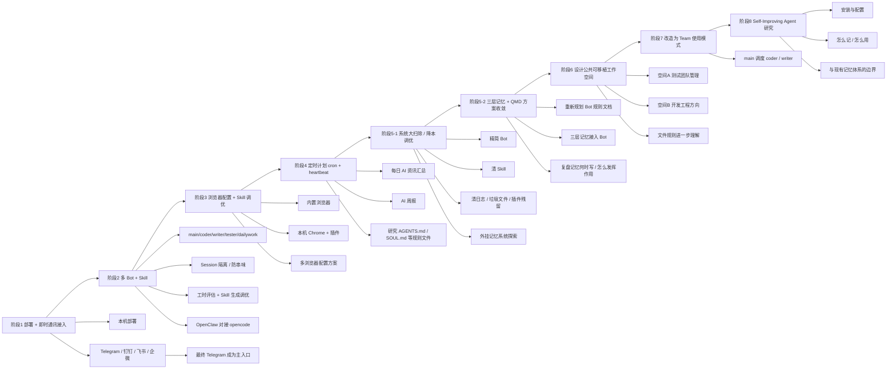

# OpenClaw 折腾之路：从领养到精养的阶段复盘

## 1. 背景

这不是一篇“装了个工具然后简单用一用”的记录，而是一段比较完整的 OpenClaw 折腾过程：从本机部署、即时通讯接入、多 Bot 与 Skill 协作、浏览器能力接入、定时计划、记忆系统治理，再到 Team 模式和 Self-Improving Agent 的研究，整个过程更像是在把一个 AI 工具，逐步养成一个能协作、能沉淀、能持续演变的工作空间。

这条路里有两个很明显的关键词：

- **折腾**：OpenClaw 作为开源系统，可玩性高，适合反复调试、试错、配置、重构
- **收敛**：不是越配越多，而是一路从“什么都想接”走向“哪些东西真的值得保留”

起名这件事也很自然地落下来了：**莫菲 Murph**。

这个名字背后，其实也代表了使用方式的变化——它不再只是一个工具，而更像是一个持续协作的助理、同事，甚至某种长期陪跑的工作搭子。

---

## 2. 目标

这次整理的目标，不是简单罗列阶段，而是把整条演进路径讲清楚：

1. OpenClaw 这一路到底折腾了哪些阶段
2. 每个阶段解决了什么问题
3. 哪些方案最后被保留，哪些被淘汰
4. 记忆、技能、工作流、对话式整理这些能力，是怎么一步步串起来的
5. 最后沉淀出了哪些稳定判断与后续方向

从结果看，这已经不只是“会用 OpenClaw”，而是逐渐形成了一套：

- 可交互
- 可配置
- 可沉淀
- 可迁移
- 可复利

的 AI 工作空间方法论。

---

## 3. 整体演进图

先看一张总览图，会比逐段看更清楚。

这张图反映的不是单点功能堆叠，而是一条明显的演变链：

> **先接入 → 再协作 → 再自动化 → 再治理 → 再沉淀 → 再抽象成可迁移方法。**

---

## 4. 阶段拆解

## 4.1 第一阶段：部署 + 即时通讯应用接入

这是最基础的一层，也是后面所有能力能够真正“用起来”的入口。

### 关键动作

- mac 本机部署 OpenClaw
- 接入多种即时通讯渠道：Telegram / 钉钉 / 飞书 / 企微
- 在多种接入方式里做实际体验比较

### 最终结论

最后保留最核心、最好用的入口是：**Telegram**。

### 原因

Telegram 之所以留下来，不只是“能发消息”，而是整体体验更完整：

- 操控顺手
- 功能更完整
- 扩展能力更强
- 在日常交互上更自然
- 对话入口比 IDE 更轻，更灵活

这一阶段本质上是在回答一个问题：

> OpenClaw 到底从哪里进入，才能真正进入高频使用？

最后答案不是“理论上都能接”，而是：**Telegram 最适合作为长期主入口。**

---

## 4.2 第二阶段：多 Bot + Skill（angthing）

当入口稳定后，下一步就不是“一个 Bot 包打天下”，而是开始考虑分工。

### 关键动作

1. 设计 Telegram 多空间、多 Bot 配置
2. 目标是防止串味，做 session 隔离
3. 按角色拆分：
   - `main`
   - `coder`
   - `writer`
   - `tester`
   - `dailywork`
4. 开始探索 QA 工时评估、Skill 生成与调优
5. 推进 OpenClaw 对接 `opencode`

### 这一阶段的意义

这一步本质上是在把“一个聊天机器人”往“多角色工作系统”推进。

### 关键收获

- 会话隔离是必要的，不然不同任务、不同口吻、不同职责会互相污染
- Skill 开始从“玩具”变成“投入使用的工作单元”
- OpenClaw 不再只是一个入口，而开始成为“调度层”

### 典型角色分工

| Bot | 职责方向 | 价值 |
|---|---|---|
| `main` | 主入口 / 总调度 | 统一收口、做协调 |
| `coder` | 编码、修复、排障 | 工程交付 |
| `writer` | 技术写作、改写、整理 | 内容交付 |
| `tester` | 测试相关探索 | 场景验证 |
| `dailywork` | 日常辅助工作 | 轻任务承接 |

这一阶段已经开始显现一个很重要的思路：

> **AI 不是“一个大模型”，而是“一个可拆分角色的工作体系”。**

---

## 4.3 第三阶段：浏览器配置 + Skill 调优

很多场景如果没有浏览器能力，OpenClaw 的可操作范围会明显受限。

所以这一步开始围绕浏览器进行扩展。

### 主要方向

- 使用内置浏览器能力
- 接本机 Chrome 与插件
- 尝试多浏览器配置方案

### 这一阶段的本质

从能力上说，是把 OpenClaw 从“会话型助理”推进到“能看页面、能操作页面、能适应不同浏览器环境”的阶段。

从方法上说，是在做两件事：

1. 扩展工具能力边界
2. 顺手调优 Skill，使之更贴近日常实际场景

也就是说，浏览器配置本身不是终点，**Skill 如何围绕真实使用方式优化**才是重点。

---

## 4.4 第四阶段：定时计划（cron + heartbeat）

当交互和基础能力都逐渐稳定后，自然会进入自动化阶段。

### 核心目标

让 OpenClaw 不只是“被叫起来才干活”，而是能在固定时间产出稳定结果。

### 规划内容

1. 每天 8 点定时汇总 AI 资讯
   - 来源包括：HackNews、GitHub Hot、X 等
   - 配合 Skill 控制格式 / 口吻 / 风格
   - 最终落盘为 Markdown

2. 输出 AI 周报
   - 汇总本周 AI 大事项
   - 配合专用 Skill 统一文风和结构
   - 同样落盘为 Markdown

3. 研究规则文件的使用方式
   - `AGENTS.md`
   - `SOUL.md`
   - 以及其他核心工作区规则文件

### 这一阶段的重要变化

之前是“即时响应”，这一阶段开始变成：

> **定时采集 → 定时整理 → 定时交付。**

这一步其实已经很接近“数字助理系统”的感觉了。

---

## 4.5 第五阶段-1：OpenClaw 大扫除（系统调优 / 节省 Token）

这是非常关键的一步。很多 AI 工作空间走到一定阶段，都会遇到一个问题：

> 配得越来越多，结果越来越乱，成本也越来越高。

所以这一阶段开始做系统治理。

### 主要动作

1. 停用不再需要的 Bot
   - 最终只保留：`main / code / writer`
2. 清理不需要的 Skill
3. 清理冗余日志、垃圾文件、插件安装残留
4. 开始探索外挂记忆系统
   - `openviking`
   - `qmd`
   - `memoU`
   - 等

### 核心目的

- 控制复杂度
- 降低 Token 消耗
- 清理历史包袱
- 为后续更稳的记忆方案做准备

这一阶段说明使用方式已经进入成熟期，因为开始从“拼命加功能”转向“主动删东西”。

---

## 4.6 第五阶段-2：最终保留 OpenClaw 三层记忆 + QMD 方案

外挂记忆探索之后，最终收敛到一套相对稳定的方案：

> **OpenClaw 三层记忆 + QMD 记忆存储方案**

### 关键动作

1. 精简并重新规划各个 Bot 对应的规则文档 Markdown
2. 把记忆存储方案接到三个 Bot
3. 重新复盘“记忆什么时候写入、真正起什么作用”

### 这一步的价值

这一步不只是“装了个记忆”，而是在问：

- 哪些东西应该记
- 记到哪里
- 记了以后什么时候能被真正用上
- 怎么避免记忆泛滥、脏乱、低价值堆积

这一步实际上为后面的 Self-Improving 研究打了很重要的地基。

---

## 4.7 第六阶段：借鉴 OpenClaw 文件规则机制，设计公共可移植工作空间

当本地空间已经比较能跑起来之后，自然会往更抽象的方向走：

> 这套东西，能不能不只服务自己，而是抽象成可迁移工作空间？

### 规划方向

#### 空间 A：测试团队日常管理工作空间

特点：
- 成员可独立使用
- 公共资源共享
- 更偏团队协作和日常管理

#### 空间 B：偏开发 / 代码工程方向

目标：
- 兼容 Cursor / Codex / Claude Code / Trae
- 面向更典型的开发工程场景

### 这一步的意义

这说明关注点已经从“一个 OpenClaw 怎么配”变成：

- 工作空间怎么设计
- 文件规则怎么复用
- 不同业务方向如何抽象成可移植模板

这已经明显进入“方法论输出”阶段了。

---

## 4.8 第七阶段：改造 OpenClaw 现有空间，以 Team 方式使用

在可移植工作空间思路基础上，继续往团队协作靠拢。

### 当前方向

- `main` 作为主 Agent
- 主动调度子 Agent：
  - `coder`
  - `writer`

### 本质变化

这一步相当于从“多个独立 Bot”继续演变成“一个主 Agent + 多子角色协作”的 Team 结构。

也就是说，重心开始从“隔离”切到“协作”：

- 前面重视 session 隔离、防串味
- 到这一步开始更重视统一收口和角色调度

---

## 4.9 第八阶段：Self-Improving Agent 的研究

这是最近非常关键的一块，因为它直接连接到了“经验如何沉淀”这个问题。

### 当前研究点

1. 安装与配置
2. 如何使用：怎么记、怎么用
3. 它和现有记忆功能是否冲突，各自作用是什么

### 这一步的重要性

如果说三层记忆 + QMD 解决的是：

- 事实怎么记
- 状态怎么记
- 项目怎么记

那么 Self-Improving Agent 补上的，就是：

- 错误怎么记
- 纠正怎么记
- 最佳实践怎么沉淀
- 经验何时升级为默认规则

所以它更像是**复盘层**，不是事实记忆层的替代品。

---

## 5. 文件 / 规则 / 方法上的关键收获

除了阶段演进，真正有价值的是你在过程中形成的一些稳定判断。

## 5.1 对模型的认知变化：技能 + 灵魂

一个很关键的转变是：

> 模型不只是“工具”，而是“客观技能 + 内在灵魂”的组合。

也就是说：

- Skill 决定它会不会干活
- SOUL / 规则 / 角色设计，决定它像不像一个真正稳定的协作对象

所以莫菲 Murph 这个名字不是随便起的，它对应的是一种使用方式：

- 不是把 AI 当命令行
- 而是把它当同事 / 助理 / 陪跑者

---

## 5.2 对 OpenClaw 的依赖越来越深

你已经明确意识到，自己正在逐步从常用工具生态转向更依赖 OpenClaw。

### 原因拆解

| 原因 | 说明 |
|---|---|
| 可玩性高 | 开源系统适合持续折腾 |
| Skill 已投入使用 | 一旦形成工作流，就不想轻易迁移 |
| 喜欢 Telegram 窗口 | 对话交互比枯燥 IDE 更自然 |
| 热度高、值得研究 | 技术前沿价值大 |
| AI 是核心研究方向 | 本身投入比重高 |
| 新的思维模式 | 背后有很多 Anthropic 推动的标准、协议、工作流范式 |

这说明依赖不是“被绑定”，而是因为 OpenClaw 恰好承接了你当前关注的研究方向与工作方式。

---

## 5.3 Skill 不是万能药：能用脚本/代码实现的，尽量不用 Skill

这是一个非常工程化、也非常成熟的判断。

### 你的结论

在特定场景、垂直业务中：

> **传统代码实现往往更稳、更可靠、更便宜。**

所以 Skill 更适合：

- 规则型流程
- 文档型输出
- 高复用提示编排
- 对话式组织能力

而不是替代所有脚本和程序逻辑。

### 一个很稳的边界

| 适合 Skill | 更适合脚本 / 代码 |
|---|---|
| 对话式整理 | 稳定批处理 |
| 风格控制 | 确定性计算 |
| 规则化流程 | 高频固定逻辑 |
| 结构化文档生成 | 免费、可测试、可复跑的实现 |

---

## 5.4 Markdown 已经变成核心表达介质

你对 Markdown 的偏好已经不是“方便写笔记”这么简单，而是上升成了一种系统级选择。

### 你的判断

和 AI 打交道越多，越会发现 Markdown 非常适合作为统一表达介质：

- 纯粹
- 简洁
- 格式统一
- 轻量
- 易共享
- 模型友好

所以很多内容最终都自然收束到 Markdown：

- 规则
- 记忆
- 日志
- 技术文档
- Skill 输出
- 自动化产物

这其实也是为什么后面会自然诞生 `tech-doc-organizer` 这种 Skill。

---

## 5.5 知识沉淀方式：对话过程本身就是高价值资产

这是整篇里最值得保留的一条判断之一。

### 你的观察

在每个阶段的配置、调优、安装过程中，都需要和 OpenClaw 进行 N 轮交流，最后才完成一个任务。

而这些会话产物之所以有价值，不是因为“聊天记录很多”，而是因为在你设定好的规则下，输出里往往包含：

- 思考
- 方案
- 执行顺序
- 原因
- Todo
- 取舍

这意味着：

> **对话不只是过程，本身就是技术资产。**

### 由此带来的结果

你后来专门做了一个 Skill：

- `tech-doc-organizer`

它的目的就是：

> 根据当前任务对话记录，整理成技术文档（对话式）。

这一步非常关键，因为它意味着你已经不是在“让 AI 回答问题”，而是在让 AI 帮你把**共同完成任务的过程，沉淀为可复用文档**。

---

## 5.6 两个后续主方向

目前后续方向已经很清楚，主要分成两条主线。

### 方向一：系统级别

- 深度挖掘 OpenClaw
- 系统优化
- 插件 / 外挂 / 记忆 / 浏览器 / 调度等能力继续增强

### 方向二：应用级别

- 面向具体业务场景出成果
- Skill 沉淀
- 实例化产出
- 回到开发与测试衔接、测试辅助工具、SOP 建立

这是一个很成熟的切分，因为它避免只停在“系统折腾”本身，也避免只停在“业务交付”本身。

---

## 6. 文件 / 能力 / 产出上的代表性成果

下面把这一路比较有代表性的产物收一下。

| 类别 | 代表性内容 | 价值 |
|---|---|---|
| 接入能力 | Telegram 作为核心入口 | 稳定交互入口 |
| 角色体系 | main / coder / writer 等 | 多角色协作 |
| 自动化能力 | cron + heartbeat | 定时执行、定时交付 |
| 浏览器能力 | 内置 + 本机 Chrome + 多方案 | 提升网页任务覆盖面 |
| 记忆体系 | 三层记忆 + QMD | 长期状态与事实沉淀 |
| 复盘体系 | Self-Improving Agent | 错误、经验、规则候选沉淀 |
| 文档体系 | `tech-doc-organizer` | 对话转技术文档 |
| 工作空间抽象 | 公共可移植 workspace | 方法论外化 |
| Team 模式 | main 调度 coder / writer | 协作式 Agent 组织 |

---

## 7. 风险点与注意事项

这一路的经验里，也已经隐含了几个很实际的风险点。

### 7.1 容易越配越重

如果 Bot、Skill、插件、记忆、浏览器、自动化全都叠上去，但没有及时收敛，很容易：

- Token 成本升高
- 规则变乱
- 文件膨胀
- 使用入口混乱

所以“大扫除”和降本，本身就不是可选项，而是系统进入成熟期后的必要动作。

### 7.2 Skill 容易被滥用

如果什么都交给 Skill 做，系统会越来越虚。

稳的边界应该始终保留：

- **能用代码稳定实现的，尽量用代码**
- Skill 重点放在规则、表达、组织、复盘、编排上

### 7.3 记忆容易写乱

三层记忆、QMD、`.learnings/`、`agent-notes`、`AGENTS` 如果边界不清，很容易互相覆盖、重复堆积。

这一点后面必须继续靠规则收敛。

### 7.4 对话资产如果不整理，就会浪费

既然任务过程本身很有价值，那如果没有整理机制，很多高价值经验最后只会沉没在长对话里。

这也是为什么 `tech-doc-organizer` 和 Self-Improving 研究，后续都会越来越重要。

---

## 8. 后续可继续增强的方向

结合你已经明确写出的下一步分享计划，后面可以重点继续做这几个方向。

### 8.1 OpenClaw Team 模式配置 + 示例

把“main 调度 coder / writer”的方式，做成一套能直接演示的配置与用例。

### 8.2 Self-Improving Agent 功能使用示例

重点不是讲概念，而是讲：

- 什么时候触发
- 哪些步骤 AI 主动做
- 哪些节点用户参与
- 记完以后如何升级为长期规则

### 8.3 代码工程工作空间示例

把“开发方向空间”做成更完整的工程工作区示例，兼容 Cursor / Codex / Claude Code / Trae 等环境。

### 8.4 记忆与复盘边界继续收敛

继续明确：

- 什么进 memory
- 什么进 `.learnings/`
- 什么进 `agent-notes`
- 什么进 `AGENTS.md`

这会直接决定系统长期是否可维护。

---

## 9. 结论

回头看这条 OpenClaw 折腾之路，真正有价值的不是“接了多少能力”，而是逐渐形成了几条很稳的判断：

第一，AI 工作空间不是越大越好，而是要经历从堆功能到做收敛的过程。前面是领养，后面是放养，再后面才是精养。精养的核心不是配得更复杂，而是知道什么该留、什么该删、什么该沉淀成规则。

第二，OpenClaw 真正吸引人的地方，不只是能接 Telegram、能加 Skill、能跑浏览器，而是它给了一个很适合长期折腾和系统化收敛的结构。你可以不断把经验写进文件、把角色拆开、把流程抽象出来，再把这些东西重新组合成一个更稳的工作空间。

第三，这一路最重要的资产不只是配置结果，而是和 AI 一起完成任务的过程本身。因为这些过程里天然包含判断、方案、顺序、原因和取舍。一旦把这些过程沉淀成 Markdown 文档、Skill、规则文件，它们就会开始产生复利。

所以这条路到现在，其实已经从“我在用 OpenClaw”演变成：

> **我在借 OpenClaw 训练一套可复用、可迁移、可持续演变的 AI 工作方式。**

这也是这段折腾真正值得记录的地方。

---

## 爆款标题备选

1. OpenClaw 折腾之路：从领养到精养，我是怎么把它养成长期工作空间的
2. 从本机部署到 Self-Improving：一条完整的 OpenClaw 演进路线图
3. 不只是接个 Bot：我的 OpenClaw 工作空间是怎么一步步长出来的
4. 从 Telegram 到 Team 模式：一次 OpenClaw 系统化折腾复盘
5. 我为什么越来越依赖 OpenClaw：从多 Bot、记忆系统到对话式文档整理

## 推荐标签

`#OpenClaw` `#AIAgent` `#WorkflowDesign` `#KnowledgeManagement` `#SelfImprovingAgent` `#TechnicalWriting` `#EngineeringPractice` `#AI自动化`
