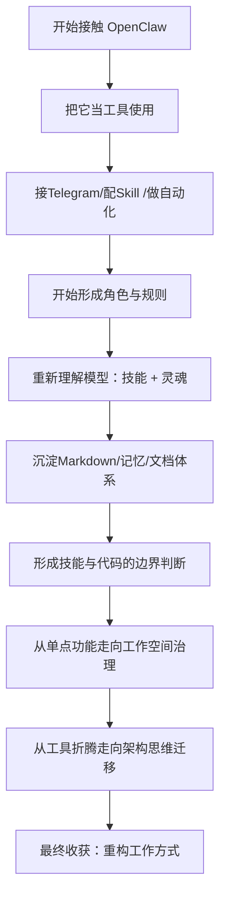

# OpenClaw 收获篇：从工具折腾到工作方式重构

## 1. 先说结论

如果只用一句话概括这段时间对 OpenClaw 的收获，我会这样说：

> **OpenClaw 真正改变的，不是我多了一个 AI 工具，而是我开始重新组织自己的工作方式。**

一开始，它看起来只是一个能接 Telegram、能调模型、能加 skill、能帮忙做点自动化的系统。但折腾久了之后会发现，它更像一个可塑的工作空间：可以起名、可以分工、可以设规则、可以沉淀记忆、可以治理技能、可以逐步长出自己的协作方式。

更重要的是，OpenClaw 带来的价值，不止停留在“会做什么”，而是开始逼人去思考：

- AI 应该以什么身份进入工作流
- 什么能力适合用 skill，什么更适合用脚本
- 知识该怎么沉淀
- 文件规则和工作空间能不能抽象成可迁移框架

所以，这篇文章不想只谈功能，而是想整理一件更本质的事：

> **OpenClaw 到底给我带来了哪些真正值得保留的收获。**

---

## OpenClaw 收获路径图

---

## 2. 对模型认知的变化：技能 + 灵魂

这段时间最明显的变化，是对模型身份的理解发生了变化。

以前很容易把模型当成工具：

- 会写点东西
- 会查点资料
- 会生成点内容
- 会帮忙做些操作

但在 OpenClaw 这套体系里，模型越来越不像一个冷冰冰的调用接口，而更像一个有两层结构的协作对象：

### 第一层：客观技能
它会什么、不会什么、适合做什么、边界在哪里。

### 第二层：内在灵魂
它的角色、语气、边界感、默认姿态、处理事情的方式。

这也是为什么后来会给它起名：**莫菲 Murph**。

起名看起来像小事，但背后其实是工作关系的变化。它意味着 AI 不再只是“被调用的东西”，而更像：

- 同事
- 助理
- 搭档
- 长期协作对象

从这个角度看，模型不只是能力容器，而是“技能 + 灵魂”的组合。

---

## 3. 为什么会越来越依赖 OpenClaw

客观说，原本常用的工具并不少，比如 Codex、Antigravity、OpenCode。但现在确实已经逐步对 OpenClaw 形成比较强的依赖。

这种依赖并不是单纯的迁移成本，而是几个因素叠加后的结果。

### 3.1 可玩性高，开源天然值得折腾

开源最大的吸引力不只是免费，而是可改、可试、可接、可调。对于喜欢折腾 AI Agent 的人来说，这种开放性本身就很有吸引力。

### 3.2 Skill 已成型并进入使用

一旦 skill 不再只是 demo，而是真的进入日常工作流，它就会形成粘性。因为 skill 里沉淀的不是单条 prompt，而是：

- 规则
- 风格
- 工作方式
- 产出结构
- 你的个人偏好

这时候迁移就不只是换工具，而是迁移一套已经被训练出来的习惯。

### 3.3 喜欢 Telegram 对话窗口

这一点非常现实。IDE 的交互往往偏机械，而 Telegram 的对话窗口更轻、更自然，也更适合随时发起任务。相比在编辑器里开着一个面板，Telegram 更像真的在和一个在线搭档说话。

### 3.4 值得研究，也足够新

OpenClaw 不只是一个工具，它同时还是 AI Agent 领域很值得研究的样本：

- 角色协作
- 规则文件
- 技能体系
- 记忆治理
- 工作流组织

这些东西背后其实对应的是整个 AI Agent 领域正在形成的一套方法论。

---

## 4. 一个越来越清晰的判断：能用代码实现的，尽量不用 skill

这段时间最重要的工程判断之一是：

> **skill 不是万能药。**

在垂直业务和稳定场景里，如果某件事能用脚本、代码、现有技术栈可靠实现，那么优先用代码往往更稳、更便宜、也更可控。

### 为什么会有这个判断

| 方案 | 优点 | 缺点 |
|---|---|---|
| 脚本 / 代码 | 稳定、可测试、可复跑、低成本 | 缺少对话式灵活性 |
| skill | 灵活、易编排、适合规则表达和结构化输出 | 稳定性依赖模型，边界更难控 |

### 更适合 skill 的场景

- 对话式整理
- 风格控制
- 规则编排
- 结构化输出
- 多步骤工作流组织

### 更适合代码的场景

- 高频稳定执行
- 可确定的批处理
- 核心业务逻辑
- 免费、可复测要求高的任务

这个判断很重要，因为它能防止“什么都上 AI”，最后反而把系统做虚。

---

## 5. Markdown 已经变成统一表达介质

随着和 AI 打交道越来越多，Markdown 已经逐渐从“写文档的格式”变成了一种默认工作接口。

原因很朴素，但非常有力量：

- 纯粹
- 简洁
- 统一
- 轻量
- 易共享
- 模型友好

所以后来很多内容都自然收束到 Markdown：

- 规则文件
- 技术文档
- 记忆文件
- `.learnings/`
- 周报 / 日报
- skill 输出结果

从这个角度看，Markdown 已经不只是文件格式，而更像 AI 工作流里的“通用中间层”。

---

## 6. 知识如何沉淀：对话过程本身就是技术资产

使用 OpenClaw 之后，一个很深的体会是：

> **真正有价值的，不只是最后配出来的结果，而是把事情做成的过程。**

因为在配置、调优、安装、排障过程中，往往都需要很多轮对话。这个过程中天然会积累出：

- 思考
- 方案
- 执行顺序
- 原因
- Todo
- 边界
- 取舍

这些内容如果只停留在聊天记录里，其实非常浪费。因为它们已经具备成为：

- 技术文档
- 工作流总结
- 规则文件
- skill 草稿
- 团队经验

的条件。

也正是基于这个认知，后面才做了一个专门的 skill：

- `tech-doc-organizer`

它的本质不是“排版聊天记录”，而是：

> **根据当前任务的对话记录，整理成可复用的技术文档。**

这一点非常关键，因为从这里开始，对话不再只是过程，而正式进入产出链路。

---

## 7. 从初级操作到架构思维迁移，才是更大的价值

如果只从表层看 OpenClaw，很容易把它理解成：

- 查数据
- 建文档
- 打开浏览器爬点东西
- 做点电脑控制

这些当然有用，但都还停留在相对初级的阶段。

真正更有价值的，是在把本地 OpenClaw 调到一个相对理想状态之后，开始做：

> **架构思维迁移。**

也就是说，不再只想“它能帮我点什么”，而是开始想：

- 这套文件规则机制能不能变成公共项目
- 这套角色协作能不能迁移到编码工程中
- 这套工作空间设计能不能抽象成框架
- 这套思维能不能用在别的 AI coding / vibe-coding 场景里

这一步的价值，远高于单次自动化操作。

---

## 8. OpenClaw 真正适合做什么

结合这段时间的体验，我觉得 OpenClaw 真正适合做的事情主要有三类。

### 8.1 日常工作辅助

例如：

- 需求分析
- 工时评估
- 文档生成
- 用例二次评审
- 测试脚本与工具生成
- 测试数据分析

这类任务的特点是：

- 需要思考
- 需要表达
- 输出有结构
- 但不要求百分百确定性执行

### 8.2 代码工程中的主 Agent / 调度员

它也很适合承担“总调度”的角色，去组织：

- 需求解析 agent
- 编码 agent
- 文档 agent
- 审查 agent

再去协同现有 IDE 或开发工具链。

### 8.3 思维迁移到公共工作空间

更有价值的，是把 OpenClaw 的思维方式迁移到别的项目和工作空间设计里。这种迁移未必强依赖 OpenClaw 本身，但可以直接借鉴它的：

- 文件规则体系
- Agent 分工方式
- 记忆与复盘层设计
- 对话式任务治理方法

---

## 9. 下一步真正值得做的两条线

随着折腾深入，后续方向其实已经越来越清楚，主要分成两条主线。

### 9.1 系统级别

继续深挖 OpenClaw 本身，包括：

- 系统调优
- 规则收敛
- 技能治理
- 插件 / 外挂
- 记忆系统设计
- 浏览器与调度能力扩展

### 9.2 应用级别

回到真实业务与具体产出，例如：

- skill 沉淀
- 示例产出
- 开发 → 测试的衔接
- 测试辅助工具
- SOP 建立

这两条线必须并行。只做系统，会掉进“工具迷恋”；只做应用，又容易失去底层掌控力。

---

## 10. 最后的结论

回头看，OpenClaw 带来的最大收获，并不是多学会了几个命令，也不是会接几个插件，而是它提供了一个足够开放、足够可塑、足够接近真实工作流的环境，让人重新理解：

- AI 应该以什么身份进入工作
- 什么该交给 skill，什么该交给代码
- 知识应该怎么沉淀
- 工作空间应该怎么治理
- 多 Agent 协作该怎么设计

如果只停留在“会查数据、会开浏览器、会生成文档”，那还只是初级阶段。真正更有价值的，是已经开始把 OpenClaw 的规则机制、架构思维、工作流设计迁移到公共项目、迁移到编码工程、迁移到更长期的方法论里。

所以对我来说，OpenClaw 真正留下来的收获是：

> **AI 工具最有价值的地方，不在于替人点按钮，而在于帮助人重构工作方式。**

---

## 

`#OpenClaw` `#AIAgent` `#WorkflowDesign` `#KnowledgeManagement` `#TechnicalWriting` `#EngineeringPractice`
