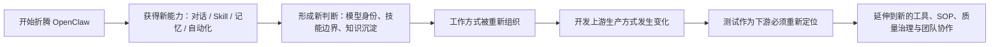

# OpenClaw 系列导读：从工作方式重构到测试重新定位

## 1. 这不是两篇孤立文章，而是一条连续的问题链

如果只看标题，`OpenClaw 收获篇` 和 `测试思考篇` 像是两个主题：

- 一篇偏工具与方法论
- 一篇偏测试与质量工作

但如果把它们放在一起，其实它们讨论的是同一件事的前后两面：

> **当 AI 工具开始真正进入工作流之后，人到底该如何重新组织工作方式。**

OpenClaw 只是一个入口。真正值得讨论的，不是它会不会查资料、会不会开浏览器、会不会接 Telegram，而是它如何一步步把人从“使用一个工具”，推向“重新设计一套工作方式”。

而测试，恰恰是这套变化里最不能回避的下游环节。

---

## 2. 系列主线：从工具使用到工作流重构

这个系列最核心的主线，可以压缩成下面这张图。

也就是说，这个系列并不是单纯在讲 OpenClaw 本身，而是在讲：

- AI 工具如何进入工作
- 工作方式如何被重组
- 下游角色如何跟着变化

---

## 3. 第一篇：OpenClaw 收获篇，回答“我到底从中得到了什么”

### 文章定位

这一篇的重点不是列功能，而是回答：

> **折腾 OpenClaw 到现在，真正留下来的收获是什么？**

### 主要讨论内容

- 对模型身份的认知变化：技能 + 灵魂
- 为什么会越来越依赖 OpenClaw
- skill 和脚本 / 代码之间的边界
- Markdown 为什么会成为统一表达介质
- 为什么对话过程本身就是技术资产
- 为什么更大的价值不在初级自动化，而在架构思维迁移

### 这一篇真正想说的

OpenClaw 带来的最大变化，不是“多了几个功能”，而是：

> **开始重新组织自己的工作方式。**

它让人开始把 AI 看成：

- 一个可被塑形的协作对象
- 一套可治理的工作空间
- 一种可迁移的方法论原型

---

## 4. 第二篇：测试思考篇，回答“当开发变了，测试怎么办”

### 文章定位

这一篇不是在争论“AI 能不能替代测试”，而是在回答：

> **当开发上游已经被 AI 改写，测试到底该怎么重新定位。**

### 主要讨论内容

- OpenClaw 不能替代完整测试自动化体系的边界
- 自动化测试三层：操作、验证、质量
- AI 代码产出提效后，测试为什么反而更难
- AI 在测试方向为什么仍然不成熟
- 影子 AI、数据风险、输出可信度等新问题
- 测试范围为什么可能重新切分
- 为什么测试真正要做的是“承载和衔接”

### 这一篇真正想说的

AI 改变开发的速度非常快，但测试真正要守住的，不是执行动作，而是：

- 判断
- 策略
- 风险控制
- 责任边界

所以测试不是被替代，而是被迫升级。

---

## 5. 为什么这两篇必须连起来看

如果只看第一篇，很容易把 OpenClaw 理解成“一个很会玩的 AI 工具”。

如果只看第二篇，又容易把测试问题看成“AI 编码提效后的自然副作用”。

但把两篇连起来看，会更清楚地看到一条完整链路：

1. OpenClaw 先改变了人的工作方式
2. 工作方式变化之后，开发生产方式开始被 AI 进一步改写
3. 开发上游被改写之后，测试作为下游不得不跟着调整

这也是为什么这个系列不是工具教程，而更像一组方法论反思。

---

## 6. 推荐阅读顺序

### 第一篇先读
**《OpenClaw 收获篇：从工具折腾到工作方式重构》**

先理解：
- OpenClaw 到底改变了什么
- 为什么说它改变的是“工作方式”而不是“多一个工具”

### 第二篇再读
**《测试思考篇：AI 改写开发上游后，测试如何重新定位》**

再去看：
- 当工作方式和开发生产方式都变了之后
- 测试该如何重新定义自己

这个顺序更自然，因为它先讲“变化从哪里开始”，再讲“变化传导到哪里”。

---

## 7. 适合谁读

这组文章并不只适合 OpenClaw 用户。

更适合的是下面这些人：

| 角色 | 为什么适合读 |
|---|---|
| AI Agent 重度使用者 | 能看到从工具使用到工作空间设计的过渡 |
| 开发负责人 | 能看到 AI 进入开发后对下游的影响 |
| 测试负责人 / 测试工程师 | 能看到测试侧应该如何承接上游变化 |
| 做流程治理的人 | 能看到规则、记忆、复盘、文档体系如何配合 |
| 正在搭建 AI 工作流的人 | 能看到一条从折腾到收敛的真实路径 |

---

## 8. 这一系列真正想回答的问题

如果要把整个系列压缩成几个核心问题，大概就是：

- AI 到底应该以什么身份进入工作？
- 什么能力适合交给 skill，什么应该坚持用代码？
- 知识该怎么沉淀，才能不浪费对话过程？
- 当开发上游被 AI 改写后，测试如何重新承接？
- AI 时代的工作空间、角色分工、质量治理，应该怎么重新组织？

这些问题比“某个工具怎么配置”更长久，也更有复利价值。

---

## 9. 后续这个系列还可以继续往下写什么

如果继续往后展开，这个系列很自然可以延伸出几篇：

1. **OpenClaw Team 模式配置与示例**
2. **Self-Improving Agent 的真实使用示例**
3. **代码工程工作空间的设计与迁移方法**
4. **记忆、.learnings、AGENTS 边界治理实践**
5. **开发 → 测试衔接中的 AI 代码审查框架**

也就是说，这个系列的后续潜力其实很大，不只是两篇停住。

---

## 10. 最后的结论

这组文章表面上写的是 OpenClaw，实际上讨论的是更大的问题：

> **AI 工具进入工作流之后，人和团队到底该怎么重新组织自己。**

第一篇讲的是：
- 工具如何改变工作方式

第二篇讲的是：
- 工作方式改变之后，测试如何重新定位

把它们串起来，才更能看清一条完整路径：

> **从折腾一个 AI 工具开始，最后走向重新理解工作空间、角色分工、知识沉淀和质量治理。**

如果说 OpenClaw 给人的最大价值是什么，也许不是某个功能，而是它提供了一个足够真实的入口，让这些本来抽象的问题，变成了可以亲手折腾、亲自验证、亲自沉淀下来的实践过程。

---

## 系列文章目录

1. **OpenClaw 收获篇：从工具折腾到工作方式重构**
2. **测试思考篇：AI 改写开发上游后，测试如何重新定位**

---

## 爆款标题备选

1. OpenClaw 系列导读：为什么这不只是两篇工具文章，而是一条工作方式重构线索
2. 从 OpenClaw 到测试重新定位：一组关于 AI 工作流的系列文章导读
3. 不只是折腾工具：这组文章真正想讨论的是 AI 如何改写工作方式
4. 从工具使用到测试承接，这组 OpenClaw 文章到底在讲什么？
5. AI 进入工作流之后，人和团队该怎么重新组织？这组文章给出一条线索

## 推荐标签

`#OpenClaw` `#AIAgent` `#Testing` `#WorkflowDesign` `#KnowledgeManagement` `#TechnicalWriting`
