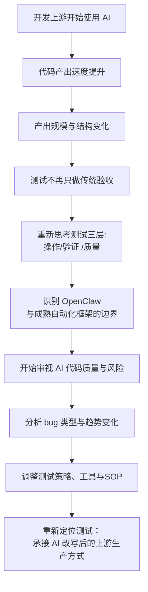

# openclaw 测试思考篇：AI 改写开发上游后，测试如何重新定位

## 1. 先说结论

这段时间折腾 OpenClaw，最后最值得延展出来的，不是“测试能不能用 AI 代替”，而是一个更现实的问题：

> **当开发上游已经开始被 AI 改写，测试到底该怎么重新定义自己的位置。**

AI 编码、AI 生成文档、AI 需求分析、AI 辅助设计，这些东西已经越来越真实地进入开发流程。它们带来的不只是提效，更重要的是改变了上游的生产方式。测试作为下游，不能只盯着“功能对不对”，而必须开始面对新的问题：

- AI 产出的代码是否可靠
- 测试覆盖怎么跟上
- Bug 类型是否在变化
- 质量风险是否在迁移
- 测试策略是不是也要跟着变

所以，这篇文章不是在讨论“OpenClaw 能不能做测试自动化”，而是在讨论：

> **AI 进入开发后，测试应该如何承接、审查、评估和调整自己的方法。**

---

## 测试侧重新定位路径图

---

## 2. 先把边界说清楚：OpenClaw 不是完整测试自动化方案

如果这点不先讲清楚，后面的讨论很容易跑偏。

目前来看，OpenClaw 这类工具并不适合替代完整的测试自动化体系，尤其不适合替代你真正关注的那两层核心能力。

### 自动化测试至少有三层

| 层级 | 说明 | 关键词 |
|---|---|---|
| 第一层 | 操作自动化：点击、输入、等待、滚动、上传 | action |
| 第二层 | 验证自动化：断言什么算对、什么算错、如何等待、如何重试、如何避免时序竞争 | think |
| 第三层 | 质量自动化：测哪些、为什么测、怎么测、失败属于谁、是否阻断发布、如何沉淀为下一轮知识 | think |

### OpenClaw 的优势在哪里

OpenClaw 主要强在：

- 第一层：操作自动化
- 稍微能碰到一点第二层

但离第三层还很远。

而真正决定测试价值的，往往恰恰是：

- 第二层：验证策略
- 第三层：质量判断、责任边界、风险控制

再加上费用成本和维护成本，现阶段对于：

- 项目测试
- UI 自动化
- API 自动化

这类事情，仍然更倾向于用成熟自动化框架来实现。

这不是保守，而是边界清晰。

---

## 3. 真正的问题不是“AI 能不能测”，而是“AI 改写了什么”

很多人会把焦点放在：

- AI 能不能帮忙写测试
- AI 能不能自己做自动化
- AI 能不能跑页面、做断言

这些当然值得看，但真正更大的问题是：

> **AI 已经开始改变开发上游本身。**

它让代码生成更快了，方案输出更快了，需求分析、文档、辅助设计都更快了。于是测试面临的现实变化不是“多了个新工具”，而是：

- 上游产出节奏变了
- 上游产出规模变了
- 上游代码形态变了
- 上游风险分布也可能变了

所以测试的核心问题自然也会变成：

- 如何承接 AI 生成代码
- 如何审查 AI 生成逻辑
- 如何看懂 AI 产物背后的模式性风险
- 如何根据这些变化重新安排测试策略

---

## 4. AI 代码产出在提效，也在制造新的测试挑战

AI 编码最直接的效果是提效，这点基本没争议。

### 它带来的好处

- 代码产出速度提升
- 文档与脚手架生成更快
- 重复性开发工作减少
- 辅助生成测试脚本和工具更容易

### 但它带来的问题也很现实

- 未知问题变多
- 测试覆盖压力更大
- 代码质量审查更难
- 后续维护成本更不透明

也就是说，AI 解决的是“速度”和“规模”的问题，但测试要兜住的是：

> **速度上来以后，质量和可维护性怎么不掉。**

这一点对测试来说非常关键。因为过去很多问题是“开发写不过来”，以后越来越可能变成“开发写得太快，测试来不及看透”。

---

## 5. AI 在测试方向的全面应用，现阶段仍然不成熟

一个必须承认的现实是：

- AI 在测试领域的全面应用比例还不高
- 可靠性和准确性仍然是最核心顾虑

所以现阶段既不能过度神化 AI，也不能把它简单视为噱头。更合适的定位应该是：

> **AI 是增强器，不是替代品。**

### AI 更擅长什么

- 提速
- 扩大规模
- 辅助生成
- 辅助整理
- 辅助分析

### 测试工程师更该承担什么

- 判断
- 策略
- 责任
- 风险控制
- 质量结论

这两者不是对立关系，而是职责层级不同。AI 可以把很多低层工作做得更快，但质量判断和责任归属，依然需要测试来承担。

---

## 6. 影子 AI 与数据风险，是测试侧绕不过去的新问题

AI 进入工作流之后，还会带来一些传统测试体系里没有那么突出的新问题，例如：

- 员工使用未经授权的 AI 工具
- 数据泄露风险
- 信息污染
- 产出来源不透明

这些“影子 AI”问题，后面只会越来越频繁。

从测试视角看，这意味着工作边界会扩张。以后测试除了看业务对不对、流程顺不顺，还可能要越来越关注：

- AI 工具使用边界
- 数据输入合规性
- 生成内容的可信度
- AI 介入后是否引入新的系统性风险

这其实已经不是传统狭义测试了，而更接近质量治理和风险治理。

---

## 7. 测试范围可能要重新切分

未来测试工作很可能不再只是“原有业务功能测试”这么简单，而会逐步形成更清晰的分层。

### 可能出现的新切分方式

| 测试方向 | 关注重点 |
|---|---|
| 原有业务测试 | 业务功能、流程、回归 |
| AI 项目测试 | 模型输出、交互流程、生成行为 |
| AI 代码质量测试 | AI 生成代码的可靠性、可维护性、覆盖风险 |

这意味着测试职责本身可能会扩张。

以后不只是看功能对不对，还要考虑：

- AI 生成代码是否合理
- AI 辅助方案是否带来新风险
- AI 输出的稳定性和一致性如何
- AI 介入后，缺陷类型有没有变化

---

## 8. 测试真正要做的，是承接开发团队新的生产方式

这一点我觉得最重要。

如果开发团队已经开始大量使用 AI 辅助编程，那测试就不能继续假设“上游还是原来那套节奏和结构”。

测试作为下游，必须先熟悉上游的新现实。

### 需要尽快搞清楚的内容

- 开发团队现在怎么用 AI 辅助编程
- 用了什么策略、什么工具、什么方案
- 产出物长什么样
- 工程结构有没有变化
- 哪些模块最容易出现 AI 生成痕迹
- 哪些阶段最容易出现模式化缺陷

这些事情搞不清楚，测试就只能被动接锅。

### 所以测试真正该做的，是“承载和衔接”

也就是：

- 审视 AI 产出代码
- 做综合评估
- 做 bug 类型归类
- 做趋势分析
- 根据趋势及时调整测试方向和侧重点

从这个角度看，测试不只是验收代码，而更像是在评估：

> **一套被 AI 改写过的上游生产方式，到底是否健康。**

---

## 9. 现阶段最值得探索的方向

如果把这些判断落实到现实工作里，现阶段最值得探索的，不是“让 AI 直接接管测试”，而是先围绕下面几个方向稳步推进。

### 9.1 熟悉开发团队的 AI 辅助编程现状

先把上游看清楚。

需要了解：

- 开发怎么用 AI
- 产出结构有什么变化
- 代码生成比例大概多少
- 哪些模块最受影响

### 9.2 做 AI 产出代码的审视与综合评估

重点不是“AI 写得快不快”，而是：

- 写出来的代码可靠吗
- 维护成本高不高
- 风险在哪些地方堆积
- 是否形成新的缺陷模式

### 9.3 做 bug 类型与趋势分析

如果 AI 代码越来越多，那 bug 也可能出现新的分布特征。

测试需要开始关注：

- 是否更容易出现边界遗漏
- 是否更容易出现模板化错误
- 是否更容易出现看起来正确、但业务语义不对的问题
- 是否更容易在局部没问题、整体集成时出错

### 9.4 及时调整测试策略与侧重点

策略不应该是固定不变的。

上游生产方式改了，测试策略也应该随之调整：

- 哪些环节需要更重的人工审查
- 哪些环节适合补工具
- 哪些缺陷模式要重点盯
- 哪些类型应该前移发现

### 9.5 回归主线：开发 → 测试的衔接 + 辅助工具 + SOP

这是我觉得最值得长期投入的方向：

- 开发到测试的衔接机制
- 测试辅助工具
- AI 产出代码审查框架
- 测试 SOP
- Bug 类型与趋势归因体系
- 测试策略动态调整机制

这条线比单纯追求“让 AI 自己点页面跑脚本”有价值得多。

---

## 10. OpenClaw 在测试侧更适合扮演什么角色

如果回到 OpenClaw 本身，我觉得它在测试侧更适合扮演这些角色：

### 10.1 辅助分析与文档整理者

例如：

- 需求分析辅助
- 工时评估
- 文档生成
- 用例二次评审
- 测试数据分析

### 10.2 测试辅助工具与脚本生成者

在你有明确边界和需求时，它适合生成：

- 测试脚本草稿
- 小工具
- 数据分析脚本
- 文档模板

### 10.3 多 Agent 调度与知识沉淀的中枢

在代码工程和测试协作里，它更适合做：

- 主 Agent 调度员
- 对话式知识沉淀入口
- 复盘和文档整理中心

而不是直接取代成熟自动化框架。

---

## 11. 最后的结论

OpenClaw 给测试工作带来的真正启发，不是“测试终于能交给 AI 做了”，而是让人更清楚地看到：

> **AI 正在重写开发上游，而测试必须跟着重新定义自己的位置。**

测试真正要守住的，从来不只是执行层，而是：

- 验证策略
- 质量判断
- 风险控制
- 责任边界

AI 可以在很多地方帮忙提速、扩规模、做辅助，但它还远不能替代这些核心职责。相反，随着 AI 产出越来越多，测试要做的事情可能不是变少，而是变得更复杂、更偏策略、更偏审查、更偏质量治理。

所以未来真正值得做的，不是幻想 AI 替代测试，而是尽快建立一套新的承接方式：

> **理解上游 AI 编码现实，审查 AI 产出，识别新缺陷模式，调整测试策略，建立新的工具与 SOP。**

这才是 AI 时代测试工作更重要的方向。

---

## 

`#Testing` `#AIAgent` `#AI代码质量` `#QualityEngineering` `#EngineeringPractice` `#OpenClaw`
