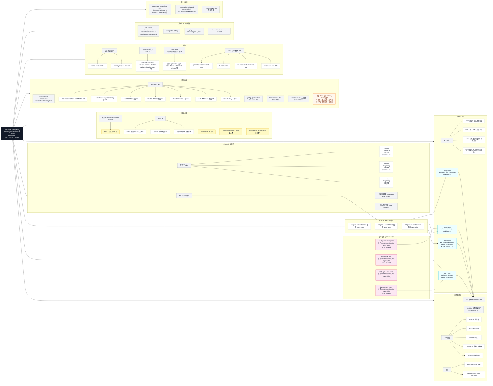
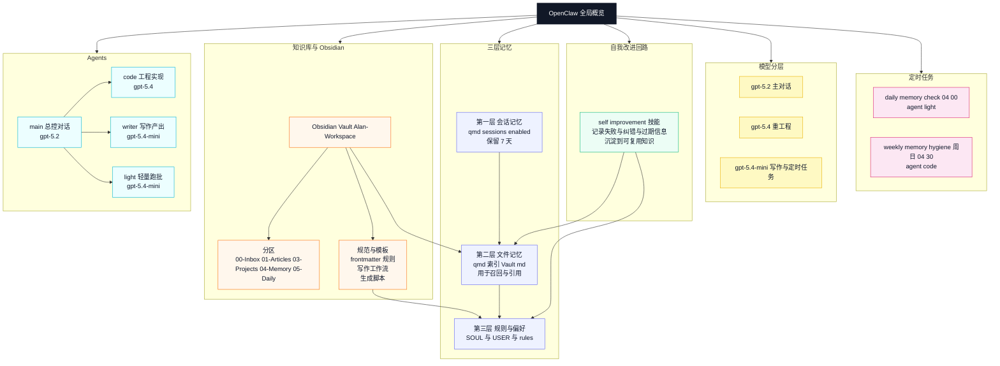
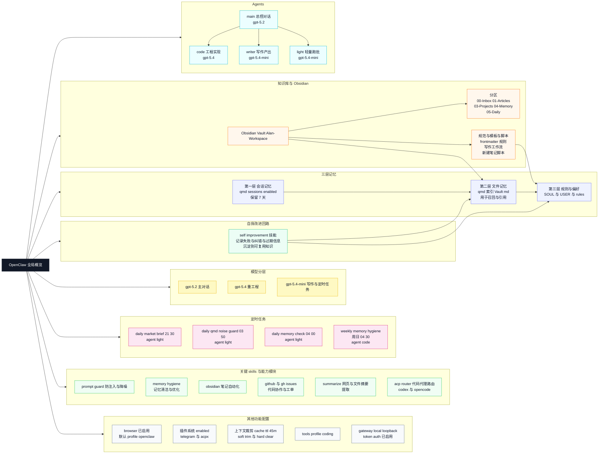

```mermaid
flowchart LR
  OC[OpenClaw 2026.3.23-2<br/>Gateway local loopback 端口 18789<br/>Dashboard http://127.0.0.1:18789/]:::core

  subgraph CH[Channels 与消息]
    TG[Telegram 已启用]:::box
    ACC[账号 三个 bot]:::box
    ACC --> TG_MAIN[main bot<br/>DM pairing<br/>群组禁用<br/>streaming off]:::item
    ACC --> TG_CODE[code bot<br/>DM pairing<br/>群组禁用<br/>streaming off]:::item
    ACC --> TG_WRITER[writer bot<br/>DM pairing<br/>群组禁用<br/>streaming off]:::item

    SESS[会话隔离策略 per account channel peer]:::box
    REACT[回执表情范围 group mentions]:::box
  end

  subgraph AG[Agents 四个]
    A_MAIN[agent main<br/>workspace Alan-Workspace<br/>model gpt-5.2]:::agent
    A_CODE[agent code<br/>workspace 03-Projects<br/>model gpt-5.4]:::agent
    A_WRITER[agent writer<br/>workspace 01-Articles<br/>model gpt-5.4-mini<br/>额外写作 skills 4 个]:::agent
    A_LIGHT[agent light<br/>workspace 00-Inbox<br/>model gpt-5.4-mini]:::agent

    REL[关系与分工]:::box
    REL --> R1[main 总控与日常对话入口]:::item
    REL --> R2[code 工程与脚本与项目实现]:::item
    REL --> R3[writer 写作改写与公众号风格产出]:::item
    REL --> R4[light 轻量任务与定时任务跑批]:::item
  end

  subgraph BND[Bindings Telegram 路由]
    B1[telegram accountId main 指向 agent main]:::item
    B2[telegram accountId code 指向 agent code]:::item
    B3[telegram accountId writer 指向 agent writer]:::item
  end

  subgraph MOD[模型分层]
    DEF[默认 primary openai-codex gpt-5.2]:::box
    M1[gpt-5.2 默认与主对话]:::model
    M2[gpt-5.4 code 重工程]:::model
    M3[gpt-5.4-mini writer 与 light 省成本]:::model
    M4[gpt-5-mini 与 gpt-4o-mini 已注册备用]:::model

    DEF --> M1
    MODR[分层策略]:::box
    MODR --> L1[主对话 质量与长上下文优先]:::item
    MODR --> L2[工程实现 推理强度优先]:::item
    MODR --> L3[写作与批处理 成本优先]:::item
  end

  subgraph MEM[记忆系统]
    MB[backend qmd<br/>citations auto<br/>includeDefaultMemory true]:::box
    UPD[qmd 更新 interval 5m<br/>debounce 15s]:::box
    LIM[limits maxResults 5<br/>timeout 5s]:::box
    SLOG[sessions memory 已启用<br/>retentionDays 7]:::box

    PATHS[索引路径 QMD]:::box
    PATHS --> P0[~/.openclaw/workspace/MEMORY.md]:::item
    PATHS --> P1[~/.openclaw/workspace/memory 下的 md]:::item
    PATHS --> P2[Vault 00-Inbox 下的 md]:::item
    PATHS --> P3[Vault 01-Articles 下的 md]:::item
    PATHS --> P4[Vault 03-Projects 下的 md]:::item
    PATHS --> P5[Vault 04-Memory 下的 md]:::item
    PATHS --> P6[Vault 05-Daily 下的 md]:::item

    NOTE[现状 status 显示 memory chunks 为 0<br/>可能尚未生成或尚未写入可索引内容或等待下一轮更新]:::warn
  end

  subgraph WS[工作空间与 Obsidian]
    VAULT[Vault 路径 Alan-Workspace]:::box
    OB[Obsidian 配置目录存在<br/>obsidian skill 可用]:::box
    STRUCT[Vault 分区]:::box
    STRUCT --> S0[00-Inbox 收件箱]:::item
    STRUCT --> S1[01-Articles 文章]:::item
    STRUCT --> S2[03-Projects 项目]:::item
    STRUCT --> S3[04-Memory 系统记忆镜像]:::item
    STRUCT --> S4[05-Daily 日报与周期]:::item
    RULES[规则]:::box
    RULES --> FM[rules frontmatter spec]:::item
    RULES --> WF[rules openclaw writing workflow]:::item
  end

  subgraph CRON[定时任务 openclaw cron]
    C1[daily market brief<br/>每天 21 30 Asia Shanghai<br/>agent light<br/>target isolated]:::cron
    C2[daily qmd noise guard<br/>每天 03 50 Asia Shanghai<br/>agent light<br/>target isolated]:::cron
    C3[daily memory check<br/>每天 04 00 Asia Shanghai<br/>agent light<br/>target isolated]:::cron
    C4[weekly memory hygiene<br/>周日 04 30 Asia Shanghai<br/>agent code<br/>target isolated]:::cron
  end

  subgraph SK[Skills]
    SKSYS[配置里显式启用]:::box
    SKSYS --> PG[prompt guard enabled]:::item
    SKSYS --> MH[memory hygiene enabled]:::item

    SKAVL[可用 skills 总数 63<br/>ready 45]:::box
    SKAVL --> S_READY[ready 示例 github gh issues summarize obsidian healthcheck coding agent acp router 等]:::item
    SKMISS[missing 18<br/>常见是依赖未装或未配置]:::box
    SKMISS --> S_M1[示例 1password apple notes discord notion slack whisper 等]:::item

    WSKILLS[writer agent 额外 skills]:::box
    WSKILLS --> W1[github hot project wechat writer]:::item
    WSKILLS --> W2[humanizer zh]:::item
WSKILLS --> W3[wx article rewrite humanize pro]:::item
    WSKILLS --> W4[wx sanguo voice style]:::item
  end

  subgraph SYS[系统与 ACP 与插件]
    ACP[ACP enabled<br/>defaultAgent codex<br/>allowed codex opencode<br/>maxConcurrentSessions 4]:::box
    TOOLS[tools profile coding]:::box
    PLUG[plugins enabled<br/>allow telegram 与 acpx]:::box
    HOOK[internal hooks boot md enabled]:::box
  end

  subgraph CTX[上下文管理]
    PRUNE[context pruning cache ttl 45m<br/>keepLastAssistants 4<br/>soft trim 与 hard clear 启用]:::box
    COMPACT[compaction safeguard<br/>memoryFlush softThresholdTokens 65000]:::box
    HB[heartbeat every 0m<br/>等同禁用]:::box
  end

  OC --> CH
  OC --> AG
  OC --> BND
  OC --> MOD
  OC --> MEM
  OC --> WS
  OC --> CRON
  OC --> SK
  OC --> SYS
  OC --> CTX

  TG --> BND
  BND --> A_MAIN
  BND --> A_CODE
  BND --> A_WRITER

  C1 --> A_LIGHT
  C2 --> A_LIGHT
  C3 --> A_LIGHT
  C4 --> A_CODE

  A_MAIN --> VAULT
  A_CODE --> VAULT
  A_WRITER --> VAULT
  A_LIGHT --> VAULT

  classDef core fill:#111827,stroke:#111827,color:#ffffff
  classDef box fill:#f3f4f6,stroke:#9ca3af,color:#111827
  classDef item fill:#ffffff,stroke:#d1d5db,color:#111827
  classDef agent fill:#ecfeff,stroke:#06b6d4,color:#0f172a
  classDef model fill:#fef9c3,stroke:#eab308,color:#0f172a
  classDef cron fill:#fce7f3,stroke:#db2777,color:#0f172a
  classDef warn fill:#fff7ed,stroke:#f97316,color:#7c2d12

```

```mermaid
flowchart TB
  OC[OpenClaw 全局概览]:::core

  subgraph AG[Agents]
    MAIN[main 总控对话<br/>gpt-5.2]:::agent
    CODE[code 工程实现<br/>gpt-5.4]:::agent
    WRITER[writer 写作产出<br/>gpt-5.4-mini]:::agent
    LIGHT[light 轻量跑批<br/>gpt-5.4-mini]:::agent
    MAIN --> CODE
    MAIN --> WRITER
    MAIN --> LIGHT
  end

  subgraph KB[知识库与 Obsidian]
    VAULT[Obsidian Vault Alan-Workspace]:::kb
    AREA[分区<br/>00-Inbox 01-Articles 03-Projects 04-Memory 05-Daily]:::kb
    RULES[规范与模板<br/>frontmatter 规则<br/>写作工作流<br/>生成脚本]:::kb
    VAULT --> AREA
    VAULT --> RULES
  end

  subgraph MEM[三层记忆]
    M0[第一层 会话记忆<br/>qmd sessions enabled<br/>保留 7 天]:::mem
    M1[第二层 文件记忆<br/>qmd 索引 Vault md<br/>用于召回与引用]:::mem
    M2[第三层 规则与偏好<br/>SOUL 与 USER 与 rules]:::mem
    M0 --> M1 --> M2
  end

  subgraph LOOP[自我改进回路]
    SI[self improvement 技能<br/>记录失败与纠错与过期信息<br/>沉淀到可复用知识]:::loop
  end

  subgraph MOD[模型分层]
    L1[gpt-5.2 主对话]:::model
    L2[gpt-5.4 重工程]:::model
    L3[gpt-5.4-mini 写作与定时任务]:::model
  end

  subgraph CRON[定时任务]
    C3[daily memory check 04 00<br/>agent light]:::cron
    C4[weekly memory hygiene 周日 04 30<br/>agent code]:::cron
  end

  OC --> AG
  OC --> KB
  OC --> MEM
  OC --> LOOP
  OC --> MOD
  OC --> CRON

  VAULT --> M1
  RULES --> M2
  SI --> M1
  SI --> M2

  classDef core fill:#111827,stroke:#111827,color:#ffffff
  classDef agent fill:#ecfeff,stroke:#06b6d4,color:#0f172a
  classDef kb fill:#fff7ed,stroke:#f97316,color:#0f172a
  classDef mem fill:#eef2ff,stroke:#6366f1,color:#0f172a
  classDef loop fill:#ecfdf5,stroke:#10b981,color:#0f172a
  classDef model fill:#fef9c3,stroke:#eab308,color:#0f172a
  classDef cron fill:#fce7f3,stroke:#db2777,color:#0f172a

```

```mermaid
flowchart LR
  OC[OpenClaw 全局概览]:::core

  subgraph AG[Agents]
    MAIN[main 总控对话<br/>gpt-5.2]:::agent
    CODE[code 工程实现<br/>gpt-5.4]:::agent
    WRITER[writer 写作产出<br/>gpt-5.4-mini]:::agent
    LIGHT[light 轻量跑批<br/>gpt-5.4-mini]:::agent
    MAIN --> CODE
    MAIN --> WRITER
    MAIN --> LIGHT
  end

  subgraph KB[知识库与 Obsidian]
    VAULT[Obsidian Vault Alan-Workspace]:::kb
    AREA[分区<br/>00-Inbox 01-Articles 
    03-Projects 04-Memory 
    05-Daily]:::kb
    RULES[规范与模板与脚本<br/>frontmatter 规则<br/>写作工作流<br/>新建笔记脚本]:::kb
    VAULT --> AREA
    VAULT --> RULES
  end

  subgraph MEM[三层记忆]
    M0[第一层 会话记忆<br/>qmd sessions enabled<br/>保留 7 天]:::mem
    M1[第二层 文件记忆<br/>qmd 索引 Vault md<br/>用于召回与引用]:::mem
    M2[第三层 规则与偏好<br/>SOUL 与 USER 与 rules]:::mem
    M0 --> M1 --> M2
  end

  subgraph LOOP[自我改进回路]
    SI[self improvement 技能<br/>记录失败与纠错与过期信息<br/>沉淀到可复用知识]:::loop
  end

  subgraph MOD[模型分层]
    L1[gpt-5.2 主对话]:::model
    L2[gpt-5.4 重工程]:::model
    L3[gpt-5.4-mini 写作与定时任务]:::model
  end

  subgraph CRON[定时任务]
    C1[daily market brief 21 30<br/>agent light]:::cron
    C2[daily qmd noise guard 03 50<br/>agent light]:::cron
    C3[daily memory check 04 00<br/>agent light]:::cron
    C4[weekly memory hygiene 
    周日 04 30<br/>agent code]:::cron
  end

  subgraph SK[关键 skills 与能力模块]
    GUARD[prompt guard 防注入与降噪]:::skill
    MH[memory hygiene 
    记忆清洁与优化]:::skill
    OBS[obsidian 笔记自动化]:::skill
    GH[github 与 gh issues 
    代码协作与工单]:::skill
    SUM[summarize 网页与文件摘要提取]:::skill
    ACP[acp router 代码代理路由<br/>codex 与 opencode]:::skill
  end

  subgraph SYS[其他功能配置]
    BR[browser 已启用<br/>默认 profile openclaw]:::sys
    PLUG[插件系统 enabled<br/>telegram 与 acpx]:::sys
    CTX[上下文裁剪 cache ttl 45m<br/>soft trim 与 hard clear]:::sys
    TOOLP[tools profile coding]:::sys
    SEC[gateway local loopback<br/>token auth 已启用]:::sys
  end

  OC --> AG
  OC --> KB
  OC --> MEM
  OC --> LOOP
  OC --> MOD
  OC --> CRON
  OC --> SK
  OC --> SYS

  VAULT --> M1
  RULES --> M2
  SI --> M1
  SI --> M2

  classDef core fill:#111827,stroke:#111827,color:#ffffff
  classDef agent fill:#ecfeff,stroke:#06b6d4,color:#0f172a
  classDef kb fill:#fff7ed,stroke:#f97316,color:#0f172a
  classDef mem fill:#eef2ff,stroke:#6366f1,color:#0f172a
  classDef loop fill:#ecfdf5,stroke:#10b981,color:#0f172a
  classDef model fill:#fef9c3,stroke:#eab308,color:#0f172a
  classDef cron fill:#fce7f3,stroke:#db2777,color:#0f172a
  classDef skill fill:#f0fdf4,stroke:#22c55e,color:#0f172a
  classDef sys fill:#f8fafc,stroke:#64748b,color:#0f172a

```

