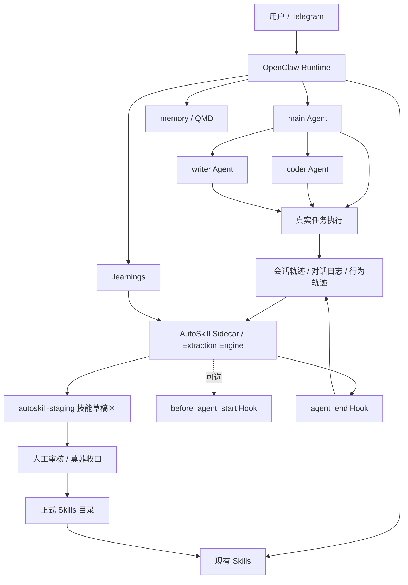

# 自我进化: AutoSkill 与 OpenClaw 集成落地实施方案

## 1. 先说结论

如果只说一句话，这套集成最合理的定位是：

> **OpenClaw 负责运行时，AutoSkill 负责技能进化。**

也就是说：

- **OpenClaw** 继续负责：聊天入口、Agent 调度、技能执行、记忆、团队协作、日常任务运行
- **AutoSkill** 负责：从真实对话和轨迹中抽取可复用技能、迭代已有技能、形成长期能力资产

对于你当前这套体系，我最推荐的接入方式不是“一步到位全自动”，而是采用：

> **离线试点 → 会话结束后抽取 → 人工审核 → 再正式回灌**

这样最稳，风险最低，也最符合你现在已经形成的规则化工作区风格。

---

## 2. 为什么值得接 AutoSkill

你现在已经有：

- OpenClaw 多 Bot / Team 工作方式
- Telegram 高频对话入口
- 技能体系（skills）
- 三层记忆 + QMD
- `.learnings/` 复盘机制
- 对话转技术文档能力（`tech-doc-organizer`）

你当前最明显的瓶颈，不是“没有素材”，而是：

> **高质量对话很多，但 Skill 的沉淀仍然偏手工。**

而 AutoSkill 的价值正好是：

- 从真实交互里识别可复用模式
- 直接输出或更新 `SKILL.md`
- 支持离线抽取历史对话
- 支持 OpenClaw 适配器与 Hook 接入

所以，它非常适合补到你现有体系里，形成一条完整闭环：

```text
真实任务发生
→ OpenClaw 完成任务
→ memory / .learnings 沉淀事实与经验
→ AutoSkill 从高价值轨迹中抽技能
→ 人工审核
→ 回灌到 OpenClaw skills
→ 后续任务复用新技能
```

---

## 3. 集成目标

这次设计的不是一个“理论兼容方案”，而是一套可逐步上手的落地路径。

### 目标拆解

| 目标 | 说明 |
|---|---|
| 不打乱现有 OpenClaw 使用方式 | 先增强，不替换 |
| 降低手工写 Skill 成本 | 从真实对话中自动提炼 |
| 让 `.learnings/` 不只停留在复盘层 | 高价值经验继续升级为技能 |
| 保持可控性 | 抽取结果先进 staging，再人工审核 |
| 优先服务高价值场景 | 先拿最稳定、最复用的流程试点 |

---

## 4. 推荐架构图（Mermaid）



### 图中各层含义

| 模块 | 作用 |
|---|---|
| OpenClaw Runtime | 负责日常会话、执行、调度 |
| memory / QMD | 记事实、状态、长期背景 |
| `.learnings/` | 记错误、经验、最佳实践、能力缺口 |
| AutoSkill | 从轨迹中抽取 skill 或 skill 更新 |
| staging 区 | 技能草稿暂存区，不直接污染正式目录 |
| 人工审核 | 控质量，避免抽到低价值或错误 skill |
| 正式 skills | 供 OpenClaw 真正加载和使用 |

---

## 5. 最推荐的接入策略

### 5.1 不建议一上来就全自动注入

虽然 AutoSkill 支持 OpenClaw hook，但从你当前工作区成熟度看，不建议第一步就启用：

- `before_agent_start` 动态注入
- 自动写入正式 skill 目录
- 自动覆盖已有 skills

原因很简单：

- 容易增加上下文噪声
- 容易引入技能冲突
- 容易把低质量轨迹抽成正式能力
- 容易造成技能目录膨胀

### 5.2 最稳的顺序

建议按下面顺序推进：

1. **离线抽取试点**
2. **只接 `agent_end`**
3. **草稿先进 staging**
4. **人工审核后再导入正式目录**
5. **验证稳定后，再考虑 `before_agent_start`**

一句话：

> **先做事后学习，再考虑事前注入。**

---

## 6. 分阶段实施步骤

## Phase 1：离线试点验证

### 目标

先验证 AutoSkill 对你这类对话轨迹抽 skill 的质量。

### 推荐试点素材

优先挑这三类：

| 试点任务 | 原因 |
|---|---|
| `tech-doc-organizer` 的形成过程 | 规则清晰、输出结构稳定 |
| Self-Improving Agent 的落地过程 | 触发条件明确、边界清楚 |
| OpenClaw 排障过程（如 gateway / browser / Telegram pairing） | 高复用、容易形成固定流程 |

### 操作建议

- 导出高价值历史对话
- 用 AutoSkill 离线导入对话
- 看输出是更适合生成新 skill，还是更新已有 skill
- 评估抽取质量、过拟合风险、结构稳定度

### 成功标准

满足以下至少 3 条，才继续下一阶段：

- 抽出的 skill 结构清晰
- 触发描述足够准确
- 没有过度绑定某一次具体任务
- 能看出可复用的工作流
- 不需要大幅重写才能用

---

## Phase 2：接入 OpenClaw 的 `agent_end` Hook

### 目标

让 AutoSkill 在每次会话结束后，自动判断是否值得抽技能。

### 推荐方式

只接 `agent_end`，不要先接 `before_agent_start`。

### 这样做的好处

- 不影响当前任务上下文
- 不干扰已有 skills 与 prompt 结构
- 先积累技能候选池
- 风险远低于会话前动态注入

### 适合触发抽取的任务类型

| 类型 | 是否推荐自动排队抽取 |
|---|---|
| 稳定重复任务 | 推荐 |
| 结构化配置过程 | 推荐 |
| 对话式整理输出 | 推荐 |
| 一次性随手问答 | 不推荐 |
| 情绪化闲聊 | 不推荐 |
| 信息不完整的半成品任务 | 不推荐 |

---

## Phase 3：建立 staging 技能草稿区

### 目标

避免 AutoSkill 直接污染正式技能目录。

### 推荐目录规划

```text
~/.openclaw/
├── skills/                         # 正式技能目录
├── autoskill-staging/             # AutoSkill 抽取草稿
│   ├── new/                       # 新技能候选
│   ├── updates/                   # 已有技能更新候选
│   ├── rejected/                  # 审核不通过的候选
│   └── review-notes/              # 审核备注
├── workspace/
│   ├── AGENTS.md
│   ├── MEMORY.md
│   ├── memory/
│   └── .learnings/
└── plugins/
```

### staging 区建议规则

| 目录 | 用途 |
|---|---|
| `new/` | 新生成但还未正式启用的 skill |
| `updates/` | 对现有 skill 的 patch / 变更建议 |
| `rejected/` | 被判定不稳定、不可复用、质量不足 |
| `review-notes/` | 审核意见、原因、调整建议 |

---

## Phase 4：人工审核与正式回灌

### 目标

把 AutoSkill 产物纳入你现有的工作区治理逻辑。

### 推荐审核流程

```text
AutoSkill 抽出 skill 草稿
→ 落到 autoskill-staging/new 或 updates
→ 莫菲 / 你审核
→ 判断：可用 / 需改 / 驳回
→ 可用的再移动到正式 skills 目录
```

### 审核标准

| 审核项 | 判断标准 |
|---|---|
| 触发是否清晰 | 用户说什么会触发这个 skill？ |
| 是否足够通用 | 不是只适配一次具体对话 |
| 是否与已有 skill 冲突 | 能否合并或避免重复 |
| 是否有明确边界 | 不要什么都做 |
| 内容是否可解释 | 人能读懂、能改、能维护 |

---

## Phase 5：再考虑 `before_agent_start` 动态注入

### 什么时候才建议做

只有当下面条件基本满足时，才建议尝试：

- 已经跑过多轮离线抽取
- staging → 审核 → 正式回灌流程稳定
- 已有 skills 结构清晰，边界明确
- 能接受上下文自动注入带来的额外复杂度

### 适合的用途

- 在特定任务开始前推荐相关 skill
- 根据近期会话上下文做轻量技能召回
- 结合任务类型做候选 skill 排序

### 暂不建议的用途

- 每轮对话都注入大量 skill
- 自动注入未经审核的 skill
- 用它替代 memory / QMD

---

## 7. 目录规划建议

下面是一版更完整的目录规划，适合你当前 OpenClaw 工作区继续演进。

```text
~/.openclaw/
├── skills/                                # 正式启用的技能
│   ├── self-improving-agent/
│   ├── tech-doc-organizer/
│   └── ...
├── autoskill-staging/                     # AutoSkill 草稿区
│   ├── new/
│   ├── updates/
│   ├── rejected/
│   └── review-notes/
├── workspace/
│   ├── AGENTS.md
│   ├── SOUL.md
│   ├── TOOLS.md
│   ├── MEMORY.md
│   ├── memory/
│   │   ├── agent-notes.md
│   │   ├── user-prefs.md
│   │   ├── topics/
│   │   └── YYYY-MM-DD.md
│   └── .learnings/
│       ├── LEARNINGS.md
│       ├── ERRORS.md
│       └── FEATURE_REQUESTS.md
├── plugins/
│   └── autoskill-openclaw-plugin/
├── extensions/
│   └── autoskill-openclaw-adapter/
└── logs/
```

### 目录职责边界

| 路径 | 作用 |
|---|---|
| `skills/` | 生产可用技能 |
| `autoskill-staging/` | 待审核技能草稿 |
| `workspace/.learnings/` | 复盘层、经验暂存 |
| `workspace/memory/` | 长期事实与规则层 |
| `plugins/` | OpenClaw 插件 |
| `extensions/` | 适配器 / hook 接入 |

---

## 8. 和现有 memory / .learnings 的职责分工

这个边界必须清楚，不然接了 AutoSkill 之后会乱。

| 系统 | 作用 | 存什么 |
|---|---|---|
| memory / QMD | 记事实、状态、背景 | 项目状态、用户偏好、长期主题 |
| `.learnings/` | 记复盘、错误、最佳实践 | 错误、纠偏、经验、能力缺口 |
| AutoSkill | 记可执行能力 | skill 草稿、skill 升级、技能版本 |
| AGENTS / agent-notes | 记默认规则 | 工作流、协作规则、长期执行方法 |

一句话概括：

> **memory 记住，.learnings 复盘，AutoSkill 提炼，AGENTS 收敛。**

---

## 9. 风险点与注意事项

## 9.1 技能目录膨胀

如果抽取门槛太低，skills 很快会膨胀，最后出现：

- 同类 skill 太多
- 触发描述重叠
- 不知道该用哪个
- 维护成本上升

### 建议

- 一开始严格控制试点范围
- 对抽出的 skill 做去重和合并
- 优先更新已有 skill，而不是不断新增

---

## 9.2 会话噪声被误抽成 skill

很多对话并不适合抽技能，比如：

- 临时闲聊
- 一次性随手问答
- 信息不完整的半成品讨论

### 建议

- 建立“抽取白名单任务类型”
- 先由 `agent_end` 只对特定标签任务排队抽取
- 必须经过人工审核

---

## 9.3 与现有 prompt / skills 冲突

如果新技能边界不清，很容易和已有 skills 或 `AGENTS.md` 冲突。

### 建议

- 先把抽取结果进 staging
- 审核时重点检查：是否已有同类 skill
- 对已有 skill 更适合走 update patch，而不是新建

---

## 9.4 自动注入导致上下文变重

如果太早接 `before_agent_start`，可能会：

- 增加 prompt 噪声
- 增加 Token 消耗
- 让任务边界变模糊

### 建议

- 后置启用
- 只做轻量推荐，不做重注入
- 优先从任务结束后的学习开始

---

## 9.5 抽出的 skill 过拟合某次对话

这是 AutoSkill 最现实的问题之一。

### 典型表现

- Skill 描述带入某个具体任务细节
- 适用范围太窄
- 对话里偶然出现的口吻、路径、约束被错误固化

### 建议

- 尽量用多轮、完整、成熟的对话做抽取
- 优先抽“流程型 skill”，少抽“偶然风格型 skill”
- 审核时重点看通用性和边界

---

## 10. 试点任务建议

我建议你先选 3 个试点，难度和收益都比较合适。

## 试点 1：`tech-doc-organizer`

### 为什么适合

- 对话很多
- 输出结构非常明确
- 规则清晰
- 好坏容易判断

### 想验证什么

- AutoSkill 能不能正确抽出“技术文档整理 Skill”
- 是否能把标题、标签、frontmatter、结构模板这些规则识别出来

---

## 试点 2：Self-Improving Agent 落地过程

### 为什么适合

- 有明确触发条件
- 有文件边界
- 有升级路径
- 有“经验 → 规则”的完整链路

### 想验证什么

- AutoSkill 是否适合提炼“规则型 skill”
- 能不能准确区分 `.learnings`、memory、AGENTS 的边界

---

## 试点 3：OpenClaw 排障流程

### 推荐内容

- gateway restart / install
- Telegram pairing
- browser 配置
- cron / heartbeat 配置

### 为什么适合

这类对话天然有：

- 问题现象
- 排查路径
- 命令
- 修复方案
- 注意事项

非常容易沉淀成排障 skill。

---

## 11. 一版最小落地流程

如果你想尽快开始，我建议用这版最小可行流程：

```text
1. 选 3 组历史高质量对话
2. 用 AutoSkill 离线导入并抽技能
3. 输出到 ~/.openclaw/autoskill-staging/new
4. 人工审核 skill 草稿
5. 合格后移动到 ~/.openclaw/skills
6. 在真实任务中继续使用
7. 再观察是否适合接 agent_end 自动抽取
```

### 这个流程的优点

- 不改动当前主运行链路
- 不污染正式技能目录
- 能快速验证价值
- 可控、可回滚、可迭代

---

## 12. 最后的结论

对于你当前这套 OpenClaw 体系，AutoSkill 最适合的角色不是“取代一切”，而是补上一层一直缺但又很关键的能力：

> **把高价值真实对话，自动提炼成可复用技能。**

它最合理的接法不是一下子全自动，而是：

- 先离线试点
- 再接会话结束后抽取
- 结果先进 staging
- 人工审核后再回灌正式 skills

这样做的好处，是既能保持你现在这套工作区的稳定性，又能逐步把“手工沉淀 skill”这件事半自动化。

最终形成的完整链路会是：

```text
OpenClaw 运行任务
→ memory / .learnings 沉淀
→ AutoSkill 提炼 skill
→ 人工审核
→ 技能正式回灌
→ 后续任务继续复用
```

这条链路一旦跑顺，OpenClaw 对你来说就不只是“越用越顺手”，而会真正开始：

> **越用越会长出新的能力。**

---

## 13. 安装

安装提示词：

```
安装这个技能：https://github.com/ECNU-ICALK/AutoSkill
```

完整插件说明（安装、接入、运行逻辑、验证）：

- `AutoSkill4OpenClaw/README.md`

安装脚本会自动：

- 安装 sidecar 运行脚本
- 安装生命周期适配器（`before_agent_start` / `agent_end`）
- 写入 `~/.openclaw/openclaw.json` 的 `plugins.load.paths + plugins.entries`
- 默认启用 `autoskill-openclaw-adapter`

重要：

- 安装完成后，需要重启一次 OpenClaw 运行进程，新的插件配置才会生效。

```
openclaw gateway restart
```


如果当前环境没有 `openclaw` CLI，请使用你现有的服务管理方式重启 OpenClaw gateway/runtime 进程。

项目地址: https://github.com/ECNU-ICALK/AutoSkill/blob/main/README.zh-CN.md


注: 目前还我没有实际安装尝试, 方案是可行的, 当前Self-Improving Agent 现阶段已够用, 暂不需要这种自我进化,感兴趣的同学可以试试效果

------

`#OpenClaw` `#AutoSkill` `#AIAgent` `#AgentSkill` `#WorkflowDesign` `#KnowledgeManagement` `#EngineeringPractice` `#AI自动化`
