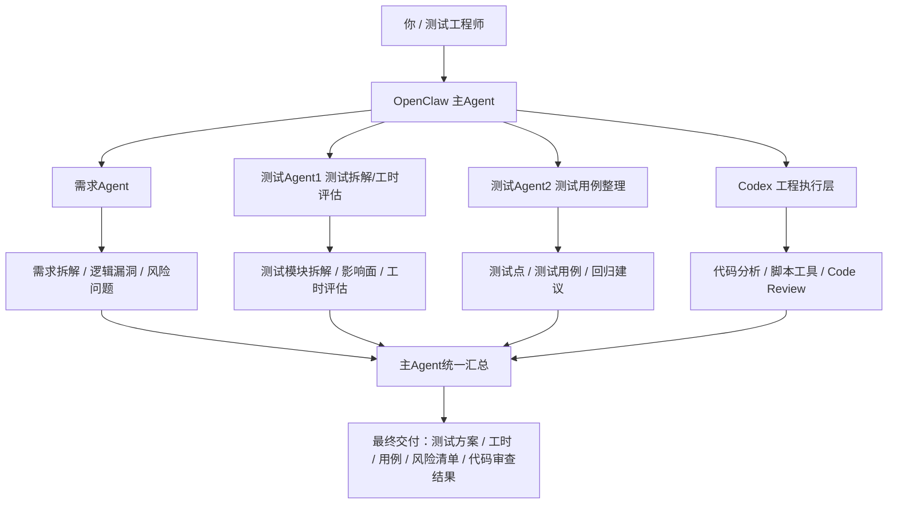

# 面向测试工程师的 OpenClaw 测试编排方案

> 说明：本文为轻量收敛版，主稿保留在 `[01-Articles/2026-03-22-面向测试工程师的-OpenClaw-测试编排方案.md](/articles/2026-03-22-%E9%9D%A2%E5%90%91%E6%B5%8B%E8%AF%95%E5%B7%A5%E7%A8%8B%E5%B8%88%E7%9A%84-OpenClaw-%E6%B5%8B%E8%AF%95%E7%BC%96%E6%8E%92%E6%96%B9%E6%A1%88-56157264/)`。

## 1. 先说结论

这套方案的核心，不是“让 AI 替测试工程师完成测试”，而是：

> **让 OpenClaw 做测试工作的编排层，让不同 Agent 分别承担需求分析、测试设计、工时评估、文档整理等工作；凡是涉及脚本、工具、代码、工程项目、代码审查的内容，一律交给 Codex。**

也就是说，这套体系的边界非常明确：

### OpenClaw 内部 agent 负责：
- 编排
- 任务拆解
- 需求分析
- 测试范围规划
- 工时评估
- 测试文档和用例组织
- 结果汇总

### Codex 负责：
- 读代码
- 拉项目
- 分析工程结构
- 写脚本 / 工具
- 代码相关排查
- code review
- 与工程代码直接相关的执行工作

一句话总结：

> **OpenClaw 负责“想清楚”和“组织清楚”，Codex 负责“动代码”和“碰工程”。**

---

## 2. 为什么测试工程师适合这套方案

测试工作的很多高价值环节，本来就不是点页面，而是：

- 需求有没有说清楚
- 测试范围怎么拆
- 哪些地方风险高
- 工时怎么估
- 用例怎么组织
- 代码改动会影响哪些地方
- 哪些缺陷值得重点盯

这类工作天然适合拆成多个角色协作。

所以，对于测试工程师来说，最适合的不是“一个万能 AI”，而是：

> **一个主编排层 + 多个职责明确的子角色 + 一个真正碰工程代码的执行引擎。**

这样做的好处是：

1. 测试分析可以前移
2. 测试拆解更系统
3. 工时评估更有依据
4. 测试用例不会一上来就机械罗列
5. 代码审查能更早介入
6. 测试工程师可以把精力更多放在判断、策略和风险控制上

---

## 3. 方案的总体定位

我建议把这套方案定义成：

> **测试编排系统（Testing Orchestration System）**

而不是“测试自动化系统”。

因为它的目标不是替代已有自动化测试框架，而是把测试工作中的高脑力环节拆开，并通过角色分工把它们组织起来。

这套体系里：

- OpenClaw 是编排层
- 各子 agent 是分析层 / 文档层 / 规划层
- Codex 是工程执行层

---

## 4. 总体架构



这张图的关键，是把角色边界画清楚：

- OpenClaw agent 不碰工程代码执行
- 工程代码相关事项统一交给 Codex
- 主 Agent 负责统筹与收口

---

## 5. 各角色职责设计

## 5.1 OpenClaw 主 Agent

### 角色定位
主 Agent 不是所有细活都自己做，而是：

- 接任务
- 判断任务类型
- 拆任务
- 分配子角色
- 判断是否需要调用 Codex
- 汇总各方结果
- 输出统一交付物

### 它应该负责的事情

- 识别这是需求分析任务、测试设计任务，还是代码相关任务
- 把纯规划和纯执行区分开
- 避免让需求 Agent、测试 Agent 直接碰工程执行
- 控制工作流顺序

### 一句话定位

> **主 Agent 是测试经理 / 调度员，不是代码执行者。**

---

## 5.2 需求 Agent

### 职责
根据用户提供的：

- 需求链接
- 历史需求
- PRD / 说明文档
- 会议纪要
- 相关资料
- 历史缺陷

完成以下工作：

- 需求拆解
- 需求质量评估
- 前后逻辑漏洞检查
- 边界和前置条件识别
- 不足、缺失、规划不完整项梳理
- 风险问题清单整理
- 待确认问题输出

### 它的核心价值

它不是写测试用例，而是先回答：

> **这个需求到底说清楚没有？哪里会埋雷？**

### 推荐输出结构

| 模块 | 内容 |
|---|---|
| 需求摘要 | 这次需求在解决什么问题 |
| 主流程 | 核心流程是什么 |
| 缺失项 | 哪些地方没说清楚 |
| 风险点 | 哪里可能理解偏差 |
| 待确认问题 | 需要产品/开发补充什么 |

---

## 5.3 测试 Agent1：测试拆解 + 工时评估

### 职责
基于：

- 原始需求
- 需求 Agent 的分析结果

完成以下工作：

- 测试功能模块拆解
- 测试范围识别
- 回归影响面识别
- 测试类型划分
- 测试工时评估
- 高风险项标记

### 它输出的重点

不是简单给一个时间，而是要先拆出：

- 测试范围
- 风险等级
- 环境准备要求
- 数据准备要求
- 是否需要联调
- 是否需要自动化回归

### 推荐输出表格

| 模块 | 变更类型 | 测试重点 | 风险级别 | 预估工时 |
|---|---|---|---|---|
| 登录模块 | 逻辑变更 | 权限/状态流转 | 高 | 1.5d |
| 模板配置 | 新功能 | 保存/编辑/回显 | 中 | 2d |

### 价值

这一步是你日常工作里最容易直接产生收益的一步，因为很多工时评估其实不是“估时间”，而是“先拆清楚”。

---

## 5.4 测试 Agent2：测试用例整理

### 职责
基于：

- 原始需求
- 需求 Agent 的结论
- 测试 Agent1 的测试拆解结果

完成以下工作：

- 测试点整理
- 测试用例编写
- 正常流程 / 异常流程 / 边界条件覆盖
- 权限、角色、状态切换场景整理
- 回归建议整理

### 它的边界

它不应该脱离前两个 Agent 单独工作。

否则很容易出现：
- 看起来用例很多
- 实际没抓住业务重点
- 没跟前面需求漏洞和风险点联动

### 推荐输出层次

1. 测试点清单
2. 正式测试用例
3. 高风险优先级标记
4. 自动化优先候选项

---

## 5.5 测试 Agent3：Code Review 归到 Codex

这是你刚明确的新规则，也是这套方案最关键的边界之一。

### 结论先说

> **测试 Agent3 的 code review 不再由 OpenClaw 内部 agent 承担，而统一归到 Codex 完成。**

### 原因

因为 code review 这件事本质上已经涉及：

- 拉项目代码
- 读工程结构
- 看调用链
- 看实现逻辑
- 查测试缺口
- 分析改动影响面

这些事情都已经属于：

> **脚本、工具、代码、工程项目相关事项**

所以按你的边界定义，应该一律交给 Codex，而不是放在 OpenClaw 内部 agent 里。

### Codex 在这里的职责

Codex 负责：

- 分析项目目录结构
- 读取改动代码
- 对照需求看实现是否偏离
- 找逻辑漏洞
- 找异常处理遗漏
- 找边界条件风险
- 看是否需要补测试
- 给出重点回归建议

### 推荐输出内容

| 维度 | 说明 |
|---|---|
| 逻辑风险 | 是否有明显业务逻辑问题 |
| 边界风险 | 是否有空值、状态、权限遗漏 |
| 测试缺口 | 哪些地方建议补测 |
| 回归影响面 | 哪些模块要重点回归 |
| 自动化建议 | 哪些适合补脚本或回归测试 |

### 一句话定位

> **Code Review 是测试视角下的工程审查任务，所以统一交给 Codex。**

---

## 6. 统一边界规则

这一条建议你直接当成这套方案的铁律。

## 6.1 OpenClaw agent 负责什么

| 类型 | 是否由 OpenClaw agent 负责 |
|---|---|
| 任务拆解 | 是 |
| 需求分析 | 是 |
| 规划和文档 | 是 |
| 测试范围整理 | 是 |
| 工时评估 | 是 |
| 测试用例整理 | 是 |
| 汇总和收口 | 是 |

## 6.2 Codex 负责什么

| 类型 | 是否由 Codex 负责 |
|---|---|
| 拉项目代码 | 是 |
| 看工程结构 | 是 |
| 写脚本 / 工具 | 是 |
| 改代码 / 排查代码 | 是 |
| Code Review | 是 |
| 生成与工程相关的辅助产物 | 是 |

### 压缩成一句话

> **凡是碰代码、碰项目、碰脚本、碰工具的，都走 Codex；凡是分析、规划、文档、组织、汇总的，都留在 OpenClaw。**

---

## 7. 推荐工作流

这套方案最合理的任务流，我建议按下面顺序跑。

```text
需求输入
→ 主Agent判断任务类型
→ 需求Agent做需求质量审查
→ 测试Agent1做测试拆解和工时评估
→ 测试Agent2整理测试点和测试用例
→ 若涉及代码与工程分析，交给 Codex 做 code review / 脚本 / 辅助分析
→ 主Agent统一汇总输出
```

### 这个顺序为什么合理

因为：

1. 不先把需求看清楚，后面的测试拆解容易偏
2. 不先把测试范围拆出来，工时评估不准
3. 不先拆完范围，用例很容易机械化
4. Code Review 本来就该在工程上下文下做，所以放到 Codex

---

## 8. 各角色的“完成定义”建议

## 8.1 需求 Agent 的 done

- 需求已拆解
- 主流程已梳理
- 缺失项已列出
- 风险点已列出
- 待确认问题已列出

## 8.2 测试 Agent1 的 done

- 模块已拆解
- 测试范围已识别
- 风险级别已标记
- 工时已估算
- 依赖项已说明

## 8.3 测试 Agent2 的 done

- 测试点已覆盖主流程
- 异常/边界已纳入
- 用例优先级已标识
- 自动化候选已标记

## 8.4 Codex Code Review 的 done

- 代码风险点已指出
- 与需求偏差已指出
- 建议补测点已列出
- 回归影响面已列出
- 若需要脚本辅助，已给出建议或实现

---

## 9. 这套方案最能解决什么问题

## 9.1 需求质量前移
很多测试问题不是测不出来，而是需求一开始就模糊。需求 Agent 可以提前把这类问题揪出来。

## 9.2 工时评估更有依据
不是拍脑袋，而是先拆模块、识别风险，再做估算。

## 9.3 用例质量更稳
不是直接机械列用例，而是建立在需求分析和测试拆解之上。

## 9.4 代码风险更早暴露
Code Review 不再等人手动慢慢看，而是先让 Codex 从工程视角做第一轮扫描。

## 9.5 测试工程师更聚焦在高价值工作
把重复性的整理和初步分析交给系统后，你可以把精力更多放在：

- 判断
- 策略
- 风险控制
- 关键问题确认

---

## 10. 最推荐的落地顺序

我不建议你一开始就把全部角色同时跑起来。

### Phase 1：先跑 3 个角色

先落地：

1. 主 Agent
2. 需求 Agent
3. 测试 Agent1（测试拆解 + 工时评估）

### 原因

这是你最常用、最容易见效的链路。

---

### Phase 2：再加测试 Agent2

等前两步稳定后，再接：

4. 测试 Agent2（测试用例整理）

### 原因

如果前面两步没跑顺，测试用例很容易只是“看起来很多”，但不准。

---

### Phase 3：最后接 Codex Code Review

再把：

5. Codex 工程执行层

稳定接进工作流。

### 原因

Code Review、脚本、代码分析这些都依赖工程上下文，更适合在前面的流程跑顺后接进来。

---

## 11. 一版最小可行方案（MVP）

如果你想先跑起来，可以先这样：

```text
输入一个真实需求
→ 主Agent判断任务
→ 需求Agent输出“需求审查结果”
→ 测试Agent1输出“测试拆解 + 工时评估”
→ 主Agent汇总
```

等这个流程跑顺，再加：

```text
→ 测试Agent2输出测试用例
→ Codex输出 code review / 辅助脚本 / 代码风险分析
```

这样推进最稳。

---

## 12. 最后的结论

这套方案最重要的，不是多加几个 agent，而是先把边界定义清楚。

最终推荐的边界可以压缩成一句：

> **OpenClaw 中的 agent 只做编排、规划、文档、需求和测试分析；凡是涉及脚本、工具、代码、工程项目、代码审查的，一律走 Codex。**

这条边界一旦定清楚，你这套测试编排系统就会更稳：

- 不会把 OpenClaw agent 用成“什么都做”的万能角色
- 不会把 code review 和需求规划混在一起
- 不会让工程上下文和编排上下文互相污染

对测试工程师来说，这套方案真正的价值也不是“用 AI 替自己干活”，而是：

> **用 OpenClaw 把测试工作组织起来，用 Codex 把工程相关的重活接过去，从而让测试工作更前移、更系统、更有策略性。**

## 

`#OpenClaw` `#Testing` `#Codex` `#AIAgent` `#WorkflowDesign` `#QualityEngineering` `#TechnicalWriting`
