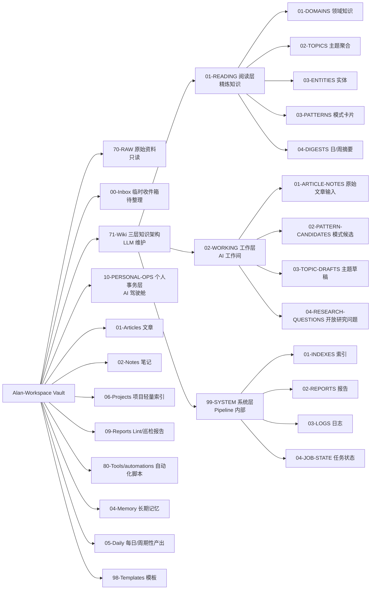
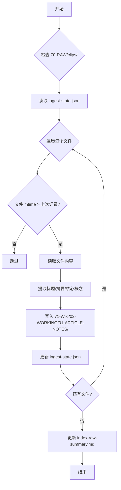
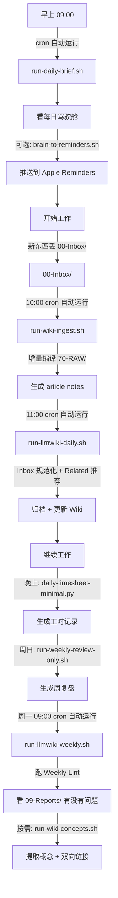

# Alan-Workspace LLM Wiki 完整体系 v2.0 升级说明

## 一句话总结

Alan-Workspace LLM Wiki v2.0 是一套基于 OpenClaw + Obsidian 的完整个人知识管理体系：**轻量落地、可复用、可扩展、增量编译**，借鉴了 Obsidian-Brain-OS 的三层知识架构、扩展 Lint、单一写入入口、Daily Brief，并新增了专业 Wiki 编译器、cron 定时任务、inbox 智能处理等核心功能。

---

## 目录结构总览



---

## 一、核心架构

### 1.1 三层知识架构（借鉴 Obsidian-Brain-OS）

| 层级 | 目录 | 用途 | 说明 |
|---|---|---|---|
| **READING 阅读层** | `71-Wiki/01-READING/` | 实际阅读的内容 | 精炼后的知识，你直接看这里 |
| → 子层级 | `01-DOMAINS/` | 领域知识 | 原 `concepts/`，概念、定义、领域知识 |
| → | `02-TOPICS/` | 主题聚合 | 原 `insights/`，洞察、判断、对比、综述 |
| → | `03-ENTITIES/` | 实体 | 原 `entities/`，公司、产品、工具、人物 |
| → | `03-PATTERNS/` | 模式卡片 | 已验证的模式、最佳实践 |
| → | `04-DIGESTS/` | 日/周摘要 | 自动生成的摘要，从这里开始阅读 |
| **WORKING 工作层** | `71-Wiki/02-WORKING/` | AI 的工作间 | 原始输入、草稿、候选内容，**不要直接看这里** |
| → 子层级 | `01-ARTICLE-NOTES/` | 原始文章输入 | 从 70-RAW/ 或 00-Inbox/ 来的原始输入，人工可审核 |
| → | `02-PATTERN-CANDIDATES/` | 模式候选 | 审核中的模式，还没到 READING/ |
| → | `03-TOPIC-DRAFTS/` | 主题草稿 | 进行中的主题页面 |
| → | `04-RESEARCH-QUESTIONS/` | 开放研究问题 | 需要深入研究的方向 |
| **SYSTEM 系统层** | `71-Wiki/99-SYSTEM/` | Pipeline 内部 | 仅 AI 可读，自动生成的索引、报告、状态、日志 |
| → 子层级 | `01-INDEXES/` | 索引文件 | index-raw-summary.md 等 |
| → | `02-REPORTS/` | 报告 | Lint 报告、巡检报告 |
| → | `03-LOGS/` | 日志 | 运行日志、执行记录 |
| → | `04-JOB-STATE/` | 任务状态 | ingest-state.json 等 |

---

### 1.2 个人事务层（Personal Ops）

| 目录 | 用途 | 说明 |
|---|---|---|
| `10-PERSONAL-OPS/01-DAILY-BRIEFS/` | 每日驾驶舱 | 每天早上生成，告诉你今天怎么打 |
| `10-PERSONAL-OPS/02-PLANS-AND-SCHEDULES/` | 周计划/月计划 | 周一/每月 1 号生成 |
| `10-PERSONAL-OPS/03-TODOS-AND-FOLLOWUPS/` | 待办/承诺/进度/决策 | 当前承诺事项、进度看板、决策队列 |
| `10-PERSONAL-OPS/04-REVIEWS-AND-RETROS/` | 复盘 | 周复盘、月复盘 |
| `10-PERSONAL-OPS/05-OPS-LOGS/` | 日常日志 | 频道历史、每日进度、复盘快照 |
| `10-PERSONAL-OPS/06-TIMESHEETS/` | 工时记录 | 每日工时自动填报（极简版） |

---

### 1.3 待办唯一真相源

- **文件**：`00-Inbox/todo-backlog.md`
- **优先级体系**：
  - **P0**：今天必须完成 → 出现在今日 Top 3
  - **P1**：本周推进 → 排入周计划
  - **P2**：本月安排 → 加入月里程碑
  - **P3**：需要判断 → 留在待办池直到评估

---

## 二、专业 Wiki 编译器（v2.0 核心新增）

### 2.1 分阶段实现方案

| 阶段 | 时间 | 功能 | 状态 |
|---|---|---|---|
| **Stage 1** | 本周 | 增量编译 + INDEX.md + 摘要生成 | ✅ 已完成 |
| **Stage 2** | 下两周 | concept-xxx.md 生成 + 双向链接 | ✅ 已完成 |
| **Stage 3** | 可选 | 图片处理 | ⏳ 待完成 |

---

### 2.2 Stage 1：增量编译 + 摘要生成

**核心脚本**：`wiki_ingest.py`



**核心功能**：
- ✅ 只处理新文件或 mtime 变化的文件（增量编译）
- ✅ 为每份 raw 资料生成标题、摘要、核心概念列表
- ✅ 创建或更新 INDEX.md（index-raw-summary.md）
- ✅ 保持干净的 Markdown 格式

**核心概念提取（极简版，不用 LLM）**：
- 大写字母开头的词（如 LLM、Wiki、Obsidian、OpenClaw）
- **加粗**的词
- 链接名
- 高频词（词频 > 3）

**输出位置**：
- `71-Wiki/02-WORKING/01-ARTICLE-NOTES/<YYYY-MM-DD-标题>.md`（原始摘要 + 核心概念列表，人工可审核）
- `71-Wiki/99-SYSTEM/01-INDEXES/index-raw-summary.md`（列出所有 raw 摘要和链接）
- `71-Wiki/99-SYSTEM/04-JOB-STATE/ingest-state.json`（记录已处理文件的 mtime）

---

### 2.3 Stage 2：concept-xxx.md 生成 + 双向链接

**核心脚本**：`wiki_concept_extract.py`

**核心功能**：
- ✅ 从 02-WORKING/01-ARTICLE-NOTES/ 中提取核心概念
- ✅ 为每个概念生成一个 `71-Wiki/01-READING/01-DOMAINS/concept-<概念名>.md`（百科式文章）
- ✅ 自动添加双向链接：`概念名`
- ✅ 在文章之间添加 backlinks

**输出位置**：
- `71-Wiki/01-READING/01-DOMAINS/concept-<概念名>.md`（百科式文章，解释关键概念）

---

### 2.4 Stage 3（可选）：图片处理

**计划功能**：
- 识别 70-RAW/assets/ 中的图片
- 描述图片内容（可选：用 multimodal 模型）
- 链接到对应文章

---

## 三、自动化脚本清单（v2.0 完整）

| 脚本 | 作用 | 推荐运行频率 | 定时任务 |
|---|---|---|---|
| `run-all.sh` | 一键运行全部（Daily + Weekly） | 周日/周一 | ❌ 按需执行 |
| `run-llmwiki-daily.sh` | LLM Wiki 日常整理（Inbox 规范化 + Related 推荐） | 每天 | ✅ cron 每日 |
| `run-llmwiki-weekly.sh` | LLM Wiki 每周整理（Weekly Lint） | 每周一 | ✅ cron 每周 |
| `run-weekly-review-only.sh` | 只生成周复盘 | 每周日 | ❌ 按需执行 |
| `run-wiki-lint.sh` | 一键跑扩展版 Wiki Lint（孤岛页/断链/格式/脏文件） | 每周/按需 | ❌ 按需执行 |
| `run-daily-brief.sh` | 一键生成每日驾驶舱（Personal Ops 版） | 每天早上 | ✅ cron 每日 |
| `run-wiki-ingest.sh` | 一键运行 Wiki 增量编译（Stage 1） | 每天/按需 | ✅ cron 每日 |
| `run-wiki-concepts.sh` | 一键运行概念提取 + 双向链接（Stage 2） | 按需 | ❌ 按需执行 |
| `brain-to-reminders.sh` | 将今日 P0/P1 推送到 Apple Reminders（需要 `remindctl`） | 每天早上（可选） | ❌ 按需执行 |
| `daily-timesheet-minimal.py` | 极简版每日工时记录（扫描今日 git 提交） | 每天晚上（可选） | ❌ 按需执行 |
| `writer_agent.py` | 单一写入入口（保证 git commit） | 按需 | ❌ 按需执行 |

---

## 四、定时任务配置（v2.0 重大改进）

### 4.1 从 launchd 到 cron 的迁移

**决策背景**：
- ❌ launchd：TCC 权限问题、路径解析问题、配置复杂
- ✅ cron：更稳定、避免 TCC/路径解析问题、配置简单易维护

**最终选择**：完全放弃 macOS launchd 定时任务，改用传统 Unix cron 方式。

---

### 4.2 当前 cron 配置

**配置文件**：`80-Tools/automations/crontab.conf`

```bash
# 每日任务：每天 09:00 运行
0 9 * * * cd [本机路径已隐藏] && 80-Tools/automations/run-daily-brief.sh >> 00-Inbox/_automation/logs/cron-daily.log 2>&1

# 每日任务：每天 10:00 运行 Wiki 增量编译
0 10 * * * cd [本机路径已隐藏] && 80-Tools/automations/run-wiki-ingest.sh >> 00-Inbox/_automation/logs/cron-ingest.log 2>&1

# 每日任务：每天 11:00 运行 LLM Wiki 日常整理
0 11 * * * cd [本机路径已隐藏] && 80-Tools/automations/run-llmwiki-daily.sh >> 00-Inbox/_automation/logs/cron-llmwiki-daily.log 2>&1

# 每周任务：每周一 09:00 运行
0 9 * * 1 cd [本机路径已隐藏] && 80-Tools/automations/run-llmwiki-weekly.sh >> 00-Inbox/_automation/logs/cron-weekly.log 2>&1
```

**不设置为定时任务的脚本**：
- `run-wiki-concepts.sh`（按需执行）
- `run-all.sh`（按需执行）

**日志位置**：`00-Inbox/_automation/logs/`

---

## 五、Inbox 智能处理（v2.0 新增）

### 5.1 核心脚本：`inbox_auto_normalize.py`

**输入**：`00-Inbox/` 下的 Markdown 文件

**处理规则（v2.0 增强版）**：

| 规则 | 说明 |
|---|---|
| 1. 自动添加标题 | 从文件名或第一个一级标题提取 |
| 2. created/updated 带时分秒 | 格式为 `YYYY-MM-DD HH:mm` |
| 3. 自动生成≥3个标签 | 从文本提取关键词、加粗词、链接名、大写开头词等 |
| 4. 规范化 Markdown 格式 | 检查并调整正文内容，确保 Markdown 格式规范 |
| 5. 自动加双链 | 对关键词首次出现添加 `链接名` |

**输出**：归档后的文件 + 更新后的 Wiki 页面

---

### 5.2 新增辅助功能

| 函数 | 作用 |
|---|---|
| `extract_better_title()` | 从一级标题→第一段→关键词组合依次提取文件标题 |
| `add_wikilinks_to_body()` | 保护代码块、已有双链、Markdown链接后，对关键词首次出现添加双链 |
| `extract_keywords()` | 从文本提取关键词生成标签 |
| `normalize_markdown_body()` | 规范化 Markdown 正文格式 |
| `now_datetime()` | 生成 `YYYY-MM-DD HH:MM` 格式时间戳 |

---

## 六、核心功能说明（完整）

### 6.1 扩展版 Wiki Lint（`wiki_lint.py`）

**检查项**：
- ✅ 孤岛页（no inbound links）
- ✅ index.md 缺失条目
- ✅ 断链（链接 指向不存在的文件）
- ✅ 缺失 frontmatter（title/category/created/updated）
- ✅ 脏文件（未命名/临时/副本文件）

**输出**：`09-Reports/YYYYMMDD-weekly-lint.md`

---

### 6.2 个人事务层每日驾驶舱（`daily_brief.py`）

**输入**：
- `00-Inbox/todo-backlog.md`（P0/P1/P2/P3）
- 最近 3 天 git 提交

**输出结构**：
1. 今天最重要的 3 件事
2. 今天必须推进但不必做完
3. 今天等待反馈 / 需要催办
4. 今天需要拍板的事
5. 今天可委派的事
6. 低能量时可做的小事
7. 今天明确不做
8. 今日提醒
9. 最近 3 天 git 提交

**输出文件**：`10-PERSONAL-OPS/01-DAILY-BRIEFS/daily-briefing.md`

---

### 6.3 Apple 提醒事项集成（`brain-to-reminders.sh`）

**依赖**：`remindctl`（需从 https://github.com/nicholasgasior/remindctl 安装）

**输入**：`00-Inbox/todo-backlog.md` 中的 P0/P1

**动作**：推送到 Apple Reminders "Brain今日" 列表，截止时间设为当天 21:00

**去重**：已存在的事项跳过

---

### 6.4 每日工时自动填报（极简版）（`daily-timesheet-minimal.py`）

**输入**：今日 git 提交（当前 repo）

**输出**：`10-PERSONAL-OPS/06-TIMESHEETS/timesheet-YYYY-MM-DD.md`

**结构**：
- 今日 git 提交
- 手动补充（可选）

---

## 七、使用流程（推荐 v2.0）



---

## 八、关键配置文件

| 文件 | 作用 | 位置 |
|---|---|---|
| `AGENTS.md` | 运行规则 / 开机 SOP | Vault 根目录 |
| `SOUL.md` | 说话方式 / 输出形态 | Vault 根目录 |
| `USER.md` | 用户偏好 / 免打扰 | Vault 根目录 |
| `MEMORY.md` | 长期记忆（精炼） | Vault 根目录 |
| `TOOLS.md` | 环境字典 / 别名表 | Vault 根目录 |
| `00-Inbox/todo-backlog.md` | 待办唯一真相源 | 00-Inbox/ |
| `80-Tools/automations/crontab.conf` | cron 定时任务配置 | 80-Tools/automations/ |
| `rules/frontmatter-spec.md` | Frontmatter 规范 | rules/ |

---

## 九、v2.0 升级要点总结

### 9.1 保留的好东西

- ✅ `70-RAW/`：只读原始资料（不碰，这是对的）
- ✅ `80-Tools/automations/`：轻量自动化脚本（保留并扩展）
- ✅ `AGENTS.md` / `SOUL.md` / `USER.md` / `MEMORY.md`：配置层（保留并细化）
- ✅ 一键脚本集合（保留并扩展）

---

### 9.2 新增的核心功能

| 功能 | 说明 | 状态 |
|---|---|---|
| 专业 Wiki 编译器 | 从 70-RAW/ 增量编译成 71-Wiki/ | ✅ Stage 1 + Stage 2 完成 |
| cron 定时任务 | 替代 launchd，更稳定 | ✅ 已配置 |
| Inbox 智能处理 | 自动加标题、标签、双链、规范化格式 | ✅ 已完成 |
| 三层知识架构 | READING/WORKING/SYSTEM | ✅ 已完成 |
| 扩展 Lint | 孤岛页/断链/格式/脏文件 | ✅ 已完成 |
| Daily Brief | 每日驾驶舱 | ✅ 已完成 |

---

### 9.3 重要的设计决策

| 决策 | 说明 |
|---|---|
| 完全放弃 launchd | 改用 cron，更稳定、避免 TCC/路径解析问题 |
| 增量编译 | 只处理新文件或有变化的文件，不要重写整个 wiki |
| 人工可审核 | 先把增量编译的原始摘要/核心概念放 71-Wiki/02-WORKING/01-ARTICLE-NOTES/ |
| 极简规则 | Stage 1 核心概念提取不用 LLM，用简单规则 |
| 单一写入入口 | writer_agent.py，保证 git commit |

---

## 十、下一步（从哪开始？）

1. ✅ **已完成**：Stage 1 + Stage 2 的专业 Wiki 编译器
2. ✅ **已完成**：cron 定时任务配置
3. ✅ **已完成**：Inbox 智能处理增强
4. ⏳ **待完成**：Stage 3（可选）：图片处理
5. 📝 **持续优化**：人工审核 working notes，完善概念定义
6. 📝 **持续优化**：把重要的概念从 01-DOMAINS/ 整理到 02-TOPICS/ 或 03-ENTITIES/

---

## 

`#KnowledgeBase` `#LLMWiki` `#OpenClaw` `#Obsidian` `#KnowledgeManagement` `#PersonalOps` `#WikiCompiler` `#个人知识管理` `#AI助手` `#效率工具`
