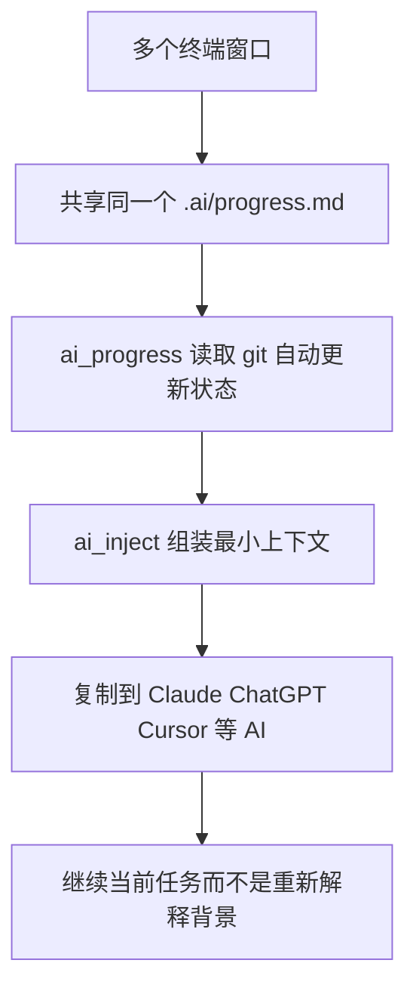

# 每次切个终端就忘了干到哪，这个小工具想把 AI 上下文同步这件事狠狠干明白

写代码最烦的，未必是难。

很多时候，是刚切了个窗口，脑子就断片了。
上一秒还知道这个任务卡在哪，下一秒新开个终端，得先翻半天笔记，才能想起“哦，刚才是在补 API retry”。
更狗的是，想把上下文重新喂给 AI，还得再手写一遍。

`aiflow` 干的事很简单，也很狠：它想让每一个终端窗口，在任何时刻，都读同一份当前状态，然后一条命令把最该给 AI 的上下文直接拼出来。

## 先说结论，这玩意到底是什么

这是一个靠 `progress.md` + 三个 shell 脚本来同步 AI 工作上下文的小工具，不跑 daemon，不起服务，不搞配置，目标就是让你别再一遍遍重写上下文。

## 它到底在治什么毛病

README 里写得很实在，这项目盯的不是“AI 能不能写代码”，而是另一个更日常、更烦人的问题：

> 人在多个终端窗口之间来回切，项目状态和 AI 上下文会不断失忆。

放到真实开发里，痛点基本就是这几个。

1. **换个窗口就忘了做到哪**  
   这太常见了。一个项目同时开 4 个终端，结果每个窗口像活在不同平行宇宙。

2. **每次都要重新组织上下文给 AI**  
   明明只是继续刚才的任务，还得重新写“当前在做什么、下一个做什么、接口约束是什么、之前踩过什么坑”。这种活很机械，还特别耗心气。

3. **手工维护进度一定会漂**  
   README 里直接点了，`progress.md` 靠手动维护很容易失真，所以它才会从 git commit 自动推导状态。

4. **多窗口天然不同步**  
   这个问题其实比“没有上下文”更烦，因为不是没有，而是每个地方都不一样。你以为自己在做 A，另一个窗口还停在 B。

## 它最聪明的地方，不是复杂，而是克制

这个项目最顺眼的一点，是它没有试图做成“大而全的 AI 工作台”。

README 里反复强调几件事：

- No daemon
- No server
- No config
- Just three shell scripts and a markdown file

这套思路很舒服。

很多效率工具最后都死在“先配半小时，爽五分钟”。这种东西一旦要你维护太多状态，它自己就会先烂掉。`aiflow` 明显知道这点，所以它把状态源压到只剩一个 `progress.md`。

说白了，这项目不是想给你造一辆火箭，它只是想先解决一个特别傻逼但特别高频的问题：

**怎么让所有窗口都知道，现在到底在干嘛。**

## 真正值得看的，是这套最小闭环

README 里这套玩法，其实可以拆成一个非常清楚的闭环：

| 环节 | aiflow 在做什么 | 这在实际中有什么用 |
|---|---|---|
| `progress.md` | 作为唯一状态源 | 不再到处找“最新版任务进度” |
| `ai_progress` | 从 git log 自动更新任务状态 | 少手工维护，降低漂移 |
| `ai_inject` | 自动拼出给 AI 的最小上下文 | 不用每次重新组织 prompt |
| `ai_done` | 手动推进当前 doing 任务 | 没 commit 时也能快速切换状态 |

这套闭环最大的价值在于，它不是想“记录一切”，而是只保留 AI 真需要的那点运行态信息。

## 30 秒上手，确实够短

README 给的 quickstart 很直接。

第一步，在项目里建 `.ai/progress.md`：

```bash
mkdir -p .ai && cat > .ai/progress.md << 'EOF'
[1] Login UI        done
[2] API integration  doing
[3] Error handling   todo
[4] Unit tests       todo
EOF
```

第二步，把当前上下文直接拼给 AI：

```bash
ai_inject .                          # print context
ai_inject -c .                       # print + copy to clipboard
ai_inject -c . "help me with retry"  # include your prompt too
```

第三步，commit 时带任务编号：

```bash
git commit -m "[2] API integration complete"
# Next time you run ai_inject, [2] is automatically marked done
```

这套流程的好处是，短，真的短。

没有中间层概念污染，也没有“先学会系统再开始用”的那种教学味。项目状态、AI 上下文、git 提交，这三件事被它硬生生拧成了一股绳。

## 它给 AI 的，不是完整文档，而是最小必要上下文

README 里对 `ai_inject` 的输出结构写得很清楚：

```text
[CURRENT]    what you're working on right now
[NEXT]       the task after this one
[GOAL]       project goal (first 15 lines)
[API]        API spec (first 10 lines, optional)
[CONSTRAINT] tech constraints (first 10 lines, optional)
[ISSUES]     last 3 known failure notes (optional)
[INPUT]      your prompt
```

而且它特地强调了一个点：

> Output (auto-assembled, < 100 lines)

这很关键。

现在很多人折腾 AI 工作流时，最容易犯的毛病就是把上下文越堆越厚，最后 prompt 写得像项目交接文档。结果模型先被喂晕，人自己也烦。

`aiflow` 的思路正好反过来，它是在逼自己做减法。

这有点像出门只带钱包、钥匙和手机，不是把整个家背身上。该带的东西别漏，不该带的别装，人才不会越走越累。

## 组合工作流示例：这玩意和 Claude / ChatGPT / Cursor 这类工具怎么配合才顺手

下面这段是**组合工作流示例**，不是 README 对某个 AI 平台的额外功能承诺，而是基于 README 已提供的能力，拼出来的一条实际使用路径。

假设场景是这样的：

- 正在做一个功能开发
- 同时开了多个终端窗口
- 要在 Claude、ChatGPT 或 Cursor 里持续接着上一个问题聊
- 又不想每次都重新手写背景

### 第一步，先把项目状态定下来

```bash
mkdir -p .ai && cat > .ai/progress.md << 'EOF'
[1] Login UI        done
[2] API integration  doing
[3] Error handling   todo
[4] Unit tests       todo
EOF
```

如果项目还有目标、约束、API 说明，可以按 README 里的结构放进 `.ai/ctx/`。

### 第二步，在任意终端一把生成 AI 上下文

```bash
ai_inject .
ai_inject -c .
ai_inject -c . "help me with retry"
```

这里最实用的，是 `-c` 直接复制到剪贴板。

不然很多工具都卡在最后一步，明明上下文拼好了，还得手动再倒腾一次。这个小动作省掉之后，体验差不少。

### 第三步，把这段上下文丢给 Claude / ChatGPT / Cursor

README 里已经明确写了它适配方式：

- Warp AI：复制后粘到 AI 输入栏
- Claude / ChatGPT：`ai_inject -c . "your question"` 后粘到聊天里
- Cursor / Copilot：粘到 system prompt 或第一条消息
- Any LLM：本质都一样，因为它输出的就是文本

整个链路可以理解成这样：



### 第四步，commit 顺手推进任务

```bash
git commit -m "[2] API integration complete"
```

下一次再跑 `ai_inject`，README 说 `[2]` 会自动标记为 done。

如果当前没 commit，但就是想手动推进，也可以：

```bash
ai_done [project_dir]
```

这个点特别像“轻工作流系统”的味道，但又没重到让人抗拒。

## 文件结构也很克制

README 给的目录结构如下：

```text
your-project/
└── .ai/
    ├── progress.md        ← the only file you write
    └── ctx/               ← auto-generated, do not edit
        ├── 00_goal.md     ← project goal (optional, you write once)
        ├── 02_current.md  ← auto-generated
        ├── 03_next.md     ← auto-generated
        ├── 04_constraint.md  ← tech constraints (optional)
        ├── 05_api.md         ← API spec (optional)
        └── 07_issue.md       ← known issues log (optional)
```

还有一个全局兜底：

- `~/.ai/ctx/` 作为跨项目共享默认值

这说明它的核心定位挺清楚，不是知识库，不是文档系统，不是任务管理全家桶，而是**运行态上下文层**。

README 里这句话其实就把它说透了：

> Context is runtime state, not documentation

这个判断非常对。

很多团队把“写给人看的文档”和“喂给模型的上下文”混在一起，最后两边都难受。人嫌啰嗦，模型嫌噪音大。

## 哪些地方是真的香

第一，它把“当前任务”放在第一优先级，而不是试图让 AI 先读一整套世界观。  
第二，它靠 git commit 自动推进状态，这一下就把最烦人的手工维护削掉一半。  
第三，它轻得有点离谱，三段 shell + 一个 markdown 文件，反而让人觉得真有机会长期用下去。

## 哪些人会更适合用

- 经常同时开多个终端窗口开发的人
- 会频繁在 Claude、ChatGPT、Cursor、Copilot 之间切换的人
- 想把 AI 上下文标准化，但又不想上复杂平台的人
- 小团队或个人开发者，想让项目当前状态始终有单一真相的人
- 容易在任务切换时断片、又懒得重写 prompt 的人

## 上手前最好先知道这些边界

README 里有些边界讲得挺明白，别上头就行。

### 1. 这不是全自动项目大脑

它解决的是“上下文同步”和“任务当前态”问题，不是全功能项目管理，不是知识图谱，也不是 IDE 插件平台。

### 2. 这套方法高度依赖 git commit 习惯

`ai_progress` 的自动更新逻辑，是靠 git log 和 commit message 里的任务编号或任务名来判断的。

也就是说，如果 commit 完全不带结构，或者根本不 commit，这套自动推进就会打折。

### 3. `progress.md` 依然是核心入口

虽然 README 已经尽量减少手工维护，但第一份任务列表还是得自己写。这个动作不复杂，但也不是零成本。

### 4. 它强调 token-minimal，所以信息量本来就是克制的

README 明确说了，目标是 `< 100 lines keeps the model sharp`。

这意味着它追求的是“够用的运行态上下文”，不是“把项目所有知识都塞进去”。如果需求是完整项目知识管理，那就不是一个方向了。

### 5. 平台支持是有边界的

README 里写的是：

- macOS (zsh / bash)
- Linux (bash)
- Windows Git Bash

也就是说，它的落点还是 shell 环境，不是所有桌面工作流都原生照顾到。

## 最后一句

**`aiflow` 最值钱的，不是又发明了一套 AI 工作流黑话，而是把“别每次重新解释你在干嘛”这件小事，做成了一个真能天天用的最小闭环。**

#GitHub #AI #aiflow #PromptEngineering #DeveloperTools #Terminal #Claude #ChatGPT #Cursor #效率工具