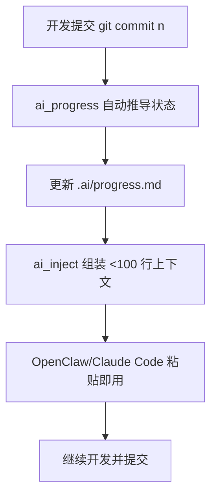

# 每次开新终端都要重讲一遍上下文？aiflow 这套 100 行内方案把这事治了

项目切到第三个终端窗口，脑子会瞬间断片。
上一窗口做到哪了？当前 task 是啥？下一个要干嘛？
然后又开始翻笔记、翻 commit、翻聊天记录。
两分钟过去了，prompt 还没写出来，真的很呆逼。

这就是 `aiflow` 盯着打的那个痛点：让任意终端窗口都能在几秒内拿到同一份、可直接喂给 AI 的最小上下文。

## 先把结论放前面

`aiflow` 是一组零服务、零守护进程、零配置的 shell 脚本，用 `.ai/progress.md` 作为单一状态源，把当前任务上下文自动拼出来并同步到所有终端窗口。

## 为什么这个项目值得继续看

README 里把问题和解法说得很直：

| 真实问题 | aiflow 的解法 | 放进日常开发意味着什么 |
|---|---|---|
| 切窗口就忘记做到哪 | `progress.md` 作为唯一真相源 | 不再靠记忆力和聊天记录兜底 |
| 每次都要重写上下文 | `ai_inject` 自动组装上下文（<100 行） | 提问更快，模型更聚焦 |
| progress 手工维护会漂移 | 从 git commit 自动推导任务状态 | 状态更新跟着开发动作走 |
| 多窗口上下文不一致 | 所有窗口都读同一份文件 | 协作和切换成本大幅下降 |

再说人话点：这玩意像给每个终端发了同一把钥匙，开门看到的是同一间“当前状态房间”，不会这边说 doing、那边还停在 todo。

## 真正有价值的 5 个能力点

### 1）把上下文压到模型愿意认真看的长度
能力是什么：`ai_inject` 输出自动控制在 100 行以内，核心块是 CURRENT、NEXT、GOAL、API、CONSTRAINT、ISSUES、INPUT。  
真实价值：不是把一堆历史塞爆模型，而是只保留“现在要做的事”。  
注意点：GOAL/API/CONSTRAINT/ISSUES 是可选块，缺了也能跑。

### 2）任务状态会自动推进，不靠人肉维护
能力是什么：`ai_progress` 读 git log，把 commit 里的任务编号或任务名映射到 `done/doing/todo`。  
真实价值：谁都知道“手工维护文档必崩”，自动推导才有长期可用性。  
注意点：依赖 commit 规范（例如 `[2] xxx`）才能稳定命中。

### 3）所有窗口天然同步
能力是什么：任何终端都读项目下同一个 `.ai/progress.md`。  
真实价值：多窗口并行开发时，不会出现“这个窗口还在昨天状态”的离谱场景。  
注意点：项目级目录结构要保持一致。

### 4）极低接入成本
能力是什么：三段脚本 + 一个 markdown 文件，无 daemon、无 server、无额外配置中心。  
真实价值：落地阻力很小，试错成本也低。  
注意点：支持平台是 macOS / Linux / Windows Git Bash。

### 5）适配主流 AI 使用方式
能力是什么：输出本质是纯文本，可贴到 Warp AI、Claude/ChatGPT、Cursor/Copilot 或任意 LLM。  
真实价值：不绑单一产品，换工具不换方法。  
注意点：不是 IDE 插件魔法，核心仍是“你把文本贴进去”。

## 上手门槛到底高不高

不高。README 给的门槛就是 shell 环境可用，能执行脚本，项目里能写 `.ai` 目录。没有数据库、没有服务编排、没有配置地狱。

官方安装命令（原样）：

```bash
curl -fsSL https://raw.githubusercontent.com/warp-context/rightStage/main/install.sh | bash
```

手动安装（原样）：

```bash
git clone https://github.com/warp-context/rightStage
cd aiflow && bash install.sh
```

## 真正怎么用：先官方路径，再看协作路径

先看 README 的 30 秒路径（原样命令）：

```bash
mkdir -p .ai && cat > .ai/progress.md << 'EOF'
[1] Login UI        done
[2] API integration  doing
[3] Error handling   todo
[4] Unit tests       todo
EOF
```

```bash
ai_inject .                          # print context
ai_inject -c .                       # print + copy to clipboard
ai_inject -c . "help me with retry"  # include your prompt too
```

```bash
git commit -m "[2] API integration complete"
# Next time you run ai_inject, [2] is automatically marked done
```

官方命令能力边界也很清楚：

```
Options:
  -c, --copy      Copy output to clipboard
  -n, --no-update Skip auto-sync from git
  -h, --help      Show help
```

---

下面是组合工作流示例（非 README 原生能力，属于实际协作用法）：

场景：OpenClaw + Claude Code 协作开发一个后端服务，团队要求每次开新终端都能秒进状态。

1) 安装/接入过程
- 在项目根目录按 README 建 `.ai/progress.md`；
- 运行 `ai_inject -c .` 把上下文复制到剪贴板；
- 把这段上下文粘到 Claude Code 首条消息里作为本轮上下文基座。

2) 实际使用过程
- 正常开发并提交，commit 带任务号；
- 下一次切到任何窗口，先跑 `ai_inject .`，拿到 CURRENT/NEXT；
- 再把新的具体问题附在 `ai_inject -c . "..."` 里，直接发给模型。

3) 产出结果 / 放进什么工作流
- 产出：更稳定的“当前任务态”提示词，不用反复手写背景；
- 工作流位置：适合放在“写代码前”和“切窗口后”的固定动作里，和 PR 前自检配套。

用 mermaid 画一下这条链路：



## 哪些地方确实真香

第一，它把“上下文管理”从主观记忆变成了可执行流程。  
第二，它的极简设计让落地难度很低，不需要额外服务治理。  
第三，多窗口同步这个点在真实开发里非常实用，尤其是并行任务多的时候。

## 更适合哪些人

- 经常开多个终端窗口、上下文切换频繁的开发者。
- 用 Claude/ChatGPT/Cursor/Warp AI 做日常协作编码的团队。
- 对 prompt 质量敏感、又不想每轮都手写背景的人。
- 希望把“任务状态”绑定到 git 提交节奏的工程团队。
- 追求轻量工具链，不想上来就引入服务端组件的个人或小团队。

## 使用前先知道这些边界

- 这是 shell 脚本方案，不是托管服务；能力边界就是“文本上下文编排 + 状态推进”。
- 自动推进依赖 commit 信息质量，commit 太随意会影响状态准确度。
- 平台支持是 README 明确列出的 macOS / Linux / Windows Git Bash，超出范围要自测。
- README 没承诺复杂权限系统和多角色审批流，所以别拿它当项目管理系统替代品。

## 收个尾

**如果团队老是在“重新解释当前上下文”上浪费时间，aiflow 这种极简同步方案，值得直接装上跑一周再评价。**

#GitHub热门项目 #AI工作流 #上下文工程 #PromptEngineering #终端效率 #开发效率 #ClaudeCode #OpenClaw #ShellScript #工程实践