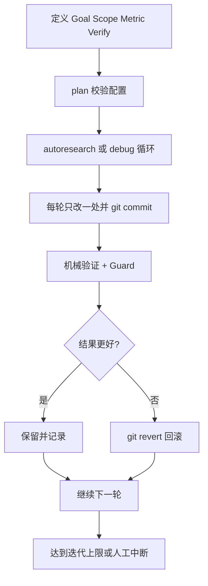

# 别再盯着 AI 一步步改代码了，这个项目想把 Claude Code / Codex 直接拧成“自动进化循环”

很多人现在用 AI 写代码，还是停在“问一句，改一下，再问一句”的阶段。

像在拎着一个很聪明但总得人盯着的实习生干活。
能干，但不够猛。
更烦的是，一旦项目复杂一点，来回试、来回回滚、来回验证，整个人很快就被拖进机械劳动里。

`autoresearch` 想干的事就比较野了，它不是想让 AI 帮你多写几行代码，而是想把 Claude Code、OpenCode、OpenAI Codex 这类工具，直接拧成一个会自己迭代、自己验证、自己回滚、自己继续试下去的改进引擎。

## 先把结论放这

这项目本质上是一套面向 Claude Code、OpenCode、Codex 的自动迭代工作流，核心思路是：**给定目标、指标、范围和验证方式，然后让 agent 自己一轮轮改、一轮轮测，一直跑到你喊停或者达到限定轮次。**

## 它解决的，不是“AI 会不会写”，而是“AI 能不能持续靠谱地优化”

README 一开头就把话挑明了，它基于 Karpathy 的 autoresearch 思路：

- constraint
- mechanical metric
- autonomous iteration
- compounding gains

翻成人话就是：

别再靠感觉让 AI 瞎折腾。
把目标卡死，把验证机械化，把范围收紧，然后让它一轮一轮试，能涨就留，变差就回滚。

这解决的几个真问题，特别现实。

### 第一类问题，AI 现在常常只是“单次回答强”，不是“持续改进强”

很多 AI 编码场景里，最难的不是出第一版，而是连续做 10 次、20 次、50 次小优化，还不把项目搞烂。

README 里这套 LOOP 就是冲着这个来的：

1. Review current state + git history + results log  
2. Pick the next change  
3. Make ONE focused change  
4. Git commit (before verification)  
5. Run mechanical verification  
6. If improved → keep. If worse → git revert. If crashed → fix or skip.  
7. Log the result  
8. Repeat.

这就不是普通“帮忙改代码”了，这是在搞自动实验流水线。

### 第二类问题，人最烦的其实是反复做机械试错

改一点，跑测试。  
再改一点，再跑测试。  
挂了，回滚。  
再换一个方向。  

这套动作本来就是机械劳动，特别适合交给 agent 干。

README 里明确要求 **One change per iteration**，而且失败就 **Automatic rollback**。这很关键，因为一旦一次改太多，炸了都不知道是哪一下炸的。单点实验虽然慢一点，但可解释、可回退，也更稳。

### 第三类问题，很多“AI 自动化”最后死在没有硬指标

README 反复强调 **Mechanical verification only**。

这点其实很硬核。

因为没有指标，AI 很容易开始一本正经地自嗨，输出一堆“looks good”“seems better”这种空气评价。说白了就是自我感动。

这个项目不吃那套，它要的是可测量结果，比如测试覆盖率、性能指标、错误数、lint 数、构建状态、审查输出，反正得是机器能判的。

## 真正狠的地方，是它把“自动改进”拆成了一整套工作流家族

这项目不是只有一个 `/autoresearch` 主循环，而是一整个命令矩阵。

先看 README 里这张表的大意：

| 命令 | 干什么 |
|---|---|
| `/autoresearch` | 无限或 N 轮自动迭代优化 |
| `/autoresearch:plan` | 把目标翻译成可执行配置 |
| `/autoresearch:security` | 自动化安全审计 |
| `/autoresearch:ship` | 统一的交付/发布流程 |
| `/autoresearch:debug` | 自动找 bug |
| `/autoresearch:fix` | 自动修错直到归零 |
| `/autoresearch:scenario` | 场景/边界情况生成 |
| `/autoresearch:predict` | 5 专家人格预判 |
| `/autoresearch:learn` | 自动化文档生成/更新 |
| `/autoresearch:reason` | 多代理辩论收敛主观问题 |
| `Guard: <command>` | 给优化套安全护栏 |

这意味着它不只是“让 AI 连续改代码”，而是在试图把开发里常见的几种高频流程都标准化成 agent loop。

## 核心逻辑其实很朴素，但非常工程化

README 里有 8 条关键规则，最值得盯的是这几条：

- **Read before write**
- **One change per iteration**
- **Mechanical verification only**
- **Automatic rollback**
- **Git is memory**
- **Simplicity wins**

这套哲学说到底就一句话：

**不要让 agent 靠主观感觉乱冲，要让它像个有纪律的实验员。**

尤其 `Git is memory` 这条很妙。

README 里要求每轮实验都用 `experiment:` 前缀提交，失败就 `git revert`，并且每轮迭代前必须读 `git log` + `git diff`。

这在实际里特别像给 agent 装了个实验室记录本，干过什么、炸过什么、差一点成功什么，都不会凭空蒸发。

## 上手这事，不算轻，但路径已经铺得挺顺

README 里分别给了 Claude Code、OpenCode、Codex 三套接入方式。

### Claude Code

推荐插件安装：

```
/plugin marketplace add uditgoenka/autoresearch
/plugin install autoresearch@autoresearch
```

更新：

```
/plugin update autoresearch
```

也支持手工复制：

```bash
git clone https://github.com/uditgoenka/autoresearch.git

# Copy skill + subcommands to your project
cp -r autoresearch/claude-plugin/skills/autoresearch .claude/skills/autoresearch
cp -r autoresearch/claude-plugin/commands/autoresearch .claude/commands/autoresearch
cp autoresearch/claude-plugin/commands/autoresearch.md .claude/commands/autoresearch.md
```

或者全局安装：

```bash
cp -r autoresearch/claude-plugin/skills/autoresearch ~/.claude/skills/autoresearch
cp -r autoresearch/claude-plugin/commands/autoresearch ~/.claude/commands/autoresearch
cp autoresearch/claude-plugin/commands/autoresearch.md ~/.claude/commands/autoresearch.md
```

以及引导式安装：

```bash
git clone https://github.com/uditgoenka/autoresearch.git
cd autoresearch
./scripts/install.sh --claude --global
```

### OpenCode

引导式安装：

```bash
git clone https://github.com/uditgoenka/autoresearch.git
cd autoresearch
./scripts/install.sh --opencode --global
```

手工复制：

```bash
git clone https://github.com/uditgoenka/autoresearch.git

# Copy to your project
cp -r autoresearch/.opencode/skills/autoresearch .opencode/skills/autoresearch
cp autoresearch/.opencode/commands/autoresearch*.md .opencode/commands/
cp autoresearch/.opencode/agents/docs-manager.md .opencode/agents/docs-manager.md
```

全局安装：

```bash
cp -r autoresearch/.opencode/skills/autoresearch ~/.config/opencode/skills/autoresearch
cp autoresearch/.opencode/commands/autoresearch*.md ~/.config/opencode/commands/
cp autoresearch/.opencode/agents/docs-manager.md ~/.config/opencode/agents/docs-manager.md
```

README 还特别提醒了，OpenCode 命令名用下划线，不是冒号，比如 `/autoresearch_debug`。

### Codex

引导式安装：

```bash
git clone https://github.com/uditgoenka/autoresearch.git
cd autoresearch
./scripts/install.sh --codex --global
```

手工复制：

```bash
git clone https://github.com/uditgoenka/autoresearch.git

# Copy to your project
cp -r autoresearch/.agents/skills/autoresearch .agents/skills/autoresearch
```

全局安装：

```bash
cp -r autoresearch/.agents/skills/autoresearch ~/.agents/skills/autoresearch
```

Codex 的调用方式也不是斜杠命令，而是 `$autoresearch` 提及语法，比如：

- `$autoresearch plan`
- `$autoresearch debug`
- `$autoresearch security`

## 真正开始跑的时候，它长这样

README 给了一个最核心的使用例子：

```
/autoresearch
Goal: Increase test coverage from 72% to 90%
Scope: src/**/*.test.ts, src/**/*.ts
Metric: coverage % (higher is better)
Verify: npm test -- --coverage | grep "All files"
```

这段配置里最重要的不是“让它去改”，而是四个前提先钉死：

- Goal
- Scope
- Metric
- Verify

这就像给 agent 划赛道、立记分牌、装刹车片。

没有这些，自动循环很容易跑成自动翻车。

## 组合工作流示例：拿 Claude Code / Codex 做“自动优化回路”到底怎么用

下面这段是**组合工作流示例**，不是 README 承诺的额外平台能力，而是基于 README 已给出的命令和机制，拼出来的一条真实开发工作流。

假设场景是这样的：

- 一个 TypeScript 项目测试覆盖率偏低
- 想让 Claude Code 或 Codex 连续补测试、跑验证、保留有效改动
- 又不想自己守在旁边一轮轮点头摇头

### 第一步，先把技能装进 Claude Code 或 Codex

如果是 Claude Code，最短路径就是：

```
/plugin marketplace add uditgoenka/autoresearch
/plugin install autoresearch@autoresearch
```

如果是 Codex，README 给的接入方式是把 skill 放到：

```bash
git clone https://github.com/uditgoenka/autoresearch.git

# Copy to your project
cp -r autoresearch/.agents/skills/autoresearch .agents/skills/autoresearch
```

### 第二步，先用 plan 把目标说人话变成机器能跑的配置

Claude Code：

```
/autoresearch:plan
Goal: Make the API respond faster
```

Codex：

```text
$autoresearch plan
Goal: Make the API respond faster
```

README 说这个 wizard 会走 5 步：

- capture goal
- define scope
- define metric
- define direction
- validate verify command (dry-run)

这一步很值钱，因为很多自动化失败，不是 loop 不行，而是前面的目标定义就已经烂了。

### 第三步，开始 bounded loop，先别一上来就无限跑

README 支持加 `Iterations: N`，所以更稳的用法其实是先让它跑一个有限轮数：

```
/autoresearch
Goal: Increase test coverage from 72% to 90%
Scope: src/**/*.test.ts, src/**/*.ts
Metric: coverage % (higher is better)
Verify: npm test -- --coverage | grep "All files"
Iterations: 10
```

如果是 Codex，对应思路就是：

```text
$autoresearch
Goal: Increase test coverage from 72% to 90%
Scope: src/**/*.test.ts, src/**/*.ts
Metric: coverage % (higher is better)
Verify: npm test -- --coverage | grep "All files"
Iterations: 10
```

### 第四步，给它加 Guard，防止为了优化一个指标把别的地方搞坏

README 的 Guard 机制是这样的：

```
/autoresearch
Goal: Reduce API response time to under 100ms
Verify: npm run bench:api | grep "p95"
Guard: npm test
```

这就很像给一个拼命冲 KPI 的员工加了底线约束。

指标涨了，但测试挂了？不算赢。

### 第五步，复杂问题别硬冲，拆成 debug → fix → ship

README 其实已经给好了链路：

- `/autoresearch:debug`
- `/autoresearch:fix`
- `/autoresearch:ship`

整个协作流可以理解成这样：



这才是它真正有意思的地方。

不是单点命令厉害，而是几条命令之间能拼出完整闭环。

## 它不止是写代码，还有安全、文档、场景、辩论这些分支

README 里比较夸张的一点，是它把 autoresearch 思路扩到了不少非纯编码场景。

### `/autoresearch:security`

做的是只读安全审计，基于 STRIDE、OWASP Top 10 和红队视角，要求每个问题都给出代码证据和攻击场景，还会输出结构化报告。

### `/autoresearch:learn`

做自动文档引擎，支持 init、update、check、summarize，还会自动生成 Mermaid 架构图、交叉引用和依赖说明。

### `/autoresearch:scenario`

做场景探索，把一个种子场景拆到 12 个维度去扩展，包含 happy path、错误、边界、滥用、并发、恢复、权限等。

### `/autoresearch:predict`

让 5 个专家人格先吵一轮，再给出预判。

### `/autoresearch:reason`

更离谱一点，它把主观问题也拉进了迭代系统，靠 blind judge panel 去做收敛。

这说明作者的野心不是“做个 skill”，而是想把 agent 工作流产品化成一套方法论。

## 哪些地方是真的香

第一，它把 agent 自动优化这件事讲清楚了，不靠玄学，靠指标、验证、回滚、日志这些硬机制。  
第二，它把 Claude Code、OpenCode、Codex 三个平台都接进来了，这一点很实用。  
第三，它不是只有一个 loop，而是把 plan、debug、fix、security、ship、learn、reason 这些流程都收成了一套体系。

## 哪些人会更适合用

- 已经在用 Claude Code、OpenCode 或 Codex 做工程任务的人
- 想让 AI 持续跑优化实验，而不是只做一次性回答的人
- 维护测试、性能、lint、构建、错误修复这类“有硬指标”的项目团队
- 想把安全审计、文档生成、发布检查也塞进 agent 工作流的人
- 喜欢用 git 做实验记录、能接受“约束优先”的工程团队

## 上手前，最好先知道这些边界

### 1. 这东西的前提，是你得有机械指标

README 说得很清楚，Mechanical verification only。

所以如果任务完全没有可衡量结果，这个主循环就没那么舒服了。虽然它提供了 `/autoresearch:reason` 去处理主观问题，但那已经是另一条路了。

### 2. Scope 不收紧，自动化就容易乱跑

README 很强调 Scope，哪些文件可改、哪些只读，必须先界定。这个不是装样子，是保命。

不然 agent 一旦无边界试错，项目很容易被改成一锅粥。

### 3. Git 习惯必须好

它高度依赖 git 作为记忆与回滚机制。

如果项目 git 状态本来就乱，或者团队完全不愿意接受“实验提交 + revert”这套节奏，那体验会打折。

### 4. 无限循环不是默认就该开

README 支持 forever，也支持 `Iterations: N`。

真要用，先 bounded run 更稳。别上来就让 agent 跑一夜，第二天醒来像家里放了个自动装修队，墙都给你砸了。

### 5. 不同平台命令格式不一样

这点 README 写得很细：

- Claude Code 用 `/autoresearch:debug`
- OpenCode 用 `/autoresearch_debug`
- Codex 用 `$autoresearch debug`

别装好了之后发现命令不认，又怀疑人生。

## 最后一句

**`autoresearch` 真正厉害的，不是让 AI 多会写一点代码，而是开始认真把“试验、验证、回滚、积累”这套工程节奏，交给 agent 自动跑起来。**

#GitHub #autoresearch #ClaudeCode #Codex #OpenCode #AIAgent #工程自动化 #开发效率 #Karpathy #AgentWorkflow