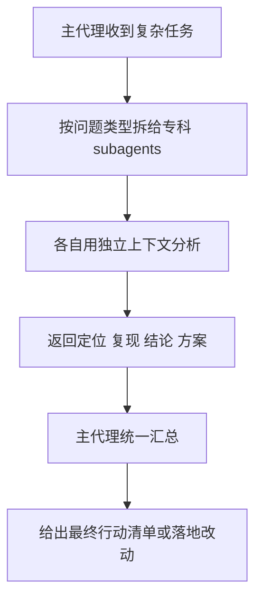

# 别再让一个 Codex 啥都干了，这个仓库直接塞了 136 个专科 AI 分身给你

很多人现在用 AI 编码，还是一种很原始的思路。

开一个 Codex。
然后把所有脏活累活，全往这一个家伙身上扔。
让它一边查 API，一边看 PR，一边找 bug，一边想架构，一边写文档。

这就很像让一个人同时当后端、前端、测试、安全、产品、运维，最后干着干着谁都不像，纯靠硬扛。

`awesome-codex-subagents` 这个仓库干的事就很直接：它不是再造一个大而全的 AI，而是给 Codex 准备了一大堆分工明确的“专科分身”，让不同子代理去处理不同类型的开发任务。

## 先说结论，这项目到底是什么

这是一个收集 Codex subagents 的仓库，目前整理了 **136+ 个子代理**、分成 **10 个大类**，每个子代理都用 Codex 原生的 `.toml` 格式定义好角色、模型、沙箱权限和指令，方便你按任务显式委派。

## 它到底解决了什么问题

README 其实说得很清楚，子代理的价值不在“多开几个模型玩花活”，而在于把不同任务从主对话里拆出去，让每个任务在自己的上下文里干净完成。

### 第一层问题，一个 AI 啥都干，最后上下文会糊成一锅粥

主线程一旦同时塞进：

- 代码路径追踪
- 浏览器复现
- 文档核对
- 安全检查
- 重构方案
- 业务分析

上下文就会越来越脏。AI 看起来还在答，但脑子已经开始串味了。

README 里对子代理的第一条核心解释就是 **Independent Context Windows**。每个 subagent 都在自己的隔离上下文里工作，不和别的任务互相污染。

这个点很关键。

说白了，就是别再让一个大脑同时处理十件不同风格的事。再聪明也容易精神分裂。

### 第二层问题，不同任务本来就该有不同“人设”和能力边界

看 PR，和修性能，和做安全审计，根本不是一种活。

README 里每个 subagent 都带：

- `description`
- `model`
- `model_reasoning_effort`
- `sandbox_mode`
- 专用 `instructions`

这意味着它不是简单换个名字，而是真的在把“什么时候该叫谁来”“这个角色能看什么、能改什么”“要用什么强度的模型”都预设好。

比如：

- reviewer / auditor 这种偏分析型的，走 `read-only`
- developer / engineer 这种要落代码的，走 `workspace-write`

这种边界感非常重要，不然子代理很容易从“专业分工”变成“到处乱改”。

### 第三层问题，很多人听过 multi-agent，但不会真正拆工

现在大家都爱说 multi-agent，好像只要多开几个 agent 就高级了。

但真问题是：**怎么拆，拆给谁，先后顺序是什么，最后怎么合并结果。**

这个仓库值钱的地方，就是它把这些“可复用分工角色”先给你备好了。

## 它不是几个 agent，而是一整套 AI 工种市场

README 开头说它有 **136+ 个 Codex subagents，10 个分类**。这个规模已经不是“几个示例”，而是一个相当完整的岗位库了。

先看这 10 类大概都在管什么：

| 分类 | 主要负责什么 |
|---|---|
| Core Development | 日常开发主力，比如前后端、全栈、API、微服务 |
| Language Specialists | 各语言 / 框架专家，比如 React、Go、Python、Rust、Java |
| Infrastructure | DevOps、云、数据库、K8s、SRE、Terraform |
| Quality & Security | 测试、安全、代码审查、调试、性能 |
| Data & AI | 数据工程、机器学习、LLM、Prompt、Postgres |
| Developer Experience | 构建、CLI、依赖、文档、MCP、重构、工具链 |
| Specialized Domains | 金融、区块链、IoT、支付、SEO、嵌入式 |
| Business & Product | 产品、项目、销售、内容、法务、用户研究 |
| Meta & Orchestration | 多代理协调、知识综合、任务分发、上下文管理 |
| Research & Analysis | 搜索、竞品、市场、研究分析 |

这就不是“给 Codex 加个 reviewer”那么简单了。

它其实是在说：

**如果 AI 真的会进入开发流程，那它也应该像团队一样有岗位分工。**

## 安装不复杂，但有几个关键规则得先搞清楚

README 里的安装逻辑很直白，Codex 的自定义 agent 放两个位置：

- `~/.codex/agents/`，全局可用
- `.codex/agents/`，项目内专用，且优先级更高

安装步骤是：

1. Clone 仓库
2. 把想要的 `.toml` agent 文件复制到对应目录
3. 重启或刷新 Codex session
4. 在 prompt 里显式委派

README 给的示例命令是：

```bash
mkdir -p ~/.codex/agents
cp categories/01-core-development/backend-developer.toml ~/.codex/agents/
```

```bash
mkdir -p .codex/agents
cp categories/04-quality-security/reviewer.toml .codex/agents/
```

另外 README 也提醒了，如果你在 Codex 里用 agent configuration，要放在 `.codex/config.toml` 的 `[agents]` 下。

这里最重要的一句其实不是命令，而是：

> Codex does not auto-spawn custom subagents.

这句话一定得记住。

别装完一堆 agent，然后等它自己觉醒。它不会。你得明确委派。

## `.toml` 这个结构，说明它是认真按 Codex 原生方式来的

README 给的 subagent 结构长这样：

```toml
name = "subagent-name"
description = "When this agent should be invoked"
model = "gpt-5.3-codex-spark"
model_reasoning_effort = "medium"
sandbox_mode = "read-only"

[instructions]
text = """
You are a [role description and expertise areas]...

[Agent-specific checklists, patterns, and guidelines]...
"""
```

这段其实信息量很大。

它意味着一个 subagent 至少要回答这几个问题：

- 你是谁
- 什么时候该叫你
- 你该用什么模型
- 你有没有写权限
- 你做事的标准流程是什么

这才像一个能落地的 agent 定义，不是只写一句“你是一个前端专家”就完事。

## 它最实用的一点，是把模型路由和权限边界也顺手定了

README 里专门讲了 **Smart Model Routing**。

### 模型怎么分

| 模型 | 适合什么活 |
|---|---|
| `gpt-5.4` | 深度推理任务，比如架构评审、安全审计、金融逻辑 |
| `gpt-5.3-codex-spark` | 快速扫描、信息汇总、轻量研究 |

这个设计挺务实的。

因为不是所有事都值得上最重的模型。该快扫的快扫，该深想的深想，不然成本和时延都会变得很难看。

### 权限怎么分

README 的沙箱哲学也很明确：

- 分析型 agent 用 `read-only`
- 开发型 agent 用 `workspace-write`

这种分法有点像公司里“审计的人别直接改账，开发的人别默认有 root”。

边界画清楚了，multi-agent 才不容易变成 multi-chaos。

## 真正厉害的不是数量，而是这几个类别特别像现实团队分工

里面有些 agent 名字一看就很实战。

比如日常开发类：

- `backend-developer`
- `frontend-developer`
- `fullstack-developer`
- `api-designer`
- `code-mapper`
- `ui-fixer`

质量与安全类：

- `reviewer`
- `code-reviewer`
- `debugger`
- `browser-debugger`
- `security-auditor`
- `performance-engineer`
- `qa-expert`

元编排类：

- `agent-installer`
- `agent-organizer`
- `context-manager`
- `multi-agent-coordinator`
- `knowledge-synthesizer`
- `workflow-orchestrator`

这类命名很实在，不是那种“宇宙最强智能体”味道，而是你大概一眼就知道该让谁上。

## 组合工作流示例：Codex 真正舒服的玩法，是主代理负责带队，不是亲自把所有活全干了

下面这段是**组合工作流示例**，不是 README 里额外承诺的自动功能，而是基于 README 已给的 agent 安装方式和 delegation 例子，整理出来的一条实际使用路径。

假设场景是这样的：

- 你在一个前后端混合项目里修一个设置页 bug
- 既要复现问题，又要搞清路径，又要最后落最小修复
- 不想让主对话被各种排查细节塞爆

### 第一步，先把几个常用 subagent 放进项目里

比如：

```bash
mkdir -p .codex/agents
cp categories/04-quality-security/browser-debugger.toml .codex/agents/
cp categories/01-core-development/code-mapper.toml .codex/agents/
cp categories/01-core-development/frontend-developer.toml .codex/agents/
```

如果你想全局可用，也可以：

```bash
mkdir -p ~/.codex/agents
cp categories/04-quality-security/reviewer.toml ~/.codex/agents/
```

### 第二步，在 prompt 里明确拆工

README 已经给了很像实战的例子，比如 bug investigation workflow：

```text
Investigate the broken settings flow. Have code_mapper trace the owning code paths, browser_debugger reproduce the bug in the browser, and frontend_developer propose the smallest fix after the failure is understood. Wait for the read-heavy agents first, then continue.
```

这一段最值钱的不是 agent 名字，而是拆工顺序：

1. `code_mapper` 先追代码归属和路径
2. `browser_debugger` 去浏览器里复现
3. `frontend_developer` 在问题被理解之后，再给最小修复

这其实就很像一个像样的技术团队，不是所有人同时扑上去乱抡。

### 第三步，PR 审查也别只让一个 reviewer 硬看

README 里还有个 PR review workflow：

```text
Review this branch with parallel subagents. Have reviewer look for correctness, security, and missing tests. Have docs_researcher verify the framework APIs this patch depends on. Wait for both and summarize the findings with file references.
```

这个拆法就很聪明：

- `reviewer` 看正确性、安全、漏测
- `docs_researcher` 去核框架 API 有没有被误用
- 最后主代理再汇总

这种场景下，多代理不是为了热闹，而是为了把“代码问题”和“文档真实性问题”拆开。

### 第四步，做探索和规划时，也能让子代理先打底

README 的 repo exploration and planning workflow：

```text
Use search_specialist to locate the code related to payment retries, knowledge_synthesizer to summarize the current design, and refactoring_specialist to propose a minimal refactor plan. Return a concrete action list.
```

整个流程可以理解成这样：



这才是这个仓库真正值得看的地方。

它不是列了 136 个名字，而是在给你一套“怎么像团队一样用 Codex”的思路。

## 哪些地方是真的香

第一，它把 subagent 这件事从“概念很好听”做成了能直接复制使用的 `.toml` 仓库。  
第二，它不只分角色，还顺手把模型路由和沙箱权限想清楚了，这点很工程。  
第三，示例工作流挺实战，能直接让人明白多代理不是玄学，而是清晰拆工。

## 哪些人会更适合用

- 已经在用 Codex，但主对话经常被复杂任务塞爆的人
- 想把 PR 审查、bug 排查、资料核对拆成并行流程的团队
- 需要团队统一 agent 角色定义和做事口径的人
- 对 multi-agent 真有落地需求，而不是只想体验概念的人
- 想把 Codex 从“单兵”变成“带队”的开发者

## 上手前最好知道这些边界

### 1. Codex 不会自动帮你调这些 subagent

README 写得非常明确，必须显式委派。别装完之后等它自动调度，那基本等于等空气。

### 2. 这仓库是精选集合，不是安全背书

License 和说明里都写了，维护者**不审计也不保证**每个 subagent 的安全性和正确性，都是按现状提供。

所以真要上生产流，先 review 一遍 agent 定义，别闭眼开。

### 3. 项目级 subagent 会覆盖全局同名 subagent

README 明确说了，命名冲突时 `.codex/agents/` 优先于 `~/.codex/agents/`。这个很好理解，但也很容易埋坑。

### 4. 数量很多，不等于该全装

136+ 看着很爽，但真全塞进去，反而容易把选择成本拉高。更合理的做法，是按团队常用工作流挑一批固定角色。

### 5. multi-agent 不是多开几个 AI 就完事，关键还是拆工质量

README 的示例已经说明了，真正有用的是“谁先看、谁后看、谁总结”。如果拆工本身乱，那多代理只会把混乱并行化。

## 最后一句

**这个仓库最值钱的，不是给 Codex 多加了 136 个名字，而是把“一个 AI 包打天下”这件蠢事，终于往真正的岗位分工推进了一步。**

#GitHub #Codex #Subagents #AI代理 #MultiAgent #开发工具 #工程效率 #OpenAI #工作流 #AgentEngineering