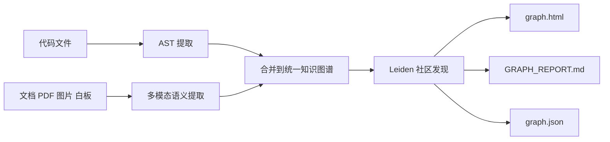
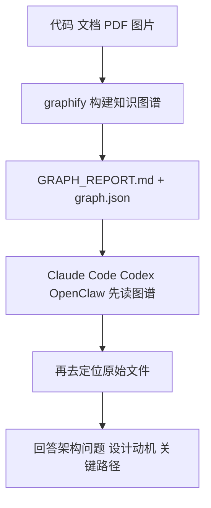

# AI 一上来就 grep 全仓太蠢了，这个项目想先给它画一张会思考的知识图谱

现在很多 AI 编码助手，最大的毛病不是不聪明。

是太勤奋了。
一上来就读文件，grep，glob，扫仓库，像个特别卖力但方向感很差的实习生。
最后 token 烧了一堆，项目还是没看明白，架构为什么这么设计更是两眼一抹黑。

`graphify` 想解决的，就是这个破事。

它不只是帮 AI 看代码，而是先把代码、文档、论文、截图、流程图这些东西，统一抽成一张知识图谱，再让助手按图导航，而不是按关键词到处乱刨。

## 先说结论，这玩意到底是什么

这是一个面向 Claude Code、Codex、OpenCode、OpenClaw、Factory Droid、Trae 等 AI 编码助手的 skill / CLI 工具，它会读取你的多种输入材料，构建知识图谱，并把代码结构、设计动机、概念关系和跨资料连接整理成一份可持久查询的图。

## 它到底在解决什么问题

README 里其实已经把问题说透了。

不是“AI 读不懂代码”，而是它每次都在用一种很原始、很贵、还很容易迷路的方式去读。

### 第一层问题，AI 太容易按关键字乱搜

传统做法基本就是：

- grep 一遍
- glob 一遍
- 开几个文件
- 看半天再猜结构

这种方式在小项目里还能凑合，一到中大型仓库，尤其混着代码、文档、截图、论文笔记这些材料时，就很容易变成“看起来很忙，实际上很散”。

README 里给 graphify 的定位很明确，就是把原本不明显的结构关系还给你，让助手先知道这堆东西之间怎么连，再去回答问题。

### 第二层问题，代码之外的信息经常被 AI 漏掉

很多架构决策，真正的“为什么”，其实不在代码本体里。

它可能藏在：

- docstring
- `# NOTE:` / `# WHY:` / `# HACK:` 这种注释
- Markdown 设计文档
- PDF 论文
- 白板图
- 截图
- 推文

而这些东西，普通代码搜索基本是拼不起来的。README 里专门强调了它是**完全多模态**，甚至连图片、流程图、白板照片和其他语言的图片都能接进同一张图里。

这个点很狠。

因为它想做的不是“代码索引器”，而是一个把项目知识重新编排给 AI 的理解层。

### 第三层问题，重复读原始材料太浪费 token

README 给了一个很抓眼球的数据：

> 每次查询的 token 消耗可降低 **71.5 倍**

注意，这不是说第一次运行就白嫖。README 也说得很清楚，第一次需要先提取、建图，会花 token；但后续查询直接读压缩后的图谱，再配合 SHA256 缓存，只处理变更文件，节省会越来越明显。

这点很像先修路再跑车。

第一天得先铺路，后面每一趟都省油。不然每次都重读原文件，跟天天拆了房子再重新装修差不多。

## 它最有意思的，不是“会画图”，而是图本身就是工作入口

graphify 的输出目录 README 也写得很直接：

```text
graphify-out/
├── graph.html       可交互图谱：可点节点、搜索、按社区过滤
├── GRAPH_REPORT.md  God nodes、意外连接、建议提问
├── graph.json       持久化图谱：数周后仍可查询，无需重新读原始文件
└── cache/           SHA256 缓存：重复运行时只处理变更过的文件
```

这里最值钱的，其实未必是 `graph.html`，而是 `GRAPH_REPORT.md` 和 `graph.json`。

因为它不是只想给人看图，而是想让 AI 助手以后都优先沿着图谱走。

README 里后面专门提到“让助手始终优先使用图谱（推荐）”，本质就是把图谱变成默认导航层。

## 它怎么工作的，思路其实挺硬核

README 里说得很清楚，graphify 分两轮。

### 第一轮，确定性的 AST 提取

这一轮完全不靠 LLM，直接对代码文件做结构分析，提取：

- 类
- 函数
- 导入
- 调用图
- docstring
- 解释性注释

也就是说，代码结构这部分尽量本地化、确定性处理，不靠模型瞎猜。

### 第二轮，Claude 子代理并行处理文档、论文和图片

这一轮才把文档、论文、截图、白板照片这些非结构化材料吃进去，抽取概念、关系和设计动机，然后再和代码图合并成一张 NetworkX 图。

最后再做：

- Leiden 社区发现
- 可交互 HTML 导出
- JSON 持久化
- 审计报告生成

这个流程可以理解成：



最值得夸的一点是，README 明确说 **聚类不依赖 embeddings**，而是基于图拓扑做的。Claude 抽出来的语义相似边本身就在图里，所以会直接影响社区划分。

这个思路很漂亮。

它不是先把一堆东西扔向量库，再寄希望于相似度“差不多能看出来”，而是把关系本身当主角。

## 更妙的是，它还会老老实实告诉你哪些是“看到的”，哪些是“猜的”

README 里每条关系都会标记为：

- `EXTRACTED`
- `INFERRED`
- `AMBIGUOUS`

而且 `INFERRED` 还会带 `confidence_score`。

这点特别重要。

因为 AI 最烦人的地方之一，就是特别会一本正经地猜。它猜不可怕，可怕的是猜了还装得像事实。

graphify 至少在机制上努力把这个问题摊开给你看：

- 这条边是源材料直接找到的
- 这条边是合理推断
- 这条边有歧义，需要复核

这就像把“证据”“推论”“存疑”三种标签贴在脑门上，至少不玩阴的。

## 安装这件事，不复杂，但平台细节得看清

README 给的安装主命令是：

```bash
pip install graphifyy && graphify install
```

这里有个小坑，README 也提醒了：

> PyPI 包当前暂时叫 `graphifyy`，因为 `graphify` 这个名字还在回收中。CLI 命令和 skill 命令仍然都是 `graphify`。

这玩意要是不看，很容易一上来就装错，然后开始怀疑人生。

### 平台支持

README 给的平台安装命令如下：

| 平台 | 安装命令 |
|------|----------|
| Claude Code | `graphify install` |
| Codex | `graphify install --platform codex` |
| OpenCode | `graphify install --platform opencode` |
| OpenClaw | `graphify install --platform claw` |
| Factory Droid | `graphify install --platform droid` |
| Trae | `graphify install --platform trae` |
| Trae CN | `graphify install --platform trae-cn` |

另外 README 还点了几个平台边界：

- Codex 需要在 `~/.codex/config.toml` 的 `[features]` 下打开 `multi_agent = true`
- OpenClaw 目前并行 agent 支持还比较早期，所以使用顺序提取
- Trae 不支持 PreToolUse hook，所以 AGENTS.md 是它的常驻机制

这些都是真坑，不是装饰说明。

## 真正跑起来之后，它的用法比想象中丰富

最基础的当然是：

```text
/graphify
/graphify .
/graphify ./raw
```

README 里还给了很多命令：

```text
/graphify                          # 对当前目录运行
/graphify ./raw                    # 对指定目录运行
/graphify ./raw --mode deep        # 更激进地抽取 INFERRED 边
/graphify ./raw --update           # 只重新提取变更文件，并合并到已有图谱
/graphify ./raw --cluster-only     # 只重新聚类已有图谱，不重新提取
/graphify ./raw --no-viz           # 跳过 HTML，只生成 report + JSON
/graphify ./raw --obsidian         # 额外生成 Obsidian vault（可选）

/graphify add https://arxiv.org/abs/1706.03762        # 拉取论文、保存并更新图谱
/graphify add https://x.com/karpathy/status/...       # 拉取推文
/graphify add https://... --author "Name"             # 标记原作者
/graphify add https://... --contributor "Name"        # 标记是谁把它加入语料库的

/graphify query "what connects attention to the optimizer?"
/graphify query "what connects attention to the optimizer?" --dfs   # 追踪一条具体路径
/graphify query "what connects attention to the optimizer?" --budget 1500  # 把预算限制在 N tokens
/graphify path "DigestAuth" "Response"
/graphify explain "SwinTransformer"
```

这就能看出来，它不是“建完图就结束”，而是把图谱当成长期可查询对象来设计的。

## 组合工作流示例：和 Claude Code / Codex / OpenClaw 配起来，才是它真正发力的时候

下面这段是**组合工作流示例**，不是 README 对平台能力的额外承诺，而是基于 README 已给出的安装、常驻规则和查询命令，拼出来的一条实际使用路径。

假设场景是这样的：

- 项目里不只有代码，还有设计文档、论文 PDF、架构截图
- 团队用 Claude Code、Codex 或 OpenClaw 在仓库里做持续问答
- 希望助手别每次都从原始文件乱搜起步

### 第一步，先装 graphify

如果是通用安装：

```bash
pip install graphifyy && graphify install
```

如果只针对 Codex 或 OpenClaw：

```bash
graphify install --platform codex
graphify install --platform claw
```

### 第二步，先把项目图谱跑出来

```text
/graphify .
```

或者对指定目录：

```text
/graphify ./raw
```

如果后面只是增量更新：

```text
/graphify ./raw --update
```

### 第三步，让助手以后默认先看图谱

README 推荐在项目里执行一次平台对应安装：

| 平台 | 命令 |
|------|------|
| Claude Code | `graphify claude install` |
| Codex | `graphify codex install` |
| OpenCode | `graphify opencode install` |
| OpenClaw | `graphify claw install` |
| Factory Droid | `graphify droid install` |
| Trae | `graphify trae install` |
| Trae CN | `graphify trae-cn install` |

Claude Code 这边会写 `CLAUDE.md` 规则，并装 PreToolUse hook；Codex、OpenClaw 等则把规则写进 `AGENTS.md`。

这一步特别关键，因为它不是“我知道你有图”，而是“你以后先按图再搜”。

### 第四步，复杂问题别再直接问原始仓库，先走图谱查询

比如 README 里的这些：

```text
/graphify query "what connects attention to the optimizer?"
/graphify path "DigestAuth" "Response"
/graphify explain "SwinTransformer"
```

这时候 AI 的工作方式就变了：



这和传统那种“先 grep 再脑补”相比，差别其实很大。

## 它给你的，不只是图，而是一堆能直接拿来问问题的结构化结果

README 里列了不少输出亮点，最值得关注的是这些。

### God nodes

度最高的概念节点，也就是整个系统最容易汇聚到的地方。

这个东西很适合快速看“哪里是系统重心，哪里最容易变成神节点烂摊子”。

### 意外连接

README 说代码-论文之间的边会比代码-代码边权重更高，而且每条都有一段人话解释。

这就很有意思，因为很多真正值钱的 insight，恰恰来自“这段实现原来和那篇论文的某个想法连上了”。

### 建议提问

图谱特别擅长回答哪几类问题，它会直接给你 4 到 5 个方向。

这相当于它不只给地图，还告诉你“从这张图最容易挖出什么”。

### “为什么” 节点

这个点我挺喜欢。

README 说会把 docstring、注释里的 `NOTE / IMPORTANT / HACK / WHY`，以及文档里的设计动机，抽成 `rationale_for` 节点。

也就是说，graphify 不只是帮你回答“这里做了什么”，还在努力回答“为什么当初要这么干”。

## 哪些地方是真的香

第一，它不是只读代码，而是把代码、文档、论文、图片统一拉进一张图里，这个视角挺猛。  
第二，它对“猜出来的关系”和“提取出来的关系”分得很清楚，这点比很多 AI 工具老实。  
第三，它想得很完整，不只是一次性建图，还包括缓存、增量更新、watch、git hooks、wiki、Neo4j、MCP 这些后续能力。

## 哪些人会更适合用

- 仓库里除了代码，还有大量文档、截图、论文资料的人
- 经常问 Claude Code / Codex / OpenClaw 架构问题的人
- 想让 AI 从“关键词搜索员”进化成“结构导航员”的团队
- 做 AI coding、代码审查、知识整理、技术研究混合流的人
- 想把知识沉淀成可持久图谱，而不是每次重读原始材料的人

## 上手前最好先知道这些边界

### 1. 文档、论文和图片会发给你当前平台背后的模型 API

README 的隐私部分写得很清楚：

- 代码文件通过 tree-sitter AST 在本地处理
- 文档、论文、图片的语义提取，会发给你所用平台背后的模型 API
- 项目本身没有遥测、使用跟踪或分析

所以如果资料特别敏感，这一层得自己掂量。

### 2. OpenClaw 的并行 agent 目前还比较早期

README 明确说了，OpenClaw 当前使用顺序提取。也就是说，同样的 graphify，在不同平台上执行体验和速度可能不一样。

### 3. Trae 不支持 PreToolUse hook

所以它走 AGENTS.md 常驻机制。这个不是优劣问题，是平台机制不同。

### 4. 第一次运行要先付建图成本

README 也没藏着掖着，第一次会花 token，因为得先提取和建图。后面查询才会越来越省。

### 5. `--mode deep` 会更激进地产生 INFERRED 边

这意味着图会更“聪明”，但也可能更需要你留心置信度和歧义标记。别把推断边全当铁证。

## 最后一句

**`graphify` 真正值钱的地方，不是又给 AI 多加了一层花哨可视化，而是终于开始认真解决“助手在动手搜文件之前，能不能先理解结构”这个老问题。**

#GitHub #graphify #AI编程 #ClaudeCode #Codex #OpenClaw #知识图谱 #多模态 #开发工具 #代码理解