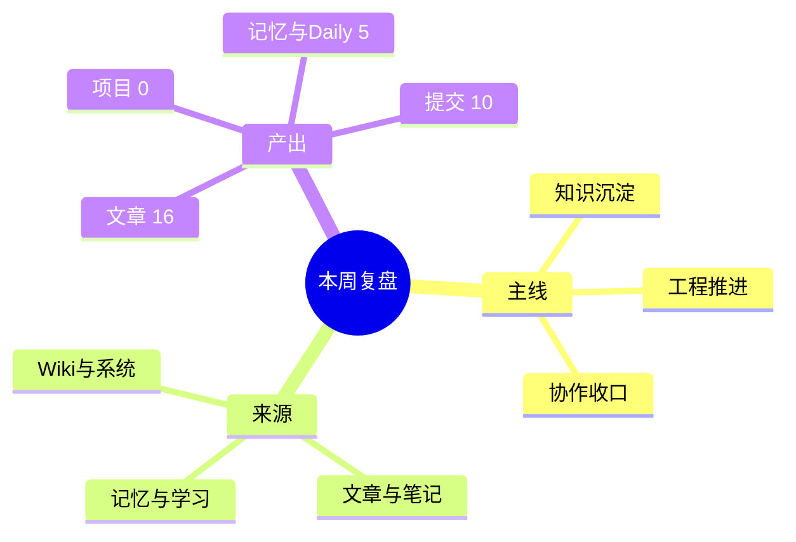

# 2026-04-18 周复盘：这周我把企微、Hermes、Obsidian 串起来了：从治理到协作，从知识到自动化

---

## 一、本周一句话总结

这周的主线很清楚：继续把 OpenClaw + Obsidian 的知识闭环工程化，同时把企微团队空间推进到可治理、可扩展、可复制部署，同时补齐 OpenClaw / Hermes / Obsidian 的协作口径。

## 二、本周主线

- 这周的主线很清楚：继续把 OpenClaw + Obsidian 的知识闭环工程化，同时把企微团队空间推进到可治理、可扩展、可复制部署，同时补齐 OpenClaw / Hermes / Obsidian 的协作口径。




## 本周检索与整理来源（规则说明）

本周复盘的内容从以下来源检索并整理：

- **01-Articles/**：文章、手册、演讲稿、PPT 等正式输出（16 项）
- **02-Notes/**：笔记、草稿、临时记录（1 项）
- **04-Memory/**：记忆、决策、经验、项目状态（5 项）
- **71-Wiki/**：结构化知识、概念、洞察（1392 项）
- **70-RAW/**：原始素材、剪藏、音频、报告（39 项）

整理原则：优先从记忆、学习、笔记、文章、知识体系中提取可复用内容；保留证据链，不随意覆盖；优先增量追加，避免破坏性整理。

## 三、本周任务归类

| 类别 | 本周动作 |
|---|---|
| 方案与知识沉淀 | 文章/手册类产出 16 项 |
| 工程与脚本推进 | 项目/脚本相关产出 0 项，git 提交 10 条 |
| 记忆与复盘维护 | 记忆/Daily/笔记/学习/Wiki 相关变更 1398 项 |

### A. 方案与知识沉淀
- 持续输出文章、手册、演讲稿、PPT 或复盘类文档
- 把阶段性结论沉淀成可复用内容资产
### B. 工程与脚本推进
- 推进脚本、部署器、自动化任务或工作流实现
- 用 git 提交把临时动作收敛成可复用工程资产
### C. 记忆、笔记与知识体系维护
- 持续补齐记忆、规则、流程和边界说明
- 从 04-Memory/（记忆）、.learnings/（学习）、02-Notes/（笔记）、71-Wiki/（知识）中检索并整理本周内容
- 让“真实生效口径”逐步清晰，减少配置幻觉和重复试错

## 四、本周主要工作任务与主题

### 1. 企微团队空间：治理、权限、可复制部署

- **主题：** 把企微团队空间做成可治理、可扩展、可复制部署的 AI 工作台

- **具体任务：**

  - 团队空间目录分层设计（共享/私有/记忆/报告/技能/脚本）

  - 用户空间初始化脚本化

  - 管理员/普通用户权限模型

  - cron 元数据管理与链路联动

  - wecom-v61-deployer 部署器连续迭代（v6.1~v6.7）

  - 部署验收清单与失败提示

  - 演讲稿、公众号版、PPT 版多版本输出

- **来源：** 01-Articles/、02-Notes/、03-Projects/、90-System/、git 提交

### 2. OpenClaw / Hermes / Obsidian 协作：配置、模型、入口

- **主题：** 补齐 OpenClaw / Hermes / Obsidian 的协作口径

- **具体任务：**

  - Hermes 配置文件修正（model.default / fallback / smart_model_routing / delegation）

  - OpenClaw 主入口与 Hermes 本地执行层分工澄清

  - 共享工作区与桥接方案梳理

  - Hermes CLI 验证与调试

- **来源：** 01-Articles/、02-Notes/、04-Memory/、git 提交

### 3. 知识库与周复盘：自动生成、格式规范、来源整理

- **主题：** 周复盘自动生成，从多来源检索整理

- **具体任务：**

  - weekly_review_generate.py 自动生成器实现

  - 加入 mermaid、表格、代码块格式要求

  - 加入来源整理规则（从记忆、learning、01-Articles、02-Notes、本周任务、日志、wiki沉淀中检索）

  - 一键生成脚本 `run_weekly_review.sh`

  - launchd 定时任务配置（尝试解决 macOS TCC/权限问题）

- **来源：** 04-Memory/、90-System/、80-Tools/、05-Daily/、git 提交


## 五、关键产出

- [Why you stop caring mid-review 中文译读](/articles/2026-04-17-Why-you-stop-caring-mid-review-%E4%B8%AD%E6%96%87%E8%AF%91%E8%AF%BB-268fdbe7/)
- [未命名](/articles/2026-04-18-01-Articles-01-Articles...-03-Projects-03-Projects...-04-M-b7ed8ee4/)
- [每次切个终端就忘了干到哪，这个小工具想把 AI 上下文同步这件事狠狠干明白](/articles/2026-04-18-aiflow-README%E8%A7%A3%E8%AF%BB-%E5%85%AC%E4%BC%97%E5%8F%B7%E5%8F%B7%E7%A8%BF-52a02668/)
- [每次开新终端都要重讲一遍上下文？aiflow 这套 100 行内方案把这事治了](/articles/2026-04-18-aiflow-rightstage-README%E8%A7%A3%E8%AF%BB-%E5%85%AC%E4%BC%97%E5%8F%B7%E7%A8%BF-v1-6ac56d91/)
- [别再盯着 AI 一步步改代码了，这个项目想把 Claude Code / Codex 直接拧成‘自动进化循环’](/articles/2026-04-18-autoresearch-README%E8%A7%A3%E8%AF%BB-%E5%85%AC%E4%BC%97%E5%8F%B7%E5%8F%B7%E7%A8%BF-c526baaf/)
- [别再让一个 Codex 啥都干了，这个仓库直接塞了 136 个专科 AI 分身给你](/articles/2026-04-18-awesome-codex-subagents-README%E8%A7%A3%E8%AF%BB-%E5%85%AC%E4%BC%97%E5%8F%B7%E5%8F%B7%E7%A8%BF-de81d3e9/)
- 2026-04-18-code-review-graph-README解读-公众号号稿-v4
- 2026-04-18-code-review-graph-README解读-公众号稿-v2
- 2026-04-18-code-review-graph-README解读-公众号稿-v3
- [这玩意把 AI 代码审查从‘全仓乱扫’拉回了‘精准点名’：code-review-graph 读后实测感](/articles/2026-04-18-code-review-graph-README%E8%A7%A3%E8%AF%BB-%E5%85%AC%E4%BC%97%E5%8F%B7%E7%A8%BF-8969bf29/)
- [AI 一上来就 grep 全仓太蠢了，这个项目想先给它画一张会思考的知识图谱](/articles/2026-04-18-graphify-README%E8%A7%A3%E8%AF%BB-%E5%85%AC%E4%BC%97%E5%8F%B7%E5%8F%B7%E7%A8%BF-7c2cbfa1/)
- 2026-04-18-hermes-agent-vs-openclaw-5轮辩论纪要
- [这个 Skill 工具有点狠，连你写的 Skill 水不水都能给你打分](/articles/2026-04-18-skill-craft-github-repo-wechat-article-f6741f83/)
- [每次手抄公众号文章都想掀桌？werss-cli 这套 Rust 工具把抓取到落盘一次打通](/articles/2026-04-18-werss-cli-%E6%8A%93%E5%8F%96%E5%85%AC%E4%BC%97%E5%8F%B7%E6%96%87%E7%AB%A0-%E5%B7%A5%E7%A8%8B%E5%8C%96%E5%AE%9E%E8%B7%B5-v1-29f48573/)
- [即时通讯群里让 OpenClaw 和 Hermes 互相对话的配置手册](/articles/2026-04-18-%E5%8D%B3%E6%97%B6%E9%80%9A%E8%AE%AF%E7%BE%A4%E9%87%8C%E8%AE%A9-OpenClaw-%E5%92%8C-Hermes-%E4%BA%92%E7%9B%B8%E5%AF%B9%E8%AF%9D%E7%9A%84%E9%85%8D%E7%BD%AE%E6%89%8B%E5%86%8C-cf8cacb0/)

### 本周关键提交

```text
2026-04-18 | 58d5373 | docs: add 5-round Hermes vs OpenClaw debate summary
2026-04-18 | 3e2a472 | docs: soften telegram wording for article
2026-04-18 | 2384b99 | docs: add telegram openclaw hermes group setup guide
2026-04-18 | ed4c992 | standardize dialog example heading
2026-04-18 | 225696e | refine dialog example layout for install flow
2026-04-18 | 920d072 | add dialog-style install example requirement
2026-04-18 | 2af49e8 | refine github hot project writer skill prompt
2026-04-18 | 1400283 | optimize wechat writer skill article structure
2026-04-18 | b924ed9 | add skill-craft wechat article
2026-04-16 | 243163a | chore: record workspace changes
```

## 六、经验与结论

### 1. 先把稳定边界写死，再持续扩功能
边界一旦清楚，后面的新增能力才不容易越做越乱。
### 2. 自动化默认非破坏性
先保证可复核、可追踪、可回滚，再逐步开放更激进的自动整理。
### 3. 当前真实生效路径，优先级高于理想设计图
排障和扩展时，先区分“目标方案”和“当前真的在跑的链路”。

## 七、不足与待补点

### 1. 版本和表达材料可能继续分叉
同主题如果同时维护文章版、手册版、演讲版、PPT 版，后面容易出现重复维护。
### 2. daily 记录如果偏薄，周复盘就仍然会依赖反推
这会增加整理成本，也会丢掉一些过程信息。
### 3. 某些协作链路可能仍未完全稳定
方案和骨架有了，不代表默认使用路径已经完全闭环。

## 八、下周建议重点

### 建议重点 1：收敛主线文档
把同主题的多版本材料收敛成一个主线总纲，其它版本尽量围绕它派生。
### 建议重点 2：继续把自动化做成可验收的稳定链路
优先补验收清单、失败提示、输入输出约束和日志定位。
### 建议重点 3：补 daily 机制
把每日推进、结论、问题、明日动作写稳，后面的周报会轻很多。

## 九、给自己的复盘结论

这周不是单点推进，而是在把零散动作继续收口成一个更稳定、可复用、可长期积累的工作系统。


## 十、本周有感而发（黑色幽默版）

- **企微治理这块儿**：

  以前以为做个机器人进群聊就能当 AI 助手了，这周才发现——

  没有空间隔离、没有权限边界、没有分层记忆，机器人就是一个群聊裸奔的「话痨工具人」。

- **Hermes 这块儿**：

  配置 Hermes 配置了半天，结果发现：

  最稳定的配置不是配得有多全，而是「当前真正在跑的那个路径」；

  再花哨的 fallback/路由/委派，如果当前真在跑的链路挂了，那就是玄学。

- **周复盘这块儿**：

  写周复盘生成器写了一周，写了改、改了再改——

  最后发现：最能打的周复盘，不是格式最全的那个，而是「直接把这周干了啥说清楚」的那个。

- **Overall**：

  这周最大的感受是：

  所谓的「AI 工作流」，不是给 AI 写几百行提示词，而是「给 AI 搭个稳定的台子」；

  台子搭稳了，剩下的就是让它别瞎折腾就行。

## 附：本周产出计数

| 指标 | 数值 |
|---|---:|
| 文章产出 | 16 |
| 笔记/草稿 | 1 |
| 学习/经验 | 0 |
| 记忆更新 | 5 |
| Wiki 更新 | 1392 |
| 原始素材 | 39 |
| 系统文档 | 0 |
| 项目/脚本产出 | 0 |
| Daily记录 | 0 |
| git 提交数 | 10 |

---

#AI助手 #OpenClaw #Hermes #Obsidian #企微 #AI工作台 #知识管理 #自动化 #工程实践
