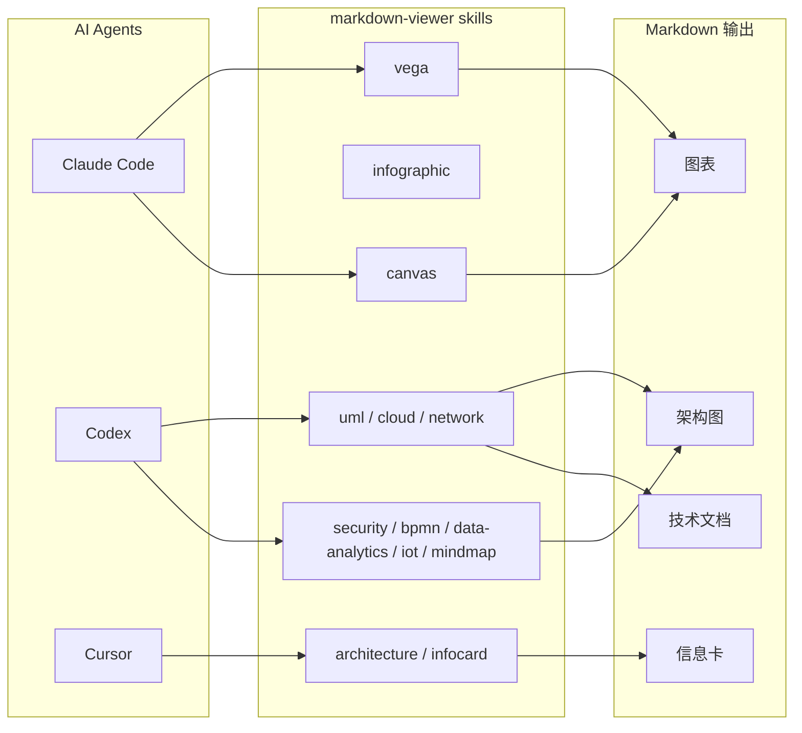

# AI 画图最烦的不是不会画，而是每种图都要换一套语法

现在很多人让 AI 帮忙写代码、写文档、搭架构图。

结果最容易把人搞烦的，往往不是模型笨。

而是你刚让它画完流程图，下一秒想补个云架构、再来张数据图、再塞一张信息卡，整套语法、渲染引擎、代码块围栏全变了。

一个图表工作流，硬是被拆成十几把不同的螺丝刀。真挺操蛋。

这项目干的事很直接，它不是又做了一个单一画图工具，而是给 AI coding agent 整了一整套 Markdown 里的可视化 skills，把图表、架构图、UML、BPMN、信息卡、数据图这些能力统一成一层可调用 skill。

## 这套东西为什么值得看

它最值钱的，不是“支持很多图”，而是把 **AI 生成可视化内容这件事，按 skill 方式系统化了**。

项目说明里明确写了，一共 14 个 skill，覆盖 5 类渲染引擎，从软件建模到企业架构、数据分析，再到内容卡片都包含进来了。这放到真实工作里，意味着你不用每来一种图，就重新教 agent 一遍规矩。

它还把 skill 分成了几类：独立 skill、HTML/CSS 嵌入式 skill、基于 PlantUML 的 skill。这个分类不是为了好看，而是直接对应实际生成方式。说白了，就是先告诉你这把钥匙开哪扇门，别拿螺丝刀去捅门锁。

另外，安装路径也给得比较实在，`npx skills add markdown-viewer/skills` 这一条是推荐路径，还明确说适用于多个 AI coding agent，比如 Claude Code、Codex、Cursor。这意味着它不是绑死在单一工具上的玩具。

## 真正有料的地方，在于它把“图”这件事拆成了三层能力

| 层级 | 代表 skill | 解决什么问题 | 放到真实工作里意味着什么 |
|---|---|---|---|
| 独立渲染 | `vega`、`infographic`、`canvas` | 处理数据图、信息图、自由节点图 | 适合指标图、路线图、脑图、知识图谱 |
| HTML/CSS 嵌入 | `architecture`、`infocard` | 直接生成嵌入 Markdown 的版式化内容 | 适合系统分层图、知识卡片、汇报型内容 |
| PlantUML 体系 | `uml`、`cloud`、`network`、`security`、`archimate`、`bpmn`、`data-analytics`、`iot`、`mindmap` | 用同一 diagram engine 去承载多领域图形 | 适合技术团队把架构、流程、网络、安全这些东西统一进一套文本图谱体系 |

### 第一层，数据图和信息图终于不是一个路子硬打天下

项目里把 `vega`、`infographic`、`canvas` 这几个 skill 单独拎出来。

- `vega` 负责数据驱动图表，支持 Vega-Lite 和 Vega
- `infographic` 用 YAML 语法，带 70 多个预设计模板
- `canvas` 用 JSON Canvas 格式做空间式节点图

这在真实场景里很好理解：

- 做柱状图、折线图、热力图，走 `vega`
- 做 KPI 卡片、时间线、路线图、SWOT，走 `infographic`
- 做脑图、知识图谱、规划板，走 `canvas`

也就是说，它没逼你拿一把锤子砸所有钉子。这个很重要，不然 agent 画图经常像拿菜刀修手表，能不能成全靠运气。

### 第二层，内容卡和架构图不再只能靠截图糊弄

`architecture` 和 `infocard` 这两个 skill 走的是 HTML/CSS 直接嵌入 Markdown 的路子。

项目说明里写得很清楚：

- `architecture` 提供 13 种 layout × 12 种 style
- `infocard` 提供 13 种 layout × 14 种 style

这在真实工作里意味着什么？

意味着很多过去靠 PPT、截图、Figma 临时拼的内容，现在可以直接让 agent 在 Markdown 里产出更像成品的版式。尤其是系统分层、知识摘要、数据亮点、事件公告这种内容，后面发文档、写内部方案、做知识卡片会顺很多。

### 第三层，PlantUML 这条线被它扩得很完整

最重的一块其实是 PlantUML 体系。

项目里这一层包括：

- `uml`
- `cloud`
- `network`
- `security`
- `archimate`
- `bpmn`
- `data-analytics`
- `iot`
- `mindmap`

而且它不是随便列个名字就完了，项目说明把每个 skill 对应的最佳场景都给出来了。

比如：

- 软件建模走 `uml`
- AWS / Azure / GCP / Kubernetes 架构走 `cloud`
- LAN/WAN、企业网络走 `network`
- 零信任、IAM、防火墙、合规走 `security`
- 企业分层建模走 `archimate`
- 工作流自动化走 `bpmn`
- ETL / 数仓 / ML 工作流走 `data-analytics`
- 传感器、边缘计算、数字孪生走 `iot`
- 分层脑图走 `mindmap`

这就不是“会画图”了，而是把不同领域的图谱语义直接做成专门 skill。对团队来说，这相当于给 agent 发了一整套专业制图工种，而不是只给它一张白纸。

## 装起来难不难

不算复杂，关键是选对接入方式。

项目文档里推荐的快速安装方式是：

```bash
npx skills add markdown-viewer/skills
```

它明确说这个方法适用于多个 AI coding agent，包括 Claude Code、Codex、Cursor 等。

手动安装这边也给了几个口子：

**For Claude Code (Manual)**
```bash
cp -r skills/<skill-name> ~/.claude/skills/
```

示例对话：

```text
你:
给 Claude Code 装一套专门画图和做可视化的 skills。

AI:
先走推荐方式，最省事：

npx skills add markdown-viewer/skills

你:
如果只想手动塞某个 skill 呢？

AI:
那就按它给的路径放到 Claude Code 的 skills 目录里：

cp -r skills/<skill-name> ~/.claude/skills/

你:
这套能给 Codex 也用？

AI:
可以，项目说明写了推荐安装方式适用于多个 AI coding agent。
重点不是一个客户端专用，而是把整套可视化能力做成可复用 skill。
```

另外还有两条安装/接入说明：

- 对于 claude.ai，可以把 skill 放进 project knowledge，或者把 `SKILL.md` 内容直接贴进对话
- 对于 GitHub Copilot / VS Code，把 skill 放到 `.github/skills/` 目录里会被自动发现

这几条别混。不同工具找 skill 的方式不一样，路径放错就跟钥匙插错门一样，你以为锁坏了，其实是自己门都找错了。

## 真正怎么用，得按工作流来讲

先说项目原生能力。

它给你的不是一个 UI 工具，而是一套 skill 集。agent 收到“帮我画图”“帮我做卡片”“帮我生成可视化说明”这类请求时，可以先识别需求，再去读对应的 `SKILL.md`，然后按各自要求的 code fence 或 HTML 方式输出。

项目说明里连使用建议都写了：

1. 先识别图类型
2. 读对应 skill 的 `SKILL.md`
3. 按语法规则走，避免渲染失败
4. 使用每个 skill 指定的 code fence

### 接进工具链之后，大概是这么跑的



### 组合工作流示例：接到 OpenClaw / Codex / Obsidian 这条线里

这一段不是项目原生示例，是更贴近实际协作的用法。

如果现在已经在用 OpenClaw 做入口编排、Codex 做执行、Obsidian 做知识沉淀，那这套 skill 很适合接在“技术文档可视化”这一步。

比如一个真实流程可以是：

1. OpenClaw 接住“把系统方案整理成一页图文说明”这个任务
2. Codex 调用对应 skill，决定该走 `uml`、`architecture`、`vega` 还是 `infocard`
3. 生成 Markdown 中可直接渲染的图或卡片
4. 最后把成品落回 Obsidian 或项目文档库

实际使用过程可以长这样：

```text
任务：
把一个系统方案整理成可读文档，要求同时有架构图、流程图和一张数据卡片。

组合工作流示例：
1. 分层架构图走 `architecture`
2. 时序或流程部分走 `uml` / `bpmn`
3. 数据趋势或指标走 `vega`
4. 最后再补一张 `infocard` 做摘要卡
5. 成果统一输出到 Markdown，回写到 Obsidian 或项目仓库
```

这套组合特别适合放进这些工作流：

- 技术方案文档可视化
- 系统架构评审材料
- 数据流程与 ETL 说明文档
- 企业网络、安全、云架构的知识沉淀
- AI 直接产出“能看”的 Markdown 图文文档

## 真香的地方，说白了就三句

第一，它不是只收一种图，而是把一整套图谱能力按场景拆开了。

第二，它把 code fence、输出格式、推荐场景讲清楚了，agent 不容易瞎打。

第三，它最有价值的不是某一个 skill 多猛，而是你终于能把“Markdown 里做图”这件事当成一条正式工作流来配。

## 哪些人会更适合用

- 经常要写技术方案、系统文档、架构评审材料的人
- 在用 Claude Code、Codex、Cursor 这类 AI coding agent 的人
- 想把图表、流程图、卡片统一进 Markdown 文档的人
- 做云架构、网络、安全、数据工程、企业架构建模的人
- 在 Obsidian 或文档仓库里长期沉淀可视化内容的人

## 真要动手前，最好先知道这些边界

第一，这项目是 skill 集，不是一个独立图形编辑器。前提还是你得有兼容 Agent Skills 的 agent 环境。

第二，不同 skill 的输出格式并不一样。

项目说明里已经写明：

- `vega` / `vega-lite` 是对应的数据图围栏
- 很多领域图走 ` ```plantuml ` / ` ```puml `
- `architecture` 和 `infocard` 不用代码围栏，而是直接输出原始 HTML

这意味着你不能拿一种输出规则硬套全部 skill，不然渲染翻车是迟早的事。

第三，每个 skill 都有单独 `SKILL.md`，而且项目特别强调里面会写：

- YAML frontmatter
- Critical Syntax Rules
- Templates / Examples
- Common Pitfalls

这其实已经明示你了，别图快。真要稳定出图，还是得先读对应 skill 的说明，不然 agent 很容易在细节语法上翻车。

第四，项目给的是非常完整的选型指南，但选型还是得按场景来。流程图、云架构、KPI 卡、脑图、BPMN、ETL，不是一个 skill 通吃。硬用错，就像穿皮鞋去踢球，不是不能踢，是怎么看都别扭。

**这套东西真正厉害的地方，不是它会画很多图，而是它把 AI 在 Markdown 里做可视化这件事，终于整理成了一套能规模化复用的技能层。**

#Markdown #AgentSkills #AI工作流 #ClaudeCode #Codex #Cursor #PlantUML #Vega #架构图 #技术文档