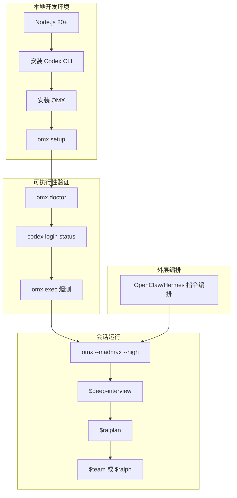

# OMX 把 Codex 从能用拉到好用的实战指南

很多团队现在都在用 Codex CLI 干活。
问题不是“能不能跑”，而是“能不能稳定、可控、可协作地跑”。

真实场景里最常见的崩点就那几个：
环境看着绿灯，真执行就 401；
多人并行一上来，状态和日志乱成一锅粥；
命令记不住、流程不统一，换个人就重学一遍。

oh-my-codex（OMX）干的就是这件事：不替代 Codex，而是在 Codex 外面套一层更稳的工作流和运行时。

## 先说结论：这项目到底是什么

OMX 是 OpenAI Codex CLI 的工作流层，用标准化指令、角色和状态目录，把“会跑”升级成“长期可维护地跑”。

## 为什么值得看

这个工具最值钱的点，不是多了多少命令，而是把“团队实际会踩的坑”提前收口：

1) 把主流程固定成一条线：澄清 → 方案审批 → 执行收敛。  
这在真实工作里意味着：需求边界、风险和执行分工不再靠口头共识。

2) 把可复用能力沉淀成技能调用面：`$deep-interview`、`$ralplan`、`$team`、`$ralph`。  
这在真实工作里意味着：新成员加入后，不用先背一堆私有术语和隐形流程。

3) 把计划、日志、记忆、模式状态放进 `.omx/`。  
这在真实工作里意味着：不是“聊天窗口历史”，而是可追溯的工程状态。

4) 明确给出推荐默认路径：macOS/Linux + Codex CLI。  
这在真实工作里意味着：减少“本地跑得通、线上跑不通”的平台幻觉。

## 项目核心能力拆解

| 能力 | 具体是什么 | 在真实场景里的价值 | 限制/边界 |
|---|---|---|---|
| 标准主流程 | `$deep-interview -> $ralplan -> ($team/$ralph)` | 把“直接开干”改成“先澄清、再批准、再执行” | 如果只想裸跑 Codex，这层可以不要 |
| 角色与技能复用 | 通过 OMX 角色关键词和技能组织任务 | 大任务拆分更自然，减少每次重写提示词 | 需要先完成 setup 并保持安装结构完整 |
| 持久状态目录 | `.omx/` 管 plans/logs/memory/mode | 排障、复盘、交接都有落点 | 需要团队约定目录治理方式 |
| 团队并行运行时 | `omx team` + tmux/worktree 协作 | 多任务并行时状态更可控 | 推荐 macOS/Linux + tmux；Windows 为次级路径 |
| 运行时体检与烟测 | `omx doctor` + `omx exec` | 防止“假绿灯”上线 | `doctor` 只查安装形态，不等于真实鉴权可用 |
| Hook 生命周期 | 以 `.codex/hooks.json` 为原生入口，`.omx/hooks/*.mjs` 为插件层 | 生命周期可观测、可管理 | 刷新/卸载时需理解 OMX 管控与用户自定义边界 |

一句人话类比：Codex 像发动机，OMX 像整车线束和仪表盘。发动机猛不猛是一回事，车能不能安全上高速是另一回事。

## 上手成本到底高不高

门槛不高，但有前提：Node.js 20+、已安装 Codex CLI、同一 shell/profile 下鉴权可见；团队并行推荐 tmux（Windows 特例是 psmux）。

安装和推荐启动命令如下（原始命令保留）：

```bash
npm install -g @openai/codex oh-my-codex
omx setup
omx --madmax --high
```

首次会话建议先做边界检查（原始命令保留）：

```bash
omx doctor
codex login status
omx exec --skip-git-repo-check -C . "Reply with exactly OMX-EXEC-OK"
```

## 怎么用：按真实使用路径走一遍

先看项目提供的标准会话指令（原始命令保留）：

```text
$deep-interview "clarify the authentication change"
$ralplan "approve the auth plan and review tradeoffs"
$ralph "carry the approved plan to completion"
$team 3:executor "execute the approved plan in parallel"
```

### 组合工作流示例：OpenClaw + Codex CLI + OMX

说明：下面是“实际协作示例”，用于展示如何把 OMX 接入常见 Agent 工作流，不等同于 OMX 原生命令面。

#### 1) 安装或接入过程



示例对话：

```text
你: 本地已经装了 codex，但每次协作流程都不统一，先把 OMX 跑起来。
AI: 好，先装并初始化：npm install -g @openai/codex oh-my-codex && omx setup
你: 装完了，怎么确认不是假绿灯？
AI: 先跑 omx doctor，再跑 codex login status，最后用 omx exec 做一次真实模型调用烟测。
你: 烟测通过了，下一步？
AI: 用 omx --madmax --high 起会话；先 $deep-interview 澄清，再 $ralplan 审批，最后按任务规模选 $team 或 $ralph。
```

#### 2) 实际使用过程

- 若需求边界不清，先用：`$deep-interview "..."`
- 形成并审批方案：`$ralplan "..."`
- 任务可并行拆分时用：`$team`
- 需要单 owner 持续推进时用：`$ralph`

团队运行时相关命令（原始命令保留）：

```bash
omx team 3:executor "fix the failing tests with verification"
omx team status <team-name>
omx team resume <team-name>
omx team shutdown <team-name>
```

探索与 shell 侧验证（原始命令保留）：

```bash
omx explore --prompt "find where team state is written"
omx sparkshell git status
omx sparkshell --tmux-pane %12 --tail-lines 400
```

Wiki 能力（原始命令保留）：

```bash
omx wiki list --json
omx wiki query --input '{"query":"session-start lifecycle"}' --json
omx wiki lint --json
omx wiki refresh --json
```

#### 3) 产出结果 / 适合放进什么工作流

- 适合放进“需求到交付”的全链路流程：澄清、审批、执行、回看
- 适合放进多人并行协作：尤其是需要 durable tmux/worktree 的场景
- 适合放进已有 OpenClaw/Hermes 编排层：OMX 做 Codex 运行时强化，外层做任务路由

## 哪些地方是真的香

1. 主流程清楚，少走弯路：先澄清再批准，不是上来就乱改。  
2. `doctor + exec` 这套组合很实用，专治“看起来都对、跑起来全错”。  
3. `.omx/` 持久化状态这件事，能把一次性对话拉回工程化轨道。

## 哪些人会更适合

- 已经在用 Codex CLI，但觉得日常协作成本高的团队
- 需要多人并行执行、又要留痕和可恢复状态的项目组
- 想把 Agent 工作流标准化（澄清/审批/执行）的技术负责人
- 用 OpenClaw/Hermes 做上层编排、想让 Codex 运行层更稳的团队
- 经常遇到“环境没问题但请求失败”的 DevOps/平台侧同学

## 使用前最好知道的边界

1) 推荐默认路径很明确：macOS/Linux + Codex CLI。Native Windows 和 Codex App 不是默认体验，可能不一致且支持度更低。  
2) `omx doctor` 不是万能绿灯，它验证安装结构，不保证当前 profile 真能完成鉴权请求；要用 `codex login status + omx exec` 做真实烟测。  
3) 自定义 HOME/profile/container/service shell 时，要确认实际使用的 `~/.codex`（或 `CODEX_HOME`）是否就是预期那份。  
4) 若依赖本地 OpenAI 兼容代理，需要确认 `~/.codex/config.toml` 中 `openai_base_url` 生效，否则容易触发鉴权错误。  
5) 团队状态卡死（如 stale team / resume_blocker / tmux 丢失）时，按项目建议清理死状态再重试（原始命令保留）：

```bash
omx team shutdown <team-name> --force --confirm-issues
omx cancel
omx doctor --team
```

6) Intel Mac 在高并发启动（尤其 `--madmax --high`）时可能出现 `syspolicyd` / `trustd` CPU 飙高；项目建议包括移除 quarantine、配置开发者工具许可、降低并发。

## 额外运维面：需要知道但不必一上来就用

- `omx setup`：安装 prompts、skills、AGENTS 脚手架、`.codex/config.toml`、OMX 管理的 hooks 封装
  - setup refresh 会保留 `.codex/hooks.json` 非 OMX 条目
  - `omx uninstall` 只移除 OMX 管理封装，若用户 hooks 仍在则保留文件
- `omx hud --watch`：监控状态面，不是主要工作流入口
- Hook 规范面：`.codex/hooks.json`（原生注册）+ `.omx/hooks/*.mjs`（插件层）

## 平台与安装补充

| 平台 | 安装方式 |
|---|---|
| macOS | `brew install tmux` |
| Ubuntu/Debian | `sudo apt install tmux` |
| Fedora | `sudo dnf install tmux` |
| Arch | `sudo pacman -S tmux` |
| Windows | `winget install psmux` |
| Windows (WSL2) | `sudo apt install tmux` |

## 文档入口与生态信息

项目提供 Getting Started、Demo、Wiki、Agents、Skills、Integrations、Troubleshooting、OpenClaw 集成、Contributing、Changelog 等文档入口，并维护多语言版本（含简体中文）。

## 收尾

**OMX 的价值不是“多一个命令层”，而是把 Codex 协作从临场发挥，拉到可复用、可审计、可持续推进的工程节奏。**

## 推荐标签

#ohmycodex #CodexCLI #AIAgent #OpenClaw #Hermes #工程化工作流 #多Agent协作 #开发效率 #AI编程 #DevTools
