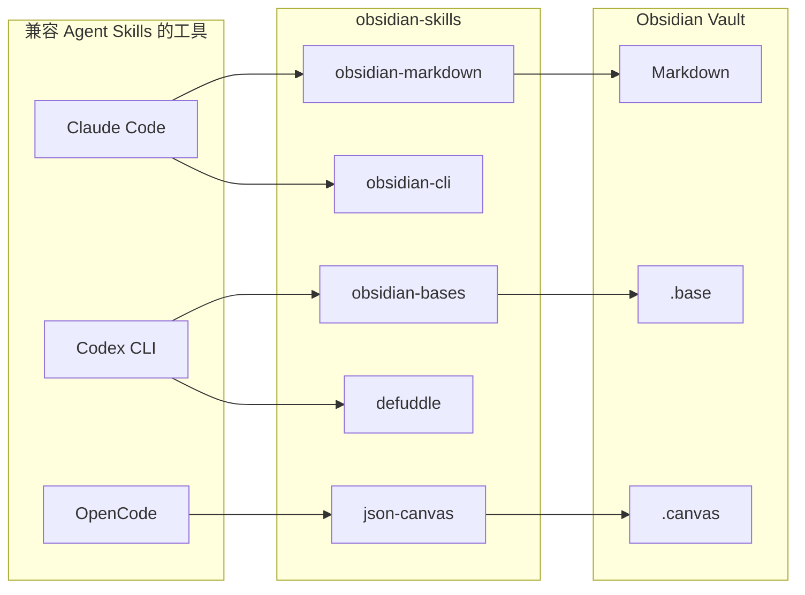

# Obsidian 终于有一套能喂给 Claude Code、Codex 和 OpenCode 的 Skills 仓库了

很多人现在折腾 AI 写作、知识库整理、Vault 自动化，最烦的一件事其实不是模型不够强。

而是你刚把工作流搭起来，下一秒就发现：Claude Code 一套装法，Codex 一套装法，OpenCode 又是一套狗东西目录结构。

最后技能没复用起来，时间先被目录和路径吃光了。

这时候如果有人把 Obsidian 相关能力，按统一 skill 规范整理成一套能直接给多种 agent 吃的仓库，这事就值一看。

这项目本质上就是一套给 Obsidian 用的 Agent Skills 仓库，而且它不是只服务某一个客户端，而是按 Agent Skills 规范整理好了，能给 Claude Code、Codex CLI、OpenCode 这类兼容 skill 的 agent 直接接上。

## 这玩意为什么值得看

它解决的不是“再多一个插件”这种小问题，而是 **Obsidian 相关能力怎么在不同 AI 工具之间复用** 这个破事。

项目说明里给得很清楚，这套技能遵循 Agent Skills 规范，所以兼容 skill 的 agent 都能用。这放到真实工作里，意味着你不用每换一个 agent，就重抄一遍 Obsidian 能力层。

它把能力拆成了几块非常明确的 Obsidian 相关 skill。这意味着不是一坨大而全的说明书，而是按能力模块拆好，后面接进自己的工作流会顺手很多。

更关键的是，安装路径和目录结构都讲得比较死，尤其是 OpenCode 那段。这个看起来像小事，实际非常重要，因为很多人就死在“路径差一点点，结果 agent 根本没发现 skill”这种傻逼坑里。

## 真正有用的地方，不在炫技，在于它把几类能力拆清楚了

| 能力 | 它能干嘛 | 放到真实场景里意味着什么 |
|---|---|---|
| Obsidian Markdown | 创建和编辑 Obsidian 风格 markdown，包括 wikilinks、embeds、callouts、properties | 你让 agent 写 Vault 文档时，不是普通 Markdown，而是直接按 Obsidian 能吃的格式写 |
| Obsidian Bases | 创建和编辑 `.base` 文件，支持 views、filters、formulas、summaries | 如果你在拿 Obsidian 做结构化查询或面板，这就不是纯笔记，而是开始往“轻数据库视图”走了 |
| JSON Canvas | 创建和编辑 `.canvas` 文件，包括 nodes、edges、groups、connections | 适合把知识关系图、流程图、项目图谱直接交给 agent 生成 |
| Obsidian CLI | 通过 Obsidian CLI 和 Vault 交互，也覆盖插件和主题开发场景 | 不只是写文件，后面还能把 Vault 操作接到更真实的工具链里 |
| Defuddle | 把网页提取成干净 markdown，去掉噪音节省 token | 这就像先把一团脏网页内容洗干净，再喂给 agent，省 token 也省脑子 |

### 第一层价值，是 Markdown 不再只是 Markdown

项目里第一类 skill 就是给 Obsidian 风格 Markdown 用的，明确支持 wikilinks、embeds、callouts、properties 这些语法。

这在真实场景里很关键，因为很多 agent 写出来的 Markdown，乍一看能看，真丢进 Vault 里就跟普通 txt 差不多，链接不成体系，属性也乱。这个 skill 的意义，就是把 agent 的输出往 Obsidian 原生格式上拉，不至于写完还得手工返工。

### 第二层价值，是把结构化能力也带进来了

除了普通文档，它还单独给了 Obsidian Bases skill。

这在真实工作里意味着，agent 不只是能帮你写笔记，还能开始碰 `.base` 这类更结构化的内容，包括 view、filter、formula、summary。这一步很重要，因为很多 Vault 到最后卡住，不是内容少，而是内容越来越多之后没人能快速筛和看。

### 第三层价值，是图谱和画布也没落下

JSON Canvas 这一块也单独拆成 skill。

这个能力的实际意义很直白，后面你让 agent 帮你搭知识图、项目图、流程图，不用再先让它输出一堆半残的 Mermaid 再自己转，直接往 `.canvas` 去走会更贴合 Obsidian 生态。

### 第四层价值，是它没有假装自己只会“写字”

项目里还有 Obsidian CLI skill 和 Defuddle skill。

一个是让 agent 通过 Obsidian CLI 直接和 Vault 交互，甚至覆盖插件和主题开发；另一个是把网页抽成更干净的 markdown。前者像是给 agent 一把更像“管家钥匙”的工具，后者像是先把网页这堆信息垃圾做一轮清洗，再往知识库里送。

这俩一配，很多知识闭环工作流就顺了，不然 agent 前面在抓网页，后面在写 Vault，中间全靠人手搓转换，累得像在给工具打零工。

## 装起来麻不麻烦

不算离谱，但你得按它给的路径来，别手抖。

它给了三种路径：Marketplace、`npx skills`、手动安装。不同 agent 的手动安装路径不一样，尤其 OpenCode 还强调了目录层级，不能只拷内部 `skills/` 文件夹。

### 先走官方安装命令

#### Marketplace

```
/plugin marketplace add kepano/obsidian-skills
/plugin install obsidian@obsidian-skills
```

#### npx skills

```
npx skills add git@github.com:kepano/obsidian-skills.git
```

#### OpenCode

```sh
git clone https://github.com/kepano/obsidian-skills.git ~/.opencode/skills/obsidian-skills
```

示例对话：

```text
你:
给 Obsidian 装一套 skills，后面要给 Claude Code 和 Codex 复用。

AI:
可以，先看你主要跑在哪个客户端。
如果是通用一点，先走：

npx skills add git@github.com:kepano/obsidian-skills.git

你:
OpenCode 呢？

AI:
OpenCode 这边别偷懒，得 clone 整个仓库，不能只拷里面那层 skills 目录。

git clone https://github.com/kepano/obsidian-skills.git ~/.opencode/skills/obsidian-skills

你:
为啥这么讲究？

AI:
因为它要识别 `~/.opencode/skills/obsidian-skills/skills/<skill-name>/SKILL.md` 这层结构。
路径歪了，技能就跟没装一样。
```

### 不同工具的接入方式，项目里其实说得很明白

对于 Claude Code，它要求把仓库内容放进 Vault 根目录下的 `/.claude` 文件夹，或者你正在给 Claude Code 使用的目录里。

对于 Codex CLI，它要求把 `skills/` 目录复制到 Codex 的 skills 路径，通常是 `~/.codex/skills`。

对于 OpenCode，它不是复制内部目录，而是要把整个仓库 clone 到 `~/.opencode/skills/obsidian-skills`，并且强调技能发现依赖完整目录结构，重启 OpenCode 后技能才会可用。

这一段别嫌啰嗦，这就是最容易翻车的地方。很多人不是不会装，是太想当然，以为“反正把 skill 文件拷过去就行”，结果 agent 根本扫不到。

## 真正怎么用，按真实工作流走一遍

先说项目原生能力，它提供的是一套 Obsidian 相关 skill 集合，你把它接到支持 Agent Skills 的工具里之后，就能让 agent 直接处理：

- Obsidian markdown
- Obsidian bases
- JSON canvas
- Obsidian CLI
- 网页 markdown 提取

也就是说，项目原生能力更像“技能层”，不是单独一个 App。

### 先把接入路径想清楚



### 组合工作流示例：接到 OpenClaw + Codex + Obsidian 这条链里

这段不是项目原生说明，而是更贴近实际协作的用法。

比如你现在已经有 Obsidian Vault，又在用 OpenClaw 做入口编排、Codex 做执行，那这套 skills 的合理用法可以是：

1. 先把 `obsidian-skills` 接进 Codex 或 Claude Code
2. 再让 OpenClaw 把“网页整理、知识沉淀、Canvas 图谱、Base 视图维护”分发给对应 agent
3. 最后把结果统一落回 Vault

实际使用过程可能长这样：

```text
需求：
把一个 GitHub 项目说明整理进 Obsidian，生成一篇结构化笔记，再补一个知识图。

执行路径：
1. 用 defuddle 类能力先抽网页正文，减少噪音
2. 用 obsidian-markdown 写成带 wikilink 和 properties 的笔记
3. 用 json-canvas 生成对应的知识图谱
4. 如需结构化整理，再补一个 .base 视图
```

如果接进 Codex / Claude Code 之后，你后面更容易把它塞进这些工作流：

- GitHub 项目解读落盘
- Obsidian 知识库整理
- LLM Wiki / Vault 索引维护
- 知识图谱或项目画布生成
- 网页内容清洗后再入库

## 真香的地方，其实就三句

第一，它不是只给一个客户端写的，兼容思路比较正。

第二，它把 Obsidian 里最容易散掉的几类能力拆成了明确 skill，不是一坨混着讲。

第三，OpenCode 那种最容易踩坑的目录结构问题，它提前给你按住了，不然很多人第一步就死了。

## 哪些人会更适合用

- 想把 Obsidian 变成 AI 可协作知识库的人
- 同时在用 Claude Code、Codex CLI、OpenCode 这类工具的人
- 想让 agent 直接产出 Obsidian 原生格式内容的人
- 在做知识闭环、项目归档、技术写作自动化的人
- 想把网页清洗、文档落盘、图谱生成串进一条线的人

## 真要上手前，最好先知道这些边界

第一，这项目给的是 skill 集，不是一个“一键啥都自动搞定”的独立产品。你还是得先有支持 Agent Skills 的工具环境。

第二，不同工具的安装方式不一样，尤其路径和目录结构别瞎改。OpenCode 那段已经写得很明确，**不要只复制内部 `skills/` 目录，要 clone 整个仓库**，不然技能发现会直接失效。

第三，OpenCode 这边技能生效还依赖重启。也就是说，别刚复制完文件就开始骂它没反应，先重启再看。

第四，Claude Code 和 Codex CLI 的接入方式也不是同一路径，一个偏 Vault 根目录下的 `/.claude`，一个偏 `~/.codex/skills`。这不是形式主义，这是 agent 找 skill 的方式不同。

**这仓库真正值钱的，不是又多了几个技能，而是它终于把 Obsidian 这套能力，整理成了能被多种 agent 稳定复用的一层。**

#Obsidian #AgentSkills #ClaudeCode #CodexCLI #OpenCode #知识库 #AI工作流 #GitHub项目 #Markdown #JSONCanvas