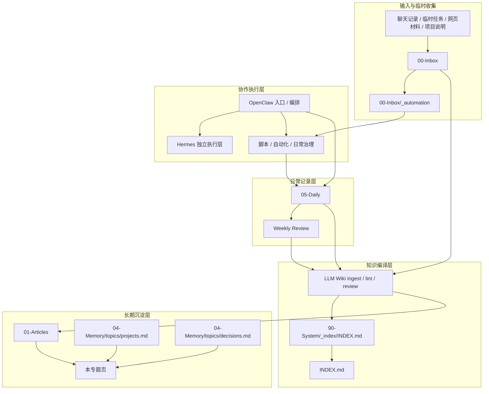
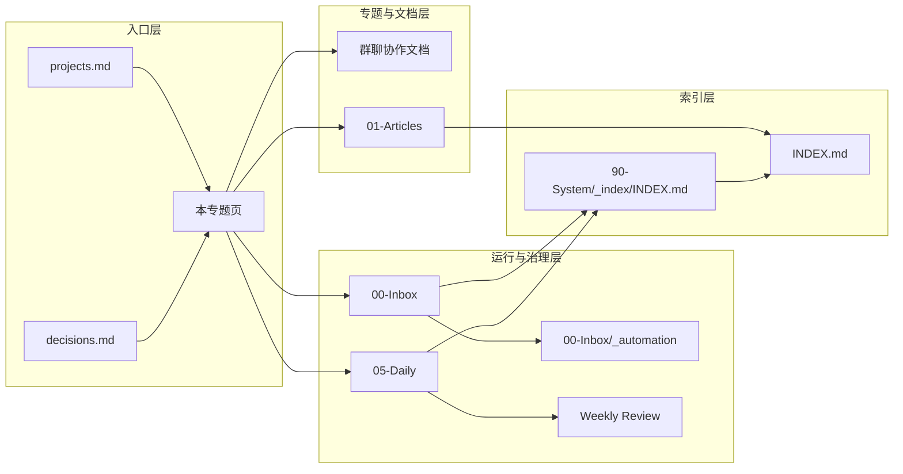

# OpenClaw / Hermes / Obsidian 协作体系专题页

> 目的：把 OpenClaw、Hermes、Obsidian / Vault 这条长期协作主线集中到一个专题页维护，避免后续继续零散追加到 `projects.md`、`decisions.md` 或其他入口页。

## 1. 一句话定位

这套体系的稳定分工是：

- **OpenClaw**：入口、编排、路由、多 bot / 多 agent 接入
- **Hermes**：独立执行层、独立 bot / 独立 runtime、补充对话与执行能力
- **Obsidian / Vault**：长期知识沉淀、文档归档、复盘与索引中心

一句话说，就是：

> **OpenClaw 负责把事情接住并组织起来，Hermes 负责作为独立能力层协同执行，Obsidian 负责把结果沉淀成长期可复用资产。**

## 2. 当前稳定架构

### 2.1 OpenClaw

当前已形成的稳定口径包括：

- OpenClaw 作为主入口 Agent
- 支持多 bot account / 多 agent binding
- 负责消息入口、工具调用、工作流编排与多角色分流
- 在群聊或多渠道场景里，优先承担“谁接消息、谁触发执行、谁负责汇总”的调度职责

### 2.2 Hermes

当前稳定口径是：

- Hermes 保持独立 runtime
- Hermes 保持独立 bot 身份
- Hermes 不默认内嵌为 OpenClaw 内部 agent
- Hermes 更适合作为与 OpenClaw 并行存在的协作执行层

这意味着，当前“OpenClaw 与 Hermes 协作”的主路径，不是内部硬耦合，而是：

- 同群并行接入
- 或按任务边界分别承担职责
- 再通过明确触发规则、协作文档与落盘结果形成闭环

### 2.3 Obsidian / Vault

Vault 目前承担的角色已经比较明确：

- 长期知识库
- 可发布文档的沉淀层
- 复盘与经验抽取层
- 自动化脚本、项目说明、专题整理的落盘位置
- Agent 长期记忆与可检索上下文的承载空间

所以对这套体系来说，Obsidian 不是“顺手记笔记”的附件，而是长期治理的一部分。

## 3. 当前协作原则

### 3.1 默认先落盘，再扩散

关于 OpenClaw / Hermes / Obsidian 的可复用结论，优先落到专题页、文章页、项目页或规则页，而不是只停留在聊天里。

### 3.2 默认非破坏性

自动化、整理、归档类动作默认先做：

- 巡检
- 标注
- 收敛
- 建索引

涉及批量删除、重命名、迁移时，优先做最小变更。

### 3.3 文档写法优先区分“当前真实生效配置”与“未来可选方案”

这条在 OpenClaw / Hermes 协作文档里尤其重要。后续凡是涉及：

- bot 接入
- 多 agent 路由
- bindings
- groupPolicy / require_mention
- Vault 自动化

都要明确区分：

- 现在已经生效的真实配置
- 未来可能演进到的方案

避免把历史残留、设想方案、当前状态写混。

## 4. 当前已形成的几个子专题

### 4.1 群聊双 bot / 多 bot 协作

相关文档：

- [即时通讯群里让 OpenClaw 和 Hermes 互相对话的配置手册](/articles/2026-04-18-%E5%8D%B3%E6%97%B6%E9%80%9A%E8%AE%AF%E7%BE%A4%E9%87%8C%E8%AE%A9-OpenClaw-%E5%92%8C-Hermes-%E4%BA%92%E7%9B%B8%E5%AF%B9%E8%AF%9D%E7%9A%84%E9%85%8D%E7%BD%AE%E6%89%8B%E5%86%8C-cf8cacb0/)

当前稳定结论：

- OpenClaw 侧可维护多个 bot account
- Hermes 保持独立 bot
- 同群协作依赖 mention 与群策略控制发言，不默认要求内部 API 互调

### 4.2 OpenClaw + Obsidian 知识闭环

相关方向包括：

- Inbox 收集
- 日 / 周整理
- LLM Wiki ingest / lint / review
- 文章与项目文档沉淀
- 记忆与知识库边界治理

### 4.3 自动化与日常治理

包括但不限于：

- launchd / cron
- Inbox 自动整理
- 日报 / 周报 / lint / review
- 状态文件、日志、导出文件的卫生清理

## 5. 协作体系时间线

| 日期 | 事件 | 当前意义 |
|---|---|---|
| 2026-04-03 | 明确 OpenClaw 的组织方式选择，长期分工优先 Multi-Agent、任务内拆解优先主 Agent + Sub-Agent | 为后续 OpenClaw 在协作体系里的“入口 / 编排层”定位打基础 |
| 2026-04-06 ~ 2026-04-09 | 持续推进 OpenClaw + Obsidian 知识闭环、LLM Wiki 分层、Inbox 自动分类、lint / review / ingest 流程 | 让 Vault 从“笔记存放处”升级成长期知识沉淀与治理层 |
| 2026-04-17 | 团队空间与路由体系继续稳定，形成单 Gateway + bindings 路由的治理经验 | 强化了 OpenClaw 作为主入口、主路由层的角色 |
| 2026-04-18 | 明确 OpenClaw 与 Hermes 在群聊场景下的稳定协作口径，不再把 Hermes 默认视为 OpenClaw 内部 agent | 确立“OpenClaw 多 bot / 多 account + Hermes 独立 runtime”这条现实可用路径 |
| 2026-04-19 | 为 OpenClaw / Hermes / Obsidian 协作体系单独建立专题页 | 后续架构分工、协作原则、文档入口开始集中维护，不再散落到多个 memory 入口页 |

## 6. 文档地图 / 索引表

| 模块 | 作用 | 当前入口 |
|---|---|---|
| 专题总入口 | 维护三者协作体系的统一口径 | [OpenClaw / Hermes / Obsidian 协作体系专题页](/articles/2026-04-19-OpenClaw-Hermes-Obsidian-%E5%8D%8F%E4%BD%9C%E4%BD%93%E7%B3%BB%E4%B8%93%E9%A2%98%E9%A1%B5-c2c23166/) |
| 群聊协作 | 维护 OpenClaw / Hermes 在同群、多 bot 场景下的配置与排障口径 | [即时通讯群里让 OpenClaw 和 Hermes 互相对话的配置手册](/articles/2026-04-18-%E5%8D%B3%E6%97%B6%E9%80%9A%E8%AE%AF%E7%BE%A4%E9%87%8C%E8%AE%A9-OpenClaw-%E5%92%8C-Hermes-%E4%BA%92%E7%9B%B8%E5%AF%B9%E8%AF%9D%E7%9A%84%E9%85%8D%E7%BD%AE%E6%89%8B%E5%86%8C-cf8cacb0/) |
| 项目入口 | 只保留长期项目摘要，不承载细节 | 04-Memory/topics/projects.md |
| 决策入口 | 只保留关键决策摘要，不承载专题细节 | decisions.md — 温记忆 / 历史决策入口 |
| 知识闭环 / Wiki 入口 | 承接 OpenClaw + Obsidian 的 LLM Wiki 索引 | Alan Workspace Index / 90-System/_index/INDEX.md |
| 日常沉淀 | 承接 Daily / Weekly Review / Inbox 清理等日常治理产物 | `05-Daily/`、`00-Inbox/` |

### 6.1 建议维护分工

后续维护时，建议按下面这个规则落盘：

- **架构分工变化**：优先写本专题页
- **具体配置与排障**：优先写对应配置手册 / 技术文章
- **长期项目状态**：只在 `projects.md` 写摘要，并链回专题页
- **关键决策**：只在 `decisions.md` 写摘要，并链回专题页
- **日常执行痕迹**：落到 Daily / Weekly / Inbox，不强行写进专题页

## 7. 后续维护约定

从现在开始，凡是新增以下内容，优先补到本专题页或它的子页面，而不是继续散写到 `projects.md` / `decisions.md`：

- OpenClaw / Hermes / Obsidian 三者的架构分工变化
- 协作原则更新
- 稳定工作流沉淀
- 专题索引与专题文档入口
- 长期有效的协作结论

而 `projects.md` / `decisions.md` 里只保留：

- 一句话摘要
- 指向本专题页的链接

## 8. 常见问题与排障入口

### 8.1 群里两个 bot 都不按预期响应，先查什么

优先排查：

- OpenClaw 侧 `bindings` 是否绑对 account 与 agent
- OpenClaw 侧群聊策略是否放得过宽，例如 `groupPolicy: open`
- Hermes 侧是否启用了 `require_mention: true`
- 当前场景到底是“真实生效配置”，还是历史文档里写过但已经失效的旧方案

优先入口：

- [即时通讯群里让 OpenClaw 和 Hermes 互相对话的配置手册](/articles/2026-04-18-%E5%8D%B3%E6%97%B6%E9%80%9A%E8%AE%AF%E7%BE%A4%E9%87%8C%E8%AE%A9-OpenClaw-%E5%92%8C-Hermes-%E4%BA%92%E7%9B%B8%E5%AF%B9%E8%AF%9D%E7%9A%84%E9%85%8D%E7%BD%AE%E6%89%8B%E5%86%8C-cf8cacb0/)
- decisions.md — 温记忆 / 历史决策入口

### 8.2 文档、配置、运行状态三者对不上，先信什么

默认优先级：

1. 当前真实生效配置
2. 当前运行状态 / 日志
3. 后写的专题页或配置手册
4. 历史决策摘要
5. 更早的旧文档

也就是说，专题页负责集中口径，但**真实排障时始终先信当前配置和当前运行状态**。

### 8.3 自动化跑了但没落盘，先查什么

优先排查：

- 解释器路径是不是固定到了预期版本
- 日志文件里是否有报错但主流程没显式失败
- `00-Inbox/_automation/state.json` 是否记录了异常状态
- 输出是没生成，还是生成了但没被整理进 Wiki / Daily / Weekly

优先入口：

- `00-Inbox/_automation/`
- `05-Daily/`
- 90-System/_index/INDEX.md
- decisions.md — 温记忆 / 历史决策入口

### 8.4 什么时候更新专题页，什么时候更新别的文档

按这个规则：

- **改分工、改协作边界、改长期口径**：更新本专题页
- **改具体配置、排障步骤、参数细节**：更新对应配置手册
- **改日常执行记录**：更新 Daily / Weekly / Inbox
- **改长期项目摘要**：只在 `projects.md` 留摘要
- **改关键决策**：只在 `decisions.md` 留摘要

## 9. 自动化清单与验收清单

### 9.1 当前自动化清单

| 模块 | 当前作用 | 主要落点 / 入口 |
|---|---|---|
| Inbox 自动整理 | 承接临时材料、导出与待整理产物 | `00-Inbox/` |
| Automation logs / state | 记录自动化运行过程、状态、导出物 | `00-Inbox/_automation/` |
| Daily / Weekly Review | 承接日常执行痕迹与周期复盘 | `05-Daily/` |
| LLM Wiki ingest / lint / review | 承接知识编译、索引、巡检与周检 | `90-System/_index/INDEX.md`、`INDEX.md` |
| 文章沉淀 | 承接可发布技术文档与专题文章 | `01-Articles/` |

### 9.2 基础验收清单

#### A. OpenClaw / Hermes 协作链路

- [ ] OpenClaw 入口、bindings、agent 路由可解释
- [ ] Hermes 仍保持独立 runtime / 独立 bot 口径
- [ ] 群聊触发规则明确，不存在“到底谁该回”长期混乱
- [ ] 配置手册与当前真实状态没有明显冲突

#### B. Vault 落盘链路

- [ ] 临时材料先进入 Inbox，而不是直接散落各目录
- [ ] 日常记录能进入 Daily / Weekly Review
- [ ] 可复用结论能进入专题页 / 文章页 / 项目页 / 决策页之一
- [ ] 长期文档具备可索引入口，不只是孤立文件

#### C. 自动化运行链路

- [ ] 自动化有状态文件或日志可查
- [ ] 关键导出目录清晰，不和正式知识目录混写
- [ ] 历史日志与一次性导出物可定期清理
- [ ] 脚本解释器、输入输出路径、落盘位置都有稳定约定

### 9.3 出问题时的最小验收顺序

建议每次按这个顺序看：

1. 当前消息入口 / 任务入口是不是对的
2. OpenClaw / Hermes 当前配置是不是对的
3. 自动化有没有真正执行
4. 日志 / state / 输出目录里有没有结果
5. 结果有没有被整理进 Vault 正式目录
6. 专题页 / 手册 / 项目页是否需要补一条长期结论

## 10. 与 LLM Wiki / Inbox / Daily / Weekly Review 的关系图

### 10.1 这张图怎么理解

- **Inbox** 负责先接住杂乱输入
- **OpenClaw / Hermes** 负责把任务执行起来
- **Daily / Weekly** 负责保留过程痕迹与阶段复盘
- **LLM Wiki** 负责把零散材料编译成可检索索引
- **专题页 / Articles / Projects / Decisions** 负责把长期有效结论收成正式资产

## 11. 文档索引图（Mermaid 版）

### 11.1 维护建议

如果后续文档越来越多，可以继续把这张索引图拆成两张：

- 一张偏“协作架构图”
- 一张偏“文档导航图”

这样专题页既能当入口，也不会因为图越画越大而失控。

## 12. 入口链接

- 项目入口：04-Memory/topics/projects.md
- 决策入口：decisions.md — 温记忆 / 历史决策入口
- 群聊协作文档：[即时通讯群里让 OpenClaw 和 Hermes 互相对话的配置手册](/articles/2026-04-18-%E5%8D%B3%E6%97%B6%E9%80%9A%E8%AE%AF%E7%BE%A4%E9%87%8C%E8%AE%A9-OpenClaw-%E5%92%8C-Hermes-%E4%BA%92%E7%9B%B8%E5%AF%B9%E8%AF%9D%E7%9A%84%E9%85%8D%E7%BD%AE%E6%89%8B%E5%86%8C-cf8cacb0/)

## 13. 待继续补充

- 典型协作案例清单
- 失败样例与修复样例对照
- 自动化目录约定细则
- 子专题的反向链接补齐
