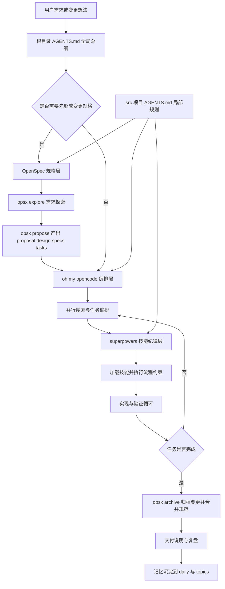
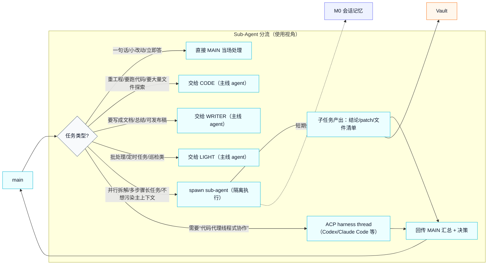
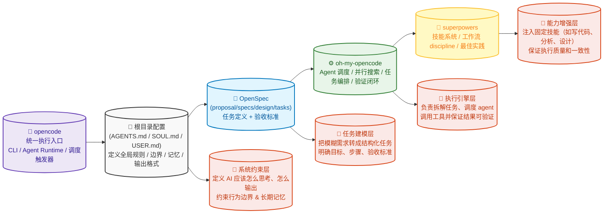
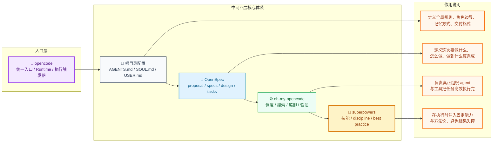
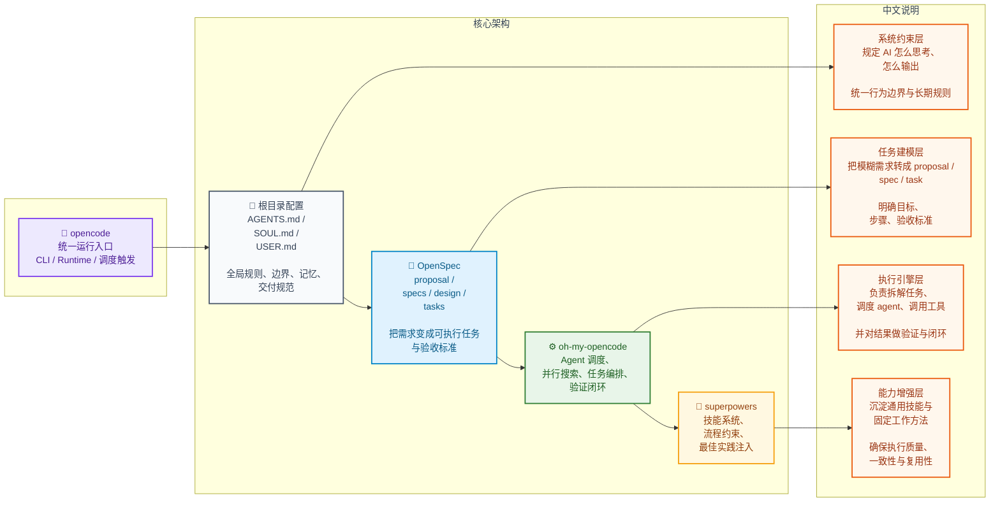

| 模式                | 一句话                                  | 调用方式                                     | Session        | 方向             | 同步/异步      |
| :------------------ | :-------------------------------------- | :------------------------------------------- | :------------- | :--------------- | :------------- |
| Multi-Agent Routing | 多个独立 agent，消息自动路由            | bindings 配置                                | 复用已有       | 单向（入站路由） | N/A            |
| Agent-to-Agent      | agent 之间互相对话                      | `sessions_send`                              | 复用已有       | 双向（最多5轮）  | 同步（可超时） |
| Sub-Agent           | 派活给子代理，跑完回报                  | `sessions_spawn`/ `/subagents spawn`         | 新建隔离       | 单向派活 + 回报  | 异步           |
| ACP Session         | 调用外部编码工具（Codex/Claude Code等） | `sessions_spawn runtime:"acp"`/ `/acp spawn` | 新建或恢复     | 线程内双向       | 异步           |
| Delegate            | 组织级代理，以自己身份代表人类行事      | 多 agent 配置 + 身份提供商                   | 同 Multi-Agent | 通过频道         | N/A            |

| 模式                | 一句话                                  | 调用方式                                     | 接入              |
| :------------------ | :-------------------------------------- | :------------------------------------------- | :---------------- |
| Multi-Agent Routing | 多个独立 agent，消息自动路由            | bindings 配置                                | main/writer/coder |
| Agent-to-Agent      | agent 之间互相对话                      | `sessions_send`                              |                   |
| Sub-Agent           | 派活给子代理，跑完回报                  | `sessions_spawn`/ `/subagents spawn`         | Main->子agents    |
| ACP Session         | 调用外部编码工具（Codex/Claude Code等） | `sessions_spawn runtime:"acp"`/ `/acp spawn` | Codex             |
| Delegate            | 组织级代理，以自己身份代表人类行事      | 多 agent 配置 + 身份提供商                   | Trae              |





1.







我帮你把刚才那张图，整理成一个**结构清晰、适合文档/汇报的 Markdown 表格**👇

- -----

## **🧠 opencode 架构总览（表格版）**

| **层级**   | **模块**                                      | **核心定位**     | **主要职责**                                                 | **输入**              | **输出**                  |
| ---------- | --------------------------------------------- | ---------------- | ------------------------------------------------------------ | --------------------- | ------------------------- |
| 入口层     | 🧠 opencode                                    | 统一执行入口     | 提供 CLI / Runtime / Agent 触发入口，启动整个系统流程        | 用户请求 / 指令       | 触发完整执行链路          |
| 系统约束层 | 📂 根目录配置(AGENTS.md / SOUL.md / USER.md)   | 全局规则中心     | 定义 AI 行为边界、角色设定、记忆机制、输出格式规范           | 用户请求 + 系统上下文 | 规范化后的执行环境        |
| 任务建模层 | 📝 OpenSpec(proposal / specs / design / tasks) | 任务结构化       | 将模糊需求拆解为清晰的任务结构，定义目标、步骤与验收标准     | 原始需求              | 结构化任务（spec + task） |
| 执行引擎层 | ⚙️ oh-my-opencode                              | Agent 调度系统   | 负责任务拆解、agent 调度、工具调用、并行搜索、结果验证闭环   | 结构化任务            | 执行结果 + 验证结果       |
| 能力增强层 | 🚀 superpowers                                 | 技能与方法论系统 | 注入通用技能（写代码、分析、设计等）与固定工作流，保证质量与一致性 | 执行任务              | 高质量、稳定的输出结果    |

- -----

## **🔄 一句话理解整套体系**

| **层**         | **本质**           |
| -------------- | ------------------ |
| opencode       | 从这里启动一切     |
| Root           | 限制 AI 怎么“做人” |
| OpenSpec       | 定义这次“要做什么” |
| oh-my-opencode | 负责“把事做完”     |
| superpowers    | 决定“做得好不好”   |

- -----

## **🧩 流程视角（很适合讲给别人）**

```
用户请求
   ↓
opencode（入口触发）
   ↓
Root（加载规则 & 记忆）
   ↓
OpenSpec（把需求变成任务）
   ↓
oh-my-opencode（调度执行）
   ↓
superpowers（提升质量）
   ↓
最终结果（可验证）
```

- -----

如果你下一步想升级，我可以帮你做一个：

👉 **「对标 OpenAI / Devin / Cursor 的完整版架构表（带 memory / tool / feedback loop）」**

那一版会更像真正的 AI Agent 系统设计文档。