```

```

# [Alan の手札] AI-Testing 思考

那天凌晨两点，我盯着 Jenkins 上 30% 失败的 UI 自动化用例，突然意识到一个残酷事实：我们精心设计的测试策略，正在被混乱的版本迭代节奏撕得粉碎。每次回归都像在赌场下注——押对了模块团队夸你专业，押错了半夜被叫起来修生产问题。直到我开始尝试用 AI 重构这个决策过程...

## 测试策略的本质：在不确定性中做选择

测试策略从来不是会议室里漂亮的 PPT，而是工程师每天面对的生存选择题：

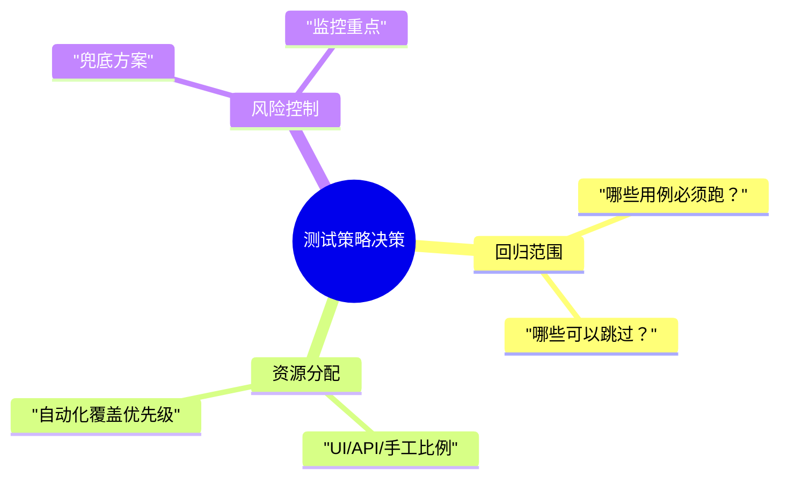

这些决策背后，藏着四个关键变量：
- 历史缺陷分布（那些总在半夜爆雷的模块）
- 本次代码变更（产品经理说"小改动"的领域）
- 业务复杂度（连开发都讲不清的流程）
- 剩余时间（永远不够用的回归窗口）

有趣的是，这些正是 AI 最擅长的数据组合分析——就像给测试策略装了个 CT 扫描仪。

## AI 的三大实战价值

### 1. 把团队记忆变成可分析的数据

每个团队都有这样的"传说级 Bug"：
- "支付模块每次大促必出问题"
- "订单状态机去年搞垮过三次发布"

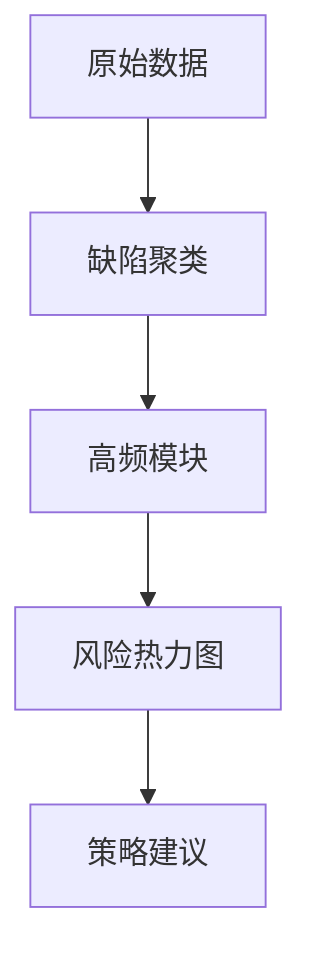

AI 能把这些口头禅变成可视化热力图，精确显示哪些模块的缺陷密度是平均值的 3 倍。某金融团队用这个发现，他们 80% 的 P0 缺陷其实集中在 20% 的接口上。

### 2. 给模糊经验装上刻度尺

当工程师说"这个模块风险较高"时，AI 可以追问：
- 较高是指？相比基准高多少？
- 历史同类型改动的缺陷率？
- 关联模块的连锁反应概率？

就像把"我觉得要下雨"变成了"气象雷达显示 3 公里外有强对流云团，降水概率 87%"。

### 3. 扮演魔鬼代言人

最实用的场景：当你想偷懒跳过某个模块回归时，AI 会冷静地列出：
- 该模块近半年缺陷趋势
- 关联依赖项变更记录
- 相似架构的历史问题

"您确定要跳过这个模块吗？它上游的订单服务本次重构了状态机逻辑。"——这种提醒比咖啡更提神。

## 真实落地：版本回归决策支持

假设明天就要上线，你只有 48 小时做回归。传统做法是：
1. 打开用例管理系统
2. 按目录筛选部分用例
3. 祈祷覆盖了关键路径

AI 辅助的决策流程：

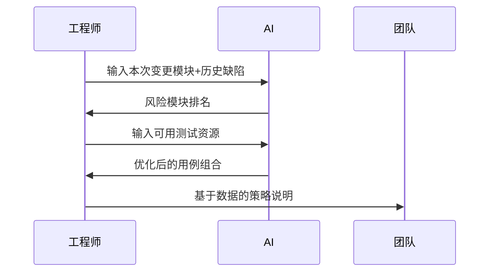

某电商团队的实际产出示例：
- **重点回归**：支付回调（历史 P1 缺陷率 25%）
- **可降级**：商品详情页（6 个月零缺陷）
- **必须监控**：新引入的优惠券聚合服务

"以前争论两小时的回归范围，现在用数据 10 分钟达成共识。"——该团队测试负责人反馈。

## 避坑指南：AI 不是策略主人

* *典型误区**：
- 直接让 AI"生成测试策略"（得到通用废话）
- 不提供项目上下文（垃圾进垃圾出）
- 盲目接受所有建议（AI 也会过度拟合）

* *正确打开方式**：
1. 喂给 AI 真实的项目"记忆"：
   - 缺陷数据库快照
   - 自动化测试元数据
   - 版本发布说明
2. 问具体问题而非开放问题：
   - ❌ "帮我制定策略"
   - ✅ "基于这些数据，砍掉哪 30% 用例风险最小？"
3. 保持最终决策权：
   - AI 建议 + 业务知识 = 可靠策略

## 三条黄金原则

1. **数据密度决定价值**  
   把 AI 当成需要"喂资料"的实习生，给的上下文越细，产出越精准。某团队甚至接入 CI/CD 流水线数据，让 AI 能关联代码变更与测试失效模式。

2. **可解释性优先**  
   好的 AI 建议应该能回答这三个问题：
   - 为什么重点测这个？
   - 为什么不测那个？
   - 如果时间减半，最先保什么？

3. **建立反馈闭环**  
   每次发布后标记 AI 建议的准确度，就像训练新人一样持续优化模型。有个妙招：让 AI 预测本次可能漏测的点，发布后验证其预见性。

> "测试策略最大的价值，是让团队在深夜被叫醒时，能坦然说'这个我们确实测过了'。"  
> ——某次生产事故复盘会上的金句

## 行动建议

1. **今天就能做**：导出最近三个月的缺陷数据，用 ChatGPT 分析高频问题模块
2. **本周可实施**：在下个版本规划时，记录你的策略决策依据，与后续缺陷做对比
3. **长期价值**：构建项目专属的测试策略知识库，持续喂养 AI 助手

当测试策略遇上 AI，不是取代经验，而是让经验在数据中迭代进化。毕竟，好的测试策略应该像老医生的诊断——既要有临床直觉，也要会看化验单。

# AI测试 #质量保障 #自动化测试 #测试策略 #DevOps #质量工程 #测试开发 #数据驱动 #决策支持 #工程效能

- -----

# [Alan の手札] AI-Testing 思考

### 凌晨三点的回归测试困境
每个经历过深夜紧急发布的测试工程师都熟悉这种场景：版本明天上线，CI流水线飘红，PM在Slack里疯狂@你。此时最痛苦的决策不是怎么写用例，而是**"到底该测哪些？"**。UI自动化全跑要8小时，但离上线只剩6小时——这种时间与质量的博弈，就是测试策略的核心痛点。

最近半年，随着AI开始渗透测试领域，一个有趣的现象出现了：工程师们开始用AI生成测试脚本、修复失败用例，甚至...尝试让AI帮忙做策略决策。这引发了一个更本质的讨论：

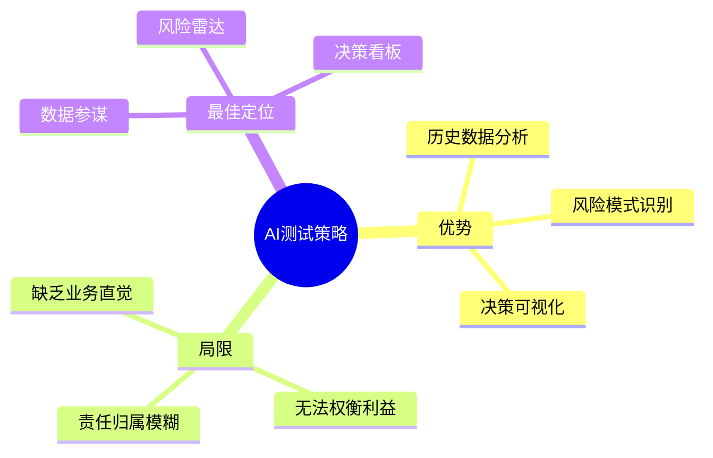

### 测试策略的"三重门"
所谓测试策略，在日常工作中通常体现为三个具体问题：
1. **范围决策**：这次改动了支付模块，但历史数据显示用户管理模块也有耦合风险，该不该扩围？
2. **手段分配**：有限的2天时间，80%给API测试还是优先保障UI核心流程？
3. **风险兜底**：如果必须砍掉30%的用例，哪些模块可以"冒险"跳过？

传统做法依赖工程师的"经验直觉"，但往往面临两个困境：
- **历史数据利用率低**：没人记得半年前那个因缓存导致的订单状态不同步问题
- **决策过程黑箱化**：为什么重点测A不测B？往往只能回答"我觉得这里容易出问题"

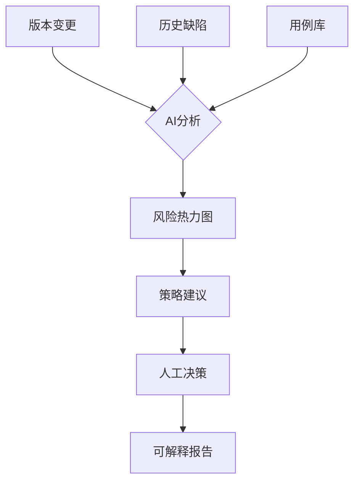

### AI的"数据透视"能力
在实际项目中，AI最惊艳的表现往往发生在这些场景：
- **缺陷模式挖掘**：发现看似随机的测试失败其实集中在每周三的部署后（可能与CI环境重置有关）
- **风险可视化**：用热力图显示近半年模块缺陷密度，直观看到"你以为的安全区"实际是雷区
- **策略模拟**："如果砍掉后50%的用例，剩余覆盖能拦截85%的历史P1缺陷"

> "过去6个月支付模块P1缺陷中，67%发生在月末对账流程，但本次测试计划未包含相关用例"
>
> 这种级别的洞察，往往需要人工翻阅数百条JIRA记录才能发现

### 一个电商项目的真实决策
某零售平台在春节大促前遇到典型困境：
- 需要测试：购物车、优惠券、支付、库存4个模块
- 资源限制：只能完成60%的预设用例

传统做法可能是均匀裁剪，但AI分析后发现：
1. 库存模块虽改动少，但与促销耦合度高，历史缺陷有"延迟显现"特点
2. 支付模块的"部分退款"场景缺陷率是平均值的3倍
3. 优惠券组合使用场景的自动化覆盖率不足30%

最终形成的策略矩阵：

```mermaid
gantt
    title 测试资源分配建议
    dateFormat  HH:mm
    section 支付模块
    退款流程测试   :active,  pay1, 2023-03-01T09:00, 120m
    多通道验证    :         pay2, after pay1, 60m
    section 库存模块
    超卖防护测试   :crit,    stock1, 2023-03-01T10:00, 90m
    缓存一致性    :         stock2, after stock1, 60m
    section 优惠券
    组合优惠边界   :         coupon1, 2023-03-01T11:00, 90m
```

### 实施落地的三个关键
1. **数据喂养**：建立缺陷库与版本变更的自动化同步管道，确保AI有最新"食材"
2. **提问技巧**：避免"生成策略"这种模糊请求，改为"基于这些数据，如果只能测3小时，应该保哪些？"
3. **决策审计**：保存AI建议与最终决策的差异记录，持续优化判断逻辑

- --

## 爆款标题候选
1. "我的测试策略AI助手：不替我做决定，但让我少背锅"
2. "从拍脑袋到看数据：AI如何重构我们的测试决策"
3. "测试工程师深夜emo时，AI在偷偷分析500条缺陷记录"
4. "当AI说'这个模块很危险'时，聪明的测试这样做"
5. "砍掉50%测试用例后更稳了？AI策略助手的反直觉建议"
6. "测试策略的'第二大脑'：如何用AI避免决策盲区"
7. "从'我觉得'到'数据说'：测试策略的AI进化论"
8. "那些让AI做测试策略的团队，后来都怎么样了？"

- --

````
# [Alan の手札] AI-Testing 思考

### 当版本发布撞上资源瓶颈
周三下午 4 点，测试组长李明盯着 Jira 看板发愁：新版本后天必须上线，但回归测试时间只剩 48 小时。100+ UI 自动化用例、30+ API 测试、还有一堆探索性测试点，全量执行根本来不及。团队会议上，大家开始凭经验「砍用例」：
- 「支付流程肯定要全测」
- 「用户中心最近很稳定，跳过吧」
- 「购物车...上次好像出过问题？」

这种场景每个月都要上演几次。直到他们开始尝试用 AI 分析历史数据，决策过程才变得不一样...

### 测试策略的本质是风险决策
测试策略不是文档模板，而是持续的风险管理过程。每次版本迭代都需要回答：

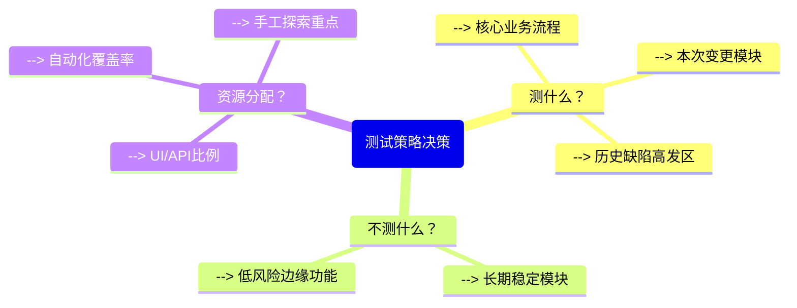

这些决策通常依赖：
- 工程师的「肌肉记忆」
- 最近踩过的坑
- PM 的「这次改动不大」口头禅

而 AI 的突破点在于：它能系统分析那些被忽视的历史数据。

### AI 的三大策略辅助能力

#### 1. 从数据沼泽到风险地图
测试团队最宝贵的资产——历史缺陷数据，往往以这种形态存在：

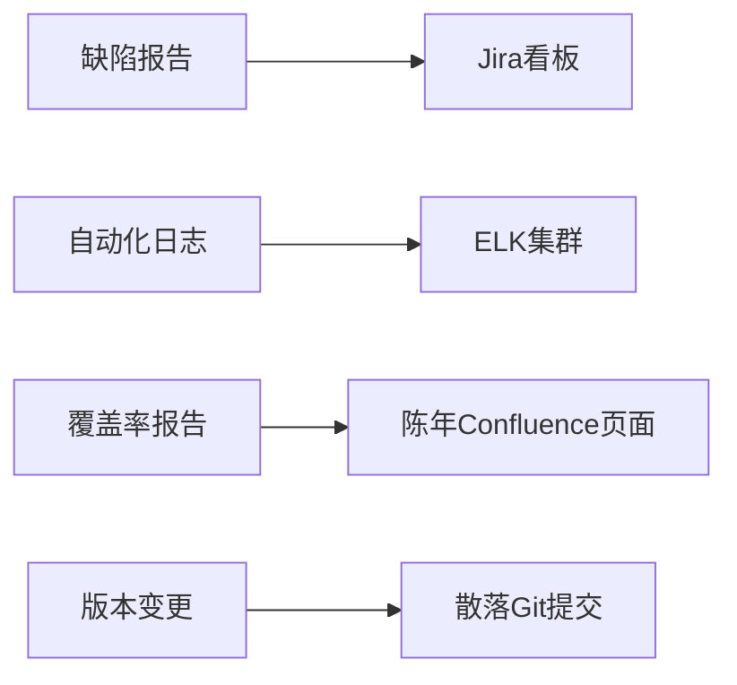

AI 能将这些离散数据转化为可视化风险指标：
- 模块缺陷密度热力图
- 自动化用例有效性评分
- 回归测试 ROI 分析报表

「我们才发现，30% 的自动化用例在验证从不出错的模块。」某电商团队分享道。

#### 2. 将「直觉警告」转化为量化建议
当工程师说「这个模块感觉不太稳」，AI 可以关联：
- 该模块近 3 个月缺陷趋势
- 关联依赖项的变更频率
- 相同代码模式的历史问题

输出可能是：
「订单履约模块：虽然本次改动小，但依赖的库存服务上周有重大更新，建议：
- 增加 API 组合测试
- 监控分布式事务日志」

#### 3. 挑战「惯性思维」
某金融团队习惯性跳过「对账功能」的回归，因为「两年没出过问题」。AI 分析显示：
- 该模块最近引入了新的三方支付渠道
- 代码变更涉及核心对账逻辑
- 相同开发者在其他系统的类似修改曾引发问题

最终团队调整策略，提前发现了金额四舍五入的边界问题。

### 落地实践：AI 策略工作流
典型的工作流应该是：

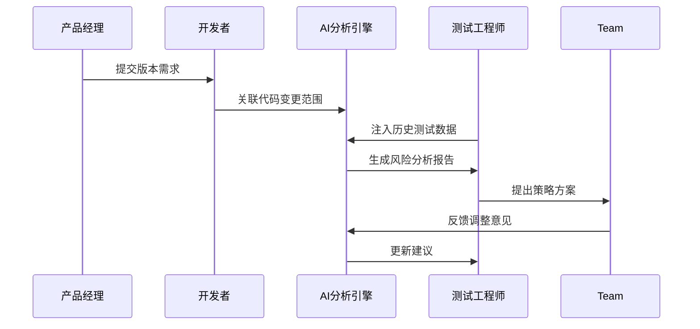

关键输入要素：
1. 本次版本变更的代码 diff
2. 过去 6 个月缺陷分类统计
3. 现有自动化用例元数据
4. 近期环境稳定性报告

### 避坑指南：AI 策略三原则
1. **数据质量决定建议质量**
   - 确保缺陷分类标准统一
   - 关联代码变更与测试结果
   - 定期清洗无效用例数据

2. **明确 AI 的辅助边界**
   - 不替代风险评估会议
   - 不绕过人工确认环节
   - 不隐藏建议依据来源

3. **输出必须可行动化**
   - 每个建议对应具体测试项
   - 标注风险等级和验证方式
   - 提供取舍的替代方案

> "AI 不会让测试策略变简单，但能让决策更透明。" —— 某跨国 SaaS 公司测试总监

### 未来演进方向
领先团队已经开始尝试：
- 实时策略调整：根据 CI 流水线反馈动态优化用例集
- 跨项目模式识别：从相似系统中迁移策略经验
- 预防性测试建议：基于代码变更预测潜在缺陷模式

## 爆款标题候选
1. 《我们如何用 AI 把测试策略会议从 2 小时缩短到 20 分钟？》
2. 《测试工程师的新焦虑：我的策略工作会被 AI 取代吗？》
3. 《从「拍脑袋」到「看数据」：AI 如何重塑测试决策？》
4. 《那些让 AI 做测试策略的团队，后来怎么样了？》
5. 《测试策略的「第二大脑」：一份 AI 辅助实操指南》
6. 《Bug 预防学：用 AI 提前 48 小时发现版本风险》
7. 《当测试老司机遇上 AI 参谋：一场关于经验的重新定义》
8. 《测试覆盖率 70% 还是翻车？你可能缺个 AI 策略官》
````

````
# [Alan の手札] AI-Testing 思考

### 凌晨两点的回归测试困境
每个经历过版本发布的测试工程师都熟悉这个场景：距离上线还剩 48 小时，面前是堆积如山的测试用例，而产品经理又临时加了一个"小改动"。此时最痛苦的决策不是如何执行测试，而是决定哪些必须测、哪些可以暂缓——这就是测试策略的核心挑战。

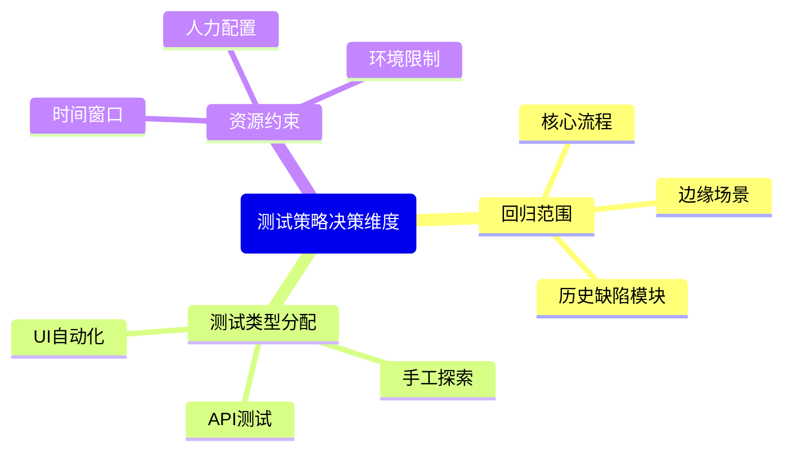

这种决策过去严重依赖工程师的个人经验，但现在 AI 正在改变游戏规则。不过值得注意的是，AI 不是来取代测试策略制定者，而是成为增强决策质量的"数据参谋"。

### 测试策略为何需要 AI 辅助
测试策略之所以困难，是因为它需要同时处理四类动态变化的信息：

1. 历史质量数据（缺陷分布、故障模式）
2. 本次变更影响（代码改动、需求调整）
3. 资源约束条件（时间、人力、环境）
4. 业务风险容忍度（可接受的缺陷级别）

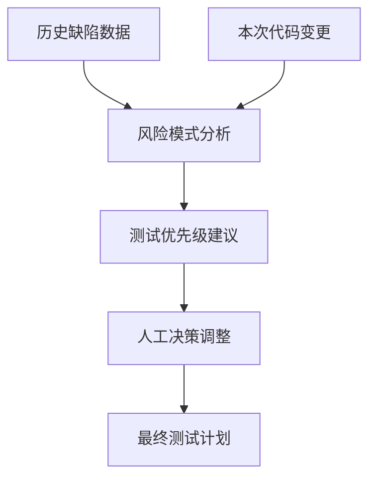

"测试覆盖率达标但线上依然出问题"的情况，往往就是因为策略决策时过度依赖直觉而忽视数据规律。某电商团队的实际案例显示，将 AI 分析纳入策略制定流程后，关键业务漏测率下降了 40%，而测试执行时间反而缩短了 15%。

### AI 辅助策略的三项核心能力
在实际工程实践中，AI 对测试策略的辅助价值主要体现在三个维度：

* *1. 数据聚合与模式识别**
- 自动关联缺陷记录、代码变更、用例执行结果
- 识别高频故障模块和隐蔽风险点
- 可视化测试效率随时间的变化趋势

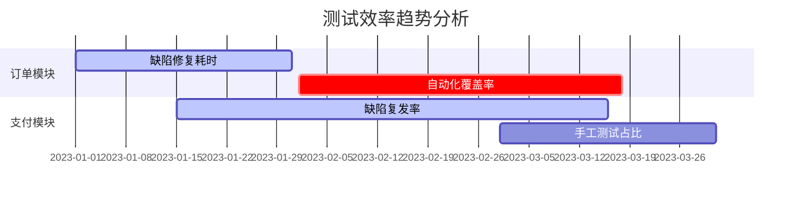

* *2. 经验结构化**
将工程师的模糊经验（如"这个模块不太稳定"）转化为可量化的策略规则：
- 为不同模块定义风险系数
- 建立测试深度与代码变更的关联模型
- 自动生成测试重点推荐权重

* *3. 决策校验**
提供第二意见来避免常见认知偏差：
- 挑战过度关注近期事件的倾向
- 提醒被忽视的关联影响
- 发现测试盲区与覆盖冗余

> "AI 不是告诉你该怎么做，而是帮你看到自己可能忽略的东西"
> ——某金融科技公司测试架构师的实际使用反馈

### 落地实施路线图
对于想要尝试 AI 辅助测试策略的团队，建议分三个阶段推进：

1. **数据准备阶段**（1-2周）
   - 标准化缺陷记录字段
   - 建立版本变更追踪流程
   - 统一测试执行日志格式

2. **工具链集成**（2-4周）
   ```mermaid
   sequenceDiagram
       测试管理系统->>AI引擎: 推送缺陷数据
       代码仓库->>AI引擎: 提交变更信息
       CI系统->>AI引擎: 发送测试结果
       AI引擎->>策略看板: 生成分析报告
       工程师->>策略看板: 调整并确认策略
   ```

3. **流程优化阶段**（持续）
   - 定期复核 AI 建议采纳效果
   - 迭代训练领域特定模型
   - 建立策略决策知识库

### 风险与边界
需要注意，AI 辅助测试策略也存在明显局限：
- 无法理解业务语义层面的特殊要求
- 对全新功能模块缺乏历史参考
- 可能放大数据质量问题（Garbage in, garbage out）

因此建议始终遵循"人类主导，AI 辅助"的原则，特别是在：
- 业务关键路径判断
- 合规性测试要求
- 用户体验相关决策

## 爆款标题候选
1. "测试工程师深夜加班的救星：AI策略辅助实战手册"
2. "从拍脑袋到凭数据：AI如何重塑测试决策"
3. "覆盖率达标但线上依然出问题？你可能需要这个AI技巧"
4. "测试策略不再玄学：3个AI落地方案直接抄"
5. "让AI当测试参谋：某团队漏测率下降40%的秘诀"
6. "别让AI写测试策略了！这才是正确打开方式"
7. "测试资源总是不够？AI帮你做优先级选择题"
8. "测试工程师的核心竞争力：如何用好AI策略分析"
````

````
# [Alan の手札] AI-Testing 思考

### 当版本发布前只剩 48 小时
每个迭代末期的晨会都像在打仗：产品经理追问测试进度，开发忙着修最后一轮 bug，而你盯着 Jenkins 上飘红的用例发愁。最痛苦的莫过于决定「这次到底测哪些」——全量回归时间不够，选择性回归又怕漏掉致命问题。这时候如果有个「测试老司机」能帮你分析历史数据、指出真正的高危区域...

```mermaid
gantt
    title 版本回归时间分配（AI 辅助前后对比）
    dateFormat  HH:mm
    section 传统方式
    需求理解       :a1, 09:00, 2h
    拍脑袋定范围   :a2, after a1, 1h
    执行测试       :a3, after a2, 10h
    漏测补救      :a4, after a3, 4h
    section AI 辅助
    数据输入      :b1, 09:00, 0.5h
    AI 分析      :b2, after b1, 0.5h
    策略调整      :b3, after b2, 1h
    精准执行      :b4, after b3, 8h
```

这种场景下，AI 的价值不在于替代你的决策，而是帮你把「这个模块以前老出问题」的模糊经验，转化为「订单模块近 3 次迭代缺陷密度 0.8/千行，是均值 3 倍」的具体风险提示。

### 测试策略的三大 AI 赋能点
#### 1. 历史缺陷模式识别
测试团队最宝贵的资产往往是散落在 Jira、邮件和记忆里的缺陷历史。AI 可以系统分析：

- 模块缺陷集中度（哪些是真正的「问题儿童」）
- 缺陷引入阶段分布（开发/重构/需求变更？）
- 修复后复发率（哪些问题会「春风吹又生」）

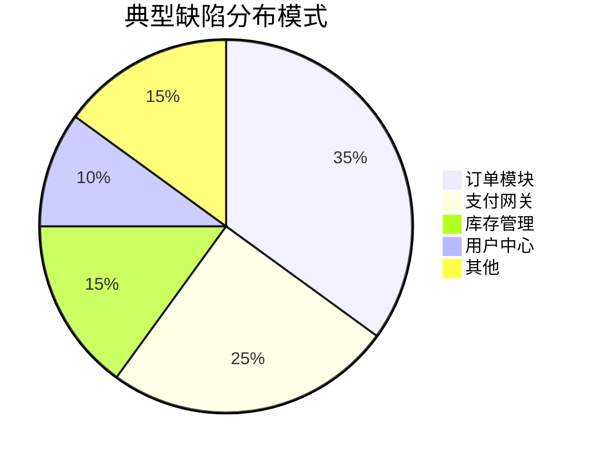

#### 2. 测试 ROI 分析
当 AI 结合以下数据时，能给出惊人的实用建议：
- 用例执行耗时
- 历史捕获缺陷数
- 相关代码变更量
- 业务关键程度

「这个耗时 2 小时的 UI 用例过去半年只发现过 1 个低优先级问题」——这类洞察能直接优化你的回归策略。

#### 3. 风险趋势预测
通过分析：
- 代码变更复杂度
- 开发者历史提交质量
- 关联模块稳定性
AI 可以预警「这次支付回调改造可能影响订单状态机」这类隐藏风险。

### 落地实践：从数据到决策
一个有效的 AI 策略辅助流程应该包含：

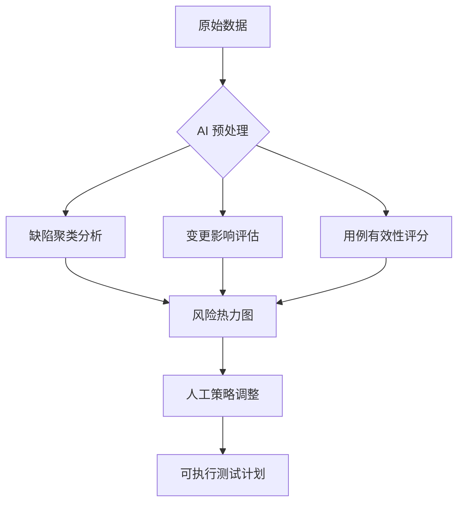

关键输入数据包括：
1. 最近 3-5 个版本的缺陷报告（含模块/严重程度/根因）
2. 当前版本代码变更的 git 记录
3. 现有自动化用例的执行历史
4. 业务方标注的核心流程清单

### 避坑指南
1. **警惕「假大空」建议**  
   「增加测试覆盖率」这样的通用建议毫无价值，好的 AI 输出应该像：「支付失败场景的 UI 覆盖率仅 40%，但该模块贡献了 60% 的 P1 缺陷」

2. **保持决策透明度**  
   对 AI 的建议要追问「为什么」：  
   「跳过用户画像测试的依据是什么？——因为近 6 个月该模块零缺陷，且本次无相关变更」

3. **建立反馈闭环**  
   记录 AI 建议与实际缺陷的匹配度，持续优化模型：  
   「上次 AI 建议重点测试的 3 个模块确实发现了 80% 的缺陷」

## 爆款标题候选
1. "我的测试策略参谋：如何用 AI 把缺陷预测准确率提升 3 倍？"
2. "告别拍脑袋：AI 辅助测试决策的 7 个真实场景"
3. "测试工程师的新武器：让 AI 告诉你哪里最容易爆雷"
4. "当 Jenkins 遇见 ChatGPT：智能化测试策略实践"
5. "省下 50% 测试时间：AI 风险定位法的落地指南"
6. "从「我觉得」到「数据说」：测试策略的 AI 进化论"
7. "测试经理的深夜救星：如何用 AI 做版本风险评估？"
8. "那些 AI 比人类更擅长的测试决策（附真实案例）"
````

````
# [Alan の手札] AI-Testing 思考

### 当版本发布前只剩 48 小时
每个迭代末期的晨会都像在打仗：产品经理追问测试进度，开发忙着修最后一轮 bug，而你盯着 Jenkins 上飘红的用例发愁。最痛苦的莫过于决定「这次到底测哪些」——全量回归时间不够，选择性回归又怕漏掉致命问题。这时候如果有个「测试老司机」能帮你分析历史数据、指出真正的高危区域...


这种场景下，AI 的价值不在于替代你的决策，而是帮你把「这个模块以前老出问题」的模糊经验，转化为「订单模块近 3 次迭代缺陷密度 0.8/千行，是均值 3 倍」的具体风险提示。

### 测试策略的三大 AI 赋能点
#### 1. 历史缺陷模式识别
测试团队最宝贵的资产往往是散落在 Jira、邮件和记忆里的缺陷历史。AI 可以系统分析：

- 模块缺陷集中度（哪些是真正的「问题儿童」）
- 缺陷引入阶段分布（开发/重构/需求变更？）
- 修复后复发率（哪些问题会「春风吹又生」）


#### 2. 测试 ROI 分析
当 AI 结合以下数据时，能给出惊人的实用建议：
- 用例执行耗时
- 历史捕获缺陷数
- 相关代码变更量
- 业务关键程度

「这个耗时 2 小时的 UI 用例过去半年只发现过 1 个低优先级问题」——这类洞察能直接优化你的回归策略。

#### 3. 风险趋势预测
通过分析：
- 代码变更复杂度
- 开发者历史提交质量
- 关联模块稳定性
AI 可以预警「这次支付回调改造可能影响订单状态机」这类隐藏风险。

### 落地实践：从数据到决策
一个有效的 AI 策略辅助流程应该包含：


关键输入数据包括：
1. 最近 3-5 个版本的缺陷报告（含模块/严重程度/根因）
2. 当前版本代码变更的 git 记录
3. 现有自动化用例的执行历史
4. 业务方标注的核心流程清单

### 避坑指南
1. **警惕「假大空」建议**  
   「增加测试覆盖率」这样的通用建议毫无价值，好的 AI 输出应该像：「支付失败场景的 UI 覆盖率仅 40%，但该模块贡献了 60% 的 P1 缺陷」

2. **保持决策透明度**  
   对 AI 的建议要追问「为什么」：  
   「跳过用户画像测试的依据是什么？——因为近 6 个月该模块零缺陷，且本次无相关变更」

3. **建立反馈闭环**  
   记录 AI 建议与实际缺陷的匹配度，持续优化模型：  
   「上次 AI 建议重点测试的 3 个模块确实发现了 80% 的缺陷」

## 爆款标题候选
1. "我的测试策略参谋：如何用 AI 把缺陷预测准确率提升 3 倍？"
2. "告别拍脑袋：AI 辅助测试决策的 7 个真实场景"
3. "测试工程师的新武器：让 AI 告诉你哪里最容易爆雷"
4. "当 Jenkins 遇见 ChatGPT：智能化测试策略实践"
5. "省下 50% 测试时间：AI 风险定位法的落地指南"
6. "从「我觉得」到「数据说」：测试策略的 AI 进化论"
7. "测试经理的深夜救星：如何用 AI 做版本风险评估？"
8. "那些 AI 比人类更擅长的测试决策（附真实案例）"
````

# **AI 自动化测试：策略能让 AI 来帮忙吗？能，但别把方向盘交出去**

## **原文核心思想（用自己的话，3～6句）**

测试策略这件事，很多团队一直靠“经验 + 直觉 + 习惯”在撑着，但随着 AI 越来越会写脚本、补用例、修失败，大家自然会开始想：**策略能不能也交给它？**

这篇文章真正想表达的是：**AI 适合做分析、整理、反向提醒，但不适合当最终决策者。**

因为测试策略本质上不是“写一份文档”，而是“在时间、人力、风险之间做取舍”，而取舍意味着要承担后果。

更现实的用法是：把 AI 当成一个会翻旧账、会算风险、会帮你补盲区的“策略参谋”，最后拍板仍然由人完成。

## **正文（Markdown，含小标题 + Mermaid 图）**

### **1）先把话说在前面：AI 能帮你做策略，但它不该替你背锅**

如果最近一年在做自动化测试，很难没被 AI 砸中过脑门。

一开始大家玩得最开心的是这些：

- 用 AI 写 Playwright / Cypress / Selenium 脚本
- 用 AI 生成测试用例（甚至还能按页面结构生成）
- 用 AI 修复失败用例（尤其是 selector 崩了、等待时间不够这种）

玩着玩着，问题就变得越来越“危险”了：

> 既然脚本能写、用例能补、失败能修，那测试策略……是不是也能顺手交给 AI？

听上去很合理。

但现实里，测试策略这东西的本质不是“聪明不聪明”，而是“背不背责任”。

所以更稳的结论是：

✅ **AI 很适合当风险分析师 / 第二视角顾问**

❌ **AI 不适合当那个最后拍板的人**

因为一旦这个版本上线翻车，挨骂的从来不是 AI。

- -----

### **2）测试策略到底是什么？它不是 PPT 里的“流程”，是每天都在做的选择题**

很多人对“测试策略”这四个字的误解在于：

以为它是个文档、是个模板、是个 QA Leader 写完别人照着走的东西。

但实际工程现场里，测试策略更像是每天的选择题：

- 这个版本回归测哪些？
- 哪些功能必须做自动化？哪些做手工更划算？
- UI / API / 手工探索，各占多少？
- 风险点在哪？如果只剩 2 天怎么兜底？

每个问题都不是“有没有答案”，而是“怎么取舍”。

而取舍背后靠的通常是这些东西：

- 历史缺陷（哪里最爱出事）
- 代码变更范围（这次动了哪条大动脉）
- 业务复杂度（流程多不多、状态机乱不乱）
- 人力时间约束（别装了，大家都知道人永远不够）

这时候就能看出来，AI 为什么突然开始“能插手”这件事。

因为这些数据，人看着就头疼。

但 AI 看着反而兴奋：**“给我！越多越好！”**

- -----

### **3）测试策略这条链路里，AI 最适合插进哪里？**

可以把测试策略的形成过程理解成一条流水线：

```
flowchart TD
  A[输入：数据和上下文] --> B[分析：风险与优先级]
  B --> C[输出：建议策略]
  C --> D[人类拍板：最终取舍]
  D --> E[执行：回归/自动化/探索]
  E --> F[复盘：缺陷结果回流]
  F --> A
```

这张图真正想表达的重点是：

* *AI 最强的环节是 B 和 C —— “分析”和“生成建议”，而不是 D 这个“拍板”。**

拍板这一步一定要人来做，不是因为 AI 不聪明，而是因为：

- 策略的结果会影响上线质量
- 上线质量会影响业务指标
- 指标掉了，锅不会落在模型身上

- -----

### **4）AI 不擅长“拍脑袋”，但它很擅长三件事（而且每一件都挺要命）**

很多团队会把 AI 用得很尴尬：

让它生成“测试策略文档”，然后得到一堆正确但没法执行的话。

比如：

- 建议覆盖核心场景
- 注意高风险模块
- 需要加强回归测试
- 建议增加自动化覆盖率

这些话当然没错。

但它的价值，就像“多喝热水”一样。

真正好用的方式，是让 AI 做它最擅长的三件事。

- -----

#### **4.1 第一件事：把历史信息整理成“能被讨论的东西”**

真实团队里经常发生一个场面：

会议上有人说：

> “这个版本感觉风险挺大。”

然后另一个人回：

> “你说的风险大，是哪里大？”

现场立刻沉默三秒。

因为大家心里都隐约知道“可能有坑”，但没人能把坑说清楚。

这就是历史信息没有结构化的后果。

而历史信息其实很多：

- 最近 6 个月缺陷数据
- 自动化失败记录（哪些脚本最爱炸）
- 覆盖率变化（哪些模块没被测到）
- 回归耗时（每次都拖在哪里）

人类很烦这种整理工作，尤其是在赶版本的时候。

但 AI 干这个像扫地机器人：不抱怨、不累、还特别快。

它能直接给你：

- 高频模块统计（哪个模块被缺陷光顾最多）
- 缺陷集中度分析（缺陷是不是集中在少数流程）
- 风险趋势总结（最近是不是在变得更糟）

简单说：

* *让“感觉”变成“证据”。**

- -----

#### **4.2 第二件事：把“经验直觉”变成“可复用策略”**

测试策略里最常见的句式其实非常主观：

- “这个模块以前经常出问题”
- “这个功能改得有点多”
- “这个地方我不放心”

这些判断在工程上非常真实、也非常重要。

但最大的问题是：**它没法复用，也没法传承。**

换一个人就断档了。

换一个项目就失效了。

换一个版本就说不清了。

AI 反而擅长把这些话翻译成“可执行的东西”，比如：

- 可复用的策略规则（什么情况下必须全量回归）
- 明确的风险等级（P0/P1/P2 风险区分）
- 可执行的测试建议（先测什么、后测什么）

这件事一旦做起来，就会出现一个很爽的变化：

以前靠“老 QA 的直觉”撑着

现在靠“经验 + 数据 + 规则”撑着

团队就没那么怕“关键人离职”了。

- -----

#### **4.3 第三件事：当你的“第二视角”，专门负责唱反调**

测试策略最容易翻车的地方是什么？

不是没测试。

而是测试的人觉得“应该够了”。

比如有时候会出现这种想法：

> “这次只回归核心流程就行。”

这句话说出口时，通常伴随着一个背景：

时间不够、人不够、需求又改了。

这时候 AI 的价值就体现出来了——它特别适合当“反向挑战者”。

它不会跟你吵架，但会给你翻旧账：

- 最近 3 次非核心流程缺陷占比 42%
- 其中 2 次来自你打算跳过的模块
- 上次回归中某条失败用例的根因，是边缘流程状态没覆盖

这不是“它比你聪明”。

而是它比你记得清楚。

换句话说：

* *AI 很适合当那个“不让团队自我催眠”的角色。**

- -----

### **5）一个最接地气的落地场景：回归只有 2 天，该怎么分配火力？**

如果说前面是价值观，那这里就是实战。

场景非常真实：

版本回归前，只剩 2 天。

手里有什么？

- 100+ 条 UI 自动化
- 30+ 条 API 用例
- 若干手工探索点（通常是“大家都知道有坑但没写用例”的地方）

这时候靠人拍脑袋，往往会出现两种极端：

1）全量回归：测到天亮，最后还是漏

2）只测核心：表面稳了，线上被边缘流程偷袭

更稳的做法是：把信息喂给 AI，让它帮你做“策略草案”。

输入数据可以很朴素：

1. 最近 5 个版本缺陷列表（模块 + 严重程度）
2. 本次版本改动模块
3. 现有自动化用例清单
4. 上次回归失败用例（以及失败原因如果有）

AI 输出的东西别期待它说“测 A/B/C”，

它更适合输出“为什么重点放在哪里”。

比如这种形式就很能用：

- 本次改动集中在订单 + 支付

- 历史缺陷显示：

  

  - 订单模块缺陷占比 35%
  - 支付模块 P1 缺陷出现频率最高

  

- 策略建议：

  

  - UI 回归重点：订单创建 + 支付失败兜底
  - API 优先：支付回调 + 订单状态流转
  - 可考虑跳过：历史 0 缺陷模块的 UI 全量回归

  

你会发现这里最值钱的不是“结论”，而是“依据”。

团队讨论也会从：

> “我觉得要测”

> 变成

> “数据告诉我们必须测”

这就是 AI 在策略里的正确位置。

- -----

### **6）2 天策略怎么落地？拆成一个可执行流程更稳**

如果团队要真的把 AI 引入测试策略，建议把流程变得更具体一点。

```
flowchart LR
  A[收集输入] --> B[AI生成风险建议]
  B --> C[人工调整优先级]
  C --> D[输出回归计划]
  D --> E[执行 + 记录结果]
  E --> F[复盘回流数据]
```

这张图要表达的是：

* *把策略做成闭环**，不然 AI 永远只是一次性工具。

很多团队的失败姿势是：

- 这次用 AI 写了策略
- 下次又重新拍脑袋
- 过两个月 AI 也没人用了

原因很简单：没有闭环，策略无法积累。

- -----

### **7）“AI 化测试策略”的正确打开方式：别让 AI 直接写策略文档**

这里有个坑特别典型，很多人会踩：

❌ 错误姿势：

“帮我生成一份测试策略。”

这类输出十有八九会变成：

- 结构完整
- 语言规范
- 读起来很专业
- 但落不了地

因为它缺少项目上下文，也缺少你的约束条件。

✅ 正确姿势：让 AI 当“策略顾问”

更好的问法其实是这种：

- 基于这些数据，哪里风险最高？
- 哪些地方测试投入回报比最低？
- 如果时间砍半，优先级怎么排？
- 哪些模块可以少测，但要怎么兜底？

一句话总结就是：

> AI = 分析助手 + 反向挑战者

> 人类 = 拍板决策者 + 责任承担者

- -----

### **8）三条实用原则：让 AI 帮忙，但不让它“乱指挥”**

很多团队的问题不是 AI 不行，而是用法不对。

#### **原则一：策略权在人，分析权给 AI**

AI 可以建议，但不要让它直接定策略。

让它做你做不动、做不完、做不细的分析。

#### **原则二：输入越具体，AI 越像个靠谱同事**

很多人怕“给 AI 太多信息”，但这其实刚好相反。

能喂就喂：

- 缺陷表
- 失败日志
- 覆盖率矩阵
- 版本说明
- 变更模块列表

AI 的价值来自上下文密度。

信息越密，它越能帮你“把模糊变成清晰”。

#### **原则三：输出必须能回答三个问题**

真正能落地的策略输出，必须直接回答：

- 测什么？
- 不测什么？
- 为什么？

如果回答不了，那就是“看着高级但没用”。

- -----

### **9）这句话是真的扎心：策略不是文档，是权衡能力**

原文最后那句其实很有劲：

> “测试策略，从来不是一份文档，而是在时间、质量、风险之间不断权衡的能力。”

点评一句：

这话不是鸡汤，它是现实。因为每次版本最难的都不是“怎么测”，而是“怎么取舍”。

AI 不会替你承担责任。

但它能让你更少靠感觉，更少靠运气。

如果把 AI 当成：

一个不知疲倦、会翻历史账的测试参谋

那它在测试策略这件事上，确实能帮上忙。

- -----

### **10）最后的 3 条行动建议（今天就能做）**

1. **先把缺陷数据整理出来**：哪怕只是过去 3 个版本，也够开始试
2. **让 AI 做一次风险排序**：不求它全对，只求它能逼团队把“感觉”说清楚
3. **把策略讨论沉淀成模板**：下次版本直接复用，而不是重新吵一遍

## **爆款标题候选（8个）**

1. 测试策略能交给 AI 吗？答案是：能，但别全交
2. AI 写脚本很强，但测试策略这事它不能拍板
3. 2 天回归怎么排优先级？AI 可能是最强“测试参谋”
4. 测试策略不是文档，是一场资源赌博：AI 能帮你少赌一点
5. 别再靠拍脑袋排回归了：把历史缺陷喂给 AI 试试
6. 让 AI 参与测试策略：真正的价值不是“它帮你写”，而是“它帮你翻旧账”
7. AI + 测试策略的正确打开方式：当顾问，不当老板
8. 自动化做得越多，越需要策略：否则就是测到天亮也翻车

## **推荐标签（10个）**

\#AI测试 #自动化测试 #测试策略 #质量保障 #测试工程 #Playwright #缺陷分析 #工程效能 #测试实践 #DevOps

- -----

```
# **AI 自动化测试：策略能让 AI 来帮忙吗？能，但别把方向盘交出去**

## **原文核心思想（用自己的话，3～6句）**

测试策略这件事，很多团队一直靠“经验 + 直觉 + 习惯”在撑着，但随着 AI 越来越会写脚本、补用例、修失败，大家自然会开始想：**策略能不能也交给它？**

这篇文章真正想表达的是：**AI 适合做分析、整理、反向提醒，但不适合当最终决策者。**

因为测试策略本质上不是“写一份文档”，而是“在时间、人力、风险之间做取舍”，而取舍意味着要承担后果。

更现实的用法是：把 AI 当成一个会翻旧账、会算风险、会帮你补盲区的“策略参谋”，最后拍板仍然由人完成。

## **正文（Markdown，含小标题 + Mermaid 图）**

### **1）先把话说在前面：AI 能帮你做策略，但它不该替你背锅**

如果最近一年在做自动化测试，很难没被 AI 砸中过脑门。

一开始大家玩得最开心的是这些：

- 用 AI 写 Playwright / Cypress / Selenium 脚本
- 用 AI 生成测试用例（甚至还能按页面结构生成）
- 用 AI 修复失败用例（尤其是 selector 崩了、等待时间不够这种）

玩着玩着，问题就变得越来越“危险”了：

> 既然脚本能写、用例能补、失败能修，那测试策略……是不是也能顺手交给 AI？

听上去很合理。

但现实里，测试策略这东西的本质不是“聪明不聪明”，而是“背不背责任”。

所以更稳的结论是：

✅ **AI 很适合当风险分析师 / 第二视角顾问**

❌ **AI 不适合当那个最后拍板的人**

因为一旦这个版本上线翻车，挨骂的从来不是 AI。

- -----

### **2）测试策略到底是什么？它不是 PPT 里的“流程”，是每天都在做的选择题**

很多人对“测试策略”这四个字的误解在于：

以为它是个文档、是个模板、是个 QA Leader 写完别人照着走的东西。

但实际工程现场里，测试策略更像是每天的选择题：

- 这个版本回归测哪些？
- 哪些功能必须做自动化？哪些做手工更划算？
- UI / API / 手工探索，各占多少？
- 风险点在哪？如果只剩 2 天怎么兜底？

每个问题都不是“有没有答案”，而是“怎么取舍”。

而取舍背后靠的通常是这些东西：

- 历史缺陷（哪里最爱出事）
- 代码变更范围（这次动了哪条大动脉）
- 业务复杂度（流程多不多、状态机乱不乱）
- 人力时间约束（别装了，大家都知道人永远不够）

这时候就能看出来，AI 为什么突然开始“能插手”这件事。

因为这些数据，人看着就头疼。

但 AI 看着反而兴奋：**“给我！越多越好！”**

- -----

### **3）测试策略这条链路里，AI 最适合插进哪里？**

可以把测试策略的形成过程理解成一条流水线：

> 图片资源未同步：mermaid diagram

这张图真正想表达的重点是：

* *AI 最强的环节是 B 和 C —— “分析”和“生成建议”，而不是 D 这个“拍板”。**

拍板这一步一定要人来做，不是因为 AI 不聪明，而是因为：

- 策略的结果会影响上线质量
- 上线质量会影响业务指标
- 指标掉了，锅不会落在模型身上

- -----

### **4）AI 不擅长“拍脑袋”，但它很擅长三件事（而且每一件都挺要命）**

很多团队会把 AI 用得很尴尬：

让它生成“测试策略文档”，然后得到一堆正确但没法执行的话。

比如：

- 建议覆盖核心场景
- 注意高风险模块
- 需要加强回归测试
- 建议增加自动化覆盖率

这些话当然没错。

但它的价值，就像“多喝热水”一样。

真正好用的方式，是让 AI 做它最擅长的三件事。

- -----

#### **4.1 第一件事：把历史信息整理成“能被讨论的东西”**

真实团队里经常发生一个场面：

会议上有人说：

> “这个版本感觉风险挺大。”

然后另一个人回：

> “你说的风险大，是哪里大？”

现场立刻沉默三秒。

因为大家心里都隐约知道“可能有坑”，但没人能把坑说清楚。

这就是历史信息没有结构化的后果。

而历史信息其实很多：

- 最近 6 个月缺陷数据
- 自动化失败记录（哪些脚本最爱炸）
- 覆盖率变化（哪些模块没被测到）
- 回归耗时（每次都拖在哪里）

人类很烦这种整理工作，尤其是在赶版本的时候。

但 AI 干这个像扫地机器人：不抱怨、不累、还特别快。

它能直接给你：

- 高频模块统计（哪个模块被缺陷光顾最多）
- 缺陷集中度分析（缺陷是不是集中在少数流程）
- 风险趋势总结（最近是不是在变得更糟）

简单说：

* *让“感觉”变成“证据”。**

- -----

#### **4.2 第二件事：把“经验直觉”变成“可复用策略”**

测试策略里最常见的句式其实非常主观：

- “这个模块以前经常出问题”
- “这个功能改得有点多”
- “这个地方我不放心”

这些判断在工程上非常真实、也非常重要。

但最大的问题是：**它没法复用，也没法传承。**

换一个人就断档了。

换一个项目就失效了。

换一个版本就说不清了。

AI 反而擅长把这些话翻译成“可执行的东西”，比如：

- 可复用的策略规则（什么情况下必须全量回归）
- 明确的风险等级（P0/P1/P2 风险区分）
- 可执行的测试建议（先测什么、后测什么）

这件事一旦做起来，就会出现一个很爽的变化：

以前靠“老 QA 的直觉”撑着

现在靠“经验 + 数据 + 规则”撑着

团队就没那么怕“关键人离职”了。

- -----

#### **4.3 第三件事：当你的“第二视角”，专门负责唱反调**

测试策略最容易翻车的地方是什么？

不是没测试。

而是测试的人觉得“应该够了”。

比如有时候会出现这种想法：

> “这次只回归核心流程就行。”

这句话说出口时，通常伴随着一个背景：

时间不够、人不够、需求又改了。

这时候 AI 的价值就体现出来了——它特别适合当“反向挑战者”。

它不会跟你吵架，但会给你翻旧账：

- 最近 3 次非核心流程缺陷占比 42%
- 其中 2 次来自你打算跳过的模块
- 上次回归中某条失败用例的根因，是边缘流程状态没覆盖

这不是“它比你聪明”。

而是它比你记得清楚。

换句话说：

* *AI 很适合当那个“不让团队自我催眠”的角色。**

- -----

### **5）一个最接地气的落地场景：回归只有 2 天，该怎么分配火力？**

如果说前面是价值观，那这里就是实战。

场景非常真实：

版本回归前，只剩 2 天。

手里有什么？

- 100+ 条 UI 自动化
- 30+ 条 API 用例
- 若干手工探索点（通常是“大家都知道有坑但没写用例”的地方）

这时候靠人拍脑袋，往往会出现两种极端：

1）全量回归：测到天亮，最后还是漏

2）只测核心：表面稳了，线上被边缘流程偷袭

更稳的做法是：把信息喂给 AI，让它帮你做“策略草案”。

输入数据可以很朴素：

1. 最近 5 个版本缺陷列表（模块 + 严重程度）
2. 本次版本改动模块
3. 现有自动化用例清单
4. 上次回归失败用例（以及失败原因如果有）

AI 输出的东西别期待它说“测 A/B/C”，

它更适合输出“为什么重点放在哪里”。

比如这种形式就很能用：

- 本次改动集中在订单 + 支付

- 历史缺陷显示：

  

  - 订单模块缺陷占比 35%
  - 支付模块 P1 缺陷出现频率最高

  

- 策略建议：

  

  - UI 回归重点：订单创建 + 支付失败兜底
  - API 优先：支付回调 + 订单状态流转
  - 可考虑跳过：历史 0 缺陷模块的 UI 全量回归

  

你会发现这里最值钱的不是“结论”，而是“依据”。

团队讨论也会从：

> “我觉得要测”

> 变成

> “数据告诉我们必须测”

这就是 AI 在策略里的正确位置。

- -----

### **6）2 天策略怎么落地？拆成一个可执行流程更稳**

如果团队要真的把 AI 引入测试策略，建议把流程变得更具体一点。

> 图片资源未同步：mermaid diagram

这张图要表达的是：

* *把策略做成闭环**，不然 AI 永远只是一次性工具。

很多团队的失败姿势是：

- 这次用 AI 写了策略
- 下次又重新拍脑袋
- 过两个月 AI 也没人用了

原因很简单：没有闭环，策略无法积累。

- -----

### **7）“AI 化测试策略”的正确打开方式：别让 AI 直接写策略文档**

这里有个坑特别典型，很多人会踩：

❌ 错误姿势：

“帮我生成一份测试策略。”

这类输出十有八九会变成：

- 结构完整
- 语言规范
- 读起来很专业
- 但落不了地

因为它缺少项目上下文，也缺少你的约束条件。

✅ 正确姿势：让 AI 当“策略顾问”

更好的问法其实是这种：

- 基于这些数据，哪里风险最高？
- 哪些地方测试投入回报比最低？
- 如果时间砍半，优先级怎么排？
- 哪些模块可以少测，但要怎么兜底？

一句话总结就是：

> AI = 分析助手 + 反向挑战者

> 人类 = 拍板决策者 + 责任承担者

- -----

### **8）三条实用原则：让 AI 帮忙，但不让它“乱指挥”**

很多团队的问题不是 AI 不行，而是用法不对。

#### **原则一：策略权在人，分析权给 AI**

AI 可以建议，但不要让它直接定策略。

让它做你做不动、做不完、做不细的分析。

#### **原则二：输入越具体，AI 越像个靠谱同事**

很多人怕“给 AI 太多信息”，但这其实刚好相反。

能喂就喂：

- 缺陷表
- 失败日志
- 覆盖率矩阵
- 版本说明
- 变更模块列表

AI 的价值来自上下文密度。

信息越密，它越能帮你“把模糊变成清晰”。

#### **原则三：输出必须能回答三个问题**

真正能落地的策略输出，必须直接回答：

- 测什么？
- 不测什么？
- 为什么？

如果回答不了，那就是“看着高级但没用”。

- -----

### **9）这句话是真的扎心：策略不是文档，是权衡能力**

原文最后那句其实很有劲：

> “测试策略，从来不是一份文档，而是在时间、质量、风险之间不断权衡的能力。”

点评一句：

这话不是鸡汤，它是现实。因为每次版本最难的都不是“怎么测”，而是“怎么取舍”。

AI 不会替你承担责任。

但它能让你更少靠感觉，更少靠运气。

如果把 AI 当成：

一个不知疲倦、会翻历史账的测试参谋

那它在测试策略这件事上，确实能帮上忙。

- -----

### **10）最后的 3 条行动建议（今天就能做）**

1. **先把缺陷数据整理出来**：哪怕只是过去 3 个版本，也够开始试
2. **让 AI 做一次风险排序**：不求它全对，只求它能逼团队把“感觉”说清楚
3. **把策略讨论沉淀成模板**：下次版本直接复用，而不是重新吵一遍

## **爆款标题候选（8个）**

1. 测试策略能交给 AI 吗？答案是：能，但别全交
2. AI 写脚本很强，但测试策略这事它不能拍板
3. 2 天回归怎么排优先级？AI 可能是最强“测试参谋”
4. 测试策略不是文档，是一场资源赌博：AI 能帮你少赌一点
5. 别再靠拍脑袋排回归了：把历史缺陷喂给 AI 试试
6. 让 AI 参与测试策略：真正的价值不是“它帮你写”，而是“它帮你翻旧账”
7. AI + 测试策略的正确打开方式：当顾问，不当老板
8. 自动化做得越多，越需要策略：否则就是测到天亮也翻车

## **推荐标签（10个）**

\#AI测试 #自动化测试 #测试策略 #质量保障 #测试工程 #Playwright #缺陷分析 #工程效能 #测试实践 #DevOps
```

- -----

# **AI 自动化测试：策略能让 AI 来帮忙吗？能，但别把方向盘交出去**

## **原文核心思想（用自己的话，3～6句）**

测试策略这件事，很多团队一直靠“经验 + 直觉 + 习惯”在撑着，但随着 AI 越来越会写脚本、补用例、修失败，大家自然会开始想：**策略能不能也交给它？**

这篇文章真正想表达的是：**AI 适合做分析、整理、反向提醒，但不适合当最终决策者。**

因为测试策略本质上不是“写一份文档”，而是“在时间、人力、风险之间做取舍”，而取舍意味着要承担后果。

更现实的用法是：把 AI 当成一个会翻旧账、会算风险、会帮你补盲区的“策略参谋”，最后拍板仍然由人完成。

## **正文（Markdown，含小标题 + Mermaid 图）**

### **1）先把话说在前面：AI 能帮你做策略，但它不该替你背锅**

如果最近一年在做自动化测试，很难没被 AI 砸中过脑门。

一开始大家玩得最开心的是这些：

- 用 AI 写 Playwright / Cypress / Selenium 脚本
- 用 AI 生成测试用例（甚至还能按页面结构生成）
- 用 AI 修复失败用例（尤其是 selector 崩了、等待时间不够这种）

玩着玩着，问题就变得越来越“危险”了：

> 既然脚本能写、用例能补、失败能修，那测试策略……是不是也能顺手交给 AI？

听上去很合理。

但现实里，测试策略这东西的本质不是“聪明不聪明”，而是“背不背责任”。

所以更稳的结论是：

✅ **AI 很适合当风险分析师 / 第二视角顾问**

❌ **AI 不适合当那个最后拍板的人**

因为一旦这个版本上线翻车，挨骂的从来不是 AI。

- -----

### **2）测试策略到底是什么？它不是 PPT 里的“流程”，是每天都在做的选择题**

很多人对“测试策略”这四个字的误解在于：

以为它是个文档、是个模板、是个 QA Leader 写完别人照着走的东西。

但实际工程现场里，测试策略更像是每天的选择题：

- 这个版本回归测哪些？
- 哪些功能必须做自动化？哪些做手工更划算？
- UI / API / 手工探索，各占多少？
- 风险点在哪？如果只剩 2 天怎么兜底？

每个问题都不是“有没有答案”，而是“怎么取舍”。

而取舍背后靠的通常是这些东西：

- 历史缺陷（哪里最爱出事）
- 代码变更范围（这次动了哪条大动脉）
- 业务复杂度（流程多不多、状态机乱不乱）
- 人力时间约束（别装了，大家都知道人永远不够）

这时候就能看出来，AI 为什么突然开始“能插手”这件事。

因为这些数据，人看着就头疼。

但 AI 看着反而兴奋：**“给我！越多越好！”**

- -----

### **3）测试策略这条链路里，AI 最适合插进哪里？**

可以把测试策略的形成过程理解成一条流水线：

> 图片资源未同步：mermaid diagram

这张图真正想表达的重点是：

* *AI 最强的环节是 B 和 C —— “分析”和“生成建议”，而不是 D 这个“拍板”。**

拍板这一步一定要人来做，不是因为 AI 不聪明，而是因为：

- 策略的结果会影响上线质量
- 上线质量会影响业务指标
- 指标掉了，锅不会落在模型身上

- -----

### **4）AI 不擅长“拍脑袋”，但它很擅长三件事（而且每一件都挺要命）**

很多团队会把 AI 用得很尴尬：

让它生成“测试策略文档”，然后得到一堆正确但没法执行的话。

比如：

- 建议覆盖核心场景
- 注意高风险模块
- 需要加强回归测试
- 建议增加自动化覆盖率

这些话当然没错。

但它的价值，就像“多喝热水”一样。

真正好用的方式，是让 AI 做它最擅长的三件事。

- -----

#### **4.1 第一件事：把历史信息整理成“能被讨论的东西”**

真实团队里经常发生一个场面：

会议上有人说：

> “这个版本感觉风险挺大。”

然后另一个人回：

> “你说的风险大，是哪里大？”

现场立刻沉默三秒。

因为大家心里都隐约知道“可能有坑”，但没人能把坑说清楚。

这就是历史信息没有结构化的后果。

而历史信息其实很多：

- 最近 6 个月缺陷数据
- 自动化失败记录（哪些脚本最爱炸）
- 覆盖率变化（哪些模块没被测到）
- 回归耗时（每次都拖在哪里）

人类很烦这种整理工作，尤其是在赶版本的时候。

但 AI 干这个像扫地机器人：不抱怨、不累、还特别快。

它能直接给你：

- 高频模块统计（哪个模块被缺陷光顾最多）
- 缺陷集中度分析（缺陷是不是集中在少数流程）
- 风险趋势总结（最近是不是在变得更糟）

简单说：

* *让“感觉”变成“证据”。**

- -----

#### **4.2 第二件事：把“经验直觉”变成“可复用策略”**

测试策略里最常见的句式其实非常主观：

- “这个模块以前经常出问题”
- “这个功能改得有点多”
- “这个地方我不放心”

这些判断在工程上非常真实、也非常重要。

但最大的问题是：**它没法复用，也没法传承。**

换一个人就断档了。

换一个项目就失效了。

换一个版本就说不清了。

AI 反而擅长把这些话翻译成“可执行的东西”，比如：

- 可复用的策略规则（什么情况下必须全量回归）
- 明确的风险等级（P0/P1/P2 风险区分）
- 可执行的测试建议（先测什么、后测什么）

这件事一旦做起来，就会出现一个很爽的变化：

以前靠“老 QA 的直觉”撑着

现在靠“经验 + 数据 + 规则”撑着

团队就没那么怕“关键人离职”了。

- -----

#### **4.3 第三件事：当你的“第二视角”，专门负责唱反调**

测试策略最容易翻车的地方是什么？

不是没测试。

而是测试的人觉得“应该够了”。

比如有时候会出现这种想法：

> “这次只回归核心流程就行。”

这句话说出口时，通常伴随着一个背景：

时间不够、人不够、需求又改了。

这时候 AI 的价值就体现出来了——它特别适合当“反向挑战者”。

它不会跟你吵架，但会给你翻旧账：

- 最近 3 次非核心流程缺陷占比 42%
- 其中 2 次来自你打算跳过的模块
- 上次回归中某条失败用例的根因，是边缘流程状态没覆盖

这不是“它比你聪明”。

而是它比你记得清楚。

换句话说：

* *AI 很适合当那个“不让团队自我催眠”的角色。**

- -----

### **5）一个最接地气的落地场景：回归只有 2 天，该怎么分配火力？**

如果说前面是价值观，那这里就是实战。

场景非常真实：

版本回归前，只剩 2 天。

手里有什么？

- 100+ 条 UI 自动化
- 30+ 条 API 用例
- 若干手工探索点（通常是“大家都知道有坑但没写用例”的地方）

这时候靠人拍脑袋，往往会出现两种极端：

1）全量回归：测到天亮，最后还是漏

2）只测核心：表面稳了，线上被边缘流程偷袭

更稳的做法是：把信息喂给 AI，让它帮你做“策略草案”。

输入数据可以很朴素：

1. 最近 5 个版本缺陷列表（模块 + 严重程度）
2. 本次版本改动模块
3. 现有自动化用例清单
4. 上次回归失败用例（以及失败原因如果有）

AI 输出的东西别期待它说“测 A/B/C”，

它更适合输出“为什么重点放在哪里”。

比如这种形式就很能用：

- 本次改动集中在订单 + 支付

- 历史缺陷显示：

  

  - 订单模块缺陷占比 35%
  - 支付模块 P1 缺陷出现频率最高

  

- 策略建议：

  

  - UI 回归重点：订单创建 + 支付失败兜底
  - API 优先：支付回调 + 订单状态流转
  - 可考虑跳过：历史 0 缺陷模块的 UI 全量回归

  

你会发现这里最值钱的不是“结论”，而是“依据”。

团队讨论也会从：

> “我觉得要测”

> 变成

> “数据告诉我们必须测”

这就是 AI 在策略里的正确位置。

- -----

### **6）2 天策略怎么落地？拆成一个可执行流程更稳**

如果团队要真的把 AI 引入测试策略，建议把流程变得更具体一点。

> 图片资源未同步：mermaid diagram

这张图要表达的是：

* *把策略做成闭环**，不然 AI 永远只是一次性工具。

很多团队的失败姿势是：

- 这次用 AI 写了策略
- 下次又重新拍脑袋
- 过两个月 AI 也没人用了

原因很简单：没有闭环，策略无法积累。

- -----

### **7）“AI 化测试策略”的正确打开方式：别让 AI 直接写策略文档**

这里有个坑特别典型，很多人会踩：

❌ 错误姿势：

“帮我生成一份测试策略。”

这类输出十有八九会变成：

- 结构完整
- 语言规范
- 读起来很专业
- 但落不了地

因为它缺少项目上下文，也缺少你的约束条件。

✅ 正确姿势：让 AI 当“策略顾问”

更好的问法其实是这种：

- 基于这些数据，哪里风险最高？
- 哪些地方测试投入回报比最低？
- 如果时间砍半，优先级怎么排？
- 哪些模块可以少测，但要怎么兜底？

一句话总结就是：

> AI = 分析助手 + 反向挑战者

> 人类 = 拍板决策者 + 责任承担者

- -----

### **8）三条实用原则：让 AI 帮忙，但不让它“乱指挥”**

很多团队的问题不是 AI 不行，而是用法不对。

#### **原则一：策略权在人，分析权给 AI**

AI 可以建议，但不要让它直接定策略。

让它做你做不动、做不完、做不细的分析。

#### **原则二：输入越具体，AI 越像个靠谱同事**

很多人怕“给 AI 太多信息”，但这其实刚好相反。

能喂就喂：

- 缺陷表
- 失败日志
- 覆盖率矩阵
- 版本说明
- 变更模块列表

AI 的价值来自上下文密度。

信息越密，它越能帮你“把模糊变成清晰”。

#### **原则三：输出必须能回答三个问题**

真正能落地的策略输出，必须直接回答：

- 测什么？
- 不测什么？
- 为什么？

如果回答不了，那就是“看着高级但没用”。

- -----

### **9）这句话是真的扎心：策略不是文档，是权衡能力**

原文最后那句其实很有劲：

> “测试策略，从来不是一份文档，而是在时间、质量、风险之间不断权衡的能力。”

点评一句：

这话不是鸡汤，它是现实。因为每次版本最难的都不是“怎么测”，而是“怎么取舍”。

AI 不会替你承担责任。

但它能让你更少靠感觉，更少靠运气。

如果把 AI 当成：

一个不知疲倦、会翻历史账的测试参谋

那它在测试策略这件事上，确实能帮上忙。

- -----

### **10）最后的 3 条行动建议（今天就能做）**

1. **先把缺陷数据整理出来**：哪怕只是过去 3 个版本，也够开始试
2. **让 AI 做一次风险排序**：不求它全对，只求它能逼团队把“感觉”说清楚
3. **把策略讨论沉淀成模板**：下次版本直接复用，而不是重新吵一遍

## **爆款标题候选（8个）**

1. 测试策略能交给 AI 吗？答案是：能，但别全交
2. AI 写脚本很强，但测试策略这事它不能拍板
3. 2 天回归怎么排优先级？AI 可能是最强“测试参谋”
4. 测试策略不是文档，是一场资源赌博：AI 能帮你少赌一点
5. 别再靠拍脑袋排回归了：把历史缺陷喂给 AI 试试
6. 让 AI 参与测试策略：真正的价值不是“它帮你写”，而是“它帮你翻旧账”
7. AI + 测试策略的正确打开方式：当顾问，不当老板
8. 自动化做得越多，越需要策略：否则就是测到天亮也翻车

## **推荐标签（10个）**

\#AI测试 #自动化测试 #测试策略 #质量保障 #测试工程 #Playwright #缺陷分析 #工程效能 #测试实践 #DevOps

- -----

```
  AI 能参与测试策略，但别让它拍板：一次把“经验活”变成“可执行”的复盘                                                                                       
                                                                                                                                                          
  ## 原文核心思想（用自己的话，3～6句）                                                                                                                   
                                                                                                                                                          
  这篇文章聊的是：在 AI 自动化测试越来越常见的当下，测试策略能不能交给 AI 这类“经验型决策”。作者的立场很明确：AI 不适合拍板，但非常适合做辅助判断的“参    
  谋”。之所以现在值得聊，是因为团队已经习惯用 AI 写脚本、生成用例、修失败用例，自然会把手伸向更高阶的“策略层”。读完你能带走的是：如何把策略中的模糊经验转 
  成数据化建议、如何让 AI 反向挑战你的默认判断，以及在时间紧、人力紧的时候怎么落地到可执行的策略调整。                                                    
                                                                                                                                                          
  ## 正文（Markdown，含小标题 + Mermaid 图）                                                                                                              
                                                                                                                                                          
  ### 读完第一感觉：原来我一直把“策略”当成了“拍脑袋”                                                                                                      
                                                                                                                                                          
  上周上线前，我对着回归清单改了三次，最后还是被产品催着“先走核心流程”。我以为这是工具问题，想着换个 AI 生成用例就能补上。结果看完才意识到：根本不是工具问
  题，是策略没理清——哪些该测，哪些该放弃。最扎心的一句是：这不就是我每天的日常吗？一边说要“风险可控”，一边只能靠经验硬顶。于是开始承认一件事：策略不该完全
  交给 AI，但也不该全靠我自己拍板。                                                                                                                       
                                                                                                                                                          
  ### 先说结论：能交一部分，但别把权力交出去                                                                                                              
                                                                                                                                                          
  原文开头就定了基调：AI 能做很多活，但策略这种“经验吃饭”的事，不能全交。                                                                                 
  这话听起来保守，其实很现实——策略不只是技术选择，而是责任、风险和资源之间的权衡。你可以让 AI 帮你整理信息、分析趋势、甚至挑战你的决策，但最终“拍板”的人必
  须是你，因为出问题时锅不会扣在模型上。                                                                                                                  
                                                                                                                                                          
  ### 什么叫测试策略？为什么它这么难                                                                                                                      
                                                                                                                                                          
  在真实团队里，策略不是 PPT 上的框框，而是每天的判断题：                                                                                                 
                                                                                                                                                          
  - 这个版本回归测哪些？                                                                                                                                  
  - 哪些功能必须自动化？                                                                                                                                  
  - UI / API / 手工怎么分配？                                                                                                                             
  - 风险点在哪，兜底要怎么做？                                                                                                                            
                                                                                                                                                          
  这些问题背后靠的不是单一规则，而是历史缺陷、代码变更、业务复杂度、人力和时间约束。也正因为这些输入都散在各个角落，策略才显得“难”。                      
  但这恰好是 AI 擅长的地方：整理、汇总、分析。                                                                                                            
                                                                                                                                                          
  mindmap                                                                                                                                                 
    root((测试策略输入))                                                                                                                                  
      历史缺陷                                                                                                                                            
        模块分布                                                                                                                                          
        严重程度                                                                                                                                          
      代码变更                                                                                                                                            
        变更范围                                                                                                                                          
        影响链路                                                                                                                                          
      业务复杂度                                                                                                                                          
        关键流程                                                                                                                                          
        依赖系统                                                                                                                                          
      资源约束                                                                                                                                            
        人力                                                                                                                                              
        时间                                                                                                                                              
                                                                                                                                                          
  这张图表达的是：策略不是凭直觉，而是多维输入的组合判断。AI 的价值首先就在于把这些输入整理成“看得见”的结构。                                             
                                                                                                                                                          
  ### AI 不擅长“拍脑袋”，但擅长三件事                                                                                                                     
                                                                                                                                                          
  1）把历史信息结构化                                                                                                                                     
  过去 6 个月的缺陷数据、自动化失败记录、覆盖率变化、回归耗时，这些信息人类看着头大，但 AI 不嫌烦。                                                       
  AI 可以帮你统计高频模块、缺陷集中度、风险趋势，把“感觉有问题”变成“哪里问题多”。                                                                         
                                                                                                                                                          
  2）把模糊经验变成可复用规则                                                                                                                             
  “这个模块以前经常出问题”“这个功能改得多，我不放心”——这些话你一定说过。                                                                                  
  AI 可以把它们变成清晰的规则：风险等级划分、策略建议、可执行清单，让团队不是“记得”，而是“用得上”。                                                       
                                                                                                                                                          
  3）提供第二视角的反向校验                                                                                                                               
  你觉得“这次回归只测核心流程就够了”，AI 可能告诉你：                                                                                                     
  最近 3 次非核心流程缺陷占比 42%，其中 2 次来自你准备跳过的模块。                                                                                        
  这不是抢你风头，而是提醒你别被习惯带偏。                                                                                                                
                                                                                                                                                          
  flowchart TD                                                                                                                                            
    A[输入历史数据+变更信息] --> B[AI 分析与统计]                                                                                                         
    B --> C[风险聚焦与建议]                                                                                                                               
    C --> D[人类拍板与资源权衡]                                                                                                                           
    D --> E[执行回归策略]                                                                                                                                 
                                                                                                                                                          
  这个流程想强调：AI 负责分析和建议，人负责决策和权衡，缺一不可。                                                                                         
                                                                                                                                                          
  ### 一个真实可落地场景：两天回归怎么救命                                                                                                                
                                                                                                                                                          
  场景很常见：版本回归前只剩 2 天。手上有 100+ UI 自动化、30+ API 用例，还有一堆手工探索点。                                                              
  你喂给 AI 的信息包括：                                                                                                                                  
  1）最近 5 个版本的缺陷列表（模块 + 严重程度）                                                                                                           
  2）本次版本改动模块                                                                                                                                     
  3）现有自动化用例清单                                                                                                                                   
  4）上次回归失败用例                                                                                                                                     
                                                                                                                                                          
  AI 不会直接说“测 A、B、C”，它更像输出一份策略建议：                                                                                                     
                                                                                                                                                          
  - 本次变更集中在订单与支付模块                                                                                                                          
  - 历史数据显示订单模块缺陷占比 35%，支付模块 P1 缺陷最高                                                                                                
  - 建议 UI 回归重点放在订单创建与支付失败兜底                                                                                                            
  - API 优先覆盖支付回调与订单状态流转                                                                                                                    
  - 跳过历史 0 缺陷模块的 UI 全量回归                                                                                                                     
                                                                                                                                                          
  这一步不是替你决定，而是让你少走弯路。                                                                                                                  
                                                                                                                                                          
  sequenceDiagram                                                                                                                                         
    participant 人 as 测试负责人                                                                                                                          
    participant AI as AI分析助手                                                                                                                          
    participant 团队 as 团队执行                                                                                                                          
    人->>AI: 提交缺陷/变更/用例/失败记录                                                                                                                  
    AI->>人: 风险聚焦+策略建议                                                                                                                            
    人->>团队: 拍板优先级与执行方案                                                                                                                       
                                                                                                                                                          
  这个时序图表达的是：AI 不是指挥官，而是参谋；真正的指挥官还是你。                                                                                       
                                                                                                                                                          
  ### 正确姿势：别让 AI 定策略，让它做策略顾问                                                                                                            
                                                                                                                                                          
  错误姿势是直接丢一句“帮我生成一份测试策略”。你会得到一份“听起来对、落不了地”的模板。                                                                    
  正确姿势是把问题拆成可分析的问题：                                                                                                                      
                                                                                                                                                          
  - 基于这些数据，哪里风险最高？                                                                                                                          
  - 哪些地方投入回报比最低？                                                                                                                              
  - 如果时间砍半，优先级怎么排？                                                                                                                          
                                                                                                                                                          
  AI 的角色是分析助手 + 反向挑战者，不是拍板的人。                                                                                                        
                                                                                                                                                          
  ### 三条实用原则：把权力和分析分开                                                                                                                      
                                                                                                                                                          
  原则一：策略权在人，分析权给 AI                                                                                                                         
  AI 可以跑数据，但责任你扛。                                                                                                                             
                                                                                                                                                          
  原则二：输入越具体，价值越大                                                                                                                            
  缺陷表、失败日志、覆盖率、版本说明——上下文越密，建议越准。                                                                                              
                                                                                                                                                          
  原则三：输出要可执行                                                                                                                                    
  好的策略必须能回答：测什么、不测什么、为什么。                                                                                                          
                                                                                                                                                          
  ### 关键引用（原文短句 + 真实点评）                                                                                                                     
                                                                                                                                                          
  > “AI 不适合‘拍板’，但非常适合‘辅助你做更好的判断’。”                                                                                                   
  > 这句像是被现实毒打过的人写的，懂策略的人都知道这句话救命。                                                                                            
                                                                                                                                                          
  > “AI = 分析助手 + 反向挑战者。”                                                                                                                        
  > 这个比喻很实在，像多了一个会翻历史账的同事。                                                                                                          
                                                                                                                                                          
  > “好的 AI 策略输出，应该能直接回答：测什么？不测什么？为什么？”                                                                                        
  > 看完只想说：这就是策略真正的交付标准。                                                                                                                
                                                                                                                                                          
  ### 收口：把 AI 当参谋，不要当老板                                                                                                                      
                                                                                                                                                          
  一句话收束：AI 能帮你把风险看清，但责任仍在你身上。                                                                                                     
  今天就能做的 3 件事：                                                                                                                                   
  1）把最近 3～6 个月缺陷数据整理成表，喂给 AI 做集中度分析。                                                                                             
  2）给每个回归版本做一次“风险点复盘”，形成策略规则库。                                                                                                   
  3）每次策略决策前，让 AI 给你一个反向质疑清单。                                                                                                         
                                                                                                                                                          
  顺便说一句，原文里有图片占位符，这种内容建议配一张“风险热力图”或“回归优先级示意图”，会更像真实工程记录。                                                
                                                                                                                                                          
  ## 爆款标题候选（8个）                                                                                                                                  
                                                                                                                                                          
  1. AI 能写用例，但别让它拍板：测试策略的真相                                                                                                            
  2. 测试策略能交给 AI 吗？看完我不敢“全交”                                                                                                               
  3. 两天回归怎么活？AI 给我的不是答案，是清醒                                                                                                            
  4. AI 不是策略官，是参谋：测试负责人必须知道的分工                                                                                                      
  5. 只回归核心流程？AI 让我重新审视“经验判断”                                                                                                            
  6. 测试策略最难的不是工具，而是“拍板的人”                                                                                                               
  7. 把经验变成规则：AI 在测试策略里最值钱的用法                                                                                                          
  8. 测什么、不测什么、为什么：AI 帮你说清楚                                                                                                              
                                                                                                                                                          
  ## 推荐标签（10个）                                                                                                                                     
                                                                                                                                                          
  #AI测试 #自动化测试 #测试策略 #回归测试 #质量保障 #测试管理 #测试经验 #工程效率 #软件测试 #测试复盘  
```

  AI 能参与测试策略，但别让它拍板：一次把“经验活”变成“可执行”的复盘

  ## 原文核心思想（用自己的话，3～6句）

  这篇文章聊的是：在 AI 自动化测试越来越常见的当下，测试策略能不能交给 AI 这类“经验型决策”。作者的立场很明确：AI 不适合拍板，但非常适合做辅助判断的“参
  谋”。之所以现在值得聊，是因为团队已经习惯用 AI 写脚本、生成用例、修失败用例，自然会把手伸向更高阶的“策略层”。读完你能带走的是：如何把策略中的模糊经验转
  成数据化建议、如何让 AI 反向挑战你的默认判断，以及在时间紧、人力紧的时候怎么落地到可执行的策略调整。

  ## 正文（Markdown，含小标题 + Mermaid 图）

  ### 读完第一感觉：原来我一直把“策略”当成了“拍脑袋”

  上周上线前，我对着回归清单改了三次，最后还是被产品催着“先走核心流程”。我以为这是工具问题，想着换个 AI 生成用例就能补上。结果看完才意识到：根本不是工具问
  题，是策略没理清——哪些该测，哪些该放弃。最扎心的一句是：这不就是我每天的日常吗？一边说要“风险可控”，一边只能靠经验硬顶。于是开始承认一件事：策略不该完全
  交给 AI，但也不该全靠我自己拍板。

  ### 先说结论：能交一部分，但别把权力交出去

  原文开头就定了基调：AI 能做很多活，但策略这种“经验吃饭”的事，不能全交。
  这话听起来保守，其实很现实——策略不只是技术选择，而是责任、风险和资源之间的权衡。你可以让 AI 帮你整理信息、分析趋势、甚至挑战你的决策，但最终“拍板”的人必
  须是你，因为出问题时锅不会扣在模型上。

  ### 什么叫测试策略？为什么它这么难

  在真实团队里，策略不是 PPT 上的框框，而是每天的判断题：

  - 这个版本回归测哪些？
  - 哪些功能必须自动化？
  - UI / API / 手工怎么分配？
  - 风险点在哪，兜底要怎么做？

  这些问题背后靠的不是单一规则，而是历史缺陷、代码变更、业务复杂度、人力和时间约束。也正因为这些输入都散在各个角落，策略才显得“难”。
  但这恰好是 AI 擅长的地方：整理、汇总、分析。

  mindmap
    root((测试策略输入))
      历史缺陷
        模块分布
        严重程度
      代码变更
        变更范围
        影响链路
      业务复杂度
        关键流程
        依赖系统
      资源约束
        人力
        时间

  这张图表达的是：策略不是凭直觉，而是多维输入的组合判断。AI 的价值首先就在于把这些输入整理成“看得见”的结构。

  ### AI 不擅长“拍脑袋”，但擅长三件事

  1）把历史信息结构化
  过去 6 个月的缺陷数据、自动化失败记录、覆盖率变化、回归耗时，这些信息人类看着头大，但 AI 不嫌烦。
  AI 可以帮你统计高频模块、缺陷集中度、风险趋势，把“感觉有问题”变成“哪里问题多”。

  2）把模糊经验变成可复用规则
  “这个模块以前经常出问题”“这个功能改得多，我不放心”——这些话你一定说过。
  AI 可以把它们变成清晰的规则：风险等级划分、策略建议、可执行清单，让团队不是“记得”，而是“用得上”。

  3）提供第二视角的反向校验
  你觉得“这次回归只测核心流程就够了”，AI 可能告诉你：
  最近 3 次非核心流程缺陷占比 42%，其中 2 次来自你准备跳过的模块。
  这不是抢你风头，而是提醒你别被习惯带偏。

  flowchart TD
    A[输入历史数据+变更信息] --> B[AI 分析与统计]
    B --> C[风险聚焦与建议]
    C --> D[人类拍板与资源权衡]
    D --> E[执行回归策略]

  这个流程想强调：AI 负责分析和建议，人负责决策和权衡，缺一不可。

  ### 一个真实可落地场景：两天回归怎么救命

  场景很常见：版本回归前只剩 2 天。手上有 100+ UI 自动化、30+ API 用例，还有一堆手工探索点。
  你喂给 AI 的信息包括：
  1）最近 5 个版本的缺陷列表（模块 + 严重程度）
  2）本次版本改动模块
  3）现有自动化用例清单
  4）上次回归失败用例

  AI 不会直接说“测 A、B、C”，它更像输出一份策略建议：

  - 本次变更集中在订单与支付模块
  - 历史数据显示订单模块缺陷占比 35%，支付模块 P1 缺陷最高
  - 建议 UI 回归重点放在订单创建与支付失败兜底
  - API 优先覆盖支付回调与订单状态流转
  - 跳过历史 0 缺陷模块的 UI 全量回归

  这一步不是替你决定，而是让你少走弯路。

  sequenceDiagram
    participant 人 as 测试负责人
    participant AI as AI分析助手
    participant 团队 as 团队执行
    人->>AI: 提交缺陷/变更/用例/失败记录
    AI->>人: 风险聚焦+策略建议
    人->>团队: 拍板优先级与执行方案

  这个时序图表达的是：AI 不是指挥官，而是参谋；真正的指挥官还是你。

  ### 正确姿势：别让 AI 定策略，让它做策略顾问

  错误姿势是直接丢一句“帮我生成一份测试策略”。你会得到一份“听起来对、落不了地”的模板。
  正确姿势是把问题拆成可分析的问题：

  - 基于这些数据，哪里风险最高？
  - 哪些地方投入回报比最低？
  - 如果时间砍半，优先级怎么排？

  AI 的角色是分析助手 + 反向挑战者，不是拍板的人。

  ### 三条实用原则：把权力和分析分开

  原则一：策略权在人，分析权给 AI
  AI 可以跑数据，但责任你扛。

  原则二：输入越具体，价值越大
  缺陷表、失败日志、覆盖率、版本说明——上下文越密，建议越准。

  原则三：输出要可执行
  好的策略必须能回答：测什么、不测什么、为什么。

  ### 关键引用（原文短句 + 真实点评）

  > “AI 不适合‘拍板’，但非常适合‘辅助你做更好的判断’。”
  > 这句像是被现实毒打过的人写的，懂策略的人都知道这句话救命。

  > “AI = 分析助手 + 反向挑战者。”
  > 这个比喻很实在，像多了一个会翻历史账的同事。

  > “好的 AI 策略输出，应该能直接回答：测什么？不测什么？为什么？”
  > 看完只想说：这就是策略真正的交付标准。

  ### 收口：把 AI 当参谋，不要当老板

  一句话收束：AI 能帮你把风险看清，但责任仍在你身上。
  今天就能做的 3 件事：
  1）把最近 3～6 个月缺陷数据整理成表，喂给 AI 做集中度分析。
  2）给每个回归版本做一次“风险点复盘”，形成策略规则库。
  3）每次策略决策前，让 AI 给你一个反向质疑清单。

  顺便说一句，原文里有图片占位符，这种内容建议配一张“风险热力图”或“回归优先级示意图”，会更像真实工程记录。

  ## 爆款标题候选（8个）

  1. AI 能写用例，但别让它拍板：测试策略的真相
  2. 测试策略能交给 AI 吗？看完我不敢“全交”
  3. 两天回归怎么活？AI 给我的不是答案，是清醒
  4. AI 不是策略官，是参谋：测试负责人必须知道的分工
  5. 只回归核心流程？AI 让我重新审视“经验判断”
  6. 测试策略最难的不是工具，而是“拍板的人”
  7. 把经验变成规则：AI 在测试策略里最值钱的用法
  8. 测什么、不测什么、为什么：AI 帮你说清楚

  ## 推荐标签（10个）

  #AI测试 #自动化测试 #测试策略 #回归测试 #质量保障 #测试管理 #测试经验 #工程效率 #软件测试 #测试复盘

- -----

# **AI 自动化测试：**

# **策略这件事，真的能交给 AI 吗？**

## **原文核心思想**

这篇文章其实在回答一个最近一年测试圈绕不开的问题：**当 AI 已经能写脚本、补用例、修失败，那测试策略这种“靠经验吃饭”的事，还轮得到人吗？**

作者给出的态度非常克制：**策略不能全交，但也绝对不该不用。**

原因很现实——测试策略本质是风险与资源的权衡，AI 不承担责任，但它在整理历史、量化风险、挑战直觉这件事上，远比人稳定。

真正的价值不是“AI 定策略”，而是：**让测试决策从拍脑袋，变成有数据兜底。**

读完你会发现，AI 在测试里的正确位置，更像一个不知疲倦、专门翻旧账的“参谋”。

- -----

## **正文**

### **一、读完这篇文章，我第一反应是：**

* *原来我这几年“凭感觉定策略”，真的挺危险的**

说个熟到不能再熟的场景：

版本上线前两天，需求刚 freeze，开发还在偷偷 push 修复。

你盯着回归列表，一边算时间，一边想：

“这个模块上次没出问题，跳过吧。”

“这个流程看起来简单，自动化应该兜得住。”

然后上线后，Bug 偏偏就出在你“心里没那么担心”的地方。

以前我们会把这归结为：

👉 **经验不够**

👉 **运气不好**

👉 **时间不够**

但这篇文章点破了一件事：

* *很多所谓的“经验判断”，其实是没被系统性验证过的直觉。**

而这，刚好是 AI 能插一脚的地方。

- -----

### **二、为什么“测试策略”这么难交接、也这么难教？**

文档里写得很漂亮，但真实世界里的测试策略，其实每天都在临时生成。

你真正纠结的，从来不是“什么是测试策略”，而是这些问题👇：

- 这个版本，**回归测多少才不算作死？**
- 哪些功能值得花时间自动化，哪些写了反而拖后腿？
- UI / API / 手工，比例怎么分才不亏？
- 真出事故了，**哪个点最可能背锅？**

而这些判断，背后靠的从来不是某一条规范，而是一堆隐性信息：

- 哪个模块**历史上最爱出幺蛾子**
- 哪段代码**改动又大又急**
- 当前人力**根本不允许理想化覆盖**
- 业务复杂到**测不完是常态**

问题来了：

👉 **这些信息，人脑记得住，但记不准，也很难量化。**

- -----

### **三、AI 不擅长拍板，但它在这 3 件事上，真的比人稳**

#### **1️⃣ 把“历史包袱”翻个底朝天（而且不嫌烦）**

现实中的测试，很容易陷入一种状态：

> “我知道以前这里经常出问题，但具体怎么个经常法，说不清。”

AI 的优势就在这。

你只要把这些东西丢给它：

- 最近 6 个月的缺陷列表
- 自动化失败记录
- 模块级缺陷分布
- 每次回归的耗时

它就能干一件人类很抗拒的事：

👉 **老老实实算清楚哪里最危险。**

#### **2️⃣ 把“感觉不放心”，变成可复用的规则**

测试策略里，最常见的不是结论，而是这种话术：

- “这个模块以前经常翻车”
- “这个改动有点大”
- “这个流程我心里没底”

AI 的价值不是替你下判断，

而是把这些模糊感受，转成：

- 明确的风险等级
- 可复用的策略条件
- 下一次还能用的判断依据

#### **3️⃣ 当一个专门“唱反调”的第二视角**

人类最容易掉坑里的地方是：

* *对自己的判断太自信。**

比如你心里已经决定：

“这次只回归核心流程。”

AI 却冷不丁甩你一脸数据：

- 最近 3 次回归
- 非核心流程缺陷占比 42%
- 其中 2 次来自你准备跳过的模块

这时候你就会意识到：

👉 **不是 AI 更懂业务，而是它不带情绪。**

- -----

### **四、人 vs AI，在测试策略里的真实分工**

| **维度**     | **人类测试工程师**   | **AI 更适合做的事** |
| ------------ | -------------------- | ------------------- |
| 决策责任     | ✅ 最终拍板           | ❌ 不该承担          |
| 业务理解     | ✅ 深度理解           | ❌ 只能基于输入      |
| 历史数据处理 | ❌ 易遗漏、凭感觉     | ✅ 全量分析、不嫌烦  |
| 风险趋势识别 | ❌ 容易被最近一次影响 | ✅ 看长期分布        |
| 反向挑战     | ❌ 容易自我确认       | ✅ 天然唱反调        |

一句话总结就是：

* *人负责“为什么要这么做”，AI 负责“数据是否支持你这么做”。**

- -----

### **五、一个真正能落地的 AI 测试策略辅助场景**

假设你面前是一个再普通不过的版本回归。

* *背景条件：**

- 回归窗口：2 天

- 现有资产：

  

  - 100+ UI 自动化
  - 30+ API 用例
  - 若干手工探索点

  

你没有让 AI “直接给策略”，而是给它这些输入👇：

| **输入信息**      | **用来干什么**   |
| ----------------- | ---------------- |
| 最近 5 个版本缺陷 | 看风险集中在哪   |
| 本次版本改动模块  | 看变更影响面     |
| 自动化用例清单    | 判断是否匹配风险 |
| 上次失败用例      | 识别不稳定点     |

AI 给你的，不是一句“测 A、B、C”，

而是一组**有依据的建议**：

- 订单、支付是本次变更核心

- 历史数据显示：

  

  - 订单模块缺陷占比 35%
  - 支付模块 P1 缺陷频率最高

  

- 策略建议：

  

  - UI 回归聚焦订单创建、支付失败兜底
  - API 优先覆盖支付回调、状态流转
  - 跳过历史 0 缺陷模块的 UI 全量回归

  

你会发现一件事：

👉 **AI 没抢你的位置，但它让你更敢下决定。**

- -----

### **六、把 AI 引入测试策略的正确打开方式**

#### **❌ 常见翻车姿势：**

> “帮我生成一份测试策略”

结果通常是：

- 看起来很专业
- 但和你项目没关系
- 没法直接执行

#### **✅ 正确姿势：把 AI 当策略顾问**

你应该问的是：

- 基于这些数据，**哪里风险最高？**
- 哪些测试投入，**性价比最低？**
- 如果时间砍半，**优先级怎么变？**

AI 的角色不是“制定者”，而是：

👉 **分析助手 + 反向挑战者。**

- -----

### **七、一个可执行的 AI 测试策略协作流程（实战版）**

1. 收集输入：缺陷、变更、失败日志、覆盖率
2. 让 AI 做结构化分析与风险聚类
3. 输出模块级风险清单 + 优先级建议
4. 人类补充业务背景与现实约束
5. 形成最终测试策略（测什么 / 不测什么）
6. 回归结束后，把结果再喂给 AI 做复盘

这一步走顺了，你会明显感觉到：

* *每一版策略，都在变“更有记忆”。**

- -----

### **八、三条真正有用的原则（不是鸡汤）**

| **原则**     | **含义**           |
| ------------ | ------------------ |
| 策略权在人   | 决策责任不能外包   |
| 分析权给 AI  | 数据处理别硬扛     |
| 输出要可执行 | 能直接指导回归动作 |

好的 AI 策略输出，必须能回答清楚三件事：

👉 **测什么 / 不测什么 / 为什么**

- -----

### **九、关键引用（真的一看就很“测试人”）**

> “AI 不适合拍板，但非常适合辅助你做更好的判断。”

> 👉 这句话背后，其实是在提醒：责任感是测试工程师最后的护城河。

> “AI 的价值来自上下文密度。”

> 👉 说白了，别指望空手套策略，你给多少真实数据，它就能帮你想多深。

> “少凭感觉，多凭数据。”

> 👉 这是每次事故复盘都会出现，但最难坚持的一句话。

- -----

### **十、写在最后**

测试策略，从来不是一份写完就存档的文档，

而是一次次在时间、质量、风险之间的取舍。

AI 不会替你背锅，

但它可以帮你少踩雷、少后悔。

如果你把 AI 当成：

* *一个会翻旧账、不怕麻烦、专门质疑你的测试参谋**

那它在测试策略这件事上，

真的不只是“能用”，而是**值得用。**

* *三个你今天就能做的动作：**

1. 把历史缺陷按模块整理一次
2. 试着让 AI 给你做一次风险排序
3. 在下一次回归前，让 AI 先挑战你的默认策略

- -----

## **爆款标题候选**

1. 测试策略能交给 AI 吗？我试完之后有点后怕
2. AI 已经会写用例了，那测试策略还要人干嘛？
3. 别再拍脑袋定回归了，AI 比你更记仇
4. 测试策略 AI 化：不是替代人，而是拆穿直觉
5. 我让 AI 帮我定回归策略，结果被它当场打脸
6. 测试工程师最该用 AI 的地方，其实不是写脚本
7. 为什么说：AI 是最适合当测试“参谋”的工具
8. 少靠感觉，多靠数据：AI 给测试策略带来的变化

- -----

## **推荐标签**

\#AI测试 #自动化测试 #测试策略 #软件测试 #质量保障 #测试工程师 #AI落地 #测试实践 #回归测试 #工程经验

- -----

- -----

- -----

- -----

测试策略这件事，AI 能帮到哪一步？

原文核心思想

很多团队已经习惯把 AI 拉进测试执行层，但一提到“测试策略”，直觉还是不敢放手。核心矛盾不在于 AI 会不会写方案，而在于：策略本身是经验、风险和责任的集合，不能外包决策权。真正可行的方式，是把 AI 放在“分析与反证”的位置，用数据帮人减少拍脑袋。这样做的价值，不是替代测试负责人，而是让判断更有底气、少踩熟坑。对当下节奏越来越快、回归时间越来越短的团队来说，这种辅助已经从“加分项”变成“保命项”。

正文

先说个熟得不能再熟的场景

上线前两天，需求刚锁，代码刚合，群里一句话：“这版回归怎么安排？”
你心里其实已经有个大概方向，但说不清为什么这么排，只能靠经验兜底。
这时候 AI 已经能帮你写脚本、补用例、修失败，但你还是不太敢让它碰“策略”。
问题往往不在工具，而在这一步一旦错了，锅是你背，不是 AI。
读完这套思路，最大的感受不是“AI 多强”，而是原来策略这块，真有一半是可以被数据托住的。

⸻

测试策略从来不是 PPT，而是每天的选择题

真正的测试策略，基本都藏在日常决策里：
	•	这个版本，回归测到什么程度才算够？
	•	哪些功能必须自动化，哪些先放一放？
	•	UI、API、手工怎么分配才不浪费人？
	•	哪些地方最容易炸，炸了有没有兜底？

这些判断看起来像“经验”，但背后用到的其实是：
	•	以前都在哪翻过车
	•	这次代码到底动了多深
	•	业务是不是那种一改就连锁反应的类型
	•	现实里还有多少人、多少时间

恰好，这一整套信息整理和交叉分析，是 AI 最不嫌烦的活。

⸻

人和 AI 在测试策略里的分工，其实很清晰

如果把策略拆开看，会发现边界并不模糊。

维度	更适合人	更适合 AI
最终取舍	是否接受风险	❌
责任承担	上线结果	❌
历史数据整理	很容易嫌麻烦	✅
模式识别	靠直觉容易偏	✅
反向质疑	容易被惯性带走	✅

结论并不复杂：
拍板一定是人的事，但支撑判断的那一堆证据，完全可以交给 AI。

⸻

AI 在策略层面，真正擅长的三件事

第一件：把历史翻个底朝天
缺陷表、失败记录、覆盖率变化、回归耗时——
这些东西人都“知道存在”，但很少真去系统看。

结果常见状态是：

感觉这块不太稳，但说不出具体哪。

AI 则可以直接给你：
	•	哪些模块缺陷出现最频繁
	•	哪些地方总在回归阶段翻车
	•	风险是在集中还是在扩散

这一步，本质是在帮你把模糊的不安，变成可指认的风险点。

⸻

第二件：把经验从脑子里抠出来
测试策略里最常见的判断，其实都很口语化：
	•	“这个模块以前老出事”
	•	“这次改得有点多”
	•	“这个地方我心里没底”

AI 能做的，是把这些话拆解成：
	•	可复用的判断规则
	•	明确的风险等级
	•	能执行的测试建议

经验不再只存在于某个人的感觉里，而是开始变成团队能讨论、能调整的东西。

⸻

第三件：当那个专门唱反调的角色
人一忙，很容易顺着惯性走。

比如你下意识觉得：

“这次时间不够，只回归核心流程吧。”

AI 却可能甩你一脸数据：
	•	最近 3 次版本里，非核心流程缺陷占 42%
	•	其中 2 次，正好来自你打算跳过的模块

这不是让 AI 做决定，而是逼你重新确认：这次的风险，你真的愿意接吗？

⸻

一个可以直接照着用的回归前场景

设定一个非常现实的条件：
版本回归前，只剩 2 天。

你手里有：
	•	100+ 条 UI 自动化
	•	30+ 条 API 用例
	•	若干必须人工探索的点

这时候，把下面这些信息给 AI：
	1.	最近 5 个版本的缺陷列表（模块 + 严重程度）
	2.	本次版本实际改动的模块
	3.	现有自动化用例清单
	4.	上一次回归中失败过的用例

AI 给你的，不是“测 A、B、C”，而是类似这样的分析结论：
	•	本次变更主要集中在订单和支付
	•	历史数据显示：
	•	订单模块缺陷占比 35%
	•	支付模块 P1 出现频率最高
	•	建议侧重方向：
	•	UI 重点压订单创建、支付失败兜底
	•	API 优先覆盖支付回调、订单状态流转
	•	历史 0 缺陷模块，可暂缓 UI 全量回归

最后拍板还是你，但这次不是凭感觉。

⸻

把 AI 用错位置，策略一定翻车

常见的错误姿势只有一个：

“帮我生成一份测试策略。”

这种输出基本都有三个特点：
	•	听起来都对
	•	跟你项目关系不大
	•	真要落地，一步走不通

正确的打开方式，是把 AI 当“策略顾问”：
	•	基于这些数据，哪里风险最高？
	•	哪些测试投入，回报其实最低？
	•	如果时间砍一半，优先级该怎么重排？

AI 的角色，是分析者 + 反向挑战者，而不是领导。

⸻

一套能跑起来的 AI 策略协作流程

下面这套步骤，很多团队照着用就能落地：
	1.	收集输入：缺陷、变更、失败日志、覆盖率
	2.	让 AI 做结构化汇总和趋势分析
	3.	输出风险清单和优先级建议
	4.	人补充业务背景和现实约束
	5.	定下最终回归策略
	6.	回归结束后，把结果再喂回去复盘

策略不是一次性文档，而是一个会被不断校准的系统。

⸻

三条真正实用的原则

原则	含义
决策在人	风险要自己扛
信息给 AI	越多越值钱
输出要可执行	能回答测什么、不测什么、为什么

⸻

“AI 不适合拍板，但很适合辅助你做更好的判断。”
这句话读完，会发现写的人多半被“拍脑袋翻车”教育过。

⸻

收个尾

测试策略从来不是一份写完就结束的东西，而是你在时间、质量和风险之间反复权衡的能力。
AI 不会替你承担后果，但它可以帮你少靠感觉，多靠证据。

今天就能做的三件事：
	1.	把最近 3～5 个版本的缺陷整理出来喂给 AI
	2.	让 AI 帮你找“你总是最后才发现的问题”
	3.	下次定回归范围前，先让 AI 反问你一句：你确定要跳过这块吗？

爆款标题候选
	1.	测试策略能不能交给 AI？答案比你想象得克制
	2.	AI 写脚本很香，但测试策略千万别乱放权
	3.	为什么测试策略最该用 AI，却最容易用错
	4.	测试负责人必看：AI 在策略层真正的用法
	5.	回归时间不够？AI 先帮你把风险翻出来
	6.	测试不是靠感觉：AI 如何逼你直面风险
	7.	别让 AI 帮你拍板，它更适合当“反对派”
	8.	测试策略这件事，终于有点不靠玄学了

推荐标签

# 自动化测试 #测试策略 #AI辅助测试 #测试工程师 #质量保障 #回归测试 #技术管理 #工程实践 #测试经验 #AI工具

- -----

- -----

- -----

- -----

- -----

- -----

# **测试策略这件事，AI 能帮到哪一步？**

## **原文核心思想**

很多团队已经习惯把 AI 拉进测试执行层，但一提到“测试策略”，直觉还是不敢放手。核心矛盾不在于 AI 会不会写方案，而在于：策略本身是经验、风险和责任的集合，不能外包决策权。真正可行的方式，是把 AI 放在“分析与反证”的位置，用数据帮人减少拍脑袋。这样做的价值，不是替代测试负责人，而是让判断更有底气、少踩熟坑。对当下节奏越来越快、回归时间越来越短的团队来说，这种辅助已经从“加分项”变成“保命项”。

## **正文**

### **先说个熟得不能再熟的场景**

上线前两天，需求刚锁，代码刚合，群里一句话：“这版回归怎么安排？”

你心里其实已经有个大概方向，但说不清为什么这么排，只能靠经验兜底。

这时候 AI 已经能帮你写脚本、补用例、修失败，但你还是不太敢让它碰“策略”。

问题往往不在工具，而在这一步一旦错了，锅是你背，不是 AI。

读完这套思路，最大的感受不是“AI 多强”，而是**原来策略这块，真有一半是可以被数据托住的**。

- -----

### **测试策略从来不是 PPT，而是每天的选择题**

真正的测试策略，基本都藏在日常决策里：

- 这个版本，回归测到什么程度才算够？
- 哪些功能必须自动化，哪些先放一放？
- UI、API、手工怎么分配才不浪费人？
- 哪些地方最容易炸，炸了有没有兜底？

这些判断看起来像“经验”，但背后用到的其实是：

- 以前都在哪翻过车
- 这次代码到底动了多深
- 业务是不是那种一改就连锁反应的类型
- 现实里还有多少人、多少时间

恰好，这一整套信息整理和交叉分析，是 AI 最不嫌烦的活。

- -----

### **人和 AI 在测试策略里的分工，其实很清晰**

如果把策略拆开看，会发现边界并不模糊。

| **维度**     | **更适合人**   | **更适合 AI** |
| ------------ | -------------- | ------------- |
| 最终取舍     | 是否接受风险   | ❌             |
| 责任承担     | 上线结果       | ❌             |
| 历史数据整理 | 很容易嫌麻烦   | ✅             |
| 模式识别     | 靠直觉容易偏   | ✅             |
| 反向质疑     | 容易被惯性带走 | ✅             |

结论并不复杂：

* *拍板一定是人的事，但支撑判断的那一堆证据，完全可以交给 AI。**

- -----

### **AI 在策略层面，真正擅长的三件事**

#### **第一件：把历史翻个底朝天**

缺陷表、失败记录、覆盖率变化、回归耗时——

这些东西人都“知道存在”，但很少真去系统看。

结果常见状态是：

> 感觉这块不太稳，但说不出具体哪。

AI 则可以直接给你：

- 哪些模块缺陷出现最频繁
- 哪些地方总在回归阶段翻车
- 风险是在集中还是在扩散

这一步，本质是在帮你**把模糊的不安，变成可指认的风险点**。

- -----

#### **第二件：把经验从脑子里抠出来**

测试策略里最常见的判断，其实都很口语化：

- “这个模块以前老出事”
- “这次改得有点多”
- “这个地方我心里没底”

AI 能做的，是把这些话拆解成：

- 可复用的判断规则
- 明确的风险等级
- 能执行的测试建议

经验不再只存在于某个人的感觉里，而是开始变成团队能讨论、能调整的东西。

- -----

#### **第三件：当那个专门唱反调的角色**

人一忙，很容易顺着惯性走。

比如你下意识觉得：

> “这次时间不够，只回归核心流程吧。”

AI 却可能甩你一脸数据：

- 最近 3 次版本里，非核心流程缺陷占 42%
- 其中 2 次，正好来自你打算跳过的模块

这不是让 AI 做决定，而是逼你**重新确认：这次的风险，你真的愿意接吗？**

- -----

### **一个可以直接照着用的回归前场景**

设定一个非常现实的条件：

* *版本回归前，只剩 2 天。**

你手里有：

- 100+ 条 UI 自动化
- 30+ 条 API 用例
- 若干必须人工探索的点

这时候，把下面这些信息给 AI：

1. 最近 5 个版本的缺陷列表（模块 + 严重程度）
2. 本次版本实际改动的模块
3. 现有自动化用例清单
4. 上一次回归中失败过的用例

AI 给你的，不是“测 A、B、C”，而是类似这样的分析结论：

- 本次变更主要集中在订单和支付

- 历史数据显示：

  

  - 订单模块缺陷占比 35%
  - 支付模块 P1 出现频率最高

  

- 建议侧重方向：

  

  - UI 重点压订单创建、支付失败兜底
  - API 优先覆盖支付回调、订单状态流转
  - 历史 0 缺陷模块，可暂缓 UI 全量回归

  

* *最后拍板还是你，但这次不是凭感觉。**

- -----

### **把 AI 用错位置，策略一定翻车**

常见的错误姿势只有一个：

> “帮我生成一份测试策略。”

这种输出基本都有三个特点：

- 听起来都对
- 跟你项目关系不大
- 真要落地，一步走不通

正确的打开方式，是把 AI 当“策略顾问”：

- 基于这些数据，哪里风险最高？
- 哪些测试投入，回报其实最低？
- 如果时间砍一半，优先级该怎么重排？

AI 的角色，是分析者 + 反向挑战者，而不是领导。

- -----

### **一套能跑起来的 AI 策略协作流程**

下面这套步骤，很多团队照着用就能落地：

1. 收集输入：缺陷、变更、失败日志、覆盖率
2. 让 AI 做结构化汇总和趋势分析
3. 输出风险清单和优先级建议
4. 人补充业务背景和现实约束
5. 定下最终回归策略
6. 回归结束后，把结果再喂回去复盘

* *策略不是一次性文档，而是一个会被不断校准的系统。**

- -----

### **三条真正实用的原则**

| **原则**     | **含义**                       |
| ------------ | ------------------------------ |
| 决策在人     | 风险要自己扛                   |
| 信息给 AI    | 越多越值钱                     |
| 输出要可执行 | 能回答测什么、不测什么、为什么 |

- -----

> “AI 不适合拍板，但很适合辅助你做更好的判断。”

> 这句话读完，会发现写的人多半被“拍脑袋翻车”教育过。

- -----

### **收个尾**

测试策略从来不是一份写完就结束的东西，而是你在时间、质量和风险之间反复权衡的能力。

AI 不会替你承担后果，但它可以帮你少靠感觉，多靠证据。

* *今天就能做的三件事：**

1. 把最近 3～5 个版本的缺陷整理出来喂给 AI
2. 让 AI 帮你找“你总是最后才发现的问题”
3. 下次定回归范围前，先让 AI 反问你一句：你确定要跳过这块吗？

## **爆款标题候选**

1. 测试策略能不能交给 AI？答案比你想象得克制
2. AI 写脚本很香，但测试策略千万别乱放权
3. 为什么测试策略最该用 AI，却最容易用错
4. 测试负责人必看：AI 在策略层真正的用法
5. 回归时间不够？AI 先帮你把风险翻出来
6. 测试不是靠感觉：AI 如何逼你直面风险
7. 别让 AI 帮你拍板，它更适合当“反对派”
8. 测试策略这件事，终于有点不靠玄学了

## **推荐标签**

\#自动化测试 #测试策略 #AI辅助测试 #测试工程师 #质量保障 #回归测试 #技术管理 #工程实践 #测试经验 #AI工具
