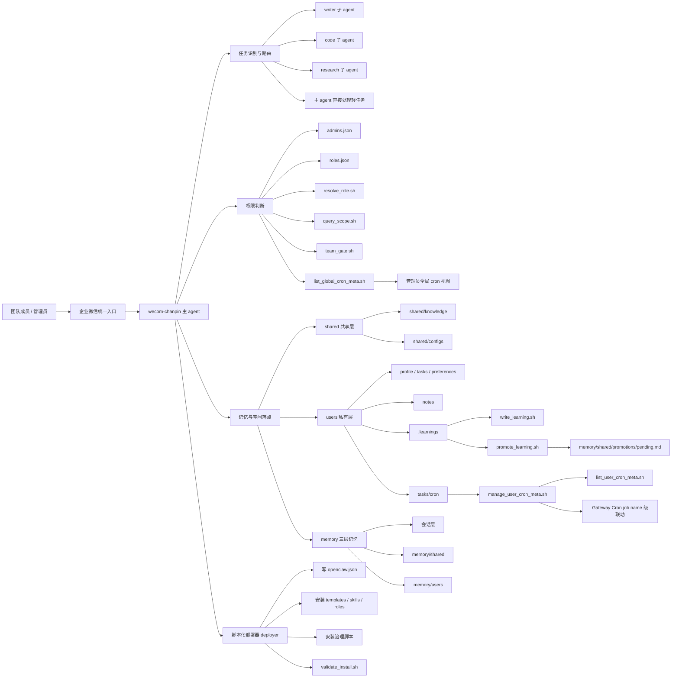

# teams 空间操作使用说明

> 适用对象：产研团队成员、管理员、部署维护者。
> 目标：用最直观的方式说明当前 teams 空间已经具备哪些功能，以及每个功能怎么用。

- --

## 一、先看整体使用方式

当前这套 teams 空间的核心使用原则很简单：

1. **普通成员主要通过企微对话来使用**
2. **管理员可以额外查看全局配置和全局任务元数据**
3. **部署维护者通过脚本和 deployer 做初始化、排查和验收**

所以这份说明会分成三类：

- 成员日常使用功能
- 管理员治理功能
- 运维/部署功能



- --

## 二、成员日常使用功能

### 功能 1：初始化我的个人空间

#### 功能说明
当成员第一次进入 teams 空间时，需要先初始化自己的私有空间。

初始化后会自动得到：

- 个人 profile
- 个人 tasks
- 个人 preferences
- 个人 notes
- 个人 `.learnings`
- 个人 `tasks/cron`
- 个人 `memory/users/<userid>/`

#### 对话示例
* *用户：**
> 初始化我的空间

* *系统预期行为：**
- 创建该成员对应的用户目录
- 创建 profile/tasks/preferences/notes/learnings/cron/memory 等基础文件和目录
- 返回初始化成功提示

#### 底层对应脚本
- `scripts/init_user_space.sh <userid>`

- --

### 功能 2：普通问答 / 日常咨询

#### 功能说明
成员可以直接在企微里把它当作团队 AI 助手使用，提日常问题、问规则、查说明。

#### 对话示例
* *用户：**
> 当前我们 teams 空间支持哪些能力？

* *系统预期行为：**
- 返回当前已接入的空间能力概览
- 优先说明共享层、私有层、权限、子 agent、cron、learnings 等核心模块

- --

### 功能 3：文档类任务自动走 writer 能力

#### 功能说明
当用户发起的是写作类任务，比如日报、周报、会议纪要、总结、润色等，主 agent 应按 writer 路线处理。

当前目标模式是：
- 主 agent 识别任务类型
- 显式委派给 writer 子 agent

#### 对话示例
* *用户：**
> 帮我把今天的会议内容整理成纪要

* *系统预期行为：**
- 识别为文档类任务
- 优先走 writer 路线
- 输出更适合阅读和分享的纪要格式

- --

### 功能 4：代码类任务自动走 code 能力

#### 功能说明
如果是代码审查、报错排查、接口设计、技术方案类任务，应优先走 code 路线。

#### 对话示例
* *用户：**
> 帮我看看这个 Python 报错是什么原因

* *系统预期行为：**
- 识别为代码类任务
- 按 code 角色处理
- 给出定位、原因、修复建议

- --

### 功能 5：研究/检索类任务自动走 research 能力

#### 功能说明
如果是知识检索、规范查询、资料整合、长文总结类任务，应优先走 research 路线。

#### 对话示例
* *用户：**
> 帮我整理一下 OpenClaw 的 cron 机制和 heartbeat 的区别

* *系统预期行为：**
- 识别为 research 类任务
- 汇总资料并输出结构化说明

- --

### 功能 6：记录个人 learning

#### 功能说明
成员可以把自己的经验、错误、需求沉淀到自己的 `.learnings/` 中。

当前已有：
- `LEARNINGS.md`
- `ERRORS.md`
- `FEATURE_REQUESTS.md`

#### 对话示例
* *用户：**
> 记一下，我希望日报提醒默认工作日 17:30 触发

* *系统理想行为：**
- 把这条需求记入用户自己的 feature requests / learnings

#### 当前底层脚本
- `scripts/write_learning.sh <userid> learning|error|feature <text>`

#### 管理员/运维侧示例
```bash
bash ~/.openclaw/teams/chanpin/scripts/write_learning.sh zhangsan feature "希望日报提醒默认工作日 17:30 触发"
```

- --

### 功能 7：创建个人 cron 元数据

#### 功能说明
成员可以拥有自己的任务提醒元数据，比如日报、周报、个人提醒。

当前已经支持：
- 写入 cron 元数据
- 查询 cron 元数据
- 删除 cron 元数据
- 与真实 Gateway cron 做 **job name 级联动**

#### 对话示例
* *用户：**
> 帮我加一个工作日 17:30 的日报提醒

* *系统理想行为：**
- 为当前用户创建一条 cron 元数据
- 计划内容写成日报提醒
- 后续与真实 cron 联动

#### 管理员/运维侧示例
```bash
bash ~/.openclaw/teams/chanpin/scripts/manage_user_cron_meta.sh add zhangsan daily_report "30 17 * * 1-5" "工作日 17:30 提醒我写日报"
```

- --

### 功能 8：查看我自己的 cron 元数据

#### 功能说明
每位成员默认只能查看自己的定时任务元数据。

#### 对话示例
* *用户：**
> 看看我现在有哪些提醒任务

* *系统理想行为：**
- 只返回当前用户自己的 cron 元数据
- 不暴露别人的任务

#### 管理员/运维侧示例
```bash
bash ~/.openclaw/teams/chanpin/scripts/list_user_cron_meta.sh zhangsan
```

- --

### 功能 9：把个人 learnings 提升到共享待审核区

#### 功能说明
如果某条经验已经不仅仅是个人经验，而是适合作为团队公共经验，可以先提升到共享待审核区。

当前机制：
- 默认先写到 `memory/shared/promotions/pending.md`
- 状态为 `pending-review`
- 默认不直接自动写入 `MEMORY.md`

#### 对话示例
* *用户：**
> 这条经验挺通用的，帮我提升为团队共享经验：子 agent 显式委派比 hook 路由更稳

* *系统理想行为：**
- 把该内容写入共享待审核区
- 标记为待确认

#### 管理员/运维侧示例
```bash
bash ~/.openclaw/teams/chanpin/scripts/promote_learning.sh zhangsan learning "子 agent 显式委派比 hook 路由更稳"
```

- --

## 三、管理员治理功能

### 功能 10：识别某个成员是不是管理员

#### 功能说明
管理员身份由：
- `shared/configs/admins.json`
- `shared/configs/roles.json`

共同决定。

#### 对话示例
* *管理员：**
> 帮我确认一下 zhangsan 现在是不是管理员

* *系统理想行为：**
- 返回该 userid 的角色信息
- 展示权限来源和权限范围

#### 管理员侧脚本示例
```bash
bash ~/.openclaw/teams/chanpin/scripts/resolve_role.sh zhangsan
```

- --

### 功能 11：判断某个用户是否有权访问某类资源

#### 功能说明
当前已支持判断的资源包括：

- `own-space`
- `own-tasks`
- `own-learnings`
- `shared-configs`
- `global-tasks`
- `system-status`

#### 对话示例
* *管理员：**
> 普通用户能不能查看全局任务？

* *系统理想行为：**
- 返回权限判断结果
- 说明普通用户默认不允许看全局任务

#### 管理员侧脚本示例
```bash
bash ~/.openclaw/teams/chanpin/scripts/query_scope.sh zhangsan global-tasks
```

- --

### 功能 12：管理员查看全体成员的 cron 元数据概览

#### 功能说明
当前已经有管理员全局视图骨架，用于查看各成员的 cron 元数据。

#### 对话示例
* *管理员：**
> 帮我看一下团队里每个人都有哪些提醒任务

* *系统理想行为：**
- 先判断当前用户是否 admin
- 如果是 admin，返回全局视图
- 如果不是 admin，返回无权限提示

#### 管理员侧脚本示例
```bash
bash ~/.openclaw/teams/chanpin/scripts/list_global_cron_meta.sh xulanzhong
```

- --

### 功能 13：team 权限入口骨架

#### 功能说明
当前已经补上了 `team_gate.sh`，作为 team 层统一资源访问入口的骨架。

它的作用不是最终用户直接使用，而是为后续接入真实企微消息入口预留统一入口。

#### 对话示例
* *管理员：**
> 未来如果用户查“我的任务”和“全局任务”，系统怎么分流？

* *系统回答重点：**
- 先经 `team_gate.sh`
- 再走 `query_scope.sh`
- 根据角色决定能不能返回结果

#### 管理员侧脚本示例
```bash
bash ~/.openclaw/teams/chanpin/scripts/team_gate.sh xulanzhong own-tasks
```

- --

## 四、运维 / 部署功能

### 功能 14：初始化整个 team 空间

#### 功能说明
用于创建 team 基础目录和规则结构。

#### 运维侧示例
```bash
bash ~/.openclaw/teams/chanpin/scripts/init_team_space.sh
```

#### 适用场景
- 新环境初始化
- 重建 team 根空间结构

- --

### 功能 15：使用 deployer 复制这套方案到新服务器

#### 功能说明
当前已经有 deployer，可把 team 空间的大部分治理能力复制到新环境。

#### 运维侧示例
```bash
cd 03-Projects/wecom-v61-deployer
cp .env.example .env
bash deploy_v61.sh
```

#### 预期结果
- 生成 team 目录
- 写主配置
- 安装模板
- 安装 skills / roles
- 安装治理脚本
- 提供基础验收入口

- --

### 功能 16：执行安装验收

#### 功能说明
当前可通过 `validate_install.sh` 做基础验收。

#### 运维侧示例
```bash
bash 03-Projects/wecom-v61-deployer/validate_install.sh
```

#### 当前能力
- 检查基础目录
- 检查主配置
- 检查 agent 语义
- 提示手工验证项

#### 当前边界
- 自动巡检报告脚本已有骨架，但还没有稳定落盘成功

- --

## 五、当前最重要的边界说明

为了避免误解，这里把当前还没 fully done 的部分也明确说一下。

### 1. 用户级 cron 已经开始联动真实 Gateway cron
但目前是：
- **job name 级联动可用**
- `gatewayCronJobId` 稳定回填仍待补强

### 2. learnings 提升共享层已经有最小闭环
但目前是：
- 提升到共享待审核区可用
- 还没有自动审核/自动写入正式共享知识层

### 3. 自动巡检报告还没完成
当前：
- `validate_install.sh` 可用
- `validate_install_report.sh` 还未稳定生成报告文件

- --

## 六、最推荐的团队使用姿势

如果你问“现在这套系统最适合怎么用”，我建议是：

### 普通成员
- 先初始化空间
- 平时直接在企微里提需求
- 把自己的 learnings 和提醒需求逐步沉淀下来

### 管理员
- 维护管理员名单和角色权限
- 查看全局 cron 元数据
- 审核是否把成员经验提升到共享层

### 运维/部署者
- 用 deployer 复制环境
- 用验收脚本做基础检查
- 持续推进入口接线和自动巡检报告

- --

## 七、一句话总结

这套 teams 空间现在已经不只是“一个机器人能回答问题”，而是开始具备：

- 用户空间
- 权限边界
- 三层记忆
- 独立 learnings
- 共享提升机制
- 用户级 cron
- 管理员全局视图骨架
- 子 agent 分工
- 可复制部署骨架

* *它已经是一套可用、可治理、可持续演进的团队 AI 工作空间。**
