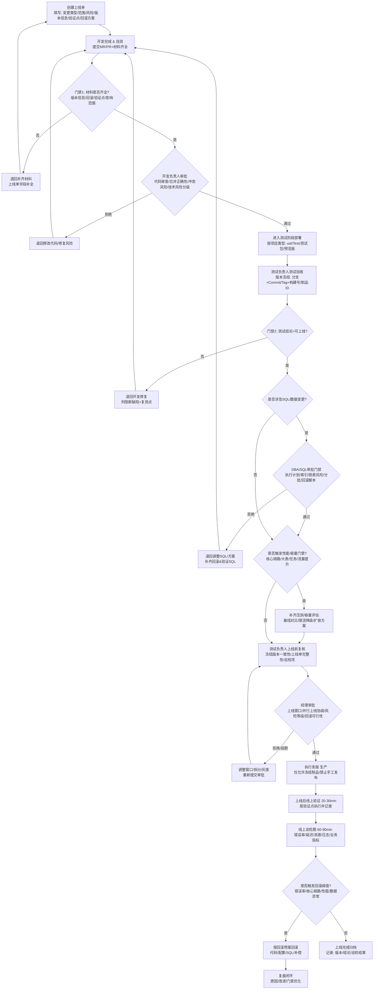
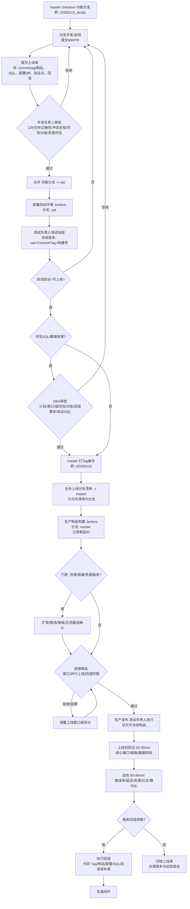
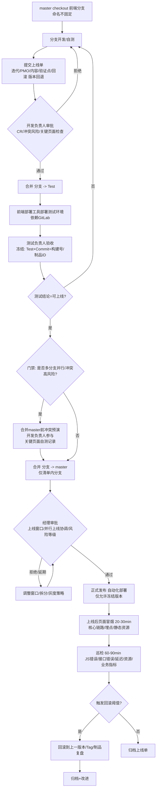
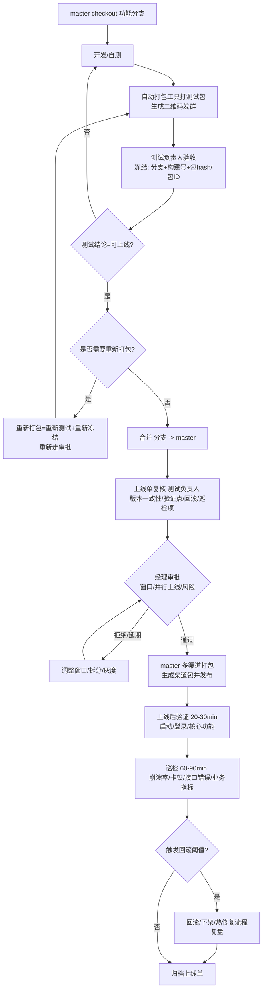
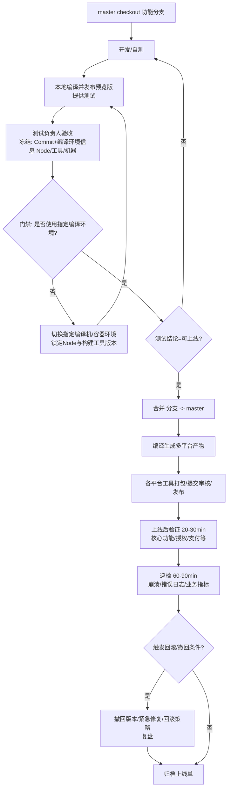
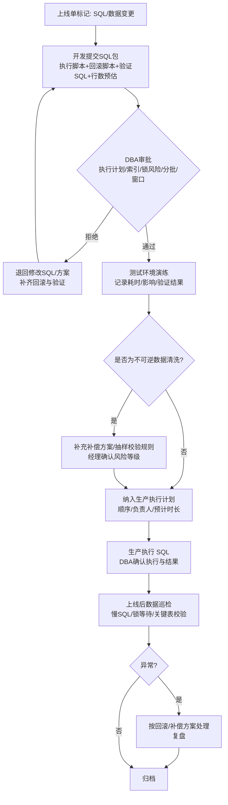
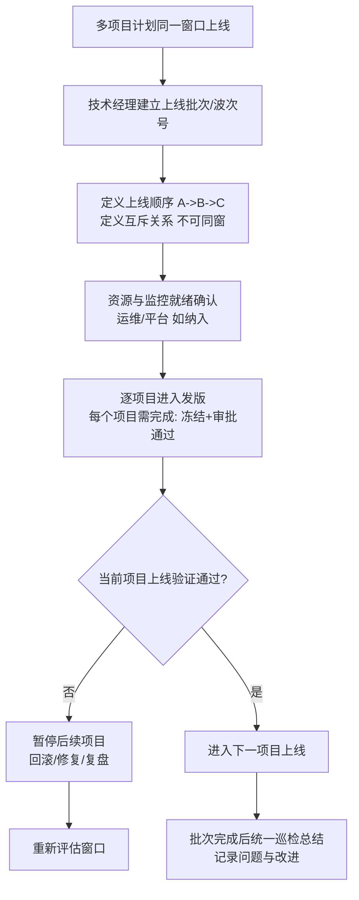
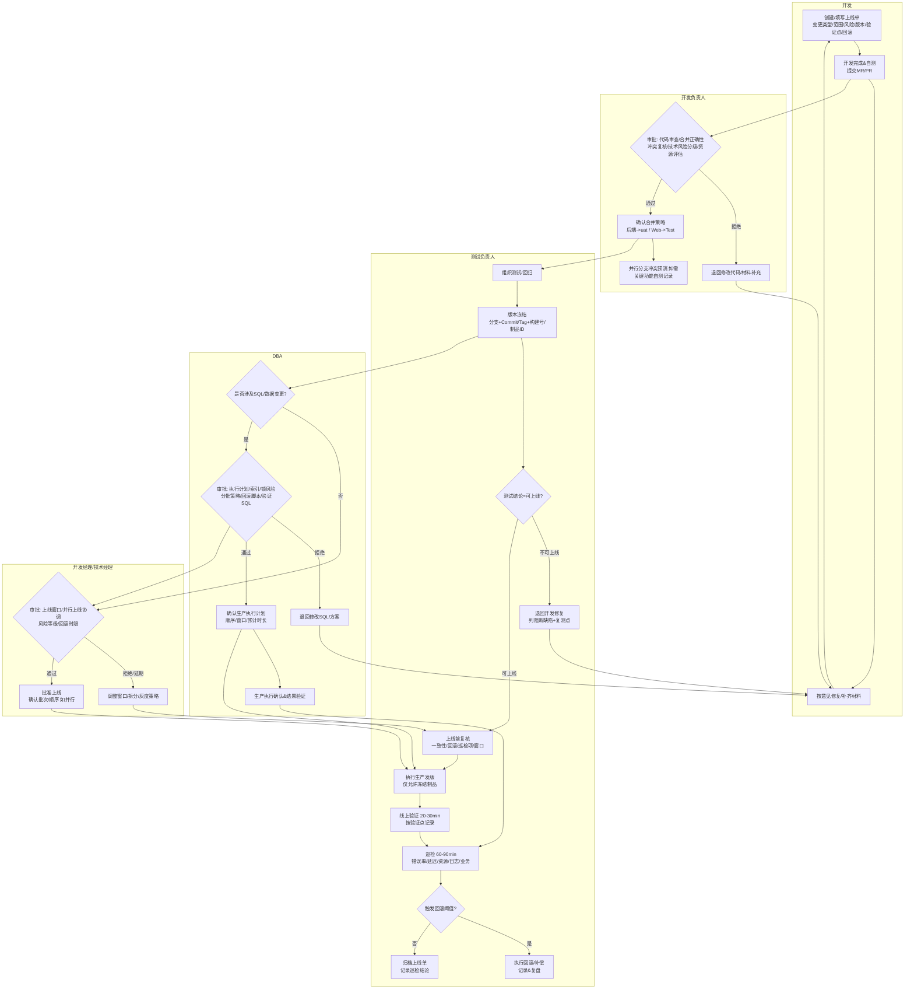

# **《2026_IT 项目上线发版流程规范（详细版）》**

>重新梳理了下项目上线,发版相关流程规范,包括了角色,职责,审批流,业务端等,为后续平台化提供依据

## **0. 术语与统一口径（平台化必备）**

- **上线单**：一次上线的唯一主记录（ID），包含范围、版本、审批、执行、验证、巡检、回滚与复盘。
- **冻结版本**：测试负责人确认“可上线”的唯一版本标识（必须包含：分支+CommitID/Tag + 构建号/制品ID）。
- **制品（Artifact）**：可部署的构建产物（后端包/镜像、前端构建产物、App 安装包、小程序产物）。
- **门禁（Gate）**：平台化强校验规则，不满足则不可进入下一环节/不可发版。
- **变更类型**：后端 / Web / App / 小程序 / 配置变更 / 数据变更（SQL、数据清洗）/ 资源变更。

- -----

## **1. 文档目的**

为规范 IT 项目迭代上线流程，提高代码质量与上线成功率，防止：

- 发错版本/发漏版本
- 合并冲突或误合并导致缺陷
- 上线代码 ≠ 测试代码
- SQL 不健壮导致性能/数据风险
- 责任不清、缺乏留痕与可追溯

- -----

## **2. 适用范围**

适用于：

- 后端服务
- Web 前端
- App（Android/iOS）
- 小程序（微信/支付宝/其他）

- -----

## **3. 总体治理目标与硬规则（“红线条款”）**

### **3.1 红线（违反即禁止上线）**

1. **未冻结版本禁止上线**（无分支+Commit/Tag+制品ID）
2. **测试未出“可上线结论”禁止上线**
3. **SQL/数据变更未审批禁止上线**
4. **无回滚方案禁止上线**
5. **生产发布不允许手工拷贝代码/包**（必须来自流水线制品或受控打包）
6. **敏感数据/日志泄露风险未确认禁止上线**

### **3.2 统一分支来源原则**

- 所有需求/迭代必须从 master 拉取新分支开发

  禁止：

- 从正在开发分支拉新分支

- 从测试分支拉新分支

- 从未完成需求分支拉紧急需求

### **3.3 测试版本即上线版本**

- 测试环境部署产物/测试包 与 正式上线产物必须：

  

  - 同一分支
  - 同一 Commit/Tag
  - 同一构建号/制品ID（或可严格映射）

  

- -----

## **4. 角色、权限与量化职责（平台化字段）**

> 建议平台上每个角色都有“必须勾选/上传”的清单项，未完成不可流转。

### **4.1 角色与否决权**

| **角色**            | **权限/否决**                  | **关键责任**                               |
| ------------------- | ------------------------------ | ------------------------------------------ |
| 开发人员            | 无否决                         | 开发、自测、提交材料、修复缺陷             |
| 开发负责人          | 可否决                         | 合并正确性、技术风险与冲突处置             |
| 测试负责人          | **最终否决/最终发版**          | 测试验收、版本冻结、发版执行或发版确认     |
| 开发经理/技术经理   | 可否决                         | 上线窗口、业务影响、风险分级、并行上线协调 |
| DBA（涉及SQL/数据） | 可否决                         | SQL性能与安全、回滚、执行方案              |
| 运维/平台（如有）   | 建议无否决（可阻断不合规操作） | 资源与发布通道保障、监控、容量             |

### **4.2 各角色“量化任务清单”（建议平台做成勾选项）**

#### **A) 开发人员（必须完成）**

- 代码提交至功能分支，关联需求/缺陷ID

- 自测通过（至少：核心链路/接口冒烟）

- 提交上线单并填写字段：

  

  - 变更类型（后端/Web/App/小程序/配置/SQL/数据清洗/资源）
  - 版本信息（分支、CommitID、Tag、构建号/制品ID）
  - 影响范围（模块/接口/页面/业务线）
  - 风险说明（含数据/性能/安全/兼容）
  - 回滚方案（代码回滚/配置回滚/SQL回滚/数据回滚）
  - 上线验证点（3~10条可执行检查项）

  

- 若涉及配置：提供配置差异清单（key 级别）与回滚配置

- 若涉及数据清洗：提供影响评估与验证SQL

#### **B) 开发负责人（必须完成）**

- Code Review 结论：通过/拒绝（拒绝必须填原因）
- 合并正确性确认：本次上线分支清单（明确列出）
- 冲突处理复核：冲突文件/模块清单 + 关键功能自测结果
- 技术风险分级（低/中/高）并给出措施（灰度/限流/降级/开关）
- 资源影响评估（CPU/内存/连接数/缓存/队列等）是否需要扩容

#### **C) 测试负责人（必须完成，重点）**

- 测试计划：覆盖范围（功能/回归/兼容/安全/性能选项）
- **版本冻结**：记录分支+Commit/Tag+构建号/制品ID（必填）
- 一致性校验：测试部署产物与冻结版本一致（必勾）
- 测试结论：可上线/不可上线（不可上线需列阻断缺陷）
- 上线前复核：上线单字段完整性（SQL/回滚/验证点/窗口）
- 发版执行/确认：仅允许冻结制品发版
- 上线后验证：按验证点执行并记录结果
- 上线后巡检：按巡检机制完成并归档

#### **D) DBA（触发时必须完成）**

- SQL 变更分类：DDL/DML/清洗/索引/大表
- 执行影响：行数预估、锁表风险、执行时间预估
- 性能风险：执行计划、索引命中、全表扫描确认
- 执行策略：分批/限速/低峰窗口/灰度
- 回滚方案：可逆性说明 + 回滚脚本 + 回滚窗口
- 生产执行确认：执行顺序、负责人、验证SQL

#### **E) 开发经理/技术经理（必须完成）**

- 上线窗口审批：是否允许工作时间上线（默认不允许）
- 风险等级确认：低/中/高（高风险需灰度或拆分）
- 并行上线协调：多项目同窗上线的顺序与互斥策略
- 资源与容量确认：是否需要扩容/限流/降级预案
- 回滚可行性确认：回滚耗时是否可接受（分钟级/小时级）
- 上线时长与验证时长审批（防止拉长影响业务）

#### **F) 运维/平台（如纳入流程）**

- 发布通道可用性确认（Jenkins/GitLab/发布系统）
- 服务器资源/容器资源检查（CPU/内存/磁盘/连接数）
- 监控告警就绪（关键指标已配置/阈值合理）
- 发布权限控制：仅允许测试负责人执行生产发布动作

- -----

## **5. 上线窗口与时长规范（强制建议，可按公司调整）**

### **5.1 默认上线窗口（建议）**

- **常规上线窗口**：工作日 **18:00–23:00**（按具体实际情况）
- **禁止窗口**：工作日 10:00–18:00（业务高峰默认禁止）
- **紧急上线**：需走“紧急变更流程”（见 5.3）

> 平台字段：上线开始时间、预计时长、验证时长、巡检结束时间。

### **5.2 时长基线（建议可配置）**

- **部署时长**：15–30 分钟（后端/前端），App/小程序按渠道/审核不同
- **线上验证时长**：至少 20–30 分钟
- **线上巡检观察**：至少 60 分钟（高风险 2–4 小时）

### **5.3 紧急变更（可选章节）**

满足任一即“紧急”：

- 生产故障/严重业务损失

- 安全漏洞修复

- 法规合规要求

  紧急变更要求：

- 审批人：开发负责人 + 测试负责人 + 技术经理（至少三方）

- 可简化测试范围，但必须补做回归与复盘

- -----

## **6. 变更分类与对应门禁（平台化规则）**

| **变更类型**            | **必须审批/门禁**              | **必须产出物**                     |
| ----------------------- | ------------------------------ | ---------------------------------- |
| 纯代码（无SQL/无配置）  | 开发负责人 + 测试负责人 + 经理 | 冻结版本、验证点、回滚方案         |
| 配置变更                | 增加配置差异清单门禁           | 配置diff、回滚配置                 |
| SQL/数据变更            | **强制 DBA 审核**              | 执行脚本+回滚脚本+验证SQL+执行策略 |
| 数据清洗/修复           | 经理风险确认 + DBA（如SQL）    | 影响评估、抽样校验、回滚或补偿     |
| 资源/容量变更           | 运维/平台确认                  | 资源评估、扩容/回退方案            |
| 高风险（性能/核心链路） | 增加性能/压测门禁              | 压测报告/基线对比（可抽样）        |

- -----

## **7. 各类型项目详细流程（含可平台化节点）**

### **7.1 后端发版流程（master + uat + tag）**

* *开发阶段**

1. master 拉分支（例：20260115_dicdai）
2. 分支开发、自测、提交 MR/PR
3. 开发负责人审核与合并策略确认

* *测试阶段（必须走 uat）**

1)（如有）执行 SQL（测试环境）

2)（如有）配置变更（测试环境）

3) 功能分支合并到 uat
4) Jenkins 构建部署 uat
5) 测试负责人测试并**冻结版本**（Commit/Tag/构建号）

* *回归主干（上线准备）**

1. master 打 tag（例：t20260115）
2. 将本次上线分支清单合并到 master
3. Jenkins 构建 master 制品（制品ID必须记录）

* *生产上线**

1)（如有）SQL 执行（生产）+ DBA确认

2)（如有）配置变更（生产）

3) 测试负责人使用冻结制品发版
4) 线上验证 + 巡检 + 归档

- -----

### **7.2 Web 前端发版流程（Test 分支测试、master 发布）**

* *开发阶段**

- master 拉分支 → 开发自测 → 提交上线单

* *测试阶段**

1. 功能分支合并到 Test 分支
2. 前端部署工具自动部署测试环境
3. 测试负责人验收并冻结版本（Commit/构建号）

* *上线阶段**

1. 功能分支合并到 master（合并冲突由开发负责人参与复核）
2. 填写上线单：原因/迭代/PMO/内容/验证点
3. 使用部署工具自动发布生产
4. 线上页面冒烟 + 核心链路验证 + 巡检

* *前端并行分支风险门禁（强制）**

- 合并 master 前必须填写：**上线分支清单**
- 冲突解决后必须勾选：**关键页面自测已完成**

- -----

### **7.3 App 发版流程（测试包二维码、多渠道打包）**

* *测试阶段**

1. 在当前分支使用自动打包工具生成测试包
2. 生成二维码并发群
3. 测试负责人验收并冻结：分支+构建号+包hash（或包文件ID）

* *上线阶段**

1. 功能分支合并到 master
2. 上线单复核（每项目独立上线单）
3. master 执行多渠道打包生成渠道包并发布
4. 上线后监控与巡检（崩溃率/启动耗时/核心功能）

* *硬规则**

- 测试通过后若重新打包：必须重新冻结与复测、重新审批

- -----

### **7.4 小程序发版流程（本地编译 + 环境一致性）**

* *测试阶段**

1. 当前分支本地编译
2. 发布预览版提供测试
3. 测试负责人冻结：Commit + 编译环境信息（Node版本/工具版本/机器标识）

* *上线阶段**

1. 合并到 master
2. 编译生成各平台产物
3. 各平台工具打包、提交审核、发布

* *环境控制（强制门禁）**

- 必须使用“指定编译机器/容器环境”
- Node 版本、构建工具版本必须匹配基线
- 不满足则禁止正式打包发布

- -----

## **8. 安全、性能、业务验证要求（量化）**

### **8.1 安全（脱敏/权限/日志）**

* *开发/测试必须确认：**

- 日志中不输出敏感字段（手机号、身份证、token、密码、密钥等）
- 数据展示/导出是否脱敏（按业务规则）
- 权限校验未被绕过（至少覆盖关键接口/页面）
- 配置中密钥不落库/不明文提交（若存在必须整改）

* *平台字段建议：**

- “是否涉及敏感数据”：是/否
- “脱敏策略确认”：选择项（手机号/证件号/地址/其他）
- “安全自检结果”：通过/不通过 + 备注

### **8.2 性能（压测/容量/慢SQL）**

触发条件（任一满足需补充性能项）：

- 核心接口/核心链路改动
- SQL大表/批量更新/新增索引
- 新增定时任务/消息消费逻辑
- 预估流量上涨/营销活动

要求（可按层级简化）：

- 与历史基线对比（响应时间/吞吐/错误率）
- 慢SQL风险评估（DBA或开发负责人）
- 容量评估（CPU/内存/连接池/线程池）

平台字段建议：

- “性能风险等级”：低/中/高
- “是否完成压测”：是/否（附报告或链接）
- “容量评估结论”：可承载/需扩容/需限流

### **8.3 业务验证（上线后必须执行）**

至少包含：

- 核心下单/支付/登录/查询等关键路径（按系统定义）
- 核心报表/对账（如适用）
- 关键告警指标无异常（错误率/超时/队列堆积）

平台字段建议：上传“验证截图/日志链接/监控截图”。

- -----

## **9. SQL / 数据变更 / 数据清洗规范（重点）**

### **9.1 SQL/数据变更上线包必须包含**

- 执行脚本（按顺序编号）
- 回滚脚本（或不可逆说明 + 补偿方案）
- 验证SQL（执行前/后对比）
- 执行窗口与预计时长
- 影响范围（表、行数预估、锁风险）

### **9.2 数据清洗（额外要求）**

- 影响评估（影响多少行/多少用户/多少订单）
- 抽样校验方案（抽样规则、样本量）
- 风险说明（不可逆/对账影响/报表影响）
- 回滚/补偿方案（必须）

- -----

## **10. 并行上线管理（多项目同窗）**

### **10.1 并行上线的限制（建议）**

- 同一上线窗口最多允许 **N 个项目**（可配置）
- 核心系统与核心链路变更不得与其他高风险变更同窗上线

### **10.2 并行上线协调规则**

- 由技术经理给出：

  

  - 上线顺序（A→B→C）
  - 互斥关系（某些系统不可同时）
  - 验证负责人分配

  

- 平台需要支持：

  

  - “上线波次/批次号”
  - “依赖关系/阻塞关系”

  

- -----

## **11. 回滚方案规范（上线前必须“可执行”）**

### **11.1 回滚类型**

- **代码回滚**：回滚到上一个 Tag/制品
- **配置回滚**：回滚配置差异项
- **SQL回滚**：回滚脚本/补偿脚本
- **数据回滚/补偿**：不可逆清洗必须有补偿路径

### **11.2 回滚触发条件（示例，可配置）**

- 错误率超过阈值（如 1% 持续 5 分钟）
- 核心链路失败（登录/支付/下单）
- 性能显著恶化（P95 延迟上升超过 X%）
- 数据异常（对账差异、关键表数据异常）

### **11.3 回滚时限要求（建议）**

- 代码回滚：**15 分钟内可启动**
- 回滚完成验证：**30 分钟内完成**
- 数据类回滚：明确预计时长与影响（可能>小时）

- -----

## **12. 上线后线上巡检机制**

> 目的：把“上线完成”从“部署结束”升级为“运行稳定确认”。

### **12.1 巡检时间段（建议）**

- **T+0 ~ T+30 分钟**：强制冒烟与核心指标观察
- **T+30 ~ T+90 分钟**：巡检期（常规）
- **高风险变更**：延长至 T+4 小时（或次日早晨复检）

### **12.2 巡检项（平台化清单）**

* *基础巡检（所有项目必做）**

- 错误率/异常量（应用错误、接口5xx、前端JS错误）
- 延迟（P95/P99 或关键接口耗时）
- 资源（CPU/内存/磁盘/连接数）
- 日志关键字（error/exception/timeout/oom）
- 业务核心指标（订单量、支付成功率、登录成功率等）

* *SQL/数据变更巡检（触发时必做）**

- 慢SQL数与耗时趋势
- 锁等待/阻塞
- 关键表行数变化符合预期
- 对账/报表抽样校验

* *巡检结论**

- 正常（归档）
- 异常但可观察（记录+设观察阈值）
- 触发回滚（进入回滚流程+复盘）

- -----

## **13. 服务器资源与部署保障**

上线前必须确认：

- 生产环境资源水位正常（CPU/内存/磁盘/连接数）
- 发布节点健康（可用实例数满足要求）
- 若需扩容：扩容已完成且验证通过
- 若使用灰度：灰度比例、回切策略明确

平台字段建议：

- “是否需要扩容”：是/否
- “扩容单/记录”：链接或编号
- “灰度策略”：无/按比例/按用户/按机房

- -----

## **14. 上线单字段模板（用于平台化）**

* *必填字段**

- 上线单ID、项目、负责人
- 上线类型：后端/Web/App/小程序/配置/SQL/数据清洗/资源
- 分支、CommitID、Tag、构建号/制品ID（冻结版本）
- 上线内容摘要（可结构化：模块/接口/页面）
- 影响范围与风险等级
- 上线窗口：开始时间/预计上线时长/预计验证时长
- 回滚方案（类型+步骤+预计时长）
- 验证点清单（3~10条）
- SQL/数据：脚本、回滚脚本、验证SQL（如涉及）
- 巡检结论记录（上线后补填）

- -----

## **15. 事故责任划分（建议，保持但更可执行）**

| **问题类型**         | **第一责任**         | **复核责任**           |
| -------------------- | -------------------- | ---------------------- |
| 发错版本/版本不一致  | 测试负责人（发版者） | 开发负责人（版本材料） |
| 合并错误/误合并      | 开发负责人           | 开发人员               |
| SQL性能问题          | DBA/SQL审批人        | 开发负责人             |
| 测试不足导致线上缺陷 | 测试负责人           | 开发负责人             |
| 脱敏/安全问题        | 开发负责人           | 测试负责人（验收项）   |

- -----

## **16. 附则**

- 本规范为 V2.1
- 自发布之日起执行
- 若与紧急故障处理冲突，以故障处理优先，但必须补齐记录与复盘。

- -----

## 17. 流程图

### **1) 总览：统一审批与发版总流程（带门禁/窗口/巡检/回滚）**

- -----

## **2) 后端：分支/测试/回归主干/生产部署流程（含现有步骤 + V2.1 门禁）**

- -----

## **3) Web 前端：Test 分支部署测试、master 自动化发布（含并行分支冲突门禁）**

- -----

## **4) App：测试包二维码、master 多渠道打包发布（含重新打包门禁）**

- -----

## **5) 小程序：本地编译预览测试 + 环境一致性控制（强制门禁）**

- -----

## **6) 补充：SQL/数据清洗专项流程**

- -----

## **7) 补充：并行上线（批次/互斥/顺序）协调流程**

- -----

## **8) 审批流泳道图（按角色：开发/开发负责人/测试负责人/经理/DBA）**

- -----

