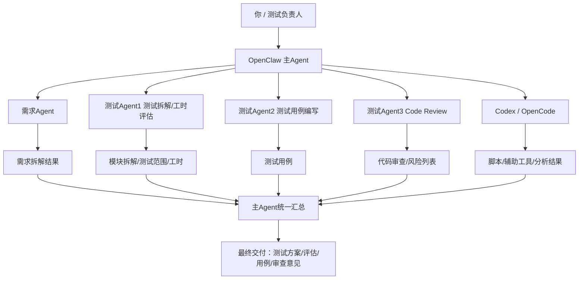

可以，这套方案能为测试工程师做的事很多，但前提是别把它理解成“让 AI 替你测”，而是：

让 OpenClaw 做测试工作的编排层，让不同 agent 分别承担需求分析、测试设计、用例生成、代码审查这些不同职责。

我先直接给你一版可落地方案雏形。

───

一、先说结论

你这个方向是对的，而且很适合测试岗。

最适合你的不是“单个 AI 测试 agent”，而是：

OpenClaw 主控 + 多个测试子 agent + 必要时调用 Codex/OpenCode 作为执行引擎

这套体系最适合做 5 类事：

1. 需求澄清与质量前移
2. 测试范围拆解
3. 工时评估
4. 测试用例生成
5. 代码审查与风险识别

也就是说，它最强的地方不是“替你点页面”，而是：

替你把测试分析、测试设计、测试审查这些高脑力环节拆开并行化。

───

二、你这套测试编排系统的推荐定位

我建议你把它定义成：

测试工作编排系统（Testing Orchestration System）

而不是“测试自动化系统”。

因为你现在的 5 个角色，其实更像测试团队里的不同职能位。

───

三、推荐的总体架构

───

四、主 Agent 怎么定位

OpenClaw 主 Agent

主 Agent 不负责做所有细活，它负责：

• 接收任务
• 判断任务类型
• 拆解任务
• 选择子 agent
• 汇总结果
• 判断是否需要调用 Codex/OpenCode
• 最终交付统一结论

一句话：

主 Agent 是测试经理 / 调度员，不是所有活都自己干。

───

五、你设想的 5 个 agent，我帮你细化一下

───

1）需求 Agent

职责

根据：

• 需求链接
• 历史需求
• PRD
• Jira / 禅道 / 飞书文档
• 会议纪要
• 历史缺陷
• 相关代码 / 接口文档

做这些事：

输出内容

• 需求拆解
• 核心流程梳理
• 前后逻辑检查
• 边界条件识别
• 缺失项 / 模糊项 / 不完整项
• 风险问题清单
• 需要产品 / 开发确认的问题列表

适合的提示方向

它不是写用例，而是先回答：

这个需求有没有说清楚？哪里容易埋雷？

价值

这是测试前移里最值钱的一步。

───

2）测试 Agent1：模块拆解 + 工时评估

职责

基于：

• 原始需求
• 需求 Agent 的产出

进一步做：

• 功能模块拆分
• 测试范围划分
• 测试类型划分
• 回归影响面识别
• 测试工时评估

输出内容

建议它输出表格：

| 模块 | 变更类型 | 测试重点 | 风险级别 | 预估工时 |
| ---- | -------- | -------- | -------- | -------- |

再补：

• 是否需要联调
• 是否需要测试环境准备
• 是否需要测试数据准备
• 是否需要自动化回归

价值

这一步特别适合你现在的日常工作。

因为很多测试工时评估，本质上不是算时间，而是先拆对范围。

───

3）测试 Agent2：测试用例编写

职责

根据：

• 原始需求
• 需求 Agent 结果
• 测试 Agent1 的测试拆解

来生成：

• 功能测试用例
• 异常测试用例
• 边界测试用例
• 权限 / 角色 / 状态切换用例
• 回归建议点

输出内容

建议分层：

第一层：测试点清单

第二层：正式测试用例

第三层：高风险优先级

注意

这个 agent 不应该脱离前两个 agent 独立工作。
否则很容易直接“机械列用例”，但忽略业务逻辑漏洞。

───

4）测试 Agent3：Code Review

职责

这个 agent 很适合结合 Codex/OpenCode。

主要看：

• 实现是否符合需求
• 有没有明显逻辑漏洞
• 是否遗漏异常处理
• 状态流转是否合理
• 是否有边界遗漏
• 是否影响现有模块
• 测试点是否应该补充

输出内容

建议产出这几类：

• 逻辑风险
• 测试风险
• 回归风险
• 需要重点验证的代码路径
• 建议补测点
• 建议补自动化点

价值

这一步非常适合测试岗切入 AI coding 场景。
因为你不一定亲自写代码，但非常适合用 AI 帮你做第一轮代码审查。

───

5）Codex / OpenCode：执行引擎

Codex 不一定是“测试 agent”，它更适合做：

• 读代码
• 查调用链
• 分析改动影响面
• 生成测试辅助脚本
• 生成 mock 数据脚本
• 生成数据校验脚本
• 帮你快速做 review supporting evidence

也就是说：

Codex 更像测试体系里的“技术执行员”，不是测试经理。

───

六、最适合你的落地顺序

我不建议你一口气上 5 个 agent 一起跑。
最稳的是 3 阶段推进。

───

Phase 1：先做 3 个角色

先上这三个：

1. 主 Agent
2. 需求 Agent
3. 测试 Agent1（拆解 + 工时评估）

为什么

这是你日常最常用、价值最高、风险最低的组合。

你先把：

• 需求拆解
• 测试范围拆解
• 工时评估

这条链跑顺。

───

Phase 2：再加测试用例 Agent

等 Phase 1 稳了，再接：

4. 测试 Agent2（测试用例编写）

为什么

因为如果前面两步没跑顺，直接写用例很容易写成“表面完整，实际偏题”。

───

Phase 3：再接 Code Review + Codex

最后再加：

5. 测试 Agent3（code review）
6. Codex / OpenCode 执行层

为什么

这一步对代码上下文依赖更高，也更适合在你已有 coder / ACP 体系稳定后接入。

───

七、推荐的任务流

你后面可以把每个需求都按这条流转：

需求输入
→ 主Agent判断任务类型
→ 需求Agent做需求质量审查
→ 测试Agent1做模块拆解和工时评估
→ 测试Agent2补测试用例
→ 测试Agent3结合代码做风险审查
→ 必要时调用Codex/OpenCode做代码分析/脚本生成
→ 主Agent统一汇总输出

───

八、每个 agent 的“定义完成”建议

这个特别重要。
不然 agent 只会“输出点东西”，不会“按标准交付”。

───

需求 Agent 的 done

• 需求已拆解
• 主流程已梳理
• 缺失项已列出
• 风险点已列出
• 待确认问题已列出

───

测试 Agent1 的 done

• 测试模块已拆解
• 影响面已识别
• 测试范围已分层
• 工时已估算
• 高风险项已标记

───

测试 Agent2 的 done

• 用例覆盖主流程
• 覆盖异常/边界
• 标出优先级
• 标出适合自动化的用例

───

测试 Agent3 的 done

• 代码风险点已指出
• 需求与实现偏差已指出
• 建议补测点已列出
• 建议重点回归范围已列出

───

九、你这套方案最能解决什么问题

1. 需求质量前移

很多测试痛点不是测不动，而是需求一开始就不清。
需求 Agent 能提前帮你挡掉很多模糊需求。

2. 工时评估更有依据

不是拍脑袋，而是先拆模块再估时。

3. 用例质量更稳

因为它不是直接写，而是建立在需求拆解和测试范围拆解之后。

4. 测试更早介入代码质量

Code review agent 能让测试从“等提测”变

成“提前发现风险”。

5. 减少你在低价值重复劳动上的时间

让你把更多精力放在：

• 判断
• 策略
• 风险控制
• 关键问题确认

───

十、我建议你给这套系统取的名字

你可以叫它：

稳一点

• 测试编排系统
• 测试工作流 Agent 系统
• AI 测试协同工作流

更传播一点

• 一个测试人的 AI 小团队
• 单人测试团队的 Agent 编排系统
• 让 OpenClaw 帮我带测试团队

───

十一、我对这套方案的判断

这套方案很适合你，原因有三条：

1. 你本身就不是想把 AI 当点按钮工具，而是想做角色化、工作流化
2. 测试工作天然适合拆成：

• 分析
• 拆解
• 设计
• 审查

3. 你已经有：

• OpenClaw 主控
• skill 经验
• memory / .learnings
• ACP / codex / opencode
• 文档整理能力

也就是说，你现在不是从零开始，而是已经有地基了。

───

十二、我建议你下一步直接做什么

最实用的是这三步：

第一步

先只定义 3 个 agent：

• 主 Agent
• 需求 Agent
• 测试拆解 / 工时评估 Agent

第二步

拿一个真实需求跑通一次

第三步

把输出沉淀成模板：

• 需求审查模板
• 测试拆解模板
• 工时评估模板

这样很快就能跑起来。

───

如果你要，我下一步可以直接继续帮你做两件事里的一个：

1. 把这套方案整理成一篇完整 Markdown 文档
2. 直接帮你设计这 4~5 个 agent 的职责说明 + prompt 草稿