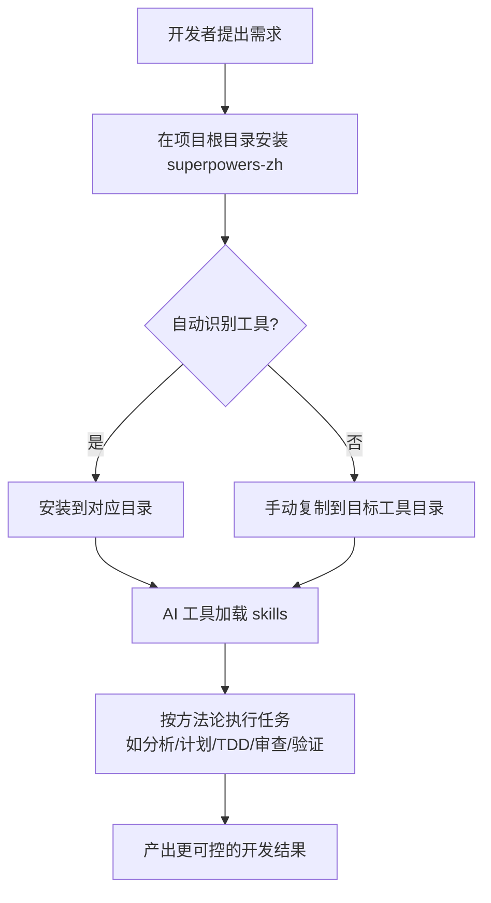

# 把 AI 编程工具从“能聊”变成“真能干活”，这个中文增强包有点东西

现在不少 AI 编程工具，最大的问题根本不是不会写代码。

而是太爱直接开写。

需求没问清，边界没摸明白，测试没想过，审查没走，哐哐一顿输出，最后人还得自己擦屁股。

这种感觉就像请了个干活很快的实习生，手脚麻利是真的，手一抖把厨房煤气一起打开也是真的。

这次看到的这个项目，解决的就是这个破事。

它不是再造一个 AI 编程工具。

而是给 Claude Code、Codex、Hermes Agent、OpenClaw、Cursor 这些工具，补上一套“应该怎么干活”的工作方法。

## 先说死结论：这玩意到底是啥

一句人话：它是一个给 17 款 AI 编程工具装“工作脑子”的中文增强包，让这些工具不只是会生成代码，还会按更靠谱的流程办事。

## 为什么这项目值得继续往下看

先把最关键的点摊开说。

| 值得看的点 | 具体是什么 | 放到真实工作里意味着什么 |
|---|---|---|
| 覆盖面够大 | 一共 20 个 skills，包含 14 个翻译能力 + 6 个中国开发场景原创能力 | 不用自己东拼西凑规则文件，拿来就能把常见研发流程补齐 |
| 工具适配够广 | 支持 17 款工具，覆盖 CLI、IDE 插件、Agent 框架 | 团队里不必强制只用一种工具，Claude Code、Codex、OpenClaw、Hermes Agent、Cursor 这类都能接 |
| 安装路径够省事 | `npx superpowers-zh` 会自动检测项目里的工具并安装到对应位置 | 少折腾配置，尤其适合一个仓库里已经有既定工具约定的团队 |
| 内容不是空话 | 覆盖头脑风暴、写计划、执行计划、TDD、调试、代码审查、完成前验证、并行 agent 等完整开发链路 | AI 不再只会“写一段代码”，而是更像按流程推进一项任务 |
| 中文场景补得准 | 额外补了中文代码审查、中文提交规范、中文技术文档、国内 Git/CI、MCP 构建、工作流执行器 | 对国内团队更友好，不会一股子生硬机翻味，也更贴近日常协作习惯 |

说白了，这项目香的地方不是“又多了点提示词”。

而是把很多人平时靠嘴反复提醒 AI 的那套方法论，沉成了可以反复复用的东西。

## 真正有用的，不只是翻译，而是把流程补齐了

### 第一层：先别急着写，先把脑子接上

项目里最基础的一批能力，是把“先想清楚再动手”这件事固化下来。

比如头脑风暴、编写计划、执行计划、测试驱动开发、系统化调试、完成前验证。

这在真实场景里特别重要。

很多 AI 工具最大的坑，不是不会写，而是写得太快，快到问题都还没被定义清楚。装上这套东西之后，它更容易先补问题、拆步骤、讲验证，再进入实现。

这意味着什么？

意味着你不用每次都像个监工一样反复喊：“先别写，先列方案”“先补测试”“先验证再说完成”。

### 第二层：不只会写代码，还会走协作流程

另一批能力更偏团队协作：请求代码审查、接收代码审查、派遣并行 Agent、子 Agent 驱动开发、Git Worktree 使用、完成开发分支。

这就不是“单兵写代码”了，而是开始碰研发现场真正麻烦的部分：并行任务、隔离开发、审查反馈、分支收尾。

放到真实工作里，这相当于不只是给 AI 一把螺丝刀，而是顺手给它配了工单流、质检员和收尾清单。

不然很多工具看起来猛，结果一到多人协作或者复杂任务，立马开始发飘。

### 第三层：中文团队常踩的坑，它专门补了

这个项目额外加的 6 个中国特色 skills，反而是最容易打动国内开发者的部分。

- 中文代码审查：更贴合国内团队沟通习惯
- 中文 Git 工作流：适配 Gitee、Coding、极狐 GitLab
- 中文技术文档：处理中英混排、中文排版、机翻味
- 中文提交规范：更贴合国内 commit message 习惯
- MCP 服务器构建：扩展 AI 工具边界
- 工作流执行器：在工具里跑多角色 YAML 工作流

这类补充的价值在于，它不是告诉你“世界上最标准的流程是什么”。

而是告诉你“在你现在这个中文团队里，怎么更容易真落地”。

### 第四层：适配 17 款工具，这点确实省命

它支持的范围很广：Claude Code、Copilot CLI、Hermes Agent、Cursor、Windsurf、Kiro、Gemini CLI、Codex CLI、Aider、Trae、VS Code、DeerFlow 2.0、OpenCode、OpenClaw、Qwen Code、Antigravity、Claw Code。

这个意义不只是“名单长”。

而是很多团队现实里本来就不是一种工具打天下。

有人在 CLI 里干活，有人在 IDE 里协作，有人还会接 Agent 框架。

这时候能一套 skills 同时覆盖多种入口，落地成本会小很多。

## 装起来麻不麻烦

整体看，上手门槛不高。

最省事的是直接跑一条命令，让它自动识别项目里的工具并安装到对应位置；如果自动识别不出来，也可以显式指定工具。

官方推荐安装方式是这一条：

```bash
cd /your/project
npx superpowers-zh
```

如果不想走自动安装，也可以手动把 skills 复制到对应目录：

```bash
# 克隆仓库
git clone https://github.com/jnMetaCode/superpowers-zh.git

# 复制 skills 到你的项目（选择你使用的工具）
cp -r superpowers-zh/skills /your/project/.claude/skills      # Claude Code / Copilot CLI
cp -r superpowers-zh/skills /your/project/.hermes/skills      # Hermes Agent
cp -r superpowers-zh/skills /your/project/.cursor/skills      # Cursor
cp -r superpowers-zh/skills /your/project/.codex/skills       # Codex CLI
cp -r superpowers-zh/skills /your/project/.kiro/steering      # Kiro
cp -r superpowers-zh/skills /your/project/skills/custom       # DeerFlow 2.0
cp -r superpowers-zh/skills /your/project/.trae/rules         # Trae
cp -r superpowers-zh/skills /your/project/.antigravity        # Antigravity
cp -r superpowers-zh/skills /your/project/.github/superpowers # VS Code (Copilot)
cp -r superpowers-zh/skills /your/project/skills              # OpenClaw
cp -r superpowers-zh/skills /your/project/.windsurf/skills   # Windsurf
cp -r superpowers-zh/skills /your/project/.gemini/skills     # Gemini CLI
cp -r superpowers-zh/skills /your/project/.aider/skills      # Aider
cp -r superpowers-zh/skills /your/project/.opencode/skills   # OpenCode
cp -r superpowers-zh/skills /your/project/.qwen/skills       # Qwen Code
cp -r superpowers-zh/skills /your/project/.claw/skills       # Claw Code（Rust 版）
```

示例对话：

```text
你:
我项目里同时有人用 OpenClaw，有人用 Codex，想把这套中文 skills 先装起来。

AI:
先到项目根目录，直接跑官方安装命令。
如果能识别出你项目里的工具，会自动放到对应目录。

你:
那要是没识别出来呢？

AI:
那就按工具手动放。
比如 OpenClaw 放 `skills/`，Codex 放 `.codex/skills/`。
先装通一个，再让团队按同一套 skills 跑流程。

你:
装完之后会发生什么？

AI:
你再让 AI 改需求、写计划、做审查时，它就不容易上来瞎冲了。
会更像一个知道先问问题、先拆任务、先验证的协作助手。
```

如果你走配置文件引用方式，项目文档也给了明确映射：不同工具对应不同配置位置，比如 Claude Code 用 `CLAUDE.md`，Hermes Agent 用 `HERMES.md` 或 `.hermes.md`，OpenClaw 用 `skills/*/SKILL.md`，Cursor 用 `.cursor/rules/*.md`，OpenCode 用 `.opencode/skills/*/SKILL.md`。

这点很重要。

别把所有工具都当成一个目录规则，路径放错了，技能再猛也等于没插电。

## 真正怎么用，别只看命令，按工作流走一遍

先说项目原生能力。

它最核心的使用方式，不是打开某个单独按钮，而是让 AI 在接任务时，优先按这些 skills 的方法来推进：先分析、再计划、再实现、再审查、再验证。

下面这个过程，更接近真实开发流。

### 先把接入链路想明白



### 真正落到开发协作里会怎么跑

先看项目给出的原始用法，核心就是安装：

```bash
cd /your/project
npx superpowers-zh
```

如果自动识别不到工具，可以按对应目录手动放进去，这一步上面那组复制命令已经给全了。

然后进入组合工作流示例。这里说的是“作者补充的实际协作用法”，不是项目原生新增功能。

#### 组合工作流示例：OpenClaw + Codex

```text
1）在仓库根目录装好这套 skills
2）用 OpenClaw 接需求，让它先走“头脑风暴”或“编写计划”能力
3）明确方案后，把实现任务交给 Codex
4）实现完成后，再走“请求代码审查”与“完成前验证”能力
5）需要并行拆任务时，再调用“派遣并行 Agent”或“子 Agent 驱动开发”思路
```

如果把这个过程翻成人话，其实就是：

- OpenClaw 负责先把需求掰开揉碎，避免一上来就瞎写
- Codex 负责落代码
- 审查与验证能力负责兜底
- 并行 agent 能力负责把复杂任务拆开做

这样的产出更适合放进什么工作流？

- 日常需求开发
- Bug 修复与回归验证
- 代码审查前的自检流程
- 多模块并行推进的任务编排
- 团队统一 AI 开发规范的落地过程

## 真香的地方，确实有

第一，它不是教 AI 多说漂亮话，而是教 AI 少犯流程性低级错误。

第二，它覆盖的工具够多，团队不用为换个工具就重做一遍规则。

第三，那 6 个中国开发场景增强项，不是花架子，是真能减少国内团队协作里的别扭感。

## 哪些人会更适合盯一下这个项目

- 已经在用 Claude Code、Codex、OpenClaw、Hermes Agent、Cursor 这类工具，但总觉得 AI 干活不稳的团队
- 想把 TDD、系统化调试、代码审查、完成前验证这些流程固化下来的研发负责人
- 一个团队里同时混用 CLI、IDE、Agent 框架，需要统一协作方法的人
- 做国内业务、要兼容 Gitee/Coding/极狐 GitLab 或中文文档规范的开发团队
- 想给 AI 工具扩展更强执行边界，顺手摸 MCP 或工作流编排的人

## 真要上手，最好先知道这些边界

先说项目文档里明确写出来的边界。

第一，它的核心定位是“AI 编程工作流方法论”。

也就是说，它更偏“教 AI 怎么干活”，不是某个框架、语言、业务系统的教程库。别指望装完它，AI 就自动懂你公司全部私有规范，那不现实。

第二，自动安装虽然方便，但识别不出来时，还是得显式指定工具或者手动放到正确目录。

第三，不同工具的配置文件和 skills 目录不一样。Claude Code、Hermes Agent、OpenClaw、Cursor、Kiro、Trae 这些接法都不同，路径搞错就白装。

第四，这个项目欢迎新增 skill，但强调新增内容要符合它的定位：必须是 AI 编程工作流方法论，要能直接执行，还要真解决中国开发者痛点。不是随便塞一篇教程进去就算数。

再补一句很克制的经验提醒。

这类项目能显著提升 AI 协作质量，但前提是团队愿意按流程用。

你要是嘴上说装了，实际还天天一句“你直接改吧”，那工具再强也救不了这个工作流，神仙来了都得挨两巴掌。

## 最后一句

**它不是让 AI 变聪明一点，而是让 AI 开始像个靠谱的开发同事那样干活。**

#AI编程 #ClaudeCode #Codex #OpenClaw #HermesAgent #Cursor #开发效率 #代码审查 #TDD #工作流 #GitHub项目 #中文技术文档
