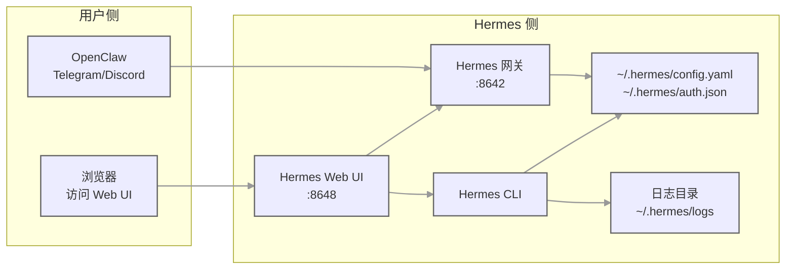

# 给 Hermes Agent 装个 Web 面板：终于不用在命令行切配置、翻日志了

你有没有过这种时候：

明明配好了 Telegram 机器人，却不知道为什么收不到消息，想翻日志要在终端里翻半天。
想换个模型，或者换套配置文件，要在 `~/.hermes` 下面改 `config.yaml`、改 `auth.json`，然后重启网关，烦得要死。
想看一下这个月 Token 花了多少，模型分布是啥样，也没个直观的地方看。

这个 Hermes Web UI 就是解决这种破事的。

它是 Hermes Agent 的一个全功能 Web 管理面板，管理聊天会话、监控用量成本、配置平台渠道、管理定时任务、浏览技能，所有事都能在一个响应式 Web 界面里完成。

## 为什么值得看？

第一，它把原来你要对着命令行和配置文件改半天的事，都做成了图形化界面，点几下就行，不用背命令，不用怕手滑把 YAML 缩进写错。放到真实工作里意味着，哪怕你团队里对命令行不太熟的人，也能安全地改配置、看会话、重启网关。

第二，它支持 8 个主流平台的渠道配置：Telegram、Discord、Slack、WhatsApp、Matrix、飞书、微信、企业微信，全在一个页面统一管理，凭证和行为设置自动写进 `~/.hermes/.env` 和 `~/.hermes/config.yaml`，改完还会自动重启网关，靠谱。

第三，它除了会话和渠道，还把用量统计、定时任务、模型管理、多配置文件切换、文件浏览器、群聊、技能与记忆、日志、认证、设置、Web 终端，全整合进来了，相当于给 Hermes 盖了个中控室，你不用在多个终端窗口之间切来切去，不用每次都去查命令怎么输。

项目核心能力拆解

## 1. AI 聊天
这个能力就是让你在浏览器里像用普通 ChatGPT 一样和 Hermes 聊天。它是流式输出的，通过 SSE 实时吐字，支持异步 Run。可以创建、重命名、删除、切换会话，还能按来源（Telegram、Discord、Slack 这些）把会话分组，用手风琴面板折叠，活跃的会话会置顶并显示旋转图标，会话列表按最新消息时间排序。渲染 Markdown、语法高亮、代码复制这些都有，工具调用的参数和结果也能展开看，文件上传下载都支持，兼容 local、Docker、SSH、Singularity 等多种 terminal backend，还有全局会话搜索（Ctrl+K），能自动从 `~/.hermes/auth.json` 发现可用模型，每个会话还会显示模型标签和上下文 Token 用量。放到真实场景里，你不用守着终端看日志，直接在 Web 界面里就能看到 Agent 的对话和工具调用细节，排查问题快很多。

## 2. 平台渠道
这个能力就是在一个页面里把你 Hermes 接入的所有 IM 平台的配置全管起来。一共支持 8 个平台，每个平台有各自要填的字段：Telegram 是 Bot Token、提及控制、表情回应、自由回复聊天；Discord 是 Bot Token、提及、自动线程、表情回应、频道白名单/黑名单；Slack 是 Bot Token、提及控制、Bot 消息处理；WhatsApp 是启用/禁用、提及控制、提及模式；Matrix 是 Access Token、Homeserver、自动线程、私信提及线程；飞书是 App ID / Secret、提及控制；微信是扫码登录（浏览器扫码，自动保存凭证）；企业微信是 Bot ID / Secret。凭证会写入 `~/.hermes/.env`，渠道行为设置写入 `~/.hermes/config.yaml`，配置变更后自动重启网关，每个平台还能看到已配置/未配置的状态。放到真实场景里，你不用每次去编辑 YAML 然后 `hermes gateway restart`，改完点保存，它自动帮你处理重启的事，不容易出错。

## 3. 用量分析
这个能力就是让你直观看到 Token 花在哪了。它会显示 Token 总用量明细（输入/输出）、会话数及日均统计、预估费用追踪及缓存命中率、模型使用分布图、30 天每日趋势（柱状图+数据表格）。放到真实场景里，你不用自己去解析日志算钱，打开这个页面就能知道最近哪个模型用得多，钱花在什么地方，心里有数。

## 4. 定时任务
这个能力就是在 Web 界面里管理 Cron 任务。可以创建、编辑、暂停、恢复、删除 Cron 任务，能立即触发执行，还有 Cron 表达式快捷预设。放到真实场景里，你不用自己去写 crontab，也不用记那些星号怎么排，选个预设，改改就行。

## 5. 模型管理
这个能力就是管理你能用的模型和 Provider。它会从凭证池（`~/.hermes/auth.json`）自动发现模型，也会从每个 Provider 的端点（`/v1/models`）拉取可用模型。可以添加、更新、删除 Provider，有预设也可以用自定义的 OpenAI 兼容的 Provider。支持 OpenAI Codex 和 Nous Portal OAuth 登录，Provider URL 会自动检测，也支持非 v1 API 版本（比如 `/v4`）。模型按 Provider 分组，还能切换默认模型。放到真实场景里，你不用自己去查 Provider 文档写 `auth.json`，界面上填就行，填完自动发现可用模型，不用自己手动加。

## 6. 多配置文件与网关
这个能力就是让你可以有多套 Hermes 配置，随时切换。可以创建、重命名、删除、切换 Hermes 配置文件（Profile），可以克隆现有配置文件或从归档（`.tar.gz`）导入，也可以导出配置文件用于备份或分享。还能多网关管理，按 Profile 启动、停止、监控网关，自动解决端口冲突，配置文件级别的配置和缓存是隔离的。放到真实场景里，你可以一套配置用于工作，一套配置用于个人玩，切换的时候点一下就行，不用手动备份恢复配置文件，省事。

## 7. 文件浏览器
这个能力就是在 Web 界面里浏览和操作远程后端的文件。支持的后端有 local、Docker、SSH、Singularity。可以上传、下载、重命名、复制、移动和删除文件，可以创建目录，还可以查看文件内容，支持语法高亮。放到真实场景里，你不用每次 SSH 连到服务器上操作文件，在 Web 界面里就能搞定，尤其适合不太熟悉命令行的人。

## 8. 群聊
这个能力就是在 Web 界面里搞多 Agent 聊天房间。通过 Socket.IO 实时通信，@提及路由，提及哪个 Agent 哪个 Agent 就回，历史消息超过 Token 阈值时会自动摘要压缩。有输入状态和回复进度指示器，可以创建、删除房间，管理邀请码，可以添加/移除房间中的 Agent，每个 Agent 可以用独立的 Profile。消息用 SQLite 持久化，移动端响应式布局，侧边栏可以折叠。放到真实场景里，你可以拉几个不同的 Agent 进同一个房间，让它们配合干活，不用自己写路由逻辑。

## 9. 技能与记忆
这个能力就是在 Web 界面里看你装了哪些技能。可以浏览和搜索已安装的技能，查看技能详情和附件，还能管理用户笔记和档案。放到真实场景里，你不用每次去 `~/.hermes/skills` 下面翻目录，直接在 Web 界面里搜就行。

## 10. 日志
这个能力就是在 Web 界面里看日志。可以看 Agent / Gateway / Error 日志，可以按日志级别、日志文件和关键词过滤，结构化日志解析，HTTP 访问日志还会高亮。放到真实场景里，排查问题的时候不用在终端里 `tail -f` 半天，直接在 Web 界面里搜关键词就行。

## 11. 认证
这个能力就是给 Web UI 加个登录门槛，防止别人随便进。默认是基于 Token 的认证（首次运行自动生成或通过 `AUTH_TOKEN` 环境变量设置），也可以设成用户名/密码登录（通过初始 Token 认证后在设置页面设置），还可以用 `AUTH_DISABLED=***` 把认证关掉。放到真实场景里，如果你把 Web UI 暴露在公网，记得开认证，不然谁都能改你的配置，谁都能看你的聊天记录，很危险。

## 12. 设置
这个能力就是在 Web 界面里改 Hermes 的各种参数。可以改显示相关（流式输出、紧凑模式、推理过程、费用显示），Agent 相关（最大轮次、超时时间、工具强制执行），记忆相关（启用/禁用、字符限制），会话重置（空闲超时、定时重置），隐私（PII 脱敏），模型设置（默认模型 & Provider），API 服务器配置。放到真实场景里，你不用每次去改 `config.yaml`，在 Web 界面里点一点就行，改完还能看到当前值，不容易改错。

## 13. Web 终端
这个能力就是把终端嵌到 Web 界面里。基于 node-pty 和 @xterm/xterm，支持多会话，可以创建、切换、关闭终端会话，通过 WebSocket 实时传输键盘输入和 PTY 输出，支持窗口大小调整。放到真实场景里，你不用每次单独开个 SSH 窗口，在 Web 界面里就能敲命令，方便。

上手成本到底高不高

不高，如果你已经有 Node.js 环境的话，一行命令就行。

```bash
npm install -g hermes-web-ui && hermes-web-ui start
```

启动后它会自动打开浏览器，默认是 http://localhost:8648。

如果你没有 Node.js，或者想用一键脚本，可以用这个：

```bash
bash <(curl -fsSL https://cdn.jsdelivr.net/gh/EKKOLearnAI/hermes-web-ui@main/scripts/setup.sh)
```

这个脚本会自动检测系统，帮你装 Node.js（如果没装的话）和 hermes-web-ui，支持 Debian/Ubuntu/macOS。

如果你用 WSL：

```bash
bash <(curl -fsSL https://cdn.jsdelivr.net/gh/EKKOLearnAI/hermes-web-ui@main/scripts/setup.sh)
hermes-web-ui start
```

WSL 会自动检测并使用 `hermes gateway run` 进行后台启动（不用 launchd/systemd）。

如果你想用 Docker Compose，仓库里有内置的 compose 文件，可以联合运行 Hermes Agent + Web UI：

```bash
# 使用预构建镜像（推荐）
WEBUI_IMAGE=ekkoye8888/hermes-web-ui:latest docker compose up -d hermes-agent hermes-webui

# 或从源码构建
docker compose up -d --build hermes-agent hermes-webui

docker compose logs -f hermes-webui
```

打开 http://localhost:6060。

注意：Docker 方式的话，Hermes 持久化数据目录是 `./hermes_data`，Web UI 认证 Token 存在 `./hermes_data/hermes-web-ui/.token`，首次启动并开启认证时，Token 会打印到容器日志里，运行参数全部由 `docker-compose.yml` 环境变量驱动。

示例对话：

```text
你: 给我装一下 Hermes Web UI，方便我在浏览器里看日志改配置
AI: 你有 Node.js 环境吗？有的话直接 `npm install -g hermes-web-ui && hermes-web-ui start` 就行
你: 好像没有，给我用一键脚本吧
AI: 那你执行这个：`bash <(curl -fsSL https://cdn.jsdelivr.net/gh/EKKOLearnAI/hermes-web-ui@main/scripts/setup.sh)`
你: 装完了，怎么启动？
AI: `hermes-web-ui start`，它会自动打开浏览器，默认 http://localhost:8648
你: 我想改成 9000 端口
AI: `hermes-web-ui start --port 9000`
你: 怎么看它是不是在跑？
AI: `hermes-web-ui status`
你: 要是想更新到最新版本呢？
AI: `hermes-web-ui update`
```

组合工作流示例（OpenClaw + Hermes Web UI）



组合工作流的使用过程：

1. 你先通过 OpenClaw 正常和 Hermes 对话，处理日常任务
2. 当你需要：
   - 看一下之前某个平台的聊天记录
   - 调整一下渠道配置
   - 看一下 Token 用量
   - 改一下定时任务
   - 翻一下日志排查问题
   - 切换一个 Profile
3. 你不用去敲命令，直接打开浏览器访问 http://localhost:8648
4. 在 Web UI 里点一点，改完配置自动生效，改完直接回去继续用 OpenClaw 聊天就行

产出结果/适合放进什么工作流：
- 适合把 Hermes Web UI 当成你的 Hermes 中控室，日常聊天用 OpenClaw，管理配置/日志/用量/定时任务用 Web UI
- 适合团队共享：如果你们团队共用一套 Hermes，可以把 Web UI 部署在服务器上，大家都能看会话、看日志，但不要乱改配置，改配置最好专人负责
- 适合演示：给别人看 Hermes 的时候，用 Web UI 展示会话、用量、技能这些，比展示命令行友好很多

哪些地方是真的香

- 终于不用在命令行里改 YAML 改半天，还要怕缩进错
- 终于不用在终端里 `tail -f` 半天搜日志，直接在 Web 界面里关键词过滤
- 终于不用自己算 Token 花了多少，直接看图表就行

### 哪些人会更适合

- 已经在用 Hermes Agent 但觉得纯命令行太麻烦的人
- 需要给 Hermes 接多个 IM 平台（Telegram/Discord/Slack/微信/飞书/企业微信等）的人
- 需要经常看用量、翻日志、改配置的人
- 团队里有对命令行不太熟的成员，需要图形化界面管理的人
- 想在浏览器里和 Hermes 聊天，不想只靠终端的人
- 想把 Hermes 部署在服务器上，需要远程管理的人

### 使用前最好知道的边界

- Docker 方式的话，Token 会打印到容器日志里，首次启动注意看一下，别找不到
- 如果把 Web UI 暴露在公网，一定要开认证，不然很危险
- 配置变更后会自动重启网关，没问题，但如果你正在跑重要的定时任务，最好避开那个时间改配置
- Web 终端是嵌在 Web 界面里的，但它也是真实的终端，敲命令的时候注意不要在生产环境瞎搞
- 多配置文件切换的时候，配置和缓存是隔离的，这点很好，但要注意你当前在哪个 Profile 下面，别改错了

收尾总结

**这个 Hermes Web UI 不是来替代 Hermes Agent 的，而是来给它当“中控室”的，让你用 Hermes 的时候，不用再跟命令行和配置文件死磕。**

#Hermes #AI #Agent #WebUI #OpenClaw #Telegram #Discord #自动化 #技术分享
