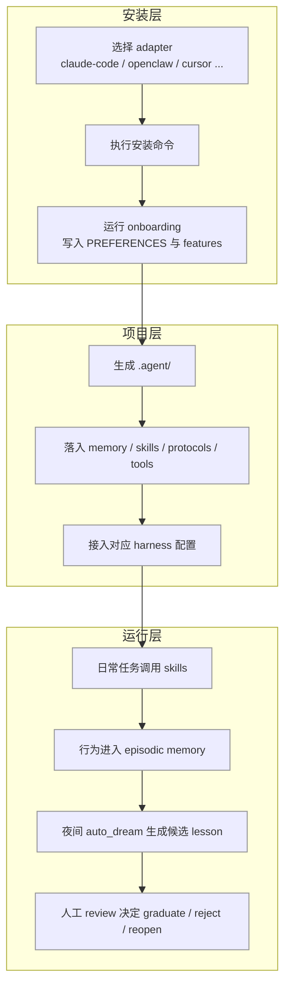

# 换个 AI 编程工具就像失忆？这个项目想把这破事一次性干平

这几年最烦的一件事，不是 AI 不够聪明。

是你刚把它调教顺手，换个壳，它就像脑子被门夹了一样，啥都不记得了。

Claude Code 一套习惯，Cursor 一套规则，OpenClaw 又是一套接法。

每次切工具，都像把一个刚带熟的助手重新从幼儿园养一遍，真有点呆逼。

这项目干的事很直接：**把 agent 的记忆、技能、协议抽成一层可移植的 `.agent/` 大脑，让你换 harness 的时候，不用把“怎么工作”也一起重装。**

说白了，它不是再造一个 AI 壳子，而是给不同 AI 编程工具之间，装了个能带着走的“脑子插座”。

## 先说结论：这玩意到底是什么

它是一个能插到多种 coding-agent 工具里的可移植 agent 层，核心是把 memory、skills、protocols 和适配器统一起来。

## 这东西为什么值得继续往下看

先别急着把它当成又一个“统一框架”。这项目值钱的地方，不在概念，而在它把几件真会把人折腾疯的事，拆得很实。

- **同一套 `.agent/` 目录能在多种 harness 之间复用**  
  这意味着你今天在 Claude Code 里养出来的记忆、偏好、技能，不用明天换到 Cursor、OpenClaw、Codex 以后又从头背一遍家规。

- **它不只给目录结构，还把目录里该放什么也补齐了**  
  真实工作里最怕那种“架子搭好了，内容自己填”的半成品。这个项目把 memory、skill、protocol、review 工具、安装适配层都带了，拿来就能跑，不是只给一张结构图糊弄你。

- **安装和管理不是一把梭脚本，而是有 adapter 管理、状态跟踪、doctor 巡检、remove 卸载的**  
  这在实际里意味着：你不是往仓库里胡乱塞配置文件，而是在管理一套长期要共存、升级、迁移、卸载的 agent 基础设施。

- **记忆不是“自动悟道”那种玄学，而是分层、压缩、候选、人工审核**  
  换成人话，就是它不会偷偷替你编人生经验，而是先把候选 lesson 摆出来，最后还是你拍板。像有个实习生会整理材料，但不会替老板盖章。

- **权限和协议被明确写出来，还能在 pre-tool-call 阶段卡住**  
  这点很重要。很多 agent 项目最容易翻车的地方，不是不会干活，而是手一抖把高风险动作干了。这里把权限写成协议，本质上是在给 AI 装“门禁”，不是给它一把万能钥匙。

## 真正有料的，不止是“跨工具复用”这一个点

下面这几块，是它最核心的骨架。

| 核心能力 | 它在干什么 | 放到真实场景里意味着什么 |
|---|---|---|
| 可移植 `.agent/` 大脑 | memory + skills + protocols 跨 harness 复用 | 工具换了，工作方式不至于归零 |
| adapter 管理系统 | 每个 harness 用 `adapter.json` 声明并统一安装/移除 | 不再靠复制粘贴配置文件硬怼 |
| 四层记忆 | `working/`、`episodic/`、`semantic/`、`personal/` | 临时上下文、行为日志、沉淀经验、个人偏好各归各位 |
| 审核式记忆成长 | `auto_dream.py` 只做候选，人工用 CLI 审核 | 避免 AI 自说自话把错误经验写死 |
| 渐进式 skills 加载 | 平时只载轻量 manifest，命中任务再读完整 `SKILL.md` | 控制上下文膨胀，不让 prompt 水电费爆炸 |
| 协议与权限 | typed tool schemas + `permissions.md` + pre-tool hook | 高风险动作前有闸门，不是裸奔 |

### 第一层香味：不是“兼容很多”，而是“脑子跟着走”

项目明确支持这些 harness：Claude Code、Cursor、Windsurf、OpenCode、OpenClaw、Hermes Agent、Pi Coding Agent、Codex、Standalone Python、Antigravity。

这不是单纯列个支持表装热闹。

它的意思是：**你能把一套 agent 的长期记忆、技能和约束，当成独立资产维护，而不是被某个壳子的配置格式绑死。**

这对经常换工具的人尤其有用。很多人不是“忠于某个 AI IDE”，而是今天拿这个写代码，明天拿那个排查问题，后天又换另一个跑自动化。没有一层可移植脑子，这种切换成本会持续吞时间。

### 第二层骨架：记忆不是一锅粥，而是分层存

项目里把 memory 分成：

- `working/`
- `episodic/`
- `semantic/`
- `personal/`

而且明确说了：**每层有自己的 retention policy，检索会结合 salience × relevance，夜间再做压缩。**

这在真实工作里非常像：

- `working/` 像今天桌面上摊着的纸
- `episodic/` 像流水日志，记录干过什么
- `semantic/` 像真正提炼出来、以后还要反复用的经验
- `personal/` 像你自己的习惯、偏好、沟通方式

这比把所有东西一股脑塞进“memory”里靠谱得多。不分层的记忆系统，最后经常会变成垃圾堆：什么都存了，但真正该召回的时候，一坨混在一起。

### 第三层关键：自动整理可以，自动拍板不行

项目里最稳的一点，是它对“自动成长记忆”的态度很克制。

它明确说：

- `auto_dream.py` 只负责 **stages candidate lessons**
- 不会直接 accepted
- 不会直接修改 semantic memory
- 最终要靠 host agent 用 CLI 做 review

对应命令如下：

```bash
# list pending candidates, sorted by priority
python3 .agent/tools/list_candidates.py

# accept with rationale (required)
python3 .agent/tools/graduate.py <id> --rationale "evidence holds, matches PREFERENCES"

# reject with reason (required); preserves decision history
python3 .agent/tools/reject.py <id> --reason "too specific to generalize"

# requeue a previously-rejected candidate
python3 .agent/tools/reopen.py <id>
```

这个设计特别像一个靠谱的助理流程：材料它先帮你归档、聚类、提候选，但最后要不要进制度、进经验库，还是得人来签字。

不然 AI 一边干活一边给自己立规矩，早晚会整出一些离谱但又看似“合理”的狗东西。

### 第四层实用：skills 不是全量塞 prompt，而是按任务触发

项目把 skills 设计成 progressive disclosure：

- 平时总会加载一个轻量 manifest
- 只有任务触发时，才读完整 `SKILL.md`
- 每个 skill 还带自我重写 hook

这件事的价值很朴素：**省上下文，控成本，也减少无关规则干扰当前任务。**

你可以把它理解成工具柜：柜门外贴目录，真要用哪个扳手，再把抽屉拉开；不是每天把全套工具都扛在背上满街跑。

### 第五层稳一点：权限协议不是摆设

项目里有几块协议层：

- typed tool schemas
- `permissions.md`
- pre-tool-call hook enforcement
- sub-agent delegation contract

这意味着它不只是让 agent “能调工具”，而是约束 **什么情况下能调、什么不该调、怎么委派**。

对于自动化来说，这比“会不会用工具”更关键。

因为真出事的时候，通常不是模型不会，而是它会得太勤快。你本来只是想让它整理一下，结果它把删库那套动作也当成高效协作了，那就不是助手，是拆迁队。

## 安装这件事，门槛高不高

整体看，门槛不算离谱，但它也不是那种“一条命令秒变全自动”的玩具。

你得接受几个前提：

- 它是一个项目级安装方案
- 它有不同 harness 的 adapter
- 它会往你的项目里接入 `.agent/` 和对应适配文件
- 你后面还得管升级、审计、移除、偏好配置

也就是说，这玩意更像“给团队或个人仓库装一个 agent 基座”，不是浏览器插件式的无脑点一下。

原始安装方式如下。

### macOS / Linux

```bash
# tap + install (one-time — both lines required)
brew tap codejunkie99/agentic-stack https://github.com/codejunkie99/agentic-stack
brew install agentic-stack

# drop the brain into any project — the onboarding wizard runs automatically
cd your-project
agentic-stack claude-code
# or: cursor | windsurf | opencode | openclaw | hermes | pi | codex | standalone-python | antigravity
```

### Windows (PowerShell)

```powershell
# clone + run the native installer
git clone https://github.com/codejunkie99/agentic-stack.git
cd agentic-stack
.\install.ps1 claude-code C:\path\to\your-project
```

### Already installed?

```bash
brew update && brew upgrade agentic-stack
```

### Clone instead?

```bash
git clone https://github.com/codejunkie99/agentic-stack.git
cd agentic-stack && ./install.sh claude-code         # mac / linux / git-bash
# or on Windows PowerShell: .\install.ps1 claude-code
# adapters: claude-code | cursor | windsurf | opencode | openclaw | hermes | pi | codex | standalone-python | antigravity
```

### 装完以后，不是放那吃灰，而是可以继续管

项目还给了统一管理命令：

```bash
./install.sh add cursor          # add a second adapter (Claude Code + Cursor in same repo)
./install.sh status              # one-screen view: which adapters, brain stats
./install.sh doctor              # read-only audit; green / yellow / red per adapter
./install.sh manage              # interactive TUI: header pane + menu loop for add/remove/audit
./install.sh remove cursor       # confirm prompt + delete; no quarantine, no undo
```

这套就很像基础设施运维，而不是一次性脚本。

尤其 `doctor` 和 `remove` 很有用：一个负责查体，一个负责善后。很多项目只会教你怎么装，不会告诉你怎么审、怎么卸，最后时间一长就一屋子历史垃圾配置。

### 示范对话：真把它装进工作流时，大概会怎么发生

```text
你:
给当前项目装一套可迁移的 agent 记忆层，后面还要给 OpenClaw 和 Cursor 共用。

AI:
可以，先在项目里接入 agentic-stack。当前先选一个 adapter 起步，后面再补别的。

你:
先走 OpenClaw，后面再加 Cursor。

AI:
那先执行官方安装命令，把基础层装进去；首次接入后，再补第二个 adapter。

你:
装完以后，能直接知道我习惯什么风格吗？

AI:
第一次会进 onboarding，写入 `.agent/memory/personal/PREFERENCES.md`。
后面每次开新会话，它会优先读这个文件。

你:
那如果以后再换 Codex 呢？

AI:
补一个 adapter 就行，核心 `.agent/` 记忆和技能层继续复用，不用重新养脑子。
```

## 真正上手时，最顺的一条使用路径

先说清楚：下面分两段。

- 前半段是**项目原生能力**
- 后半段是**组合工作流示例**，用 OpenClaw 把这套能力接进日常开发协作

### 先把接入路径看明白



### 1）项目原生能力：先把它装进一个仓库

如果你是 macOS / Linux，起步就是：

```bash
# tap + install (one-time — both lines required)
brew tap codejunkie99/agentic-stack https://github.com/codejunkie99/agentic-stack
brew install agentic-stack

# drop the brain into any project — the onboarding wizard runs automatically
cd your-project
agentic-stack claude-code
# or: cursor | windsurf | opencode | openclaw | hermes | pi | codex | standalone-python | antigravity
```

如果是已有仓库，又不想只接一个 harness，也可以直接用安装脚本的管理模式继续加：

```bash
./install.sh add cursor          # add a second adapter (Claude Code + Cursor in same repo)
./install.sh status              # one-screen view: which adapters, brain stats
./install.sh doctor              # read-only audit; green / yellow / red per adapter
./install.sh manage              # interactive TUI: header pane + menu loop for add/remove/audit
./install.sh remove cursor       # confirm prompt + delete; no quarantine, no undo
```

这里有两个实际要注意的点：

- **bare `./install.sh` 不是无脑静默安装**，在 fresh project 会开多选向导；在非 TTY shell 会打印 usage 并以 code 2 退出。
- **从 pre-v0.9 升级时，最好先跑 `./install.sh doctor`**，因为它会先根据磁盘信号合成 `install.json`，避免新 backend 接管时把旧安装记录搞丢，形成 orphan。

### 2）项目原生能力：onboarding 不只是问答，而是在写长期偏好

项目里说得很清楚：安装后会进入 onboarding，把这些偏好写进 `.agent/memory/personal/PREFERENCES.md`，并写 `.agent/memory/.features.json`。

六个可跳过问题包括：

- What should I call you?
- Primary language(s)?
- Explanation style?
- Test strategy?
- Commit message style?
- Code review depth?

还有一个可选特性：

- Enable FTS memory search `[BETA]`

对应 flags：

```bash
agentic-stack claude-code --yes          # accept all defaults, beta off (CI/scripted)
agentic-stack claude-code --reconfigure  # re-run the wizard on an existing project
```

这在工作里是什么意思？

就是它不是只装文件，还会把“这个 agent 应该怎么和你合作”提前固化下来。以后解释要简洁还是展开、测试先写还是后补、commit 风格怎么走，都能有个稳定入口。

### 3）项目原生能力：记忆成长有夜间周期，但最后要人审

它提供夜间任务：

```bash
crontab -e
0 3 * * * python3 /path/to/project/.agent/memory/auto_dream.py >> /path/to/project/.agent/memory/dream.log 2>&1
```

项目还明确强调：

- `auto_dream.py` 会绝对路径解析
- 只做机械文件操作：cluster、stage、prefilter、decay
- 不做 git commits
- 不跑 network
- 不做 reasoning
- safe to run unattended

这点很重要。

很多“自动学习”系统最怕偷偷长出不可控副作用。这里把边界写得比较死：它夜里只做整理，不替你做判断。

### 4）项目原生能力：还带记忆搜索，但它自己也承认是 Beta

如果启用了 `[BETA]` memory search，可以这样用：

```bash
# enable during onboarding (or set manually in .agent/memory/.features.json)
python3 .agent/memory/memory_search.py "deploy failure"
python3 .agent/memory/memory_search.py --status
python3 .agent/memory/memory_search.py --rebuild
```

而且它把 fallback 说清楚了：

- 优先 FTS5
- 不行就 `rg`
- 再不行就 `grep`
- 只查 `.md` / `.jsonl`
- 索引存在 `.agent/memory/.index/` 且 gitignored

这就挺像个老手写的：新能力能给，但不装神，不会假装所有机器环境都完美一致。

### 5）组合工作流示例：把它接进 OpenClaw 的真实协作链路

下面这段不是项目原生命令，而是**组合工作流示例**。意思是：项目本身提供可移植脑子和 adapter，实际工作中可以这样和 OpenClaw 组合。

场景：一个团队同时用 OpenClaw 做消息入口、用 Cursor 写代码、偶尔再切回 Codex 查问题。

那么最顺的链路会像这样：

```text
你:
把这个仓库接到 OpenClaw，后面还要让 Cursor 也共用记忆和技能。

AI:
先按官方方式装 agentic-stack 的 openclaw adapter，再补 cursor adapter。
接完以后，记忆和技能主层都还在 `.agent/`，不是分散在各家工具私有目录里。

你:
那 OpenClaw 里每天沉淀的经验，换到 Cursor 还能继续读？

AI:
可以，前提是你仍在同一个项目里共用这套 `.agent/`。
adapter 只是接线，脑子本体还是同一份。

你:
夜里自动整理 lesson 会不会乱写？

AI:
不会直接入正式经验。它只先生成候选，再由你人工 review。
```

实际协作过程可以拆成下面这种：

```bash
# 先装一个 adapter 起步
agentic-stack openclaw

# 后续补第二个 harness
./install.sh add cursor

# 查看当前接了哪些 adapter、brain 状态怎么样
./install.sh status

# 升级旧项目前先巡检，避免历史接法失联
./install.sh doctor
```

产出结果适合放进这些工作流：

- 个人多工具切换开发流
- 团队统一 agent 规范和偏好管理
- 同一仓库内多 harness 共存
- 需要把权限、记忆、技能一起版本化的项目

## 哪几处是真的香

第一，**“换壳不失忆”这件事终于被做成了具体文件和安装路径，不只是嘴上说跨平台。**

第二，**记忆成长先候选、再人工审核，这个分寸拿得挺稳，不会一上来就让 agent 自己给自己立法。**

第三，**安装、审计、移除、迁移都有对应命令，说明它是按长期维护资产在设计，不是一次性 demo。**

## 什么人会更适合拿它上手

- 经常在 Claude Code、Cursor、OpenClaw、Codex 之间来回切的人
- 想给自己的 agent 建一套长期记忆和协作偏好的人
- 团队里想统一 AI 助手工作方式，但又不想绑定单一工具的人
- 需要把权限、协议、记忆一起版本化管理的项目负责人
- 会长期维护仓库，希望安装、升级、迁移、卸载都有规矩的人
- 想搭 DIY Python agent，但不想从 memory / skill / protocol 全部手搓起步的人

## 用之前最好先知道的边界

有些东西项目已经写得很明白，别上头。

- **不同 harness 的 hook support 并不一样。**  
  例如表里明确写了：Claude Code 有 hook，Cursor / Windsurf 没有，OpenCode 是 partial，OpenClaw 是 varies by fork，Codex 是 no，Pi 和 Standalone Python 才更完整。也就是说，别把“共享脑子”误解成“所有自动化行为在每个平台都一样强”。

- **`./install.sh remove cursor` 是有 confirm prompt，但没有 quarantine、没有 undo。**  
  这就很像拆装修，不是撤回消息，真删了别指望它帮你反悔。

- **从 pre-v0.9 升级时，不先 doctor 可能把旧安装关系搞成 orphan。**  
  这个不是玄学兼容性问题，是项目文档直接提醒的升级路径。

- **bare `./install.sh` 在 CI 这种 non-TTY shell 下不会陪你演交互，会直接打印 usage 并退出 code 2。**  
  所以脚本化场景要老实用明确参数，别幻想它自动猜你意思。

- **FTS memory search 目前就是 `[BETA]`。**  
  能用是好事，但别把它当成已经完全稳定的底层依赖。

- **夜间 `auto_dream.py` 可以 unattended 跑，但它只做机械整理，不负责替你做价值判断。**  
  真正要沉淀成 lesson，还是要 review 流程接住。

## 收尾就一句话

**这不是又一个“会接很多 AI 工具”的花架子，它更像是在给 agent 工作方式做真正可迁移的底座。**

#GitHub项目 #Agent工程 #ClaudeCode #OpenClaw #Cursor #Codex #Hermes #AI编程 #开发工作流 #记忆系统 #技能系统 #自动化协议
