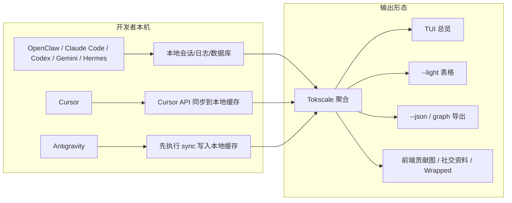

# AI token 账单终于能看明白了：这个开源工具把 OpenClaw、Codex、Claude Code 全给你摊平了

现在很多人已经不是在“用一个 AI 工具”了。

而是在 OpenClaw 里跑自动化，在 Codex 里改代码，在 Claude Code 里补逻辑，偶尔再去 Cursor 里点几下。

然后月底一看账单，脑子里只剩一句话：

这些 token 到底是怎么花出去的，谁这个狗东西最能吃？

这时候，Tokscale 这类工具就很有意思了。
它干的不是再造一个助手，而是把你分散在各处的 AI 使用记录，像对账单一样拢起来，告诉你到底是谁在烧钱、谁在吞 token、哪天最猛、哪个模型最贵。

Tokscale 说白了，就是一个专门给 AI 编程助手做“水电费总表”的统计工具。

## 先把话说透：它到底值不值得看

这东西最有价值的地方，不是“能看个图”，而是它把开发者平时最散、最乱、最难核对的几类信息，重新拉回一个视图里。

- 它能同时吃很多 AI 编程客户端的数据，包括 OpenCode、Claude Code、OpenClaw、Codex CLI、Copilot CLI、Hermes Agent、Gemini CLI、Cursor、Amp、Kimi CLI、Qwen CLI、Roo Code、Kilo、Mux、Goose、Crush、Antigravity、Synthetic 等。  
  放到真实工作里，这意味着你终于不用一会儿翻这个目录、一会儿翻那个缓存，像找失踪人口一样查 token。

- 它不只看总量，还会拆输入、输出、缓存读写、推理 token，外加成本。  
  这意味着你能看见到底是模型在正常干活，还是缓存命中、推理 token、上下文膨胀在偷偷卖你房。

- 它支持交互式 TUI、轻量 CLI 表格、JSON 导出、前端可视化。  
  这意味着你既可以自己终端里看，也可以扔进自动化流程里做报表，甚至接个网页给团队看。

- 它带实时定价，价格源来自 LiteLLM，还会对 OpenRouter 和部分 Cursor 新模型做回退。  
  这意味着你不是只看“用了很多”，而是能继续追到“到底贵在哪个模型上”。

- 它连社交分享、排行榜、年度 Wrapped 都做了。  
  这意味着它不只是一个冷冰冰的统计器，而是准备把“AI 使用画像”做成可展示资产。

## 真正有用的，不止一个统计表

### 1）先把各路 AI 助手的账合到一张表里

Tokscale 支持的客户端非常多，核心思路是去各自的数据目录里抓会话、日志、数据库，再统一聚合。

下面这张表，基本能让人一眼看懂它在吃什么：

| 类型 | 代表来源 | 默认数据位置 | 这意味着什么 |
|---|---|---|---|
| 本地会话目录 | Claude Code / Codex / Gemini / Qwen / Kimi | `~/.claude/projects/`、`~/.codex/sessions/`、`~/.gemini/tmp/*/chats/*.json`、`~/.qwen/projects/`、`~/.kimi/sessions/` | 大多数 CLI/Agent 本来就会落本地会话，直接读就行 |
| OpenClaw / Hermes 一类代理 | OpenClaw / Hermes Agent | `~/.openclaw/agents/`、`$HERMES_HOME/state.db` | 自动化代理也能一起纳入，不再和 CLI 世界割裂 |
| IDE / 平台型来源 | Cursor / Antigravity | `~/.config/tokscale/cursor-cache/`、`~/.config/tokscale/antigravity-cache/` | 有些不是直接读原始文件，而是走同步和缓存 |
| SQLite / OTEL / 特殊格式 | OpenCode / Copilot / Goose / Crush / Kilo CLI | 各自数据库、JSONL、OTEL 文件 | 说明它不是只会读一种格式，兼容性做得比较狠 |

对 OpenClaw 用户来说，这点尤其关键。
它会扫描：

- `~/.openclaw/agents/*/sessions/sessions.json`
- 旧版路径：`~/.clawdbot/`、`~/.moltbot/`、`~/.moldbot/`

也就是说，哪怕你一路从老路径迁过来，账不至于直接断层。

### 2）它不是只会算总 token，还会把钱和结构一起摊开

很多统计工具的问题是：只能告诉你“用了很多”。
这跟说“这个月电费高”差不多，屁用不是没有，但不够定位问题。

Tokscale 会追这些维度：

- 输入 Token
- 输出 Token
- 缓存读取 Token
- 缓存写入 Token
- 推理 Token
- 成本
- 按模型、客户端、提供商的分组

它在 TUI 里支持 6 个视图：

- 概览
- 模型
- 每日
- 每时
- 统计
- 代理

这就像把一张总账，拆成了按模型看、按日期看、按来源看、按趋势看的几种账本。

如果你平时会同时用 OpenClaw 跑任务、用 Codex CLI 做批处理、再让 Claude Code 修点代码，这个视角就很香：你会第一次真正知道，谁是主力，谁是吞金兽，谁纯属气氛组。

### 3）筛选、分组、定价这套，明显是按“真排查”做的

Tokscale 的分组策略不是摆设。
它提供三种聚合粒度：

| 策略 | 标志 | 效果 |
|---|---|---|
| 模型 | `--group-by model` | 合并所有客户端和提供商，只看模型本身 |
| 客户端 + 模型 | `--group-by client,model` | 看同一模型被哪些客户端分别用了多少 |
| 客户端 + 提供商 + 模型 | `--group-by client,provider,model` | 最细，适合追具体来源 |

这在真实场景里特别像查公司费用单。
你可以先看“总成本最高的模型”，再切到“到底是哪个客户端把它打爆了”，最后再查到具体 provider。

再加上它支持：

- `--client` 多客户端筛选
- `--today` / `--week` / `--month`
- `--since` / `--until`
- `--year`
- `pricing` 实时价格查询

这基本已经不是“看看数据”了，而是能拿来做真正的成本排查。

### 4）它考虑到了现实世界那些麻烦分支

很多工具演示时很美，落地时一地鸡毛。
Tokscale 倒是把几个常见坑提前兜了：

- Cursor 不是直接本地扫，而是要先登录同步
- Antigravity 不是默认采集，要先 `sync`
- Codex 的无头模式要么走 `tokscale headless codex exec`，要么你自己把 JSON 输出重定向到 headless 目录
- 社交平台提交前有一级数据验证，至少会查数学一致性、重复、未来日期、必填字段
- 日期筛选按本地时区计算，而且 `--since` / `--until` 都是包含的

这类细节看着不起眼，但真用起来差很多。
少一个说明，用户就会在半夜怀疑是不是自己脑子坏了。

### 5）它不只做终端，还顺手把“展示层”做齐了

除了 CLI/TUI，它还有前端可视化和社交能力。

前端侧支持：

- 2D GitHub 风格贡献图
- 3D 等距贡献图
- 多种调色板
- Light / Dark / System 三态主题
- 年份筛选
- 来源筛选
- 悬停详情与每日分解
- 统计面板

社交侧支持：

- GitHub 登录
- 提交使用数据
- 排行榜
- 公开个人资料
- GitHub README 嵌入卡片
- shields 风格徽章
- 年度 Wrapped 图片

这说明它想做的，不只是本地查账，而是把“AI 开发者的使用画像”也产品化了。

## 上手门槛没你想得那么高，但也不是零脑子

先说结论：

如果你只是想看自己的本地使用情况，门槛真不高。
有 Node.js 或 Bun，直接跑就行。
如果你只是临时查看，甚至不用自己拉源码。

项目给的最快路径是：

```bash
# 直接用 npx 运行
npx tokscale@latest

# 或使用 bunx
bunx tokscale@latest

# 轻量模式（仅表格渲染）
npx tokscale@latest --light
```

它要求的前置条件也比较克制：

- [Node.js](https://nodejs.org/) 或 [Bun](https://bun.sh/)
- （可选）从源码构建原生模块的 Rust 工具链

如果你是本地开发或打算自己改源码，项目给的是这套：

```bash
# 克隆仓库
git clone https://github.com/junhoyeo/tokscale.git
cd tokscale

# 安装 Bun（如果尚未安装）
curl -fsSL https://bun.sh/install | bash

# 安装依赖
bun install

# 开发模式运行 CLI
bun run cli
```

原生 Rust 核心如果要自己构建，用这个：

```bash
# 构建原生核心（从仓库根目录运行）
bun run build:core
```

项目说明里明确写了：通过 `bunx tokscale@latest` 安装时，原生二进制已经预构建并包含在内；只有本地开发时，才需要自己从源码构建。

### 示例对话：

```text
你:
我就想先看下 OpenClaw、Codex、Claude Code 这些到底花了多少。

AI:
先别整复杂的，直接跑一遍最轻的。

你:
用什么？

AI:
先原样执行：

npx tokscale@latest --light

你:
跑完会怎样？

AI:
会先去扫你本机上各个客户端的会话和缓存来源，
然后直接给你一张表。

你:
如果我只想看 Cursor 呢？

AI:
那得先登录它，Cursor 不是裸扫本地文件那套。
先认证，再筛选。

你:
如果我想把 Codex 的 CI 批处理也算进去？

AI:
那就走 headless 模式。
不然那部分 JSON 只从 stdout 飘过去，账根本留不住。
```

顺手说一句，实测这边直接跑 `npx tokscale@latest --light` 是能出结果的，说明它至少不是那种文档写得飞起、落地直接装死的类型。

## 真正怎么用，别上来就把命令堆脸上

先看它给的基础命令，这一组基本就是日常主入口：

```bash
# 启动交互式 TUI（默认）
tokscale

# 使用特定标签启动 TUI
tokscale models    # 模型标签
tokscale monthly   # 每日视图（显示每日分解）

# 使用传统 CLI 表格输出
tokscale --light
tokscale models --light

# 明确启动 TUI
tokscale tui

# 导出贡献图数据为 JSON
tokscale graph --output data.json

# 以 JSON 输出数据（用于脚本/自动化）
tokscale --json                    # 默认模型视图为 JSON
tokscale models --json             # 模型分解为 JSON
tokscale monthly --json            # 月度分解为 JSON
tokscale models --json > report.json   # 保存到文件
```

如果是一个正常开发者的实际路径，大概会是这么走：

1. 先用 `tokscale` 或 `tokscale --light` 看总览  
2. 再按客户端筛，比如只看 OpenClaw / Codex / Claude  
3. 再按时间看这周、这个月或者某个区间  
4. 发现某个模型异常，再用 `pricing` 查定价  
5. 如果要做汇报或自动化，再导成 JSON 或前端图表

### 一个更贴近真实协作的组合工作流

下面这段不是项目原生“唯一正确姿势”，而是更接近日常开发团队会发生的实际协作用法。



如果你日常主要用 OpenClaw + Codex，这一段命令就很典型：

```bash
# 仅显示 OpenCode 使用量
tokscale --client opencode

# 逗号分隔：同时筛选多个客户端
tokscale --client opencode,claude

# 重复使用：效果相同（与 shell 别名搭配使用很方便）
tokscale -c opencode -c claude

# Cursor IDE 需要先运行 `tokscale cursor login`
tokscale --client cursor

# Synthetic（synthetic.new）从其他 agent 会话中检测
tokscale --client synthetic

# 与其他筛选条件组合
tokscale --client opencode,claude --week --json
```

日期筛选也很实用：

```bash
# 快速日期快捷方式
tokscale --today              # 仅今天
tokscale --week               # 最近 7 天
tokscale --month              # 本月

# 自定义日期范围（包含，本地时区）
tokscale --since 2024-01-01 --until 2024-12-31

# 按年份筛选
tokscale --year 2024

# 与其他选项组合
tokscale models --week --client claude --json
tokscale monthly --month --benchmark
```

如果你已经看到某个模型猛得离谱，就继续查价格：

```bash
# 查询模型价格
tokscale pricing "claude-3-5-sonnet-20241022"
tokscale pricing "gpt-4o"
tokscale pricing "grok-code"

# 强制指定提供商来源
tokscale pricing "grok-code" --provider openrouter
tokscale pricing "claude-3-5-sonnet" --provider litellm
```

这套价格查询后面不是拍脑袋，它有一整套解析逻辑：精确匹配、别名解析、层级后缀剥离、版本标准化、提供商前缀匹配、Cursor 模型定价回退、模糊匹配。

对 OpenClaw/Codex 自动化用户来说，另一个很实用的是 JSON 输出和 headless 模式。

比如你想把批处理任务也记账，项目给的推荐命令是：

```bash
# 显示扫描位置和无头计数
tokscale sources
tokscale sources --json
```

```bash
# 在 GitHub Actions 工作流中
- name: Run AI automation
  run: |
    mkdir -p ~/.config/tokscale/headless/codex
    codex exec --json "review code changes" \
      > ~/.config/tokscale/headless/codex/pr-${{ github.event.pull_request.number }}.jsonl

# 稍后跟踪使用情况
- name: Report token usage
  run: tokscale --json
```

如果想更顺一点，它还给了一个自动捕获思路：

```bash
export TOKSCALE_HEADLESS_DIR="$HOME/my-custom-logs"
```

以及推荐方式：

| 工具 | 命令示例 |
|------|----------|
| **Codex CLI** | `tokscale headless codex exec -m gpt-5 "implement feature"` |

这就很适合接进 CI/CD、批量审查、自动修复、日报统计这类流程里。

### 如果你还会用 Cursor 或 Antigravity，这两段别跳过

Cursor 不是白嫖本地目录，它要先认证：

```bash
# 登录 Cursor（需要从浏览器获取会话令牌）
# --name 是可选的，用于之后区分账户的标签
tokscale cursor login --name work

# 检查 Cursor 认证状态和会话有效性
tokscale cursor status

# 列出已保存的 Cursor 账户
tokscale cursor accounts

# 切换活动账户（同步到 cursor-cache/usage.csv 的账户）
tokscale cursor switch work

# 登出指定账户（保留历史，但不再参与合并统计）
tokscale cursor logout --name work

# 登出并删除该账户的缓存
tokscale cursor logout --name work --purge-cache

# 登出所有 Cursor 账户（保留历史，但不再参与合并统计）
tokscale cursor logout --all

# 登出所有账户并删除缓存
tokscale cursor logout --all --purge-cache
```

Antigravity 这边则要先同步：

```bash
# 检查 tokscale 是否能识别正在运行的 Antigravity 语言服务器
tokscale antigravity status

# 将本地 Antigravity 语言服务器中的使用量同步到 tokscale 的缓存
tokscale antigravity sync

# 删除已缓存的 Antigravity 产物
tokscale antigravity purge-cache
```

一句人话总结就是：
有的来源是“直接翻抽屉拿账本”，有的来源是“得先找管理员开门拿钥匙”。
Cursor 和 Antigravity 明显属于后者。

### 如果你还想把数据展示给别人看

那它的社交和展示链路也给好了：

```bash
# 登录 Tokscale（打开浏览器进行 GitHub 认证）
tokscale login

# 查看当前登录用户
tokscale whoami

# 提交使用量数据到排行榜
tokscale submit

# 带筛选提交
tokscale submit --client opencode,claude --since 2024-01-01

# 预览将要提交的内容（试运行）
tokscale submit --dry-run

# 登出
tokscale logout
```

GitHub 个人资料嵌入和徽章也都有现成地址：

```md
[](https://tokscale.ai/u/<username>)
```

```md

```

如果你爱年终总结那味儿，它还支持：

```bash
# 生成当前年份的 Wrapped 图片
tokscale wrapped

# 生成指定年份的 Wrapped 图片
tokscale wrapped --year 2025
```

## 真香的地方，其实就这几下

第一，它真把“多客户端 AI 使用账单”这件破事做成了统一入口。  
第二，它不只是看 token，还把成本、缓存、推理、分组、时间维度一起拎出来了。  
第三，它既能自己终端里查账，也能往自动化、前端展示、社交分享继续接，不是个半截子工具。

## 哪些人会更适合盯它

- 同时在 OpenClaw、Codex、Claude Code、Gemini CLI 之间来回切的人
- 已经开始关注 token 成本，而不是只盯“能不能跑起来”的个人开发者
- 想给团队做 AI 使用统计、周报、月报、成本复盘的人
- 把 Codex CLI、自动审查、批处理任务接进 CI/CD 的工程团队
- 想在 GitHub 主页展示 AI 使用画像、年度总结、公开资料的人
- 经常怀疑“是不是某个模型把预算偷偷吃爆了”的人

## 真要上手前，最好先知道这几个边界

先别上头，边界还是得讲清楚。

- 它的基础前提是你本地本来就留得住会话数据。像 Claude Code 默认 30 天清理周期，如果不改，历史账单会自己蒸发。项目给的禁用方式是把 `~/.claude/settings.json` 里的 `"cleanupPeriodDays"` 设成 `9999999999`。
- Gemini CLI 默认是禁用清理的；Codex CLI 和 OpenCode 默认也没有自动清理。这几类相对省心。
- `--client` 是推荐新写法，旧的单客户端选项虽然还兼容，但已经隐藏，后面会移除。
- 日期筛选按本地时区算，而且 `--since` 和 `--until` 都是包含的。别拿 UTC 脑补，不然容易自己把自己绕晕。
- Cursor 的会话令牌要当密码看，项目明确提醒不要泄露、不要提交到版本控制。
- Antigravity 不会被根命令自动抓取，想拿到最新数据，要先 `tokscale antigravity sync`。
- Headless 捕获目前只支持 Codex CLI。你如果直接跑 Codex 又不重定向 stdout，那部分使用量可能根本进不了账。
- 社交平台提交前会做基础验证，但这不等于帮你理解业务含义。它能拦住明显坏数据，拦不住你对成本结构的误判。
- Windows 也支持，而且项目把跨平台路径差异交代得很细；但很多工具依然沿用 Unix 风格目录，不是走 `%APPDATA%` 那种传统 Windows 味儿。

再补一句，项目文档里还给了配置和缓存位置：

- 设置文件：`~/.config/tokscale/settings.json`
- 可再生缓存：`~/.config/tokscale/cache/`
- 可用环境变量覆盖，比如 `TOKSCALE_NATIVE_TIMEOUT_MS`、`TOKSCALE_CONFIG_DIR`

如果你数据量很大，这些配置不是摆设，是真能救命的。

## 最后收一下

**Tokscale 最厉害的地方，不是把图画漂亮了，而是终于把 AI 开发这笔越来越乱的账，做成了一张能查、能对、能追责的总表。**

#AI #Token统计 #OpenClaw #Codex #ClaudeCode #Cursor #HermesAgent #开发工具 #GitHub项目 #效率工具