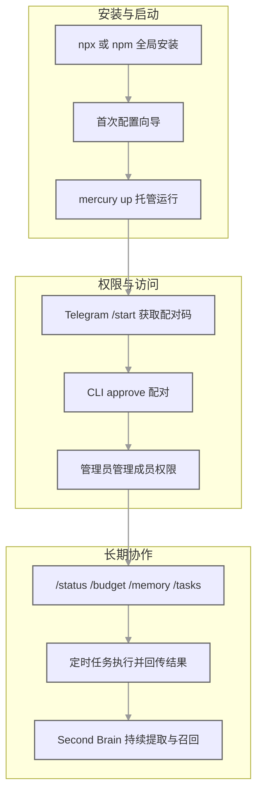

# 为什么你的 AI Agent 总在“偷偷做事”？Mercury 把先问再做、长期记忆、成本治理做成了底层

## 先把痛点说透：很多 Agent 不是不会干活，是干活方式太吓人

现在大多数 AI Agent 都能读文件、执行命令、访问网页。

问题是它们经常“静默操作”：你不在场，它也照样往下跑；权限默认全开；历史上下文断层；Token 花到哪了也不透明。

这类体验像什么？
像把家门钥匙交给一个超能管家，但你不知道它今天开过几次门、搬过什么东西、花了多少钱。

Mercury 的思路很明确：先问再做、记住重要信息、知道预算花在哪。

这不只是功能堆料，而是一套有自己原则的 Agent 架构。

👉 GitHub 开源地址：cosmicstack-labs/mercury-agent

## 这个项目一句话到底是什么

Mercury 是一个 Soul-driven AI Agent：把权限系统、Second Brain 记忆、Token 预算和 24/7 后台运行打包成一套可长期使用的个人助理框架，支持 CLI + Telegram。

## 它和常见 Agent 最大的不一样：不是“能不能做”，而是“怎么做”

### 1) 先问再做：Permission-hardened 工具执行

Mercury 的权限控制是内建的，不是后期补丁：
- Shell 命令阻止列表（比如 `sudo`、`rm -rf /` 直接拦截）
- 文件读写有目录作用域限制
- 每条外部操作有 pending approval 流程
- 支持会话模式切换（“问我”/“全部允许”）

假设你让它删文件，交互会像这样：

⚠️ 即将执行: delete_file
路径: ~/Desktop/test.txt
是否允许？ [Yes / No / Always]

这个设计对安全敏感用户非常关键：你不需要在 Agent 外面再套一层壳，它自己就是。

### 2) 第二大脑：SQLite 支撑的长期记忆

Mercury 的 Second Brain 不是“聊天记录翻页”，而是结构化记忆系统：
- 10 种记忆类型：identity、preference、goal、project、habit、decision、constraint、relationship、episode、reflection
- 每轮对话后自动提取 0~3 条事实（含置信度/重要性/持久性）
- 冲突记忆按置信度和时间新旧处理
- 每次回复前注入最相关 5 条记忆（默认 900 字符预算）
- 自动整理与自动修剪：活跃上下文 21 天过期，低置信持久记忆 120 天后撤销

存储位置是纯本地：
`~/.mercury/memory/second-brain/second-brain.db`
（SQLite + FTS5，不上云）

### 3) Token 预算：让 Agent 学会“省着花”

Mercury 有每日 Token 预算与命令控制：
- 达到 70% 消耗时自动进入低带宽简洁回复模式
- `/budget` 命令随时查看状态
- 支持 override/reset/set
- 超过预算可直接暂停 API 调用

这对“长期后台常开”的使用场景太重要了，不然很容易一觉醒来发现账单爆了。

## 上手和运行：不是演示模式，是长期托管模式

快速开始：

```bash
npx @cosmicstack/mercury-agent
```

或者全局安装：

```bash
npm i -g @cosmicstack/mercury-agent
mercury
```

首次运行会触发配置向导，输入名字、API Key，可选配 Telegram Bot Token，30 秒就能完成。

后续要重配：

```bash
mercury doctor
```

推荐长期运行方式（一条命令搞定）：

```bash
mercury up
```

常用守护命令：

```bash
mercury restart      # 重启后台进程
mercury stop         # 停止后台进程
mercury start -d     # 后台启动，不安装系统服务
mercury logs         # 查看近期守护进程日志
mercury status       # 查看运行状态
```

示例对话：

```text
你: 我不想每次都手动开，想让它一直在线
AI: 用 mercury up，它会安装系统服务并确保守护进程运行
你: Telegram 怎么接入
AI: 先给 Bot 发 /start 拿配对码，再在 CLI 执行 mercury telegram approve <code>
你: 能多人用吗
AI: 可以，管理员可批准、拒绝、提升、降级成员，成员负责日常对话
你: 我担心费用
AI: 用 /budget 实时看预算，必要时 override 或 reset
```

接入流程图：



## 多渠道与技术栈：工程实现也挺干净

渠道能力：
- CLI：流式输出、Markdown 重渲染、命令导航
- Telegram：HTML 格式化、可编辑流式消息、输入状态、多用户角色模型

技术栈：
- TypeScript + Node.js 20+
- Vercel AI SDK v4（`generateText`、`streamText`、多步循环）
- grammY（Telegram）
- SQLite + FTS5（Second Brain）
- Provider fallback：主提供商失败时自动切换下一个，并记住上次成功的

## 社区状态（已核对）

基于 GitHub API（2026-04-28 08:42 +0800）可确认：
- 仓库创建时间：2026-04-20
- Star：1547
- Fork：164
- PR #15（Z.ai + Web Panel + Discord）：目前是 open，未合并（48 个测试全部通过）
- PR #16（中文文档）：已 merged
- Issue #10（Lark Suite 渠道）：open
- Issue #13（Windows 服务安装问题）：open

核心维护者 Salman Qureshi（hotheadhacker）响应迅速，有用户报告 Telegram 无响应 Bug，当天晚上就定位并修复合并。

## 适合谁用

1. 需要安全可控的本地 AI 助手、不想给第三方云服务交出数据的用户
2. 对长期记忆有硬需求，不想每次对话都从零开始的人
3. 对 Token 成本敏感，想做精细化预算治理的团队
4. 同时依赖 CLI 与 Telegram 的开发者
5. 希望把 Agent 当长期基础设施而非临时玩具的人

## 局限和边界（不吹不黑）

1) 当前核心渠道还是 CLI + Telegram
- 扩展渠道在推进中（例如 Lark/Discord 相关需求或 PR）。

2) Windows 服务安装仍有已知问题
- 相关 issue 仍开着，Windows 用户建议上线前先验证守护部署链路。

3) Second Brain 很强，但不是“永不偏移”
- 超长周期对话下，仍建议定期人工校准关键记忆与约束。

## 收尾

Mercury 真正的差异，不是“会不会调工具”，而是它从第一天就把安全、记忆、成本做成了操作系统级约束。

TypeScript 开发者如果想自己部署一个可控的 AI Agent，Mercury 是目前 GitHub 上增长最快的选项之一。npm 安装一条命令就能跑起来，数据全在本地——对在意隐私和可控性的用户来说，这个定位很有吸引力。

#MercuryAgent #AIAgent #SecondBrain #PermissionHardened #TokenBudget #TelegramBot #CLI工具 #SQLite #VercelAISDK #TypeScript #本地优先 #开发效率