# 仓库有代码但 AI 用不起来？这个 skill 直接给你焊一套“Agent 施工规范+配电箱”

## 开场钩子

你肯定遇到过这类场景：

模型挺聪明，能写单函数能解算法题。

但一丢进自己的真实仓库就懵逼。
- 层级依赖乱加
- 文档东拼西凑
- 规范全靠口头说，最后产出一坨狗东西

核心问题根本不是 Prompt 写得不够好，而是仓库根本没有给 AI 一套“能看懂、能执行、不会踩坑”的基础设施。

今天说的这个东西，盯着的就是这个痛点。

## 先说结论：这项目到底是什么

harness-creator 是一个“给代码仓库搭 Agent 基建”的 skill，它会补全 AGENTS.md、文档体系、lint 脚本、harness 配置和 CI，让 AI agent 在仓库里能稳定干活。

## 为什么值得看

它解决了三个真实存在的破事：

1. **“AI 能力强，但仓库不可读”的问题**

核心哲学是：Intelligence without infrastructure is just a demo.

放到真实工作里意味着：就像 CPU 再猛，主板接线乱成麻花，也跑不稳。把所有知识和约束都落进仓库，别靠 Slack/飞书文档/团队历史经验。

2. **“只会口头规范，不会机械约束”的问题**

它要求把规则落到 lint 与配置里，而不是靠大家自觉。

放到真实工作里意味着：别靠“记得遵守”，要靠“违规就报错并告诉你怎么改”。Agent 也是一样，只有可执行的检查，没有“尽量注意”。

3. **“不同项目状态下流程混乱”的问题**

空仓库、已有代码、已有半套 harness，都走统一五阶段流程。核心是先找当前状态和目标状态的差，再补 delta。

放到真实工作里意味着：不会拿“完整改造方案”砸空项目，也不会对已有基础的仓库瞎折腾。

## 项目核心能力拆解

这个 skill 一共给了五段式统一流水线，每一段都有明确分工：

| 阶段 | 做什么 | 重点产出物 |
|------|--------|------------|
| 1 快速探测与意图确认 | 5分钟内摸清楚仓库状态、技术栈、用户要什么 | 状态判定表、探测脚本 |
| 2 并行分析 |  spawn 子 agent 同时分析架构/现有 harness/环境 | harness/.analysis/ 下的三份分析报告 |
| 3 Delta 合成 | 合并分析结果，算出要创建/更新/不动什么 | 清晰的待办清单 |
| 4 并行创建/更新 |  spawn 子 agent 并行生成文档、lint、配置 | AGENTS.md、docs/、scripts/lint-*、harness/ 等 |
| 5 验证与交接 | 跑构建、跑 lint、检查文件是否齐全 | 验收清单、下一步指引 |

这五个阶段里，有三个能力点特别实在：

1. **项目状态自动分类，不瞎干**

它通过一套 shell 探测脚本把项目分成四类：
- Empty：文件数 < 5 且代码文件数 = 0
- Code Only：有代码但还没 AGENTS.md
- Partial Harness：有 AGENTS.md 但缺 lint 或 harness 目录
- Full Harness：关键组件都齐，只要审计+优化建议

这在真实场景里有什么用：

避免了每次都从“完整改造”开始，不同状态有不同策略，不会对已有规范的项目过度打扰。

2. **lint 错误要“Agent 可执行”，不是只骂街**

它特别强调了 lint 报错的标准：
- ✗ 坏例子：“Forbidden import in core/types/user.go”
- ✓ 好例子：“core/types/user.go:15 imports core/config (layer 0 → layer 2). Layer 0 packages must have NO internal dependencies. Fix options: 1. Move config-dependent logic to a higher layer 2. Pass the config value as a parameter 3. Use dependency injection via an interface”

这在真实场景里有什么用：

不管是真人还是 AI，看到错误都知道怎么改，而不是只知道“这里错了”。

3. **Delta 清单化管理，不迷路**

它要求每一步都产出一张清单：哪些要创建，哪些要更新，哪些已经没问题不用碰。

这在真实场景里有什么用：

改动可追溯，可和人确认，也不会把临时尝试当成最终方案。

## 上手成本到底高不高

从给出的信息来看，基本没有硬依赖门槛，主要是用 npx 拉取 skill，然后按流程跑。

原始安装命令如下：

```bash
npx @nacos-group/cli skill-get harness-creator -o ~/.copaw/skill_pool
```

---

**示例对话：**

```text
你: 用她来帮我这个仓库搭一下 Agent 能用的基建
AI: 好的，我先花 5 分钟探测一下当前仓库状态
AI: 探测结果：
    - 技术栈：Python（找到了 pyproject.toml）
    - 状态：Code Only（有 120+ 代码文件，但没有 AGENTS.md）
    - 缺的东西：几乎全套
AI: 我默认按 Full harness 给你做，如果要调整可以说
你: 可以
AI: 现在并行启动分析 agent
AI: 架构分析 agent 已启动 → 存 harness/.analysis/architecture.json
AI: harness 审计 agent 已启动 → 存 harness/.analysis/audit.json
AI: 环境分析 agent 已启动 → 存 harness/.analysis/environment.json
AI: 分析完成，开始合成 Delta...
AI: 生成了待办清单，要我现在直接创建/更新，还是先看一眼？
你: 直接干
AI: 并行启动创建 agent...
AI: 文档 agent、lint agent、配置 agent 已启动
AI: 所有文件已生成，现在做验证
AI: ✓ python -m compileall 通过
AI: ✓ make lint-arch 通过
AI: ✓ AGENTS.md 行数 107（符合 80-120 要求）
AI: ✓ 关键文件都齐全
AI: 完成。后续如果是空项目要写业务代码，可以用 harness-executor 接着跑
```

---

这是整个接入流程的 mermaid：

```mermaid
%%{init: {'themeVariables': {'edgeLabelBackground':'#fff'}}}%%
flowchart LR
    classDef default stroke:#666,stroke-width:1.5px,font-size:14px
    linkStyle default stroke:#999,stroke-width:1.5px,stroke-dasharray:0

    subgraph 1.快速探测
        S1[探测文件数/代码文件数] --> S2[检查 AGENTS.md/docs/lint/harness/Makefile]
        S2 --> S3[判断技术栈]
        S3 --> S4[用户确认 scope]
    end

    subgraph 2.并行分析
        S4 --> A1[code-architecture-analysis]
        S4 --> A2[harness-state-analysis]
        S4 --> A3[environment-analysis]
        A1 --> A4[存 architecture.json]
        A2 --> A5[存 audit.json]
        A3 --> A6[存 environment.json]
    end

    subgraph 3.Delta合成
        A4 --> D[读取三份报告]
        A5 --> D
        A6 --> D
        D --> D2[列清单：创建/更新/不动]
    end

    subgraph 4.并行创建
        D2 --> C1[create-documentation]
        D2 --> C2[create-linters]
        D2 --> C3[create-harness-config]
        C1 --> C4[AGENTS.md/docs/ARCHITECTURE.md...]
        C2 --> C5[scripts/lint-deps.*]
        C3 --> C6[harness/config/environment.json/setup-env.sh...]
    end

    subgraph 5.验证与交接
        C4 --> V[跑构建/lint/检查文件]
        C5 --> V
        C6 --> V
        V --> V2[出验收清单+下一步]
    end
```



## 怎么用，按真实使用路径讲

这个 skill 官方给的路径非常明确，直接按五段式走就行。

先看官方给的原始探测命令（原样保留）：

```bash
# Count files
file_count=$(find . -type f ! -path './.git/*' ! -path './node_modules/*' ! -path './vendor/*' 2>/dev/null | wc -l)
code_files=$(find . -type f \( -name "*.go" -o -name "*.ts" -o -name "*.js" -o -name "*.py" -o -name "*.rs" \) ! -path './.git/*' ! -path './node_modules/*' ! -path './vendor/*' 2>/dev/null | wc -l)

# Check harness components
has_agents_md=$(test -f AGENTS.md && echo "yes" || echo "no")
has_architecture=$(test -f docs/ARCHITECTURE.md && echo "yes" || echo "no")
has_linters=$(ls scripts/lint-* 2>/dev/null | wc -l)
has_harness_dir=$(test -d harness && echo "yes" || echo "no")
has_makefile=$(test -f Makefile && echo "yes" || echo "no")

# Detect tech stack
if test -f go.mod; then TECH="Go"
elif test -f package.json; then TECH="TypeScript/Node.js"
elif test -f requirements.txt || test -f pyproject.toml; then TECH="Python"
else TECH="Unknown"
fi
```

当用户说“我要在当前仓库搭 Agent 基建”时，skill 会先跑上面这段，然后按状态分类。

如果 AskUserQuestion 能力可用，它会先问你要做 Full harness、Documentation only 还是 Minimal viable：

```json
{
  "question": "What's your priority for this harness setup?",
  "header": "Scope",
  "multiSelect": false,
  "options": [
    {
      "label": "Full harness (Recommended)",
      "description": "Complete setup: AGENTS.md, docs, linters, eval framework, CI integration"
    },
    {
      "label": "Documentation only",
      "description": "Just AGENTS.md + docs/ for now, add linters/evals later"
    },
    {
      "label": "Minimal viable",
      "description": "Only AGENTS.md + basic lint-deps, can expand later"
    }
  ]
}
```

如果是 Empty 项目，还会多问一个技术栈：

```json
{
  "question": "What tech stack for this project?",
  "header": "Tech Stack",
  "multiSelect": false,
  "options": [
    {"label": "Go", "description": "CLI tools, high-performance services, system programming"},
    {"label": "TypeScript/Node.js", "description": "Web APIs, full-stack apps, rapid prototyping"},
    {"label": "Python", "description": "Data processing, ML/AI, scripting"}
  ]
}
```

最后验证阶段也给了原始命令：

```bash
# 1. Build passes
go build ./... || npm run build || python -m compileall .

# 2. Linters pass
make lint-arch

# 3. AGENTS.md size check
wc -l AGENTS.md  # Should be 80-120 lines

# 4. All expected files exist
test -f AGENTS.md && echo "✓ AGENTS.md"
test -f docs/ARCHITECTURE.md && echo "✓ ARCHITECTURE.md"
test -f scripts/lint-deps* && echo "✓ lint-deps"
test -d harness/ && echo "✓ harness/"

# 5. Design docs exist (not just index)
find docs/design-docs -name "*.md" ! -name "index.md" | wc -l
```

---

**组合工作流示例（作者补充，非官方原生能力）：**

结合你现在手里常用的 OpenClaw + Hermes，这个 skill 可以这么用：

1. 你在 OpenClaw 对话里对某个仓库说：“用 hermes 给这个仓库跑一下 harness-creator”
2. OpenClaw 按规则拦截，调用 Hermes 并把当前目录传过去
3. Hermes 运行 skill，输出完整 harness
4. 你 review 一下 Delta 清单，确认后 merge
5. 后续开发就让 main/code/writer agent 以 AGENTS.md 为入口干活

这样就把“OpenClaw 触发 → Hermes 执行工程基建 → 日常开发用仓库原生规范”串起来了。

## 哪些地方是真的香

- 它不写业务代码，只搭“让业务代码能稳定被 AI 生成”的框架，职责非常清晰。
- 它给的不是一堆感觉，而是可执行的 lint、可落地的文档、可验收的检查项。
- 它把复杂多 Agent 协作流程给拆得很清楚，没有黑盒。

## 哪些人会更适合

1. 正在把单人写码迁移到多 Agent 协作的团队
2. 仓库历史包袱重，文档与代码长期脱节的项目
3. 经常遇到“AI 改着改着改坏层级依赖”的工程团队
4. 想把规范从“口头约定”升级成“可执行检查”的负责人
5. 需要让新人或新 Agent 快速上手仓库的团队
6. 做平台/中台，想沉淀跨项目工程脚手架的人

## 使用前最好知道的边界

这里有几个非常明确的官方限制，必须注意：

1. **它不写业务代码**

空项目里业务代码计划会写到 docs/exec-plans/active/bootstrap-code.md，后续交给 harness-executor 实施。harness-creator 只搭 harness infra。

2. **AGENTS.md 有明确尺寸要求**

建议 80-120 行，做导航图，不要变成长篇手册。里面只放索引，详细内容链接到 docs/ 下面。

3. **verify.json 不要手工造**

verification config 由 harness-executor 在运行时动态生成，不需要手工创建。

4. **小项目可以不必强行多 Agent**

对于 <20 文件的小项目，或者当 subagent 不可用时，可以 inline 执行所有阶段，不用硬开并行子 agent。

## 收尾总结

**这是一个“务实的基建工具”，它不帮你把产品做出来，但能把“AI 能稳定干活的环境”给你搭好。**

## 推荐标签

#AIAgent #HarnessEngineering #AGENTSmd #代码规范 #工程化 #多Agent协作 #Lint #CI #GitHub技能市场 #开发效率 #OpenClaw #Hermes