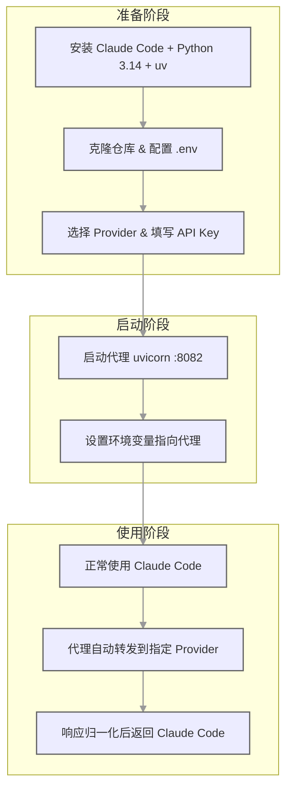

# Claude Code 贼好用，但 Anthropic 的额度烧得心在滴血——直到碰上这个代理

每个月打开 Claude Code，写几行代码，额度就没了。想用 Opus？更别想了，那价格跟烧钱没什么区别。

然后刷到这么一个东西：一个代理，把 Claude Code 的请求转发到免费或者本地模型上，客户端那边什么都不用改。

一句话说清：**Free Claude Code 是一个本地代理，拦截 Claude Code 发给 Anthropic 的请求，转发到 NVIDIA NIM、OpenRouter、DeepSeek、LM Studio、llama.cpp 或 Ollama，客户端协议完全不变。**

---

## 为什么值得看

Claude Code 本身是真好用，但它的定价模型让很多人只能"小心翼翼地用"。这个项目解决的问题很直接：

- **不想付 Anthropic 的钱？** 转发到 NVIDIA NIM 的免费模型或者 OpenRouter 的免费档
- **有本地显卡但不会配？** 直接走 Ollama 或 LM Studio，代理帮你做协议适配
- **想不同档次用不同模型？** Opus 走付费、Sonnet 走免费、Haiku 走本地——全在一个配置里搞定

放到真实工作里意味着什么？就是你可以敞开用 Claude Code 的交互界面和工具链，但背后跑的模型完全由你说了算。

---

## 这东西到底能干嘛

### 🔀 多后端路由

支持六个 provider：NVIDIA NIM、OpenRouter、DeepSeek、LM Studio、llama.cpp、Ollama。每个 provider 的协议差异（OpenAI chat 格式 vs Anthropic Messages 格式）代理自动做翻译，Claude Code 那边完全无感。

放到真实场景里：今天 NVIDIA NIM 免费额度用完了，换个 key 或者切 OpenRouter 的免费模型，改一行 `.env` 就行。

### 🎯 按模型档次分流

Claude Code 在请求里会标注模型档次（Opus / Sonnet / Haiku）。这个代理可以按档次指定不同的 provider 和模型：

```dotenv
MODEL_OPUS="nvidia_nim/moonshotai/kimi-k2.5"
MODEL_SONNET="open_router/deepseek/deepseek-r1-0528:free"
MODEL_HAIKU="lmstudio/unsloth/GLM-4.7-Flash-GGUF"
MODEL="nvidia_nim/z-ai/glm4.7"
```

这什么意思？重活交给 kimi-k2.5，日常用免费的 deepseek-r1，轻量的走本地 GGUF——一分钱不花，还能让每个档次的活都分到合适的模型上。

### 📋 原生 /model 选择器

Claude Code 2.1.126 以上版本支持 `/model` 命令，这个代理会暴露 `/v1/models` 端点，让选择器里直接列出可用的 provider 模型。选完之后自动路由，不用再改配置重启。

每个模型还有一个 `(no thinking)` 变体，碰到不支持 thinking 的模型时用这个，代理会告诉 Claude Code 别发 thinking 请求。

### 🔄 流式 + 工具调用 + Thinking 块

代理会把不同 provider 的流式响应、tool call、thinking/reasoning block 全部归一化成 Claude Code 期望的格式。说白了就是——不管背后跑什么模型，Claude Code 那边看到的都是标准的 Anthropic 协议响应。

### 💬 Discord / Telegram 机器人

可选的 bot wrapper，可以把 Claude Code 挂到 Discord 或 Telegram 上远程用。支持流式输出、回复分支、任务停止和清除。在手机上也能远程写代码。

### 🎙️ 语音笔记

支持本地 Whisper 或 NVIDIA NIM 做语音转文字，在 Discord 和 Telegram 上收语音消息自动转成文本输入。

---

## 上手成本到底高不高

说实话，不算高。核心就三步：装 Python + uv → 拉仓库配 `.env` → 启动代理然后指向它。

依赖方面，Python 3.14 + uv，macOS/Linux/Windows 都有对应安装命令。本地模型的话还需要额外跑 Ollama 或 LM Studio，但那属于"你想用本地模型"这个决策自带的成本，不是这个项目额外加的。

**安装 Python 3.14 + uv：**

macOS/Linux：

```bash
curl -LsSf https://astral.sh/uv/install.sh | sh
uv self update
uv python install 3.14
```

Windows PowerShell：

```powershell
powershell -ExecutionPolicy ByPass -c "irm https://astral.sh/uv/install.ps1 | iex"
uv self update
uv python install 3.14
```

**克隆并配置：**

```bash
git clone https://github.com/Alishahryar1/free-claude-code.git
cd free-claude-code
cp .env.example .env
```

编辑 `.env`，选一个 provider。默认走 NVIDIA NIM 的话：

```dotenv
NVIDIA_NIM_API_KEY="nvapi-your-key"
MODEL="nvidia_nim/z-ai/glm4.7"
ANTHROPIC_AUTH_TOKEN="freecc"
```

`ANTHROPIC_AUTH_TOKEN` 随便填个字符串就行，Claude Code 发请求时会带上这个值，代理用来校验。本地测试可以留空。

**启动代理：**

```bash
uv run uvicorn server:app --host 0.0.0.0 --port 8082
```

也可以用包安装方式：

```bash
uv tool install git+https://github.com/Alishahryar1/free-claude-code.git
fcc-init
free-claude-code
```

`fcc-init` 会在 `~/.config/free-claude-code/.env` 生成配置模板。

---

## 怎么用，按真实路径讲

### 接入过程

先把整体流程捋清楚：



### 示例对话：

```text
你: 帮我把 Claude Code 的请求转发到 NVIDIA NIM 的免费模型上
AI: 好的，先确认一下——你本地装了 uv 和 Python 3.14 吗？
你: 装了
AI: 那直接克隆仓库，把 .env.example 复制一份改成 .env
你: 好了，.env 里面怎么填？
AI: 去 build.nvidia.com 拿一个 API Key，然后填这三行：
     NVIDIA_NIM_API_KEY="nvapi-你的key"
     MODEL="nvidia_nim/z-ai/glm4.7"
     ANTHROPIC_AUTH_TOKEN="freecc"
你: 填好了，然后呢？
AI: 启动代理：
     uv run uvicorn server:app --host 0.0.0.0 --port 8082
     启动之后另开一个终端，设环境变量然后跑 Claude Code：
     ANTHROPIC_AUTH_TOKEN="freecc" ANTHROPIC_BASE_URL="http://localhost:8082" claude
你: 这就完了？
AI: 对，Claude Code 的界面和操作完全不变，只是背后的模型换了。
```

### 实际使用过程

**CLI 方式（最简单）：**

```bash
ANTHROPIC_AUTH_TOKEN="freecc" ANTHROPIC_BASE_URL="http://localhost:8082" claude
```

注意 `ANTHROPIC_BASE_URL` 指向代理根路径，不要加 `/v1`。

**VS Code 扩展：**

在 Settings 里搜 `claude-code.environmentVariables`，编辑 `settings.json`：

```json
"claudeCode.environmentVariables": [
  { "name": "ANTHROPIC_BASE_URL", "value": "http://localhost:8082" },
  { "name": "ANTHROPIC_AUTH_TOKEN", "value": "freecc" }
]
```

重新加载扩展就行。如果弹出登录界面，走一次 Anthropic Console 路径，环境变量生效后流量还是会走代理。

**JetBrains ACP：**

编辑 Claude ACP 配置文件（macOS/Linux 在 `~/.jetbrains/acp.json`，Windows 在 `C:[本机路径已隐藏]`），加环境变量：

```json
"env": {
  "ANTHROPIC_BASE_URL": "http://localhost:8082",
  "ANTHROPIC_AUTH_TOKEN": "freecc"
}
```

改完重启 IDE。

### 产出结果 & 适合什么工作流

用起来之后，Claude Code 的所有交互——代码生成、文件编辑、终端命令——都照常工作，只是背后跑的模型变了。适合这些场景：

- 每天的日常编码任务走免费模型，省钱
- 重度任务按档次分流，贵的只用在刀刃上
- 本地有显卡的，完全离线跑，零成本
- 配合 OpenClaw / Claude Code / Codex 等 AI 编码工具的混合工作流里，作为一个模型流量调度层

---

## 六个 Provider 一览

| Provider | 配置前缀 | 协议 | 需要 Key | 默认地址 |
| --- | --- | --- | --- | --- |
| NVIDIA NIM | `nvidia_nim/...` | OpenAI chat 转换 | ✅ | `https://integrate.api.nvidia.com/v1` |
| OpenRouter | `open_router/...` | Anthropic Messages | ✅ | `https://openrouter.ai/api/v1` |
| DeepSeek | `deepseek/...` | Anthropic Messages | ✅ | `https://api.deepseek.com/anthropic` |
| LM Studio | `lmstudio/...` | Anthropic Messages | ❌ | `http://localhost:1234/v1` |
| llama.cpp | `llamacpp/...` | Anthropic Messages | ❌ | `http://localhost:8080/v1` |
| Ollama | `ollama/...` | Anthropic Messages | ❌ | `http://localhost:11434` |

前三个是云端 provider，需要 API key；后三个是本地运行，不需要 key 但需要自己起服务。

---

## 哪些地方是真的香

- Claude Code 的交互体验一点都不变，切换成本几乎为零
- 按模型档次分流这个设计太实用了，免费和付费混着用完全可控
- `/model` 选择器直接列出可用模型，不用来回改配置重启

---

## 哪些人会更适合

- 每天用 Claude Code 但额度不够烧的个人开发者
- 有本地显卡、想完全离线用 Claude Code 的人
- 团队里有人需要 Claude Code 但不想每个人买 Anthropic 订阅
- 经常在不同模型之间做 A/B 对比的人
- 想在 Discord/Telegram 上远程跑 Claude Code 的人
- 需要一个统一的模型流量调度层来管理多条 API key 的人

---

## 使用前最好知道的边界

- **工具调用兼容性因模型而异。** 有些 OpenAI 兼容模型吐出来的 tool call 格式不对，会丢 tool name 或者把 tool call 当纯文本返回。碰到这种情况先换模型或 provider 试试，别急着怀疑代理有问题。
- **llama.cpp / LM Studio 返回 400，大概率是上下文长度不够。** Claude Code 的请求 token 量不小，本地模型如果 context window 不够大，请求会被直接拒绝。启动 llama.cpp 时把 `--ctx-size` 调大。
- **流式断连通常是上游 provider 的问题。** 碰到 `incomplete chunked read`、`server disconnected` 这类错误，降并发、加超时、或者换个时间重试。
- **`ANTHROPIC_BASE_URL` 不要加 `/v1`。** 填 `http://localhost:8082`，不是 `http://localhost:8082/v1`。加错了会请求不到正确的端点。
- **原始日志开关会暴露敏感信息。** `.env` 里那些 `LOG_RAW_*` 变量开着的话，prompt、tool 参数、路径、模型输出都会被记下来。只在本地调试时开，别在生产环境用。
- **Web 工具默认禁止访问私有网络。** `WEB_FETCH_ALLOW_PRIVATE_NETWORKS=false` 是安全默认值，别随便开。
- **项目要求 Python 3.14。** 3.14 alpha 不支持 `except X, Y` 语法（正式版才行），用旧版 Python 可能会遇到语法问题。

---

**这工具不免费送你 Claude，但让你可以用别的模型来跑 Claude Code 的壳——很猛，但别忘了背后模型的能力边界才是真正的天花板。**

---

#GitHub #ClaudeCode #代理 #免费模型 #NVIDIA-NIM #OpenRouter #DeepSeek #Ollama #LMStudio #本地模型 #AI编码 #模型路由
