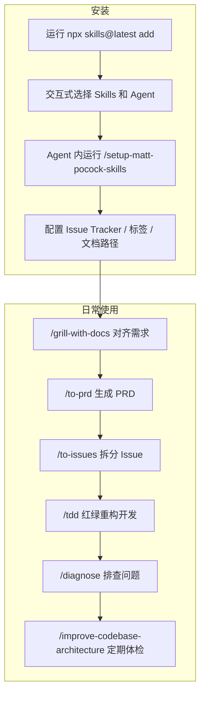

# 别再让 Agent 瞎写代码了：Matt Pocock 的 Skills 把工程素养塞回 AI 工作流

---

用 Agent 写代码，最怕什么？

不是跑不起来——跑不起来还好说，改呗。

最怕的是：跑起来了，你看了看产出，发现它压根不是你想要的。更怕的是：跑起来了，你挺满意，过三天再改需求，发现代码已经是一坨泥巴。

这两种死法，覆盖了 Agent 编程 90% 的翻车现场。

Matt Pocock 搞了一套 Skills，专治这两个毛病。不是什么银弹框架，就是一堆小技能，往 Claude Code、Codex 这类 Agent 里一塞，让它们干活的时候别太放飞。

**一句话：这套 Skills 把"对齐、反馈、设计"三个工程基本功，塞进了 AI 编码工作流里。**

---

## 为什么值得看

大多数人对 Agent 编码的期望还停在"你说一句它写一段"的阶段。但真实开发里，最大的坑从来不是写不出来，而是：

- **你没想清楚就要它动手**——它更没想清楚，于是产出偏到姥姥家
- **它说了 20 句废话才到重点**——因为你项目里的术语它根本不懂，它在猜
- **代码写完不跑测试**——没有反馈环，它就是盲飞
- **能跑但架构烂**——Agent 加速了编码，也加速了腐化

这套 Skills 每一个都对应一个具体的失败模式。不是喊口号，是给了你可以直接跑的命令和流程。

---

## 核心能力拆解

### 1. 先烤你一顿再动手：`/grill-me` 和 `/grill-with-docs`

这是整套 Skills 里最核心的两个。

做什么？在你动手之前，Agent 会对你的计划疯狂提问——每个分支、每个模糊点、每个"到时候再说"的地方，全给你扒出来。

`/grill-me` 是通用版，适合非代码场景；`/grill-with-docs` 是工程版，在烤你的同时还会干三件事：

- 拿你的计划和项目现有领域模型对齐，发现矛盾
- 帮你把术语沉淀成共享语言，写进 `CONTEXT.md`
- 把难解释的决策记录成 ADR（Architecture Decision Record）

**放到真实工作里意味着什么？** 就像你跟一个特别较真的技术负责人结对——你随口说"加个缓存"，它追问"缓存一致性怎么办？失效策略呢？热点 key 呢？"——逼你在动手前把决策树走完。

### 2. 用共享语言砍废话：`CONTEXT.md`

Agent 不知道你项目里的行话，就会用 20 个字解释一个你 1 个字就能说清的概念。

`/grill-with-docs` 会在烤你的过程中，把项目的领域语言沉淀到 `CONTEXT.md` 里。之后每次对话，Agent 都会先读这个文件，用你的术语说话。

| 没有 CONTEXT.md | 有 CONTEXT.md |
|---|---|
| "当一个课程章节里的课时被设为'真实'（即在文件系统中分配了位置）时出了问题" | "物化级联出了问题" |

这不是翻译问题，是认知压缩。术语一致之后，变量命名、文件命名也跟着一致，Agent 导航代码库更快，token 消耗更少。

### 3. 别盲飞：`/tdd` 红绿重构循环

Agent 写代码最大的问题之一：没有反馈。

`/tdd` 强制 Agent 走红绿重构——先写失败测试，再写最小实现让测试通过，最后重构。一个功能切片一循环，不是一口气写完再补测试。

**放到真实工作里意味着什么？** Agent 每一步都有测试反馈，写歪了立刻知道，而不是写完 500 行才发现方向错了。

### 4. 诊断不是玄学：`/diagnose`

遇到 bug 怎么办？大多数人让 Agent "看看这个报错"，然后它就开始猜。

`/diagnose` 给了一个纪律性循环：

> 复现 → 缩小范围 → 假设 → 插桩观察 → 修复 → 回归测试

不是拍脑袋，是一步步排除。跟老手排查问题的思路一模一样。

### 5. 别让代码烂成一坨：`/improve-codebase-architecture`

Agent 写代码越快，技术债积累越快。这不是错觉，是必然。

这个 Skill 做的事很克制：扫描代码库，找到可以"加深"的模块——就是把更多功能藏在更简单的接口后面。参考的是 John Ousterhout 那本《A Philosophy of Software Design》的核心观点。

它会读你的 `CONTEXT.md` 和 `docs/adr/` 里的决策记录，基于领域语言给建议，不是空泛地说"这里该重构"。

**推荐每隔几天跑一次**，像给代码做个体检。

### 6. 从计划到执行：`/to-prd`、`/to-issues`、`/triage`

这三个是一条线：

- `/to-prd`：把对话里讨论的内容合成为 PRD，提交为 GitHub Issue
- `/to-issues`：把 PRD 或任何计划拆成垂直切片的独立 Issue，每个 Issue 可以独立领取和完成
- `/triage`：通过状态机对 Issue 进行分流打标签

**放到真实工作里意味着什么？** 从"聊完就开干"变成"聊完有文档、有计划、有分工"——Agent 参与的项目也需要项目管理，否则就是野路子。

### 7. 其他实用工具

| Skill | 干什么 |
|---|---|
| `/zoom-out` | 让 Agent 跳出当前代码，从系统全局角度解释 |
| `/caveman` | 极简通信模式，砍掉约 75% 的废话 token |
| `/write-a-skill` | 用这套规范创建新 Skill |
| `/setup-matt-pocock-skills` | 每个仓库首次使用前的初始化（选 Issue Tracker、配标签、设文档路径） |

---

## 上手成本到底高不高

说实话，不算高。核心安装就一条命令，交互式选择你要装哪些 Skill、装到哪个 Agent。

```bash
npx skills@latest add mattpocock/skills
```

装完之后，在 Agent 里跑一次 `/setup-matt-pocock-skills`，它会问你三个问题：

1. 用哪种 Issue Tracker（GitHub / Linear / 本地文件）
2. Issue 打哪些标签（`/triage` 会用）
3. 文档存哪

答完就能用了。

前置依赖基本为零——只要你在用 Claude Code、Codex 或类似的 Agent，能跑 `npx`，就够了。

---

### 示例对话：

```text
你: 我要加一个视频转码功能，用户上传视频之后自动转成三种格式
AI: 好的，在动手之前让我先确认几个点——
    1. 转码是同步还是异步？用户上传后要等多久才能拿到结果？
    2. 三种格式是固定的还是会变？需不需要做成配置？
    3. 转码失败怎么处理？重试？通知用户？
    4. 存储走哪里？S3？本地？有没有大小限制？
    5. 并发怎么控？100 个人同时上传，转码队列怎么排？
你: 异步，发个通知就行。格式暂时固定三种。失败重试一次，还失败就通知用户。
AI: 明白了。那转码任务的状态你打算怎么存？数据库里加个字段？还是用消息队列自带的状态？
你: 数据库里加个 status 字段吧，简单点。
AI: 可以。还有一个——转码完成之后，用户在哪里看到结果？项目里现在有"通知"这个概念吗？
你: 有个消息中心，可以往那推。
AI: 好，我把这些记到 CONTEXT.md 里——"视频转码"指异步转三种固定格式，状态存 DB status 字段，结果推消息中心。接下来我先写 PRD 还是直接拆 Issue？
你: 先拆 Issue 吧。
```

---

## 怎么用，按真实使用路径讲

### 安装或接入过程



### 实际使用过程（组合工作流示例）

下面是一个结合 OpenClaw + Claude Code 的完整使用流程，属于作者补充的实际协作用法，非项目原生示例：

**第一步：需求对齐**

在 Claude Code 里直接输入 `/grill-with-docs`，然后描述你想做什么。Agent 会基于项目现有 `CONTEXT.md` 和代码结构，对你反复追问，直到每个模糊点都落地。

**第二步：沉淀产出**

对齐完成后，`CONTEXT.md` 自动更新了共享语言，ADR 记录了关键决策，PRD 被合成为 GitHub Issue。

**第三步：拆分任务**

```text
/to-issues
```

把 PRD 拆成垂直切片的独立 Issue。每个 Issue 包含：要改什么、测试怎么写、验收标准。

**第四步：TDD 开发**

```text
/tdd
```

Agent 开始走红绿重构循环——写失败测试 → 最小实现 → 重构 → 下一个切片。

**第五步：问题诊断**

遇到 bug 时：

```text
/diagnose
```

Agent 按复现 → 缩小 → 假设 → 插桩 → 修复 → 回归测试的循环走。

**第六步：架构体检**

每隔几天跑一次：

```text
/improve-codebase-architecture
```

检查是否有模块可以加深，防止代码库腐化。

### 产出结果与工作流嵌入

这套流程的产出是结构化的：`CONTEXT.md`（领域语言）、`docs/adr/`（决策记录）、GitHub Issues（任务拆分）、测试代码（质量保障）。所有产出都在仓库里，不是飘在对话里。

放进 OpenClaw 的 Skill 体系也很自然——`/grill-with-docs` 可以作为 Agent 接到新需求时的第一步，`/tdd` 可以绑定到编码 Agent 的默认行为，`/improve-codebase-architecture` 可以做成定时任务。

---

## 哪些地方是真的香

共享语言这招真的狠——一次投入，每次对话都在吃红利，Agent 的废话肉眼可见地少了。对齐之后再动手，返工率断崖下降。架构体检不是空喊重构，是基于你项目的领域语言给具体建议。

---

## 哪些人会更适合

- 天天跟 Claude Code / Codex 搭伙写代码，但老觉得产出偏的人
- 项目已经开始出现"Agent 写完能跑但改不动"症状的团队
- 想给 Agent 编码加纪律但不想上重型框架（GSD / BMAD 等）的开发者
- 有工程素养但不知道怎么把素养"教"给 Agent 的技术负责人
- 单人开发者用 Agent 撑起一个项目，需要自我对齐和自我约束
- 已经在用 OpenClaw / Claude Code 等 Agent 框架，想把 Skills 编排进工作流的人

---

## 使用前最好知道的边界

- 这套 Skills 目前主要适配 Claude Code 和类似 Agent，其他 Agent 可能需要自行适配 Skill 格式
- `/grill-with-docs` 的威力跟项目复杂度正相关——小项目可能觉得有点重，但养成习惯不亏
- 共享语言的前提是你自己得想清楚领域概念，Agent 是帮你提炼，不是替你发明
- `/improve-codebase-architecture` 给的是建议，不是自动重构——真要动手改，还是得人审
- `/tdd` 强制红绿重构，对纯脚本 / 一次性工具类代码可能有点仪式感过重，按场景取舍
- 整套体系假设你用 GitHub / Linear 管理任务，纯本地文件方案也有但功能最弱

---

**Skills 不是让 Agent 变聪明，是让用 Agent 的人别犯蠢——工程纪律这东西，AI 时代反而更重要了。**

---

#Skills #MattPocock #ClaudeCode #CodingAgent #TDD #Architecture #Engineering #AI开发 #Agent工作流 #CONTEXT #共享语言 #红绿重构
