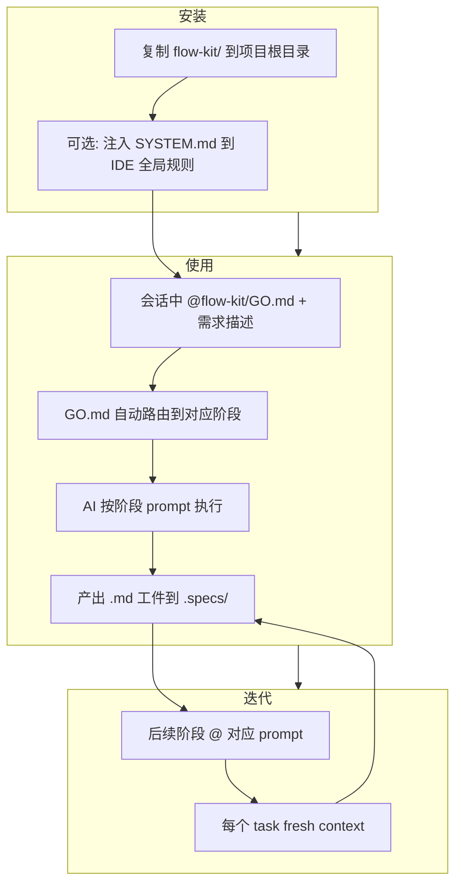
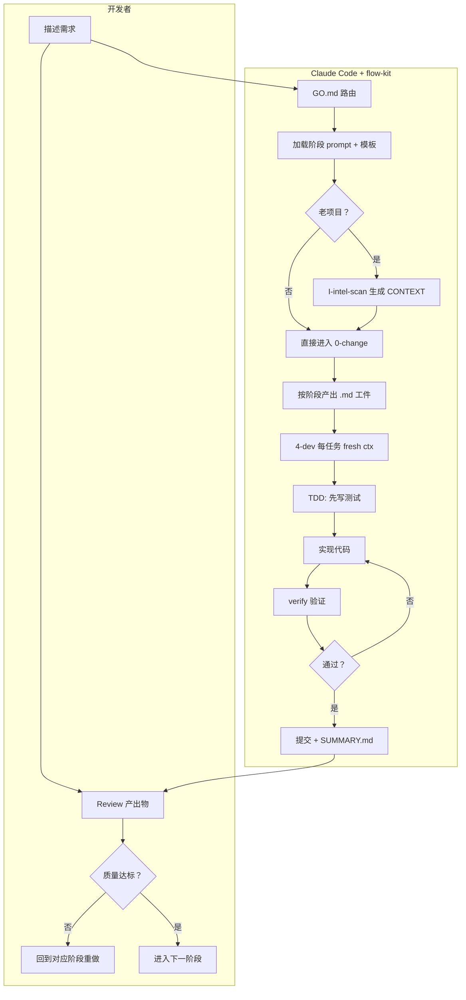

# AI 写代码总翻车？flow-kit 把流程管起来，让 AI 别瞎搞

用 AI 写代码这事儿，越用越发现一个尴尬的现实——

让它直接写，10 次里有 3 次跑偏：不按项目既有架构来、重复造轮子、顺手改了不相关的文件、删了个"没人用"的函数结果反射调用的全炸了。让它先想再写，它又说了一堆正确的废话然后写出来还是那德行。

根本问题不是 AI 不聪明，是没有流程约束。人写代码有 code review、有 PR 流程、有设计文档，AI 介入之后这些全跳过了，直接上手写，不出事才怪。

**flow-kit 就是一套纯 markdown 的 AI 编程流程文档——把"从想法到上线"拆成 8 个阶段，每个阶段有 prompt、有模板、有产出物，AI 按阶段走，不跳步不瞎搞。** 不是工具，没有 CLI，clone 下来就用。

## 为什么值得看

AI 编程的痛点不只是"写不好"，更核心的是——

- **没有流程约束**。人对 AI 说了"帮我加个功能"，AI 直接开写，跳过需求澄清、跳过设计、跳过拆任务
- **上下文窗口崩盘**。50k token 的大对话里 AI 开始打转、重复、遗忘前面的约束
- **老项目一碰就碎**。AI 不知道项目用了 Repository 模式就写 Service 直调 ORM；不知道已有 `formatDate` 就又造一个
- **产出不可追溯**。改了什么、为什么改、决策依据是什么——全在对话里，对话一关就没了

flow-kit 的做法：**用 markdown 文件当流程管线，每个阶段产出 .md 工件，状态靠文件传递不靠对话记忆**。放到实际工作里，这意味着每一步都有据可查，AI 不能跳步，老项目有护栏防翻车。

## 核心能力拆解

### 8 阶段线性流程：从模糊想法到可发布

```
0-change → 1-requirement → 2-design → 3-task → 4-dev → 5-test → 6-review → 7-integration
```

每个阶段做一件明确的事：

| 阶段 | 做什么 | 产出 |
|------|--------|------|
| 0-change | 反问澄清，把模糊想法变成变更提案 | CHANGE.md |
| 1-requirement | 把提案变成可执行需求 + 验收准则 | REQUIREMENT.md |
| 2-design | 把需求变成技术设计 + ADR + 风险 | DESIGN.md |
| 3-task | 把设计拆成可并行的原子任务 | TASK.md |
| 4-dev | 单任务执行（TDD + 提交 + 断点恢复） | 代码 + SUMMARY.md |
| 5-test | 从验收准则派生测试矩阵 + UAT 脚本 | TEST.md |
| 6-review | 双/三轮审查（spec 合规 + 代码质量 + 视觉） | REVIEW.md |
| 7-integration | UAT 引导 + 失败诊断 + 教训沉淀 + 归档 | LESSONS.md |

类比一下：这就像把"一个人闷头写代码"变成"有流程的研发团队"——不是让 AI 变聪明，是给 AI 加上人在用的研发流程。

**两个路径可以选**：从零开发走完整 8 步；给已有项目加功能可以跳过 1-requirement 和 2-design（如果架构没变的话），最少 6 步。MVP 模式只要 3 步就能当天跑通。

### 每个阶段 fresh context：不靠对话堆叠，靠文件传递状态

这是 flow-kit 最核心的设计决策。阶段切换时清窗，通过 .md 工件传递状态，不让对话无限堆叠。

为什么这很重要？50k token 以上的对话里，AI 会开始：
- 重复之前说过的内容
- 遗忘前面的约束和决策
- 在多个方案之间反复横跳

flow-kit 的做法是：每个任务开一个 fresh context，只加载必要的 prompt + 当前 task 块 + LESSONS。窗口压力小，AI 不会打转。

代价是 token 消耗更多（每个 task 重新加载 prompt + spec），但这恰好是 token 多花、单窗压力小的取舍——用 token 换稳定性。

### 老项目护栏：5 道防线防 AI 瞎搞

这是 flow-kit 对 brownfield 项目最实用的部分：

| 护栏 | 拦什么 |
|------|--------|
| **B1** 入场扫描自动生成 CONTEXT.md | AI 不知道项目栈和既有抽象 → 写出格格不入的代码 |
| **B2** DESIGN 步骤 0.5「既有架构对齐」 | 引入与项目矛盾的新模式（如老项目用 Repository，AI 写出直调 ORM） |
| **B3** TASK 的 `read_files` + `write_files` 强约束 | "顺手改了别的文件"，提交前自动检测越界 |
| **B4** 破坏性变更高门槛协议 | 删错代码 / 改坏公共接口 → 强制 grep 引用图 + 反问用户 |
| **B5** 沿用既有抽象 grep | 重复实现已有抽象（项目里已有 formatDate，AI 又写一个） |

这些护栏不是花架子，每一条拦的都是真实会出的事故。跳过 B3，AI 改路由的时候顺手改了中间件；跳过 B5，项目里出现三个 `formatDate`。

### 横向命令：不在主流程里，按需调用

前缀区分作用：`L-` 生命周期、`M-` 维护巡检、`I-` 项目情报、`A-` 架构演进。

| 命令 | 做什么 | 什么时候用 |
|------|--------|-----------|
| `I-intel-scan` | 老项目入场扫描，生成 CONTEXT.md | 老项目首次使用 flow-kit 必跑 |
| `A-architect` | 项目级架构梳理，建立 ARCHITECTURE.md | 里程碑后架构梳理；接手陌生项目 |
| `A-evolve` | 架构增量同步，扫近期归档的 DESIGN §9 更新 CONTEXT + ARCHITECTURE | 每月/每季批量同步 |
| `M-health` | 代码库周期性巡检，6+6 维衰退诊断 + 冗余扫描 | 月度/季度体检；接手陌生项目首周 |
| `L-restyle` | 一键换调性，保留功能只换视觉 | 品牌换新；做暗色版 |

### 每个文件都能单独用：不用全套上车

这是 flow-kit 和同类工具的明显区别——除了 PROGRESS.md 和 STATE.md 这种流程绑定文件，其他每个 prompt 和 template 都设计成可独立使用。

只想让 AI 更靠谱？单独注入 RULES.md 就行。只想做 code review？6-review.md + REVIEW.md 模板就够了。只想给项目建一份"小抄"？CONTEXT.md 填好就有用。

### 三层项目级文档：rules / structure / change 职责不重叠

| 层级 | 文件 | 职责 | 谁维护 |
|------|------|------|--------|
| rules | CONTEXT.md | 技术栈、命名约定、既有抽象、禁动清单 | intel-scan 首创 + A-evolve 增量 |
| structure | ARCHITECTURE.md | 模块图、依赖规则、ADR 列表、跨模块契约 | A-architect 首创 + A-evolve 增量 |
| change | DESIGN.md | 本次 change 的技术决策、风险、架构沉淀建议 | 2-design 写，归档后冻结 |

三层之间有联动机制：每个 change 完成后，DESIGN.md 的 §9 填入架构沉淀建议；A-evolve 定期扫这些 §9，逐项 review 后 patch CONTEXT.md 和 ARCHITECTURE.md。这不是一次性文档，是跟着项目持续生长的知识层。

## 上手成本到底高不高

极低。没有 npm install、没有 pip、没有 CLI。把 `flow-kit/` 文件夹复制到项目根目录就完了。

```text
your-project/
├── flow-kit/          ← 复制到这里
│   ├── METHODOLOGY.md
│   ├── RULES.md
│   ├── GO.md
│   ├── prompts/
│   └── templates/
├── src/
└── ...
```

所有 AI IDE 都支持 `@` 引用文件——Windsurf、Claude Code、Cursor、Copilot、Codex、Gemini、Cline 全能跑。想更省事，把 SYSTEM.md 注入到 IDE 全局规则文件，每次会话少引一个文件。

## 怎么用，按真实使用路径讲

### 最简方式：一个 @ 搞定

```
@flow-kit/GO.md

设计陪诊网站
```

GO.md 是统一入口——自动判断你想做哪个阶段，自动生成 change-id，自动加载所需工件，自动反问澄清。任何 IDE、任何 AI 都只需要这一个 @。

### 接入流程



### 示例对话：

```text
你: @flow-kit/GO.md  帮我在现有项目里加一个用户权限模块

AI: 检测到项目没有 CONTEXT.md，建议先跑入场扫描（~15-30k tokens，仅首次）。
    1) 现在跑  2) 跳过

你: 1

AI: 好，跑 I-intel-scan...
    扫描完成，生成 CONTEXT.md：
    - 技术栈：Next.js 14 + Prisma + PostgreSQL
    - 既有抽象：已有 auth middleware、用户模型
    - 禁动清单：不动 prisma/schema.prisma 的 id 字段
    - 命名约定：驼峰、组件 PascalCase

    现在进入 0-change 阶段。你的权限模块具体需要什么？
    - 基于角色还是基于权限？
    - 需要前端路由守卫吗？
    - 和现有 auth middleware 是什么关系？

你: 基于角色，需要路由守卫，和现有 auth middleware 对接

AI: CHANGE.md 已生成，change-id: rbac-module。
    下一步：@flow-kit/prompts/1-requirement.md 出需求文档。
    因为架构有变化，建议走 2-design，不跳过。
```

### 组合工作流：flow-kit + Claude Code

flow-kit 本身不挑 AI 工具，但和 Claude Code 配合有个天然优势——Claude Code 支持 skill 机制，每个阶段的 prompt 可以包成 skill，用 `/` 斜杠命令直接调用。

**接入步骤：**

```bash
# 把 prompts 包成 Claude Code skills
mkdir -p .claude/skills/flow-change
cp flow-kit/prompts/0-change.md .claude/skills/flow-change/SKILL.md
# 其他阶段同理

# 或者最简单——直接在会话里 @ 引用
```

**实际协作过程：**



**实际协作示例：**

```text
你: @flow-kit/GO.md  继续执行 T03

AI: 加载 TASK.md...T03 是"实现 RBAC 中间件"。
    加载 CONTEXT.md...项目用 Prisma，已有 auth middleware。
    Fresh context 启动，加载 4-dev prompt + T03 任务块 + LESSONS.md。

    1.4 grep 既有抽象：找到 src/middleware/auth.ts，沿用其模式。
    TDD 开始——先写测试：
    - 未登录用户访问 /admin 返回 401
    - 普通用户访问 /admin 返回 403
    - 管理员访问 /admin 返回 200

    实现中...采用与 auth.ts 相同的 middleware 链模式。
    verify 通过，准备提交。

    5 提交前 diff 边界 verify：检查变更文件列表——
    变更：src/middleware/rbac.ts（新建）、src/middleware/index.ts（注册）
    未越界，可以提交。

你: 提交吧，然后跑 review

AI: 已提交。进入 6-review...
    第一轮 spec 合规：T03 的 verify 全通过 ✅
    第二轮代码质量：RBAC 中间件复用了 auth.ts 的模式 ✅
    未发现越界修改 ✅

    REVIEW.md 已生成到 .specs/rbac-module/。
```

这个工作流里，flow-kit 不只是"给 AI 一堆 prompt"——它管的是流程纪律。每个任务有边界、有验证、有审查，AI 不能跳步、不能顺手改别的文件、不能忘掉项目已有抽象。这些组合起来，AI 编程从"赌运气"变成了"有流程保障"。

## 哪些地方是真的香

- 每个阶段 fresh context，50k+ token 大对话里 AI 打转的问题基本消失
- 老项目护栏是真的拦得住事故，B3 边界检测和B5 既有抽象 grep 每次都省排查时间
- 全套纯 markdown，没有运行时依赖，不会被工具更新坑到

## 哪些人会更适合用

- **AI 编程重度用户**：日常用 Claude Code / Cursor / Windsurf 写项目，受够了 AI 不按套路出牌
- **老项目维护者**：项目代码量大、架构复杂，AI 一改就翻车，需要护栏约束
- **团队技术负责人**：想让团队用 AI 编程时有统一流程和可追溯的产出物
- **长期项目开发者**：需要跨 change 沉淀架构决策和失败教训，不想每个需求都从零开始
- **前端项目开发者**：2a-ui-design 阶段 + 反 AI-slop 清单，专门对付 AI 生成的前端"审美灾难"
- **流程洁癖者**：受不了 AI 跳步、改需求、不写测试的工作方式

## 使用前最好知道的边界

- **Token 消耗比"裸用 AI"高**。完整模式一个中型 change 要 250k-530k token。多花的 token 换的是稳定性和可追溯性，但如果只是改 30 行以内的简单 bugfix，别走 flow-kit，让 AI 直接改更快
- **手动操作多**。没有 CLI、没有自动化，每个阶段要手动 @ 引用 prompt。GO.md 能简化到 1 个 @，但阶段之间的切换还是得手动推进
- **AI 可能跳过流程**。项目作者 2026.5.6 明确标注"运行过程发现 AI 会跳过一些流程"。RULES.md 写得再硬，AI 也不是 100% 遵守——特别是上下文长的时候
- **流程重不适合轻量场景**。改个 CSS、加个字段、修个小 bug——走 flow-kit 反而更慢。它解决的是 100 行以上的中等规模以上需求
- **模板需要适配**。默认模板是通用设计，特定项目可能需要追加规则（commit 格式、覆盖率门槛等）。RULES.md 支持扩展，但要自己加
- **跨模型审查依赖手动切模型**。6-review 建议其中一轮用不同模型做 spot-check，但 flow-kit 本身不会自动切换模型——你得自己开另一个会话或 IDE 来做

---

**AI 编程缺的不是更聪明的模型，是更靠谱的流程——flow-kit 把人用的研发流程翻译成 AI 能执行的 markdown，值不值看你愿不愿意多花 token 换一个不翻车的 AI。**

#AI编程 #flow-kit #LLM工作流 #代码质量 #ClaudeCode #Cursor #Windsurf #AI Agent #研发流程 #老项目维护 #TDD #开源工具
