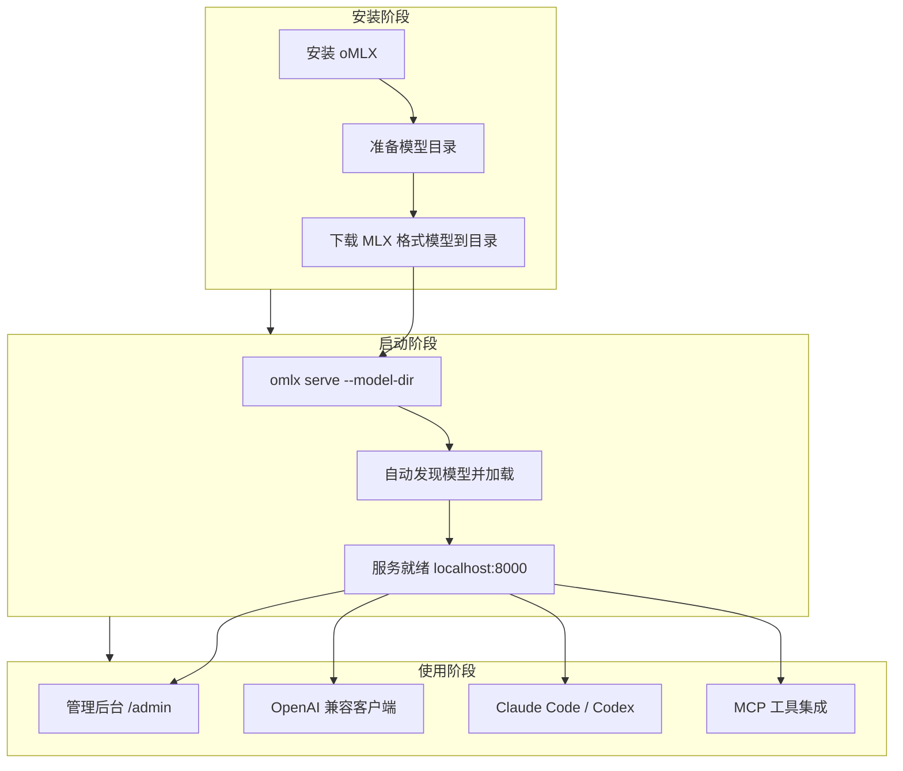
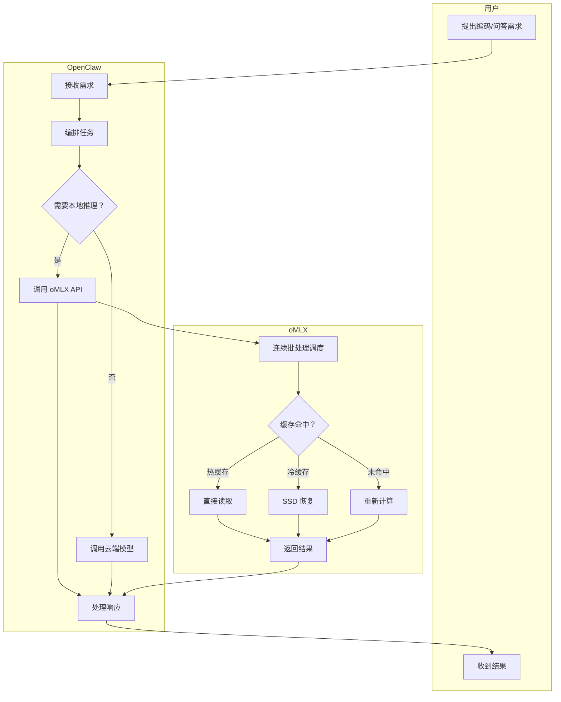

# Mac 上跑本地 LLM 总是折腾？oMLX 把推理服务器塞进菜单栏

在 Mac 上跑本地模型这件事，折腾过的人都知道——

开个 llama-server，终端占着不敢关；想同时跑 LLM 和嵌入模型，得开两个进程两个端口；上下文一长内存就炸，重启之后缓存全丢，前面对话全白算；想接 Claude Code，还得自己琢磨 API 格式和超时配置。

每次想用本地模型，光是"把它跑起来"这步就够劝退了。

**oMLX 就是干这个的：一个为 Apple Silicon 优化的本地 LLM 推理服务器，多模型同服、KV 缓存分层持久化、菜单栏一键管理。** 跑起来之后，它就是一个本地版的 OpenAI API，任何兼容客户端直连就行。

## 为什么值得看

本地推理的痛点很明确——

- **多模型不能共存**。LLM + VLM + 嵌入模型要开三个服务，端口管理心累
- **缓存不持久**。换对话、换模型、重启服务器，之前算好的 KV 缓存全白费
- **内存管理靠手感**。模型一多就容易 OOM，没有自动卸载机制
- **和 Agent 工具集成麻烦**。Claude Code、Codex 这些要手动配 endpoint、改 config

oMLX 的思路是：把这些基础设施问题全解决掉，让本地推理从"折腾"变成"开箱即用"。放到实际工作里，这意味着 Mac 上跑本地模型终于可以像用云 API 一样省心了——只不过数据不出机器。

## 核心能力拆解

### 分层 KV 缓存：热缓存 + 冷缓存，重启也不丢

这是 oMLX 最核心的差异化能力。借鉴 vLLM 的基于块的 KV 缓存管理，把缓存分成两层：

- **热缓存（RAM）**：频繁访问的块留在内存，快速读取
- **冷缓存（SSD）**：热缓存满了，块以 safetensors 格式转存到 SSD。下次请求命中相同前缀直接从磁盘恢复，不用重算

类比一下：热缓存就像你桌上常翻的那几份文件，冷缓存是档案柜——桌上放不下就归档，要用的时候拿出来比重新写一份快得多。

关键点：**即使服务器重启，冷缓存也不会丢**。之前算过的上下文，重启后还能接着用。这对配合 Claude Code 这类 Agent 做实际编码特别重要——长对话中途不会因为缓存丢失而重新计算整个前缀。

支持前缀共享和写时复制（Copy-on-Write），多个请求共享相同前缀时只存一份。

### 多模型同服：LLM、VLM、嵌入、重排序全在一台

一个服务器进程里同时加载文本 LLM、视觉语言模型、嵌入模型和重排序模型。通过 OpenAI 兼容 API 统一暴露。

管理机制是自动 + 手动的组合：

| 机制 | 做什么 |
|------|--------|
| LRU 驱逐 | 内存不够时，最近最少用的模型自动卸载 |
| 模型固定 | 常用模型钉住不放，不被驱逐 |
| 模型级 TTL | 空闲超时自动卸载，省内存 |
| 手动加载/卸载 | 管理后台一键操作 |
| 进程内存限制 | 总内存上限默认系统 RAM - 8GB，防 OOM |

在真实场景里，这意味着：把主力编码模型固定住，嵌入模型按需加载，VLM 偶尔用一下设个 5 分钟 TTL 自动回收。不用操心"开了几个模型会不会爆内存"。

### 连续批处理：并发请求不用排队

通过 mlx-lm 的 BatchGenerator 处理并发请求。多个请求同时进来，不用一个一个串行等。最大并发数可配置。

### Claude Code 优化：为 Agent 场景专门调过

这不是随便说说的"兼容"，是针对 Claude Code 的实际使用模式做了适配：

- **上下文缩放**：用较小上下文模型时，缩放上报的 token 数量，让自动压缩在合适时机触发
- **SSE keep-alive**：防止长时间预填充导致的读取超时

在 Agent 编码场景里，这两个优化直接决定了"能用"还是"频繁断连"。本地模型预填充慢是常态，没有 keep-alive 的话 Claude Code 等不到响应就超时了。

### 视觉语言模型 + OCR：同一个推理栈

VLM 用的是和文本 LLM 一样的连续批处理 + 分层 KV 缓存堆栈。支持多图聊天、base64/URL/文件图像输入，以及带视觉上下文的工具调用。

OCR 模型（DeepSeek-OCR、DOTS-OCR、GLM-OCR）会被自动识别并使用优化的提示词，不用手动配置。

### 管理后台：Web UI 管一切

`/admin` 提供实时监控、模型管理、聊天、基准测试和模型级设置。支持中英日韩四种语言，CDN 依赖全内置，完全离线可用。

能做的事：

- 模型加载/卸载/固定/TTL 设置
- 每个模型的采样参数、聊天模板参数、别名独立配置，改了即时生效
- 内置聊天 UI，支持对话历史、模型切换、VLM/OCR 图片上传
- 一键基准测试（预填充 PP + 生成 TG 的 tok/s，含部分前缀缓存命中测试）
- HuggingFace 模型搜索下载，一键搞定
- OpenClaw / OpenCode / Codex 一键集成配置

### 菜单栏应用：不用开终端

原生 PyObjC 菜单栏应用，不是 Electron。启动、停止、监控服务器全在菜单栏完成。包含持久化服务统计（重启后保留）、崩溃自动重启、应用内自动更新。

如果用 CLI，还有 Homebrew 服务模式：`brew services start omlx`，崩溃自动重启。

### API 兼容性：OpenAI + Anthropic 双协议

| 端点 | 说明 |
|------|------|
| `POST /v1/chat/completions` | 聊天补全（流式） |
| `POST /v1/completions` | 文本补全（流式） |
| `POST /v1/messages` | Anthropic Messages API |
| `POST /v1/embeddings` | 文本嵌入 |
| `POST /v1/rerank` | 文档重排序 |
| `GET /v1/models` | 列出可用模型 |

直接当 OpenAI 或 Anthropic API 用。支持流式使用统计、Anthropic adaptive thinking、视觉输入。

### 工具调用与结构化输出

支持 mlx-lm 所有可用的函数调用格式、JSON Schema 验证和 MCP 工具集成。多个模型系列自动检测：

| 模型系列 | 工具调用格式 |
|---------|-------------|
| Llama、Qwen、DeepSeek 等 | JSON `<tool_call>` |
| Qwen3.5 系列 | XML `<function=...>` |
| Gemma | `<start_function_call>` |
| GLM (4.7, 5) | `<arg_key>/</tool_call>` XML |
| MiniMax | Namespaced `<minimax:tool_call>` |
| Mistral | `[TOOL_CALLS]` |
| Kimi K2 | `<\|tool_calls_section_begin\|>` |
| Longcat | `<longcat_tool_call>` |

没列出来的模型，只要聊天模板支持 `tools` 参数且输出用可识别的 `<tool_call>` XML 格式，也有可能正常工作。

## 上手成本到底高不高

门槛不算高。macOS 应用的话，下载 DMG 拖进 Applications 就完事。CLI 的话，Homebrew 一行搞定。前提是你在 Apple Silicon 的 Mac 上，系统 macOS 15.0+。

**macOS 应用安装：**

从 [Releases](https://github.com/jundot/omlx/releases) 下载 `.dmg`，拖到 Applications 即可。应用支持自动更新。

**Homebrew 安装：**

```bash
brew tap jundot/omlx https://github.com/jundot/omlx
brew install omlx

# 升级到最新版本
brew update && brew upgrade omlx

# 作为后台服务运行（崩溃时自动重启）
brew services start omlx

# 可选：MCP（Model Context Protocol）支持
/opt/homebrew/opt/omlx/libexec/bin/pip install mcp
```

**从源码安装：**

```bash
git clone https://github.com/jundot/omlx.git
cd omlx
pip install -e .          # 仅核心
pip install -e ".[mcp]"   # 含 MCP 支持
```

需要 macOS 15.0+ (Sequoia), Python 3.10+ 和 Apple Silicon（M1/M2/M3/M4）。

## 怎么用，按真实使用路径讲

### CLI 启动

```bash
omlx serve --model-dir ~/models
```

服务器会自动从子目录中发现 LLM、VLM、嵌入模型和重排序模型。任何 OpenAI 兼容客户端连接 `http://localhost:8000/v1`。内置聊天 UI 在 `http://localhost:8000/admin/chat`。

### 接入流程



### 示例对话：

```text
你: 帮我把 oMLX 跑起来，接上 Claude Code

AI: 好，先用 Homebrew 装：
brew tap jundot/omlx https://github.com/jundot/omlx
brew install omlx

你: 装好了，模型放哪？

AI: 建议建个目录，比如 ~/models，把 MLX 格式的模型丢进去就行。目录结构支持两级：
~/models/
├── Qwen3-Coder-Next-8bit/
├── bge-m3/
└── ...
oMLX 会自动识别模型类型，不用手动声明。

你: 模型下好了，启动服务

AI: 直接跑：
omlx serve --model-dir ~/models
启动后访问 http://localhost:8000/admin 就是管理后台。
接 Claude Code 的话，在管理后台的集成页面一键配置就行，不用手动改 config。

你: 内存不够怎么办？我想同时跑 LLM 和嵌入模型

AI: oMLX 有 LRU 自动驱逐和模型级 TTL。常用模型可以固定住，嵌入模型设个空闲超时自动卸载。也可以指定总内存上限：
omlx serve --model-dir ~/models --max-process-memory 80%
这样不会把系统内存吃满。
```

### 组合工作流：oMLX + OpenClaw

oMLX 作为本地推理后端，OpenClaw 作为 Agent 编排层，这个组合的核心优势是——**所有推理都在本地跑，数据不出机器，同时 Agent 的对话上下文通过分层 KV 缓存持久化**。

**接入步骤：**

在 oMLX 管理后台的集成页面，选择 OpenClaw，一键生成配置。或者手动配置 OpenClaw 指向 oMLX 的 API 端点。



**实际协作示例：**

```text
你: 用本地模型帮我 review 这段代码，不要发云端

AI: 调用 oMLX 本地推理...（命中热缓存，前缀复用）
模型：Qwen3-Coder-Next-8bit
分析结果：...（代码审查意见）

你: 顺便给这段代码生成嵌入向量，存到知识库

AI: oMLX 自动加载 bge-m3 嵌入模型（TTL 5分钟，空闲后自动卸载）
生成嵌入向量完成，768 维。

你: 下次同样的代码 review 会更快吗？

AI: 会。KV 缓存会保留在热缓存或冷缓存中。相同前缀的请求会直接复用缓存，不用重新计算。即使重启 oMLX，冷缓存在 SSD 上不会丢。
```

这个工作流里，oMLX 不只是"本地推理服务器"——它的分层缓存让 Agent 的长对话上下文可以持久化，LRU + TTL 让多模型共存不 OOM，Claude Code 优化让 Agent 编码不超时。这些组合起来，才让本地模型在 Agent 场景下真正可用。

## 哪些地方是真的香

- KV 缓存重启不丢，长对话终于不用每次重算前缀了
- 多模型同服 + LRU 自动管理，不用再手动开端口、手动杀进程
- 管理后台一键集成本地 Agent 工具，配置从"手动改文件"变成"点个按钮"

## 哪些人会更适合用

- **Apple Silicon Mac 用户**：有 M 系列芯片，想跑本地模型但不想折腾
- **Agent 编码重度用户**：用 Claude Code / Codex 做编码，想用本地模型降低延迟和成本
- **隐私敏感场景**：代码或文档不能出机器，必须本地推理
- **多模型切换用户**：日常需要 LLM + 嵌入 + 重排序组合，不想开多个服务
- **Obsidian / 知识库用户**：需要本地嵌入模型做 RAG，oMLX 可以一并托管
- **macOS 原生体验党**：不想开终端，菜单栏管理一切

## 使用前最好知道的边界

- **只支持 Apple Silicon**。Intel Mac 不行，Linux 也不行。这是 MLX 框架的限制
- **需要 macOS 15.0+（Sequoia）**。老系统跑不了
- **冷缓存依赖 SSD**。如果 SSD 空间紧张，冷缓存转存会受限。不过 safetensors 格式压缩率还行
- **模型必须是 MLX 格式**。不能直接用 GGUF 或 safetensors 原始格式，得找 MLX 转换版。好在 HuggingFace 上 mlx-community 有大量转换好的模型
- **macOS 应用不含 CLI**。DMG 安装的只有 GUI，要 CLI 得走 Homebrew 或源码
- **VLM 性能受限**。视觉模型的预填充比文本 LLM 更慢，大图场景下等待时间会比较长
- **工具调用依赖模型自身支持**。模型聊天模板不支持 `tools` 参数的话，工具调用功能用不了

---

**本地推理不是不能用，是一直缺少一个把基础设施问题全收拾好的工具——oMLX 做的就是这件事，值不值看你愿不愿意让 Mac 真正成为本地推理的主力机。**

#AppleSilicon #oMLX #本地推理 #MLX #KV缓存 #ClaudeCode #本地LLM #MCP #多模型服务 #OpenAI兼容API #macOS #开源工具
