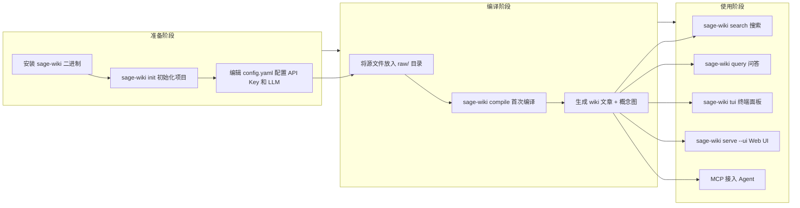
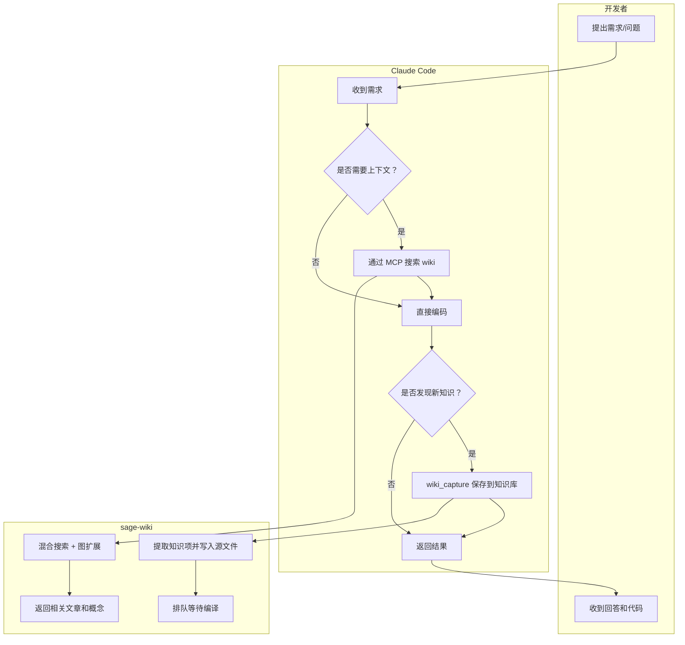

# 知识库全靠手动整理？sage-wiki 让 LLM 帮你把文档编译成 wiki

硬盘里躺了上千篇论文、几百篇笔记、几十个项目文档——想找的时候翻半天，找到之后发现跟另一篇有关联但从来没链接过。

手动整理？整理到一半就放弃了，比写代码还累。

不整理？那就等于没有知识库，只是个文件坟场。

**sage-wiki 就是干这事的：把你的文档扔进去，LLM 自动读完、提取概念、生成互相关联的 wiki 文章。** 输入源文件，输出结构化知识库。

## 这玩意到底解决了什么破事

传统知识管理的痛点特别集中——

- **文档之间没有关联**。论文 A 和笔记 B 讲的是同一个东西，但谁也不知道对方存在
- **搜索靠文件名**。记不清文件名的时候，等于没存
- **整理成本极高**。手动打标签、写摘要、建链接，比看文档本身还耗时
- **规模一上去就崩**。100 篇还能手动管，1000 篇以上基本放弃

sage-wiki 的思路很直接：**编译器不是只编译代码，也可以编译知识**。把 LLM 当编译器的后端，源文件当输入，wiki 文章当输出。每次加新文档，整个知识库都会变得更丰富——因为新文档里的概念会自动和已有文章建立关联。

放到实际工作里，这意味着：以前写完一篇笔记就扔那儿了，现在每写一篇，知识库就自动多几条交叉引用，越积越聪明。

## 核心能力拆解

### 自动编译：扔文件进去，出来 wiki

把 PDF、Markdown、Word、甚至图片和代码文件丢进 `raw/` 目录，sage-wiki 会自动检测格式，用 LLM 读完之后生成摘要、提取概念、写出互相关联的 wiki 文章。

支持的格式非常广：

| 类型 | 支持的扩展名 | 提取内容 |
|------|-------------|---------|
| Markdown | `.md` | 正文 + frontmatter |
| PDF | `.pdf` | 纯 Go 提取全文 |
| Word | `.docx` | XML 文档文本 |
| Excel | `.xlsx` | 单元格值和工作表数据 |
| PPT | `.pptx` | 幻灯片文本 |
| CSV | `.csv` | 表头 + 行数据（最多 1000 行） |
| EPUB | `.epub` | XHTML 章节文本 |
| 邮件 | `.eml` | 邮件头 + 正文 |
| 图片 | `.png/.jpg/.gif/.webp/.svg` | 通过 vision LLM 生成描述 |
| 代码 | `.go/.py/.js/.ts/.rs` 等 | 源代码 |

丢进去就行，不用管格式。图片需要用支持 vision 的模型（Gemini、Claude、GPT-4o）。

在真实场景里，这意味着研究者的论文库、开发者的项目文档、运营的会议纪要——全都能往里扔，不用事先整理成统一格式。

### 分层编译：10 万文档也能在几小时内搞定

这是最关键的工程决策。不是所有文档都值得花 LLM 费用跑完整编译管线，sage-wiki 用四层分层来控制成本：

| 层级 | 做什么 | 费用 | 每文档耗时 |
|------|--------|------|-----------|
| 0 — 仅索引 | FTS5 全文搜索 | 免费 | ~5ms |
| 1 — 索引 + 向量 | FTS5 + 向量 embedding | ~$0.00002 | ~200ms |
| 2 — 代码解析 | 正则解析器提取结构摘要 | 免费 | ~10ms |
| 3 — 完整编译 | 摘要 + 概念提取 + 写文章 | ~$0.05-0.15 | ~5-8 分钟 |

类比一下：这就像图书馆的分级处理——新书先进目录（层级 0），有人借了再做摘要卡（层级 1），借的人多了才写完整书评（层级 3）。不是每本书都值得写书评，但每本书都该能被找到。

默认所有文档走层级 3，但对于万级以上的知识库，设 `default_tier: 1` 就能先快速索引全部内容，再按需编译。搜索命中多次的文档会自动提升到层级 3，90 天没人查的会自动降级。

### 增强搜索：不是关键词匹配，是理解式检索

搜索管线相当硬核，六层增强：

1. **Chunk 级索引**：文章切成 ~800 token 的块，每块独立索引，搜 "flash attention" 能精确定位到长文中的相关段落
2. **LLM 查询扩展**：一次 LLM 调用生成关键词改写、语义改写和假设回答
3. **LLM 重排序**：前 15 候选由 LLM 打分，位置感知融合保护高置信检索结果
4. **跨语言向量搜索**：中文查询能搜到英文内容，零词汇重叠也能命中
5. **图增强上下文**：4 信号图评分器通过本体发现相关文章
6. **Token 预算控制**：上下文限制在可配置上限内，贪心填充最优结果

用 Ollama 跑本地模型的话，这些增强搜索完全免费。用云端 LLM，单次查询大约 $0.0006。

### MCP 集成：让 Agent 主动查知识库

sage-wiki 提供 17 个 MCP 工具，可以接入 Claude Code、Cursor 等任何 MCP 客户端。Agent 在对话中就能搜索 wiki、捕获知识、按需编译。

这意味着 Agent 不再是"每次对话都从零开始"——它有一个持久化的记忆层可以查。对话中发现的决策、踩过的坑，一句"保存到 wiki"就自动提取并入库。

### 本体图：概念之间不只是"相关"，而是有明确关系

内置 8 种关系类型：`implements`、`extends`、`optimizes`、`contradicts`、`cites`、`prerequisite_of`、`trades_off`、`derived_from`。还能自定义关系类型和同义词。

这比普通知识库的"相关文章推荐"强得多——它知道 A 是 B 的优化版本，C 和 D 互相矛盾，E 是 F 的前置知识。查一个概念的时候，不只是看到"相关"，而是看到"为什么相关"。

### 费用控制：不是无脑烧 API 额度

三种省钱策略：

- **Prompt 缓存**（默认开启）：复用系统提示词，省 50-90% 输入 token 费用
- **Batch API**：异步提交批次，费用降 50%
- **费用估算**：编译前预览费用，`--estimate` 先看再决定

## 上手门槛：比想象中低

sage-wiki 是单一 Go 二进制文件，除了 API Key 不需要额外装东西。有 Go 环境一行命令搞定，没 Go 环境用 Docker 也行。

**CLI 安装（不含 Web UI）：**

```bash
go install github.com/xoai/sage-wiki/cmd/sage-wiki@latest
```

**含 Web UI 安装：**

```bash
git clone https://github.com/xoai/sage-wiki.git && cd sage-wiki
cd web && npm install && npm run build && cd ..
go build -tags webui -o sage-wiki ./cmd/sage-wiki/
```

**Docker：**

```bash
docker pull ghcr.io/xoai/sage-wiki:latest
docker run -d -p 3333:3333 -v ./my-wiki:/wiki -e GEMINI_API_KEY=... ghcr.io/xoai/sage-wiki
```

安装完初始化项目、配好 API Key 就能跑。Vault 覆盖模式甚至可以直接在现有 Obsidian 仓库上操作，不用迁移数据。

## 从零跑通：实际使用路径

### 全新项目

```bash
mkdir my-wiki && cd my-wiki
sage-wiki init
# 将源文件放入 raw/
cp ~/papers/*.pdf raw/papers/
cp ~/articles/*.md raw/articles/
# 编辑 config.yaml,添加 API Key 并选择 LLM
# 首次编译
sage-wiki compile
# 搜索
sage-wiki search "attention mechanism"
# 提问
sage-wiki query "How does flash attention optimize memory?"
# 交互式终端面板
sage-wiki tui
# 在浏览器中查看 (需要 -tags webui 构建)
sage-wiki serve --ui
# 监听文件夹变化
sage-wiki compile --watch
```

### Vault 覆盖模式（已有 Obsidian 仓库）

```bash
cd ~/Documents/MyVault
sage-wiki init --vault
# 编辑 config.yaml,设置源文件/忽略文件夹,添加 API Key,选择 LLM
# 首次编译
sage-wiki compile
# 监听仓库变化
sage-wiki compile --watch
```

### 接入流程



### 示例对话：

```text
你: 帮我把之前研究的几篇 Transformer 论文整理成知识库

AI: 好的，先确认下环境。sage-wiki 装了没？

你: 装了，go install 装的

AI: 那直接初始化项目。先建目录，然后跑 init：
mkdir transformer-wiki && cd transformer-wiki
sage-wiki init

你: init 完了，接下来怎么把论文放进去？

AI: 把 PDF 丢进 raw/ 目录就行，比如：
cp ~/papers/attention-is-all-you-need.pdf raw/
cp ~/papers/flash-attention.pdf raw/
然后编辑 config.yaml，把 GEMINI_API_KEY 填上，选好模型。

你: 配好了，跑编译？

AI: 直接跑：
sage-wiki compile
首次编译会读所有文件，每篇大概 5-8 分钟。可以先加 --estimate 看下费用再决定。

你: 编译完了，怎么搜？

AI: 两种方式——关键词搜索：
sage-wiki search "flash attention"
或者自然语言提问：
sage-wiki query "Flash Attention 和标准 Attention 的核心区别是什么？"
query 会给出带引用的回答，不是只返回文档列表。
```

### 组合工作流：sage-wiki + Claude Code

这个组合的威力在于——Claude Code 写代码的时候可以随时查知识库，发现的新知识也能直接存回去。

**接入步骤：**

在项目根目录的 `.mcp.json` 中添加：

```json
{
  "mcpServers": {
    "sage-wiki": {
      "command": "sage-wiki",
      "args": ["serve", "--project", "/path/to/wiki"]
    }
  }
}
```

配好之后，Claude Code 就能通过 MCP 调用 sage-wiki 的 17 个工具。实际协作流程：



**实际协作示例：**

```text
你: 帮我重构连接池模块，先查下之前关于连接池的设计决策

AI: 搜索知识库...找到了 3 篇相关文章：
- "connection-pool-sizing"：2025-11 的决策，最大连接数从 100 改到 200
- "pool-timeout-strategy"：超时策略从固定 30s 改为指数退避
- "connection-leak-detection"：泄漏检测方案的选型记录

基于这些决策，当前连接池的核心参数是...（开始重构）

你: 这次重构把超时策略改成了自适应模式，把这个决策记录下来

AI: 已通过 wiki_capture 保存。提取了 1 个决策项：
- "adaptive-timeout-migration"：从指数退避迁移到自适应超时
已写入源文件，等待下次编译。
```

这个流程里，Claude Code 不只是查 wiki，还能往里写——对话中产生的决策、踩坑经验、设计变更，全都能自动沉淀。知识库不再是静态的，而是跟着开发过程持续生长。

## 真香的地方

- 丢文件进去就能搜，不用先花几周手动整理标签和链接
- 跨语言搜索是真的能用，中文问题直接搜英文论文，不用先翻译关键词
- 分层编译 + 自动升降级，10 万文档的库也能在可接受的成本内跑起来

## 谁会更适合用

- **研究者**：论文库几百篇以上，经常需要跨论文找关联概念
- **独立开发者**：多个项目之间有共享知识，需要跨项目检索
- **技术团队**：设计决策和踩坑记录散落在各处，需要统一沉淀和检索
- **Obsidian 重度用户**：已有大量笔记但链接稀疏，想自动化补全概念关联
- **AI Agent 构建者**：需要给 Agent 挂一个持久化的知识记忆层
- **长期知识工作者**：知识积累超过半年以上，手动整理已经跟不上新增速度

## 使用前最好知道的边界

- **完整编译依赖 LLM API**。层级 3 的每篇文档耗时 5-8 分钟，成本约 $0.05-0.15。大规模知识库务必先跑 `--estimate` 看费用，或者设 `default_tier: 1` 先索引再按需编译
- **搜索质量依赖 LLM**。查询扩展和重排序需要额外 API 调用。用本地 Ollama 可以免费但会自动禁用重排序
- **Web UI 需要单独构建**。默认 `go install` 不含 Web UI，要加 `-tags webui` 标志且需要 Node.js 环境
- **Web UI 默认无认证**。`--bind 0.0.0.0` 暴露到网络时没有内置登录机制，生产环境需要自己加反向代理鉴权
- **概念提取不是 100% 准确**。基准测试显示事实提取率 68.5%，综合质量分 73.0%。LLM 会遗漏部分概念，也会有噪音
- **代码解析器是正则而非 AST**（除 Go 外）。结构摘要的精度有限，复杂代码结构可能提取不完整
- **编译耗时主要卡在 LLM 调用**。非 LLM 编译开销低于 1 秒，但完整编译 1000 篇文档就是 1000 次 LLM 调用

---

**知识库不整理就是文件坟场，整理全靠手动就是体力活——sage-wiki 把"编译"这个概念从代码搬到了知识上，值不值看你愿不愿意让 LLM 帮你干活。**

#知识管理 #LLM编译 #sage-wiki #个人知识库 #MCP #Obsidian #全文搜索 #向量搜索 #知识图谱 #Agent记忆 #开源工具 #Go
