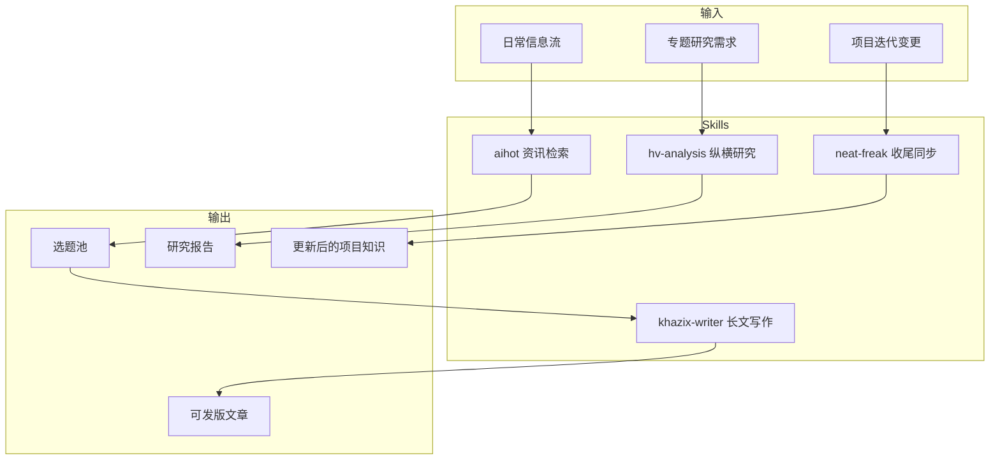

# 这仓库把 AI Agent 的「高频脏活」打包了：装上就能用，但别瞎上头

每天在 Agent 里干活，最烦的不是模型不聪明。

最烦的是流程重复：查资讯一套、写文一套、整理项目一套。

每次都从零讲需求，像让同事每天重新入职一次。

说难听点，这种重复劳动真的很狗东西。

先说结论：这是一个把「可复用工作方法」做成 Skills 的仓库，装到 Claude Code、Codex、OpenCode、OpenClaw 这类 Agent 里，可以直接通过自然语言调用。

它值得往下看，是因为它不只是“功能列表”，而是把几类高频动作做成了能落地的固定套路：

- 会话收尾同步（`neat-freak`）
- 深度研究拆解（`hv-analysis`）
- 长文写作风格固化（`khazix-writer`）
- AI 资讯一键检索（`aihot`）

放到真实工作里，这意味着什么？

意味着团队不用每次靠“临场发挥”，而是能把方法沉淀成可重复执行的资产。

## 真正有价值的，不是会不会，而是稳不稳

这个仓库在项目说明里明确了两类资产：

- **Skills**：可安装、可复用、遵循 Agent Skills 开放标准
- **Prompts**：可复制粘贴到常见对话模型的轻量版本

这套分层很实在。

有 Skill 系统的工具（Claude Code、Codex、OpenCode、OpenClaw）可以直接装；没有 Skill 系统的场景，也能先用 Prompt 版跑起来。

## 四个核心能力，分别解决哪种破事

### 1）`neat-freak`：给项目做“会话收尾卫生”

这个能力本质上是在任务结束后，把改动与知识做同步，覆盖三层：

- 项目规则文件（如 CLAUDE.md / AGENTS.md）
- 项目文档（docs / README）
- Agent 记忆

真实意义：避免代码改飞了、文档还活在上周。

就像家里换了门锁却没换钥匙说明，下一次进门必卡壳。

### 2）`hv-analysis`：研究任务不再“只看一面”

它的框架很清晰：

- 纵向：按时间线梳理对象演进
- 横向：和同期竞品/方案做对照
- 交叉：给出判断

项目说明里给出的产出形态是：万字级 PDF 研究报告（10,000–30,000 字）。

真实意义：做竞品和行业研究时，不会陷入“资料一堆、观点没有”。

### 3）`khazix-writer`：把写作风格工程化

它不是“帮你写字”这么浅。

它做的是把口吻、节奏、禁忌表达、检查机制打包进写作流程。

真实意义：账号内容风格更一致，减少“今天像人写，明天像模板机”的割裂感。

### 4）`aihot`：把 AI 资讯检索从手搓改成一句话

项目说明里给到的能力包括：

- 拉今天或指定日期日报
- 拉精选条目流
- 按分类拉条目（模型/产品/行业/论文/技巧）
- 按时间窗口拉最近 N 天
- 按关键词/公司/主题搜索

真实意义：做选题时先拿全局信息底盘，不用先折腾 API Key。

## 安装门槛高不高？几乎没有

项目原始安装命令如下：

```bash
帮我安装这个 skill：https://github.com/KKKKhazix/khazix-skills/tree/main/<skill-name>
```

把 `<skill-name>` 换成 `neat-freak`、`hv-analysis`、`khazix-writer` 这类目标目录即可。

### 示例对话：

```text
你:
帮我安装这个 skill：https://github.com/KKKKhazix/khazix-skills/tree/main/aihot

AI:
收到，开始安装 aihot。
安装完成后会校验是否可调用，并返回触发示例。

你:
装好后跑一下今天 AI 日报

AI:
已安装完成。
现在执行“今天 AI 圈有什么新东西”。
返回：日报摘要 + 重点动态清单。
```

## 从“能用”到“真用起来”，建议按这个路径走

先区分两层：

- **项目原生能力**：仓库里明确提供的 Skill 能力
- **组合工作流示例**：把这些能力接进团队实际协作方式



**组合工作流示例（作者补充的实际协作用法）**

以 OpenClaw / Hermes Agent 协作为例，可按这个顺序：

1. 早上先用 `aihot` 拉当天 AI 动态，筛 2~3 个可写题
2. 对重点题用 `hv-analysis` 做纵横研究补全背景
3. 用 `khazix-writer` 出首稿，统一文风
4. 任务收尾跑 `neat-freak`，同步文档与记忆

对应使用片段示例：

```bash
# 资讯入口（自然语言触发）
今天 AI 圈有什么新东西

# 研究深化（自然语言任务）
用横纵分析法研究一下 <目标公司/产品/概念>

# 写作产出
基于上面的研究结果，按既定风格写成公众号长文

# 收尾同步
/neat
```

## 哪些点是真的香

- 把“知道怎么做”变成“下次还能复用”，这点很关键。
- Skill + Prompt 双轨，覆盖重度与轻度两类用户。
- 触发路径短，执行成本低，团队推广阻力小。

## 哪些人最适合直接上

- 做技术内容输出的个人作者
- 做 AI 资讯周报/日报的内容团队
- 频繁做竞品研究和行业分析的产品/战略岗位
- 已经在用 Agent 写代码、但文档常年失真的工程团队
- 想把“经验流”固化为“可继承流程”的小团队

## 上手前要知道的边界

- 这套仓库提供的是流程能力，不替代基础判断。
- `hv-analysis` 偏重深度研究，不适合所有轻量查询。
- `khazix-writer` 是有明确风格倾向的写作能力，不是“所有账号都通吃”。
- 多 Skill 串联时，最好先定义输入责任和收尾责任，避免流程互相覆盖。

**一句话收住：真正值钱的不是炫功能，而是把重复劳动从“手搓”变成“可继承”。**

#GitHub项目 #AIAgent #ClaudeCode #Codex #OpenClaw #HermesAgent #Skills工程化 #技术写作 #工作流自动化 #知识沉淀