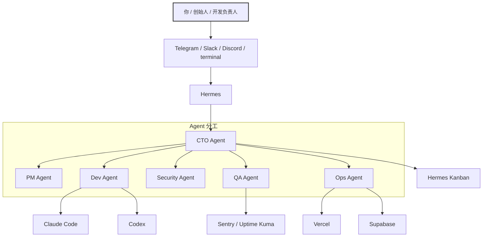

# 把 Hermes 调教成真能干活的 CTO：这项目把聊天机器人直接拧成了交付流水线

群里、Telegram 里、终端里，天天都有人喊 AI Agent。

但很多东西点开一看，本质还是个会回话的壳。

能聊天，不能持续推进；能写两行，不能把活接住。

这个项目有意思的地方就在这：它不是教 Hermes “更会说”，而是直接给它塞了一整套干项目、发版本、盯线上、催审批的工作流。

说白了，它想解决的不是“AI 能不能写代码”，而是“项目从想法到上线，再到后续维护，这堆破事能不能少靠人肉拧螺丝”。

这玩意到底是什么

它本质上是一个装到 Hermes 里的工作流层，把技能、代理角色、部署、监控、GitHub 协作这些能力一次性配齐，让 Hermes 不只是陪聊，而是真的能把软件项目往前推。

## 值得继续往下看的原因，不是因为酷，而是因为真能接活

先把结论摊开：它不是提示词包，也不是聊天皮肤，而是一套“装一次，后面持续跑”的工程化层。

它解决的几个问题，都是开发和小团队里最烦、最碎、最容易靠人脑硬撑的部分：

- 把自然语言需求接成可执行流程：你只是在 Telegram、Slack、Discord 或终端里说一句话，Hermes 就会加载对应技能开始干活。这在真实工作里意味着什么？意味着很多原本散在群聊、备忘、脑子里的动作，终于能被串成稳定流程。
- 把项目从想法一路推到上线：从澄清需求、生成产品简述、设计交接、选择执行引擎，到部署、接数据库、接监控、上线后回访，它给的是完整路径，不是单点小工具。这意味着团队不是多了个“写代码助手”，而是多了个会跑流程的项目管家。
- 把 GitHub 问题、PR 审查、合并审批和上线通知接起来：它默认就考虑 triage、实现、扫描、审查、汇报和合并确认。这在实际里特别像什么？像给项目找了个不会睡觉的值班 PM + Dev + QA + Ops，但钥匙还是捏在你手里。
- 让 Claude Code 和 Codex 退到“执行引擎”位置：Hermes 负责编排，Claude Code 和 Codex 只是按任务深度被调度。真实意义很大：复杂多文件改动给 Claude Code，单文件快修给 Codex，不用什么都手搓切换。
- 支持 24/7 跑在 VPS 上：这不是桌面玩具路线，而是默认考虑常驻、定时任务、监控和通知。这意味着它瞄准的是“持续运营项目”，不是单次演示。

## 它最狠的地方，不是会聊天，而是把角色和流程都拆明白了

下面这几个能力，基本就是这个项目的骨架。

| 能力 | 它在干嘛 | 放到真实场景里意味着什么 |
|---|---|---|
| 聊天入口统一接单 | 可以从 Telegram、Slack、Discord、WhatsApp、终端接收自然语言消息 | 需求入口不再散成一地狗毛，谁发起、怎么推进都有路径 |
| 技能化项目推进 | 23 个技能覆盖需求澄清、实现、部署、监控、GitHub 管理等环节 | 不再靠“这次先这么搞”，而是把常见动作固化成稳定套路 |
| 多代理分工 | CTO、PM、Dev、Security、QA、Ops 六个角色分工明确 | 终于不是一个 Agent 又当产品又当测试又当运维，职责边界清楚得多 |
| 自主 CTO 循环 | 每小时自动 triage issue、推进开发、扫描风险、给你发 YES/NO 合并消息 | 项目能持续转，不至于一周不盯就彻底烂在 backlog 里 |
| 引擎路由 | 根据任务选择 Hermes、Claude Code 或 Codex | 复杂改动和快修分流，省得拿大炮轰蚊子 |
| 部署与监控闭环 | 支持 Vercel、Supabase、Sentry、Uptime Kuma、Slack webhook 等 | 上线不是终点，出了问题能追、能看、能通知 |

### 第一层：它不是聊天增强，而是给 Hermes 装工作骨架

项目核心定位写得很直白：像 Oh My Zsh 之于 Zsh，一次安装后，Hermes 才真正变成适合真实软件项目的工具。

这句话的潜台词很重要：Hermes 本身是操作者，负责对话、记忆、构建、部署、监控、通知；这个项目干的是把“怎么干项目”那套骨架补上。

这在真实场景里的价值，就是不再每次临时拼提示词。谁负责 triage，谁负责实现，什么时候部署，部署后怎么验，出了问题怎么追，全部都被预设进去了。

### 第二层：它给了三种非常实际的起手式

项目说明里给了三种直接可用的入口，而且都不是花架子。

第一种，是让 Claude、Cursor、Copilot 这类编码助手直接帮你把项目装起来：

```
Install Oh My Hermes on this project.

1. Clone the repo: git clone https://github.com/salomondiei08/oh-my-hermes /tmp/oh-my-hermes
2. Run the installer: bash /tmp/oh-my-hermes/install.sh
3. Bootstrap this project: bash /tmp/oh-my-hermes/scripts/bootstrap.sh
4. Verify everything installed: bash /tmp/oh-my-hermes/scripts/verify.sh

Then tell me what's missing and what I need to fill in.
```

第二种，是直接搭“autonomous CTO loop”：

```
Set up the Oh My Hermes CTO loop for this project.

Follow the instructions in: https://raw.githubusercontent.com/salomondiei08/oh-my-hermes/main/INSTALL_FOR_AGENTS.md

I will provide the following when you ask:
- My GitHub repo (owner/repo)
- A GitHub fine-grained token (I'll create one if you explain how)
- My production URL (if deployed)

Walk me through each step one at a time.
```

第三种，是从零开始做一个新应用：

```
Use Oh My Hermes to start a new app.

Oh My Hermes is installed at ~/.hermes/skills/. Load the following skills in order:
1. clarify-requirements — ask me the 7 questions and save my answers
2. product-brief — generate the brief from my answers
3. choose-engine — decide how to implement it
4. implement — build it using the right engine

Start with clarify-requirements now.
```

这三段最香的地方在于，它不是空喊“支持 AI Agent”，而是连第一句该怎么说都替你想好了。对忙团队来说，这种能直接复制就开跑的东西，比一堆概念图值钱多了。

### 第三层：项目生命周期给得非常完整

它覆盖的不是某一个功能，而是完整生命周期：

- onboarding：通过聊天完成初始配置
- clarify-requirements：问 7 个问题并写入记忆
- product-brief：生成 PRODUCT_BRIEF.md
- design-handoff：把设计说明转成实现规范
- choose-engine：决定走 Hermes、Claude Code 还是 Codex
- implement：开始实现，强调“surgical changes, no secrets committed”
- deploy-to-vercel：部署前检查、部署、记录 URL
- connect-supabase：连接数据库、推送迁移、设置环境变量
- setup-monitoring：配置 Sentry 和 Uptime Kuma
- post-deploy-followup：健康检查、日志、通知
- 运行后再进入自动 issue triage、实现、审查、审批、合并、复查的循环

这在真实工作里的意义很残酷也很现实：多数项目不是死在写不出代码，而是死在需求说不清、部署没标准、上线没人盯、问题没人收口。

### 第四层：六个 Agent 不是摆设，职责分得很像一个小团队

项目里定义了六个角色：

- CTO：总编排，盯看板，每天汇报
- PM：给 GitHub issue 打分、分流、排优先级
- Dev：实现需求、选择执行引擎、创建 PR
- Security：扫密钥、做 OWASP 检查、做 CVE 审计
- QA：审 PR、跑健康检查、写人话总结
- Ops：部署、监控生产、处理事故

并且每个角色对应看板阶段：Backlog、In Progress、Review、Done 等。

这套设计最妙的点在于：它没有假装“一个超级 Agent 啥都能干”。反而很老实，承认真实项目就是分工协作，只不过把协作对象从人扩大成了 Agent。

### 第五层：自动 CTO 循环，真有一点“项目自己转起来”的味道

项目描述的自动流程大概是这样：GitHub issue 出现后，PM 先 triage，Dev 实现，Security 做 secret scan + OWASP + CVE 检查，QA 跑 build 和健康检查，再把结果发给你，然后由你回复 YES 或 NO。

这点很关键。

它不是让 Agent 偷偷帮你合并、偷偷帮你上线。相反，它把风险动作前的最后一把钥匙留给你。

这在自动化里非常重要，不然很多工具一兴奋，最后就变成“手一抖删库型管家”——平时看着很猛，出事时直接把房本也一起卖了。

## 上手门槛高不高？说实话，不算低，但也没到劝退

如果只是本地体验，门槛不算夸张：先有 Hermes，再跑安装脚本，然后给 bot 发一句话就行。

如果想把它当长期值班工具，最好还是上 VPS，让它 24/7 挂着，定时任务自动跑，手机里随时能回消息。

先看最核心的安装命令：

```bash
curl -fsSL https://raw.githubusercontent.com/salomondiei08/oh-my-hermes/main/install.sh | bash
```

示例对话：

```text
你:
想把 Hermes 变成一个能盯 GitHub、能发 PR、还能提醒上线状态的项目管家。

AI:
先确认 Hermes 已经装好，并且消息入口能正常收消息。

你:
Hermes 已经能在 Telegram 里回话了，下一步呢？

AI:
直接跑这条安装命令：
curl -fsSL https://raw.githubusercontent.com/salomondiei08/oh-my-hermes/main/install.sh | bash

你:
跑完之后还要自己配很多东西吗？

AI:
不用先脑补一大堆。
下一步给 bot 发一句：set up the CTO loop
它会开始问 GitHub 仓库、token、生产地址这些必要信息。

你:
也就是说，不是先手写一堆配置文件？

AI:
对，很多接入过程是在聊天里一步一步完成的。
先跑通，再补细节，别一上来就把自己折腾麻了。
```

如果要从 Hermes 安装开始，一套完整的生产向路径是这样的：

```bash
# On a $5/month VPS (Ubuntu 22.04+)
curl -fsSL https://raw.githubusercontent.com/NousResearch/hermes-agent/main/scripts/install.sh | bash
hermes model        # choose your provider (Anthropic, OpenAI, etc.)
hermes gateway setup && hermes gateway start   # connect Telegram or Slack

# Then install Oh My Hermes
curl -fsSL https://raw.githubusercontent.com/salomondiei08/oh-my-hermes/main/install.sh | bash

# Message your bot: "set up the CTO loop"
```

Docker 也给了一个最小启动方式：

```bash
docker run -d --restart=always \
  -v hermes-data:/root/.hermes \
  nousresearch/hermes-agent
```

## 真正怎么用，别只盯命令，要看它怎么进工作流

这个项目最适合的理解方式，不是“有哪些命令”，而是“活是怎么流过去的”。

### 一张图先看明白：谁发话，谁接活，谁落地



### 先按官方路径走一遍，最省脑子

项目给的最短起手式其实就一句：

```
set up the CTO loop
```

这句话发给 bot 后，它会继续问你：

- GitHub 仓库
- fine-grained token
- 生产 URL（如果已经部署）

然后把整套配置往下走完。

项目说明里还给了一个“每一步解锁什么”的表，这个很实用：

| Step | What to do | What you get |
|---|---|---|
| 1 | Install Hermes + connect Telegram | A bot you can message |
| 2 | Run install.sh | 23 skills and 5 workflows loaded |
| 3 | Message: "set up the CTO loop" | Bot guides the full setup in chat |
| 4 | Bot asks for GitHub token | Issues monitored, PRs managed |
| 5 | Bot asks for production URL | Health checks every 15 min |
| 6 | `/goal` command | Agent stays focused across long sessions |
| — | Autonomous from here | Hourly triage, daily report, weekly security scan |

### 实际使用过程，看几个原始示例就明白了

**新项目起步：**

```
you: start a new app
hermes: What problem does this solve? Who experiences it?
you: [answer]
hermes: [6 more questions…]
hermes: Requirements saved. Generating product brief…
hermes: Brief written to PRODUCT_BRIEF.md. Ready to implement or do design first?
```

**实现完直接部署：**

```
you: deploy this to Vercel
hermes: Running pre-deploy checklist…
hermes: Deploying… done. URL: https://myapp.vercel.app
hermes: Health check: PASS (200ms)
hermes: Notification sent to Slack.
```

**单文件快速修 bug：**

```
you: fix the auth redirect bug in src/middleware.ts
hermes: Loading context… routing to Codex (single-file fix)
hermes: Done. Typecheck passes. Creating PR…
hermes: PR #14 ready — reply YES to ship.
```

**中途改优先级：**

```
you: /steer prioritize the payment bug above everything else
hermes: Understood. Switching Dev Agent to issue #38.
```

这些例子已经把项目的交互方式说明白了：自然语言发起，Hermes 判断上下文、调技能、选执行引擎、再把结果通过消息回给你。

### 组合工作流示例：Hermes + Codex/Claude Code 怎么接住真实开发过程

下面这段是**组合工作流示例**，不是项目原生固定输出，但完全建立在项目里已经明确给出的能力上。

1）安装或接入过程：

- Hermes 负责对话、编排、记忆、部署和通知
- `choose-engine` 负责判断该用 Hermes、Claude Code 还是 Codex
- 单文件修复优先走 Codex
- 复杂多文件改动可以交给 Claude Code
- 完成后继续接 PR、检查、审批、部署

2）实际使用过程：

```text
你:
修一下登录跳转问题，只改一个文件就行，别把别的逻辑碰坏。

AI:
收到。这个任务适合走 Codex 的单文件修复路径。
先定位 src/middleware.ts，再跑检查，修完后创建 PR，最后发回 YES/NO 审批消息。

你:
如果改动扩散到多个文件呢？

AI:
那就交给 Claude Code，范围更适合复杂多文件改动。
Hermes 还是继续做编排和状态同步，不需要你手工切来切去。
```

3）产出结果 / 适合塞进什么工作流：

- 适合放进小团队的 GitHub issue → PR → 审批 → 部署链路
- 适合把“老板在 Telegram 发一句话，团队开始推进”的模式固定下来
- 适合把快修和复杂开发分流，不让所有任务都用同一把锤子乱砸

### 23 个技能、6 个角色、5 条工作流，基本把常见软件项目的骨架配齐了

技能不少，但不是堆数量，关键是覆盖面比较完整：

- `onboarding`：在聊天里引导完整安装配置
- `clarify-requirements`：问 7 个结构化问题并写入记忆
- `product-brief`：生成产品简述并写入 PRODUCT_BRIEF.md
- `design-handoff`：把设计说明变成实现规范
- `create-skill`：创建新技能
- `choose-engine`：决定走 Hermes、Claude Code 或 Codex
- `implement-with-claude-code`：给 Claude Code 搭好上下文和范围约束
- `implement-with-codex`：给 Codex 搭单点修复路径
- `deploy-to-vercel`：部署前检查、部署、记录地址
- `connect-supabase`：连库、推迁移、设环境变量
- `setup-monitoring`：配置 Sentry 和 Uptime Kuma
- `health-check`：调 `/api/health`、校验响应、看 Supabase 与 Vercel 日志
- `send-notification`：发 Slack webhook 通知
- `post-deploy-followup`：健康检查、日志、通知、总结
- `manage-github-issues`：分流、创建、打标、指派、关闭 issue
- `create-github-pr`：开 PR 前先做 secret scan
- `auto-issue-triage`：每小时给 open issues 打分并挑优先项
- `review-github-pr`：审 diff、跑检查、写人话总结
- `security-review`：secret scan + OWASP + CVE + 每周供应链检查
- `await-merge-approval`：把 YES/NO 审批发给负责人，决定合并或返工
- `kanban-task`：持续维护 Hermes 看板卡片
- `cto-status-report`：每天早上汇报进展、完成项、阻塞项
- `backup-hermes-data`：把 `~/.hermes/` 打包备份到 S3、Dropbox 或本地

默认技术栈也写得很清楚：

| Layer | Default | Alternative |
|---|---|---|
| Frontend / full-stack | Vercel | Railway, Render |
| Database | Supabase PostgreSQL | PlanetScale, Neon |
| Auth | Supabase Auth | Clerk, Auth.js |
| Error tracking | Sentry | LogRocket |
| Uptime monitoring | Uptime Kuma | Better Uptime |
| Notifications | Slack webhook | Telegram, Email |

这句话也值得记一下：这些都是可插拔的，每个技能会说明怎么替换。

### 支撑脚本也给齐了，不用自己瞎编目录和动作

| Script | What it does |
|---|---|
| `install.sh` | Installs all skills, workflows, and agent definitions |
| `scripts/bootstrap.sh` | Creates `AGENTS.md`, `.env.example`, health endpoint in a project |
| `scripts/setup-cto.sh` | Creates profiles, initializes kanban, schedules crons |
| `scripts/verify.sh` | Checks everything is installed correctly |
| `scripts/uninstall.sh` | Removes all Oh My Hermes files from `~/.hermes/` |

项目结构也很清楚：

```text
oh-my-hermes/
├── skills/          ← 23 skill files → ~/.hermes/skills/
├── workflows/       ← 5 workflow files → ~/.hermes/workflows/
├── agents/          ← 6 agent role definitions → ~/.hermes/agents/
├── templates/       ← AGENTS.md template, .env example, health endpoint
├── scripts/         ← install, bootstrap, verify, setup-cto, uninstall
└── docs/            ← Full documentation
```

如果要补强记忆能力，项目还给了 GBrain 这条路，而且特意提醒了一个坑：

```bash
git clone https://github.com/garrytan/gbrain.git ~/gbrain && cd ~/gbrain
curl -fsSL https://bun.sh/install | bash && export PATH="$HOME/.bun/bin:$PATH"
bun install && bun link && gbrain init
```

并且明确提醒：

- 不要使用 `npm install -g gbrain`
- 因为 npm 上有同名 squat 包

这种提醒挺值钱，属于那种少看一眼就可能踩坑的地方。

## 真香的地方，控制在三句里说完

第一，它把“聊天式 AI”往“项目操作系统”方向拧了一大步，这不是套皮，是补骨架。

第二，它把自动化做得挺克制，真正危险的合并和上线动作前，还是让负责人回 YES/NO，不会像某些工具一样兴奋过头。

第三，它把 Hermes、Claude Code、Codex 的关系摆正了：一个负责编排，另外两个负责执行，顺手就把很多团队的工具混乱症治了一半。

## 哪些人会更适合用它

- 已经在用 Hermes，希望它别只停留在“能聊天”的个人开发者
- 小团队负责人，尤其是既要盯需求、又要看 issue、还要盯上线状态的人
- 经常通过 Telegram、Slack、Discord 远程推进项目的人
- 想把 GitHub issue → 开发 → 审查 → 部署这条链路标准化的团队
- 想把 Claude Code 和 Codex 用得更有边界，而不是谁都乱上场的人
- 有 VPS 或长期运行环境，希望 Agent 24/7 值班的人

## 真要用之前，最好先把这些边界想明白

先说项目里明确写到的边界和注意点：

- Hermes 本身就有终端后端，能直接写、改、跑代码；Claude Code 和 Codex 是可选执行引擎，不是前置依赖。也就是说，没有它们，这套东西也不是完全不能用。
- 如果要玩“自主 CTO 循环”，需要准备 GitHub 仓库、fine-grained token，以及生产 URL（如果已部署）。这些是关键前提，不是点一下就能魔法启动。
- 生产向推荐跑在 VPS 上，默认期待 24/7 常驻和 cron 自动执行；如果只是本地临时开着，很多“持续盯项目”的价值会打折。
- `security-review`、`create-github-pr`、`await-merge-approval` 这些设计都说明它非常在意 secret scan、OWASP、CVE、审批再合并，这不是装饰项，而是流程一部分。
- GBrain 那段明确提示别走 `npm install -g gbrain`，因为有 squat 包，这种包名坑别不当回事。
- 角色定义文件放在 `agents/`，运行 `scripts/setup-cto.sh` 或直接发“set up the CTO loop”之后，实际 Hermes profiles 才会创建并激活。

再给一个很克制但很现实的提醒：

它能帮你把流程自动化，但自动化不会替你拥有判断力。

仓库权限、token 范围、部署目标、审批习惯，这些要是自己本来就一团浆糊，再强的 Agent 也只是帮你把浆糊搅得更均匀一点。说难听点，狗东西再聪明，也得先给它对的钥匙和清楚的边界。

## 最后收一下

**这不是一个“更会聊天的 Hermes”，而是一套把项目交付、上线和后续维护都往工程化推进的工作骨架。**

#Hermes #AI_Agent #GitHub #ClaudeCode #Codex #Vercel #Supabase #DevOps #自动化工作流 #技术管理 #项目交付 #Telegram
