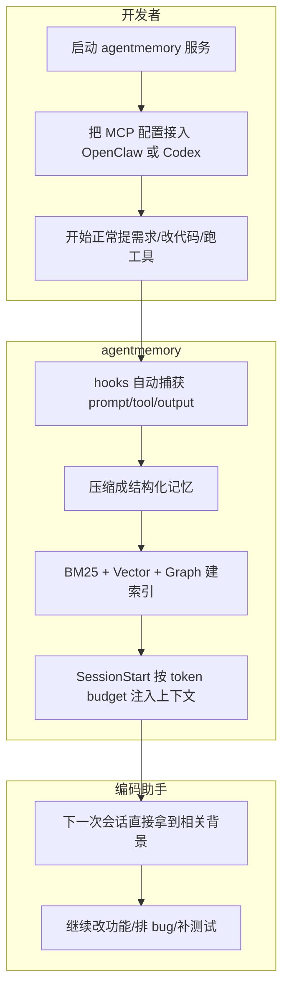

# agentmemory：让编码助手真记住事，而不是每次都像失忆

很多人用编码助手，最烦的不是它写得慢。

是它第二天就失忆。
昨天刚讲过认证怎么做、文件放哪、为什么选这个库，今天一开新会话，它又像个刚入职的呆逼一样重新问一遍。

你以为自己在协作。
其实一直在重复 onboarding。

先说结论：`agentmemory` 就是给 Claude Code、Codex CLI、OpenClaw、Hermes、Cursor、Gemini CLI 这类编码助手挂上一套“持久记忆系统”，让它能跨会话记住项目事实、决策、文件、模式和操作轨迹，不用每次从零解释。

## 这玩意为什么值得看

这个项目盯的不是“AI 更聪明”这种空话，而是一个特别现实的破事：**编码助手会话一断，前面的上下文就像厕所冲水一样没了。**

项目说明里给的解决方式很直接：后台持续记录助手做过什么、压缩成可检索记忆、在下一次会话开始时注入最相关的上下文。

这放到真实开发里，意义很大：

- **不用反复解释同一套架构和习惯**：比如 JWT 中间件放哪、测试覆盖了什么、为什么选某个库。这意味着开新会话不是重新培训，而是直接接着干。
- **同一份记忆能跨多个助手共享**：Claude Code、Codex CLI、OpenClaw、Hermes、Cursor、Gemini CLI 这些都能共用同一个 memory server。也就是说，不是每个助手养一份碎片记忆，而是一套记忆底座，多端复用。
- **不是把全部上下文硬塞进提示词**：它走的是检索式记忆，靠 BM25、向量检索、知识图谱混合召回，再按 token 预算注入。这意味着不是“上下文越长越好”，而是“只拿当前真相关的那点东西”。
- **自动捕获而不是手工维护**：通过 hooks 记录工具调用、用户输入、会话结束摘要等。这意味着你不用像记流水账那样手动整理，不然这种系统八成撑不过三天就废了。

## 它到底能干什么，不吹虚的那种

先看个总表：

| 能力 | 它做的事 | 放进真实工作流意味着什么 |
| --- | --- | --- |
| 持久记忆 | 跨会话保存事实、模式、摘要、流程 | 助手不再每次开局都像失忆重启 |
| 混合检索 | BM25 + 向量 + 图谱，用 RRF 融合 | 不只靠关键词死搜，能按语义找回东西 |
| 自动捕获 | 通过 hooks 记录工具使用、错误、会话摘要 | 记忆来源更完整，不靠人肉补笔记 |
| 多助手共享 | MCP、REST、leases、signals | 同一项目里多助手协作时不再各说各话 |
| 生命周期管理 | 4 层记忆整合、衰减、自动遗忘、矛盾处理 | 不是越存越臭，而是尽量维持可用性 |
| 可观测性 | viewer、Replay、iii console、health | 出问题时能查，不是个黑盒狗东西 |

### 不是“有个记事本”，而是真做持久记忆

项目把内置记忆系统和它自己分得很清楚。

像 `CLAUDE.md`、`.cursorrules`、notepads 这些，更像便签纸；`agentmemory` 则是“便签纸背后的可搜索数据库”。

项目文档里直接给了对比：内置静态文件有大约 200 行容量上限，而它是无限扩展；内置方式常常把全部内容一起塞进上下文，而它只取 top-K 结果；内置方式通常是单助手单文件，而它支持跨助手共享。

说人话就是：前者像把所有家当都堆客厅，找东西靠翻；后者像给家里装了柜子、抽屉、标签和检索目录。

### 自动记，不靠你手动喂

这个项目最香的一点，是它不是要求你自己记，而是**自动捕获**。

它会在多个 hook 上记录东西：

- `SessionStart`：项目路径、会话 ID
- `UserPromptSubmit`：用户输入（做过隐私过滤）
- `PreToolUse`：文件访问模式和增强上下文
- `PostToolUse`：工具名、输入、输出
- `PostToolUseFailure`：错误上下文
- `PreCompact`：压缩前重新注入记忆
- `SubagentStart/Stop`：子助手生命周期
- `Stop`：会话结束摘要
- `SessionEnd`：会话完成标记

这在真实场景里意味着什么？

意味着助手不是只记“最终答案”，而是连“怎么走到这个答案的”也能留下轨迹。你下次回来看 bug、看决策来源、看某个文件历史时，能顺着证据链往回摸，不至于全靠猜。

### 检索不是单一路子，而是三路一起上

它的检索是三路并行：

| Stream | 做什么 | 什么时候启用 |
| --- | --- | --- |
| BM25 | 关键词匹配 + 同义词扩展 | 一直开启 |
| Vector | 基于向量相似度做语义检索 | 配了 embedding provider 时 |
| Graph | 通过实体匹配走知识图谱遍历 | 查询里识别出实体时 |

最后再用 Reciprocal Rank Fusion 做融合，还会做 session 去重分散，同一会话最多给 3 条结果。

这就不是“搜词条”了，更像你跟一个知道项目上下文的人说：“上次那个数据库性能优化怎么搞的来着？”它不一定非要碰到原词，也可能把 `N+1 query fix` 给你拎出来。

项目说明还特别提了中文、日文、韩文场景：如果要对 CJK 记忆做更好的分词，可以额外装：

```bash
npm install @node-rs/jieba tiny-segmenter
```

不装也不是不能用，只是会退化成整段 tokenization，并在 stderr 打一次提示。

### 它不只是记“发生了什么”，还在管记忆生命周期

很多“长期记忆”产品最后会烂掉，根因不是记不住，而是**记太多之后没人管**。

`agentmemory` 在这块做得挺狠，给了 4 层记忆整合：

| 层级 | 含义 | 类比 |
| --- | --- | --- |
| Working | 工具使用产生的原始观察 | 短期记忆 |
| Episodic | 压缩后的会话摘要 | 发生了什么 |
| Semantic | 提取出来的事实和模式 | 知识 |
| Procedural | 工作流和决策模式 | 做事的方法 |

而且它还会做：

- 记忆衰减（Ebbinghaus curve）
- 高频访问强化
- 过时记忆自动淘汰
- 矛盾检测与解决

这在真实项目里就很像有个档案管理员，不是所有纸都往柜子里胡乱一塞。要不然时间一长，所谓“长期记忆”只会变成长期垃圾场。

### 多助手协作，不用每个人各背一套锅

这个项目一个很猛的点，是它本来就不是只服务单个助手。

项目说明里明确写了：支持 hooks、MCP 或 REST API 的助手都能接；所有助手共享同一个 memory server。

而且除了 MCP、REST 这种基础接入，它还有：

- leases
- signals
- actions
- routines
- team namespacing
- shared/private 模式

这意味着，如果一个团队里同时有人用 Claude Code、有人用 OpenClaw、有人用 Codex CLI，不需要每个人重复积累一份记忆副本。这个特别像一个大家共用的项目大脑，而不是每人拿一张小抄。

## 装起来麻不麻烦

说实话，不高。

最短路径就两步：先启动服务，再把你的助手接上去。

项目最开始给出的安装方式是：

```bash
npm install -g @agentmemory/agentmemory     # once — bare `agentmemory` on PATH
agentmemory                                  # start the memory server on :3111
agentmemory demo                             # seed sample sessions + prove recall
agentmemory connect claude-code              # wire your agent (also: codex, cursor, gemini-cli, ...)
```

或者你不想先全局安装，也能直接：

```bash
npx @agentmemory/agentmemory
```

不过这里有个很关键的坑，项目说明专门提醒了：`npx` 会按版本缓存。也就是说，裸跑 `npx @agentmemory/agentmemory`，有可能吃到旧版本。

要强制拿最新版本，可以这样：

```bash
npx -y @agentmemory/agentmemory@latest
```

或者清缓存：

```bash
rm -rf ~/.npm/_npx
```

从 `v0.9.16+` 开始，第一次 `npx` 运行会提示你是否内联全局安装，回答 `Y` 之后，后面就能直接用 `agentmemory` 命令了。

### 示例对话：

```text
你: 想给 OpenClaw 接一个长期记忆，不想每次新会话都重讲项目背景。
AI: 先起服务，最省事的是单独开个终端跑。
AI: npx @agentmemory/agentmemory
你: 跑起来之后怎么接 OpenClaw？
AI: 往 MCP 配置里加一个 agentmemory 服务，指向 localhost:3111。
你: 这样就能直接用？
AI: 基础 MCP 能用了，51 个 memory 工具会通过代理暴露出来。
你: 还有更深一点的接法吗？
AI: 有，可以把 integrations/openclaw 复制到 ~/.openclaw/extensions/agentmemory，再启用 memory slot 集成。
你: 怎么确认不是假装装好了？
AI: 先用 curl 打健康检查，再开 http://localhost:3113 看实时 viewer。
```

## 真正接入时，按这条路径走最顺

### 先把服务跑起来

如果只是 30 秒试跑，项目给的官方路径是：

```bash
# Terminal 1: start the server
npx @agentmemory/agentmemory

# Terminal 2: seed sample data and see recall in action
npx @agentmemory/agentmemory demo
```

`demo` 会种进去 3 组真实感比较强的会话数据：JWT auth、N+1 query fix、rate limiting，然后做语义搜索测试。项目文档里强调，像搜索 “database performance optimization” 时，它也能找回 “N+1 query fix”，不只是做机械关键词匹配。

Viewer 地址也给得很明确：

```bash
open http://localhost:3113
```

### 再把助手接上去

如果你偏向全局安装后长期使用，项目给出的命令是：

```bash
npm install -g @agentmemory/agentmemory
agentmemory                    # start the server (same as the npx form)
agentmemory stop               # tear it down
agentmemory remove             # uninstall everything we created
agentmemory connect claude-code   # wire one agent
agentmemory doctor             # interactive diagnostics + fix prompts
```

如果你是 OpenClaw 用户，项目甚至把“可直接粘贴给助手的提示”都写好了：

```text
Install agentmemory for OpenClaw. Run `npx @agentmemory/agentmemory` in a separate terminal to start the memory server on localhost:3111. Then add this to my OpenClaw MCP config so agentmemory is available with all 51 memory tools:

{
  "mcpServers": {
    "agentmemory": {
      "command": "npx",
      "args": ["-y", "@agentmemory/mcp"],
      "env": {
        "AGENTMEMORY_URL": "http://localhost:3111"
      }
    }
  }
}

Restart OpenClaw. Verify with `curl http://localhost:3111/agentmemory/health`. Open http://localhost:3113 for the real-time viewer. For deeper memory-slot integration, copy `integrations/openclaw` to `~/.openclaw/extensions/agentmemory` and enable `plugins.slots.memory = "agentmemory"` in `~/.openclaw/openclaw.json`.
```

### 组合工作流示例：把它塞进 OpenClaw / Codex 的日常协作里

下面这段属于**组合工作流示例**，不是项目额外新增能力，而是把它原生提供的能力拼成一条真实工作流。



实际使用过程大概会是这样：

1. 先在一台机器上跑 `agentmemory` 服务，让它在 `:3111` 提供 REST，在 `:3113` 提供 viewer。
2. 把 OpenClaw、Codex CLI 或 Claude Code 接进来。Claude Code 和 Codex 甚至还有完整 plugin 路径，不只是 MCP。
3. 正常工作时，助手的 `UserPromptSubmit`、`PreToolUse`、`PostToolUse`、`Stop` 这些节点会自动把信息送进记忆流水线。
4. 到下一次新会话开始，`SessionStart` 会读取项目 profile、跑混合检索、按默认 `2000 tokens` 的预算注入上下文。
5. 结果就是：你说“继续做 rate limiting”，它已经知道上次 auth 走的是 JWT middleware，测试在哪，为什么当时选了 `jose`。

如果你是 Codex CLI 用户，项目给的插件安装路径也很明确：

```bash
# 1. start the memory server in a separate terminal
npx @agentmemory/agentmemory

# 2. register the agentmemory marketplace and install the plugin
codex plugin marketplace add rohitg00/agentmemory
codex plugin install agentmemory
```

文档里还明确说明，这个 Codex 插件会注册：

- `@agentmemory/mcp` 作为 MCP server
- 6 个 lifecycle hooks：`SessionStart`、`UserPromptSubmit`、`PreToolUse`、`PostToolUse`、`PreCompact`、`Stop`
- 4 个 skills：`/recall`、`/remember`、`/session-history`、`/forget`

这意味着你不是只“连上一个 MCP 工具”，而是连同记忆生命周期一起装进去了。

## 有些地方，确实是真香

- 自动捕获 + 混合检索这套组合很实用，终于不是靠人肉维护一堆静态记忆文件。
- 同一个 memory server 服务多种编码助手，这点对多工具混用的人太友好了。
- Viewer、Replay、iii console 都给到了，至少出问题时还能查，不是只能干瞪眼。

## 哪些人会更适合用

- 经常在 Claude Code、OpenClaw、Codex CLI、Cursor 之间切换的人
- 新会话里总要重复解释项目架构、代码约定、历史决策的开发者
- 需要多助手共享项目上下文的小团队
- 想让记忆不仅能存，还能检索、回放、审计、删除的人
- 对 MCP、hooks、工作流自动化已经比较熟，不满足于单纯静态 `MEMORY.md` 的用户
- 想把“长期记忆”接进真实开发流程，而不是只拿来做演示的人

## 真要上手前，边界最好先知道

这里有几条，不看很容易踩坑。

### 1）`npx` 可能给你旧版本

项目说明写得很直白：`npx` 是按版本缓存的。裸跑 `npx @agentmemory/agentmemory`，可能拿到的是你上周跑过的旧版本。

所以要么：

```bash
npx -y @agentmemory/agentmemory@latest
```

要么清缓存：

```bash
rm -rf ~/.npm/_npx && npx @agentmemory/agentmemory
```

### 2）MCP shim 不一定默认就是 51 个工具

这个点非常重要。

项目文档专门说明了：发布出来的 `@agentmemory/mcp` 是个轻量 shim。**只有当它能连上正在运行的 `agentmemory` 服务时，才会暴露完整 51 个工具。**

如果服务没起来，或者 `AGENTMEMORY_URL` 没指对，它会回退成只有 7 个本地工具。

也就是说，如果你在 Cursor、OpenCode、Gemini CLI 里只看到 7 个工具，先别怀疑人生，先检查：

- `npx @agentmemory/agentmemory` 是否已经在跑
- `AGENTMEMORY_URL=http://localhost:3111` 是否配对了

### 3）有些特性默认是关的

项目不是那种“一安装就全开”的激进玩法。

比如这些默认就是关的：

- `AGENTMEMORY_AUTO_COMPRESS=false`
- `AGENTMEMORY_SLOTS=false`
- `AGENTMEMORY_REFLECT=false`
- `AGENTMEMORY_INJECT_CONTEXT=false`
- `GRAPH_EXTRACTION_ENABLED=false`

这意味着什么？意味着你看到的很多高级能力是可配的，但不是所有装好就默认生效。尤其 `AGENTMEMORY_AUTO_COMPRESS` 打开后，每次 `PostToolUse` 都可能调用 LLM provider 压缩观察，项目文档明确提醒：**活跃会话下 token 花费会显著增加。**

### 4）Windows 不是不能用，但别幻想一条命令丝滑到底

项目对 Windows 的说明很诚实：Node 包本身不够，你还需要 `iii-engine` 这个原生运行时。

支持路径有三种：

- 下载预编译 Windows 二进制
- 用 Docker Desktop
- 只跑 standalone MCP，不启完整服务和 viewer

如果 `npx @agentmemory/agentmemory` 起不来，还建议加 `--verbose` 看 engine stderr。

### 5）从源码运行时，`iii-engine` 版本是钉住的

这个项目当前明确 pin 在 **`v0.11.2`**，因为 `v0.11.6` 引入了新的 sandbox-everything-via-`iii worker add` 模型，而项目还没完成对应重构。

这意味着你如果想自己折腾源码、Docker、iii worker 扩展，最好别想当然升级 engine 版本，不然很容易给自己整出一套玄学故障。

### 6）公开暴露服务时要收着点

项目文档里写了几个重要边界：

- REST API 默认绑在 `127.0.0.1`
- viewer `3113` 默认也是 loopback
- `iii console` 本身**没有额外鉴权**，明确提醒不要对公网暴露
- 如果设置了 `AGENTMEMORY_SECRET`，受保护端点需要 `Authorization: Bearer <secret>`
- mesh sync 两端也都要求 `AGENTMEMORY_SECRET`

这部分别犯懒。记忆系统里存的不是壁纸，是你的项目事实、操作轨迹、用户提示、工具输出，真裸奔出去，后面哭都来不及。

## 最后收一句

**这不是让编码助手“看起来更懂你”，而是真的让它少失忆、少重学、少浪费你的人生。**

#GitHub #AgentMemory #AI编程 #ClaudeCode #CodexCLI #OpenClaw #MCP #长期记忆 #开发效率 #工程化
