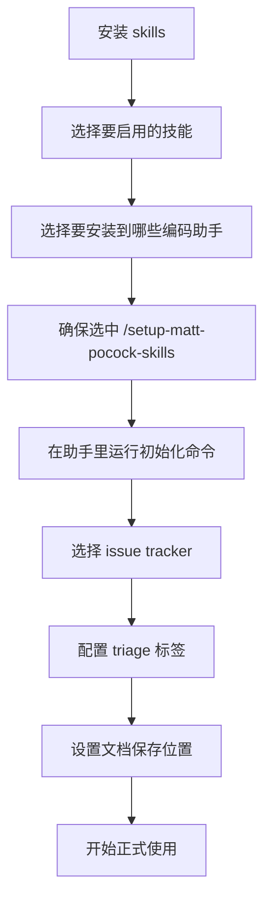

# 这套 Agent Skills，不是帮你 vibe coding，而是把开发流程重新拽回正轨

AI 写代码这事，最气人的往往不是它不会写。

是它特别勤快。
勤快到把事做偏了，还能一本正经继续往下冲。
像请了个动作飞快的管家，结果钥匙拿错了屋，门开得比谁都猛。

所以真正缺的，从来不是“再来一个更聪明的模型”。
而是给编码助手一套顺手、克制、能拆能装的工程习惯。

这套项目，说白了就是给 Claude Code、Codex 这一类编码助手装上一组工程化技能包，让它少跑偏、少废话、少把项目干成一坨泥。

## 真值得继续往下看的地方

它不是想接管整个开发流程，也不是那种一上来就把人架空的重流程方案。

项目给出的思路很明确：技能要小、容易改、能组合，而且能跑在任意模型上。这个意思放进真实团队里，其实很重要——不用为了换一种工作方式，把整套工具链和习惯全卖房重来。

更关键的是，它盯的不是花活，而是几个最常见、也最恶心的翻车点：

- **需求没对齐**：助手以为懂了，最后做出来根本不是那回事。这在真实工作里意味着，返工不是“多改两行”，而是整个方案方向都歪了。
- **输出过度啰嗦**：项目术语没统一，助手只能用一大坨解释去绕。这意味着 token 在烧，沟通成本也在烧。
- **代码写出来但根本不工作**：没有反馈环，助手等于闭眼开车。这意味着它写得越快，坑可能越大。
- **代码库越写越乱**：速度提上去了，熵增也跟着起飞。这意味着后面每次改需求，都像在老房子里凿承重墙。

## 它到底靠什么，把这些破事压住

先看一张表，更直观点：

| 常见翻车点 | 对应技能 | 真实意义 |
| --- | --- | --- |
| 需求说不清 | `/grill-me`、`/grill-with-docs` | 先把话问透，别让助手靠猜 |
| 术语混乱、回复太长 | `/grill-with-docs` | 建共享语言，减少废话和误解 |
| 改完代码不工作 | `/tdd`、`/diagnose` | 用测试和诊断闭环给助手上手铐 |
| 代码库越改越乱 | `/to-prd`、`/zoom-out`、`/improve-codebase-architecture` | 不只盯着一段代码，盯系统结构 |

### 先把话问明白，别让助手靠脑补

这个项目最强调的一件事，就是**先对齐，再开工**。

对应的技能有两个：

- `/grill-me`：用于非代码场景
- `/grill-with-docs`：和前者类似，但会额外帮助建立共享语言，并把难讲清的决策写进 `CONTEXT.md` 和 ADR

这在真实场景里非常实用。很多需求不是“不会做”，而是“大家以为自己说清了”。项目里直接把这个问题点破了：你和助手之间一样存在沟通鸿沟，所以要有一轮细问猛问的 grilling session。

顺带一提，`/grill-with-docs` 还内置了共享语言这套打法。说人话就是：把项目里的黑话、术语、领域模型先统一。这样后面变量名、函数名、文件名都能更一致，助手也会少说很多废话，token 消耗也更收敛。

### 不是嫌它啰嗦，是术语没对齐

项目对“助手太啰嗦”这个问题的判断很准：很多时候不是模型单纯嘴碎，而是它没吃透项目语言。

所以它给出的解法不是“少说话”，而是**建立 shared language**。

文档里提到，这不只是让回复更短，还有几个直接收益：

- 变量、函数、文件命名会更一致
- 代码库对助手来说更容易导航
- 助手在思考时花的 token 更少

这在团队里就像先把抽屉标签贴好。标签一旦统一，找东西的人少骂两句，放东西的人也少塞错格子。

### 没反馈环，助手就是闭眼开车

项目对“代码不工作”这件事，态度也很硬：先别怪模型，先看反馈环够不够。

它明确提了三类反馈：

- 静态类型
- 浏览器访问
- 自动化测试

其中自动化测试这块，项目专门给了一个 `/tdd` 技能，强调 **red-green-refactor**：先写失败测试，再让测试通过，最后重构。

这在真实开发里意味着什么？意味着助手不再是写一大坨再等你验尸，而是每次只往前推一个小切片，错了也能尽快看到。

另外还有 `/diagnose`，把调试实践包装成一个简单循环，适合拿来处理难 bug 和性能回归。这个很像给助手配了个故障排查 SOP，不至于一出问题就开始瞎试。

### 不想最后造出一坨泥，就得天天看结构

项目还有个很务实的判断：AI 让编码变快，也会让代码库变乱的速度同步起飞。

所以它不是只给“写功能”的技能，也给“看系统”的技能：

- `/to-prd`：在创建 PRD 前，会追问你要动哪些模块
- `/zoom-out`：让助手从整个系统视角解释局部代码
- `/improve-codebase-architecture`：帮助从 `CONTEXT.md` 和 `docs/adr/` 里吸收上下文，找出代码库还能“变深”的地方

文档里甚至直接建议：`/improve-codebase-architecture` 可以隔几天就在代码库上跑一次。

这不是玄学，这是在提醒一件很现实的事：别因为助手写得快，就默认设计可以不管。那样最后留下来的，多半是个狗东西级别的维护地狱。

## 装起来难不难

不高。

从项目说明看，接入门槛非常低：先跑安装器，选要装的技能和目标编码助手，**记得选上 `/setup-matt-pocock-skills`**，然后在助手里执行一次初始化命令就行。

真正的门槛不在安装，而在初始化时几个关键选择：

- 你要用什么 issue tracker：GitHub、Linear，还是本地文件
- 你在 triage 时给 ticket 打什么标签
- 文档生成后要存到哪里

这里别嫌烦，这几步其实是在给后续技能铺底层配置。尤其 `/triage` 会用到标签；而 `to-issues`、`to-prd`、`triage`、`diagnose`、`tdd`、`improve-codebase-architecture`、`zoom-out` 这些工程技能，都依赖这次初始化。

```bash
npx skills@latest add mattpocock/skills
```

### 示例对话：

```text
你: 这个仓库想接一套工程化技能，先装最常用那批。
AI: 可以，先跑安装命令。
AI: npx skills@latest add mattpocock/skills
你: 装完之后怎么选？
AI: 选你要的 skills，再选要安装到哪些编码助手上。
AI: 这里别漏掉 /setup-matt-pocock-skills。
你: 然后呢？
AI: 回到助手里执行 /setup-matt-pocock-skills。
AI: 它会问你 issue tracker 用 GitHub、Linear 还是本地文件。
AI: 还会问 triage 用什么标签，以及文档保存到哪里。
你: 配完就能用了？
AI: 对，配完这轮，这套技能就能开始接管提问、拆任务、诊断和 TDD 节奏了。
```

## 真正用起来，路径其实很顺

先看它的安装/接入路径：



### 官方路径，适合怎么一路走下去

项目说明里给出的使用路径其实很清楚：

1. **先初始化**：运行 `/setup-matt-pocock-skills`
2. **需求不清时先问透**：用 `/grill-me` 或 `/grill-with-docs`
3. **需要整理需求时**：用 `/to-prd`
4. **需要拆成可独立处理的事项时**：用 `/to-issues`
5. **进入开发实现时**：用 `/tdd`
6. **遇到 hard bug 或性能回归时**：用 `/diagnose`
7. **看不清局部代码在系统里的位置时**：用 `/zoom-out`
8. **代码库开始发腻发粘时**：用 `/improve-codebase-architecture`
9. **要做 issue 分诊时**：用 `/triage`

### 组合工作流示例：放进 OpenClaw / Codex 的真实协作节奏里

下面这段不是项目原生新增能力，而是**组合工作流示例**，目的是让人看明白这套技能怎么塞进日常开发。

假设现在要给一个业务系统加新功能，比较顺手的一条线会是这样：

```text
/setup-matt-pocock-skills
/grill-with-docs
/to-prd
/to-issues
/tdd
/diagnose
/zoom-out
```

这条链路放进真实工作里，大概就是：

1. 在 OpenClaw 或 Codex 里先完成一次仓库级初始化，让 issue tracker、标签和文档落盘位置统一。
2. 需求刚进来时，不着急写代码，先跑 `/grill-with-docs`，把术语、边界、设计决策问透，并顺手沉淀到 `CONTEXT.md` 和 ADR。
3. 确认方向后，用 `/to-prd` 把当前对话上下文收束成 PRD，再用 `/to-issues` 拆成能独立抓取的 GitHub issue。
4. 进入实现后，让 `/tdd` 强迫助手按 red-green-refactor 推进，每次只做一个垂直切片。
5. 一旦出现奇怪 bug 或性能回退，用 `/diagnose` 走复现、缩小、假设、打点、修复、回归测试这套闭环。
6. 改完之后，再跑 `/zoom-out` 看这次改动在整个系统里有没有把结构搞歪；如果代码库已经出现泥球化趋势，再上 `/improve-codebase-architecture`。

这套节奏最适合塞进“需求澄清 → 方案成文 → issue 拆分 → TDD 实现 → 调试回归 → 架构巡检”这类团队工作流里。

## 这玩意真香的地方，就三句

- 它不是替你做决定，而是逼助手把该问的先问掉。
- 它不是堆功能，而是把需求对齐、TDD、诊断、架构这几件正经事揉进日常动作里。
- 最妙的是它够小、够松、还能组合，不会一上来就把人锁死在重流程里。

## 哪些人用起来会特别顺手

- 已经在用 Claude Code、Codex 一类编码助手，但老被“理解偏差”折腾的开发者
- 想把 issue、PRD、TDD、诊断这些动作串成闭环的小团队
- 有 GitHub 或 Linear 任务流，希望助手能真正接上分诊和拆分环节的人
- 代码库已经开始显乱，想靠共享语言和架构巡检把节奏拉回来的项目负责人
- 经常需要把需求、设计和实现来回同步的全栈开发者
- 不想搞 vibe coding，只想把工程基本功重新装回 AI 工作流的人

## 先别上头，边界得看清

项目说明里有几件事，最好提前记住：

- **初始化不是可选项**：`/setup-matt-pocock-skills` 需要先跑，而且项目说明明确说，使用 `to-issues`、`to-prd`、`triage`、`diagnose`、`tdd`、`improve-codebase-architecture`、`zoom-out` 之前，都要先做这一步。
- **`/triage` 依赖标签配置**：初始化时会问你分诊标签怎么定，这不是走过场，后续 triage 真会用到。
- **共享语言这套打法需要持续维护**：它能减少啰嗦、统一命名，但前提是 `CONTEXT.md` 和 ADR 这些文档得认真维护，不然很快就会过期。
- **这套技能解决的是工程失误模式，不是替代工程判断**：它能帮你问清需求、拆任务、逼测试、做诊断，但没有承诺“用了就不会写烂”。
- **它强调可组合，不代表默认包治百病**：技能小而松的好处是灵活，代价是你仍然要知道自己当前缺的是哪一块反馈环。

## 别只盯着工程技能，这个仓库其实是一整套工具箱

除了上面那批工程向技能，项目说明还把整套工具按类别列出来了。

### Engineering

这些是日常代码工作最常用的一组：

- `diagnose`：用纪律化诊断循环处理难 bug 和性能回归，路径是 reproduce → minimise → hypothesise → instrument → fix → regression-test
- `grill-with-docs`：在现有领域模型基础上挑战你的方案，打磨术语，并更新 `CONTEXT.md` 和 ADR
- `triage`：通过一套 triage 角色状态机来分诊 issue
- `improve-codebase-architecture`：结合 `CONTEXT.md` 和 `docs/adr/`，寻找代码库可以继续“变深”的机会
- `setup-matt-pocock-skills`：为仓库脚手架出每仓配置，包括 issue tracker、triage 标签词汇、领域文档布局；而且说明里明确写了，这个命令每个仓库跑一次
- `tdd`：按 red-green-refactor 做测试驱动开发，一次推进一个垂直切片
- `to-issues`：把计划、规格或 PRD 拆成能独立领取的 GitHub issue
- `to-prd`：把当前对话上下文直接整理成 PRD，并提交为 GitHub issue，不额外做访谈
- `zoom-out`：让助手跳出局部代码，给更高层的系统上下文
- `prototype`：做一次性原型，用于验证状态/业务逻辑，或者从同一路由切换多种 UI 方案

### Productivity

这组更偏通用工作流，不只限于代码：

- `caveman`：超压缩沟通模式，项目说明里给出的说法是能把 token 使用砍掉大约 75%，但保留技术准确性
- `grill-me`：围绕方案或设计持续追问，直到决策树各分支都被问清楚
- `handoff`：把当前对话压缩成一份交接文档，方便另一个助手继续
- `write-a-skill`：创建新技能，并带好结构、渐进式说明和配套资源

### Misc

这组是作者自己平时少用但会留着的工具：

- `git-guardrails-claude-code`：给 Claude Code 配 hook，阻止危险 git 命令执行，比如 push、reset --hard、clean 等
- `migrate-to-shoehorn`：把测试文件从 `as` 类型断言迁移到 `@total-typescript/shoehorn`
- `scaffold-exercises`：生成练习目录结构，包含 sections、problems、solutions、explainers
- `setup-pre-commit`：用 Husky 配 pre-commit hook，串 lint-staged、Prettier、类型检查和测试

## 最后收一下

https://github.com/mattpocock/skills

**这不是一套让 AI 更会表演的技能，而是一套让开发重新像开发的技能。**

#GitHub #AI编程 #CodingAgent #ClaudeCode #Codex #OpenClaw #TDD #软件工程 #开发效率 #架构设计
