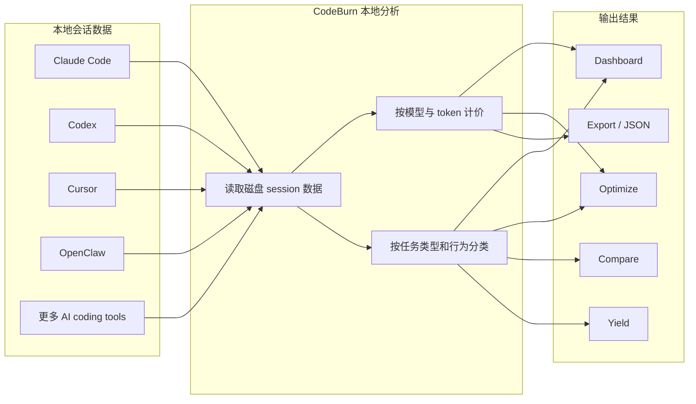

# CodeBurn，把 AI 编程烧钱账单摊开给你看

AI 编程工具这波，很多团队已经不是「用不用」的问题了。

真正开始肉疼的，往往是第二阶段。

每天都在跑 Claude Code、Codex、Cursor、OpenClaw，活干了不少，token 也烧得飞快，但钱到底烧在哪，哪个模型最贵，哪个项目最能吞预算，很多时候其实是一笔糊涂账。

更骚的是，有些钱不是花在写代码上，是花在反复重读、无效重试、冗长 bash 输出，还有一堆挂着不用的配置上。

这时候再看 `CodeBurn`，就有点那个意思了。

## 先说结论，这项目到底是什么

它就是一个把 AI 编程成本、token 用量和产出效率摊开给你看的本地账本，而且不是云端套壳，是直接读你磁盘里的会话数据。

## 为什么这玩意值得继续往下看

很多人现在对 AI 编程的管理方式，基本还停留在体感阶段。

感觉 Claude 最近有点贵。

感觉 Cursor 好像跑得多。

感觉某几个项目特别能烧。

但感觉这东西，跟月底对账单碰上的时候，通常不太顶用。

`CodeBurn` 的价值就在这，它不是只告诉你花了多少钱，而是继续往下拆。

它会按任务类型、模型、工具、项目、provider 去拆你的支出，也会给出性能视角，比如 one-shot rate、retry rate、cost per edit、cache hit rate 这些。说白一点，它不是只看你花了多少钱，还在看这笔钱花得冤不冤。

而且整个东西本地运行，不需要 wrapper，不需要代理，不需要再塞一层 API key。很多这类统计工具一上来就想做流量入口，先把你的请求接过去再说，像又请了个管家进你家翻账本。`CodeBurn` 不是这条路子，它直接去读本地 session 数据，再按 LiteLLM 的价格表核算。

这就很现实。

## 它到底强在哪，别空喊真香

先看一眼这玩意的大致工作方式。



这个结构最值钱的地方，不在「做了个 dashboard」，而在它把几类原本散着的东西串起来了。

### 第一层，它先把账给你记明白

项目说明里写得很直接，它会给每次 API 调用按 input、output、cache read、cache write、web search token 去计价，Claude 的 fast mode multiplier 也算进去。价格来源走 LiteLLM，本地缓存 24 小时，同时对 Claude 和 GPT 系列还做了 hardcoded fallbacks，避免价格匹配错位。

这在真实工作里就不是小事了。

很多团队现在最大的坑，不是不会用 AI，而是看不见成本结构。结果就是每个人都在烧，月底一看总账，谁也说不清哪块最离谱，像开着空调不看电表，爽的时候是真爽，缴费的时候也是真疼。

### 第二层，它不只看钱，还看你是不是在白烧

这项目把任务分成 13 类，而且是确定性分类，不走额外 LLM 调用。

分类里包括 Coding、Debugging、Feature Dev、Refactoring、Testing、Exploration、Planning、Delegation、Git Ops、Build/Deploy、Brainstorming、Conversation、General。

因为很多时候真正该复盘的，不是「哪个模型最贵」，而是「贵的是不是值」。如果某段时间 Debugging 的 retry 特别高，或者 Coding 的 one-shot rate 特别低，那八成不是模型单纯太贵，而是流程出了问题，提示词、上下文、读写比例、测试路径，至少有一个地方在拉胯。

### 第三层，它把常见浪费点直接挑出来

`optimize` 这块是很适合技术团队看的。

它扫的不只是 session，还会扫 `~/.claude/` 配置，专门抓这些典型浪费。

| 浪费类型 | 实际意味着什么 |
|---|---|
| 反复重读同样文件 | 同一份上下文来回喂，token 像白送 |
| 低 Read:Edit 比例 | 没看清就改，后面靠重试擦屁股 |
| 冗长 bash 输出 | 终端噪音把上下文塞爆 |
| 没用的 MCP server | 每次开会话都在交 schema 过路费 |
| 从没调用过的 agent / skill / slash command | 配了很多，真正上场的没几个 |
| 膨胀的 `CLAUDE.md` | 上下文像背着一袋砖进场 |
| cache creation overhead 和 junk directory reads | 看起来像在工作，其实在烧预算 |

而且每条 finding 不只是报问题，还会给你估算 token 和美元 savings，再附一个可以直接粘贴的修复动作，比如环境变量、`CLAUDE.md` 配置行，甚至 `mv` 命令。

不是泛泛地告诉你「要优化使用习惯」，而是直接告诉你哪块肉白白烤糊了。

### 第四层，它把对比和结果也补上了

`compare` 用来做模型横向对比。

它看的不是那种玄学印象，而是 one-shot rate、retry rate、self-correction、cost per call、cost per edit、output tokens per call、cache hit rate 这些指标，还会对比 per-category one-shot rates、delegation rate、planning rate、average tools per turn、fast mode usage。

`yield` 更狠一点，它开始把 AI session 跟 git commit 时间戳关联，拆成 Productive、Reverted、Abandoned 三类。

这就不是「花钱统计」了，已经开始往「产出归因」走。

### 第五层，它支持的工具范围够宽

项目说明给的定位是覆盖 **19 AI coding tools**，而支持列表里已经能看到一大串常见选手，包括 Claude Code、Claude Desktop、Cline、Codex、Cursor、cursor-agent、Gemini CLI、Mistral Vibe、GitHub Copilot、IBM Bob、Kiro、OpenCode、OpenClaw、Pi、OMP、Droid、Roo Code、KiloCode、Qwen、Kimi Code CLI、Goose、Antigravity、Crush。

现在团队里很少只用一种工具，今天 Codex，明天 Claude Code，旁边还有 Cursor 和 OpenClaw 混着跑。如果统计工具只能看单一生态，最后还是半本账。`CodeBurn` 这点至少是朝全账本在走。

## 上手成本高不高

不算高。

门槛主要就三件事，Node.js 20+，你的机器上至少真有一个受支持的 AI coding tool，而且它本地确实留下了 session 数据。对 Cursor 和 OpenCode，`better-sqlite3` 会作为 optional dependency 自动安装。

安装方式很直接。

```bash
npm install -g codeburn
```

或者用 Homebrew。

```bash
brew tap getagentseal/codeburn
brew install codeburn
```

如果你只是想先看一眼，也可以不安装，直接跑。

```bash
npx codeburn
bunx codeburn
dx codeburn
```

### 示例对话：

```text
你:
想看最近 Codex 和 OpenClaw 到底谁更烧钱，先把这个工具跑起来。

AI:
可以，先直接试跑，不急着全局安装。

你:
npx codeburn

AI:
如果本地已经有对应工具的 session 数据，它会直接起交互面板。
先看 7 days 总览，再切到 compare 和 optimize。

你:
如果要长期用呢？

AI:
那就装全局版，后面查 today、month、report、yield 会顺手很多。

你:
数据会不会先绕去第三方？

AI:
不会，这个工具的路子就是本地读盘、本地计价、本地展示。
```

## 怎么用，按真实使用路径走一遍

先看它给的主命令集合。

```bash
codeburn                        # interactive dashboard (default: 7 days)
codeburn today                  # today's usage
codeburn month                  # this month's usage
codeburn report -p 30days       # rolling 30-day window
codeburn report -p all          # every recorded session
codeburn report --from 2026-04-01 --to 2026-04-10  # exact date range
codeburn report --format json   # full dashboard data as JSON
codeburn report --refresh 60    # auto-refresh every 60s (default: 30s)
codeburn status                 # compact one-liner (today + month)
codeburn status --format json
codeburn export                 # CSV with today, 7 days, 30 days
codeburn export -f json         # JSON export
codeburn optimize               # find waste, get copy-paste fixes
codeburn optimize -p week       # scope the scan to last 7 days
codeburn compare                # side-by-side model comparison
codeburn yield                  # track productive vs reverted/abandoned spend
codeburn yield -p 30days        # yield analysis for last 30 days
codeburn models                 # per-model token + cost table (last 30 days)
codeburn models --by-task       # explode each model into per-task-type rows
codeburn models --top 10        # only the top 10 by cost
codeburn models --format markdown      # paste-friendly markdown table
codeburn models --task feature         # filter to feature-development work
codeburn models --provider claude      # filter to one provider
```

如果是第一次上手，比较顺的路径其实是这样的。

1. 先跑 `codeburn` 看总览，确认本地 session 数据有没有被识别到。
2. 再跑 `codeburn status` 和 `codeburn today`，快速看今天和本月有没有异常。
3. 接着进 `codeburn compare`，看模型之间是不是有明显成本和成功率差异。
4. 最后跑 `codeburn optimize`，把明显浪费先收掉。

这里再补一个组合工作流示例。注意，这不是项目原生内建能力，而是很自然的实际协作方式。

### 组合工作流示例

假设团队现在同时在用 OpenClaw、Claude Code、Codex。

白天先用 `codeburn report --format json` 或 `codeburn export -f json` 把数据导出来，喂给内部脚本、Notion 面板，或者让 OpenClaw/Codex 帮忙做日报总结。晚上再跑一次 `codeburn optimize` 和 `codeburn compare`，把高成本低产出的模型、任务类别、项目和配置挑出来，第二天直接调整工作流。

对应的原生命令如下。

```bash
codeburn optimize                       # scan the last 30 days
codeburn optimize -p today              # today only
codeburn optimize -p week               # last 7 days
codeburn optimize --provider claude     # restrict to one provider
```

```bash
codeburn compare                        # interactive model picker (default: last 6 months)
codeburn compare -p week                # last 7 days
codeburn compare -p today               # today only
codeburn compare --provider claude      # Claude Code sessions only
```

```bash
codeburn yield                  # last 7 days (default)
codeburn yield -p today         # today only
codeburn yield -p 30days        # last 30 days
codeburn yield -p month         # this calendar month
```

如果你还想把订阅成本也拉进来，它还有 plan 这条线。

```bash
codeburn plan set claude-max                                  # $200/month
codeburn plan set claude-pro                                  # $20/month
codeburn plan set cursor-pro                                  # $20/month
codeburn plan set custom --monthly-usd 200 --provider codex   # ChatGPT Pro-style custom plan
codeburn plan reset --provider codex                          # remove one provider plan
codeburn plan set none                                        # disable plan view
codeburn plan                                                 # show configured plans
codeburn plan reset                                           # remove plan config
```

这块的价值在于，很多团队现在不是单纯按量计费，还混着 Claude Pro、Claude Max、Cursor Pro、Codex 一类订阅。账如果只看调用，不看套餐边界，很容易判断偏。

## 哪些地方是真的香

第一，它是本地读盘，不绕代理，不再往外多开一层口子，这点对很多开发者已经很有吸引力了。

第二，它不只看 token 和美元，还把 one-shot rate、retry、yield 这些效率指标拉进来了，终于不是只会报账。

第三，`optimize` 不是空谈建议，而是直接给你能复制粘贴的修复动作，这就很像给浪费开刀，而不是开会。

## 哪些人会更适合

- 同时在用 Claude Code、Codex、Cursor、OpenClaw 这类多工具组合的个人开发者
- 已经开始关心 AI 编程预算，但现在还只能靠体感判断的团队负责人
- 想复盘模型性价比，而不是只盯主观印象的工程团队
- 经常改 `CLAUDE.md`、MCP、agent、skill 配置，想知道哪些配置其实一直在白烧 token 的重度用户
- 想把 AI session 和 git 产出关联起来看，判断哪些使用习惯真正有结果的团队

## 使用前最好知道的边界

有几点得提前说清楚，不然后面容易上头。

第一，不同 provider 的数据质量并不完全一样。

像 Cursor 的 Auto 模式不会暴露真实模型，所以成本按 Sonnet pricing 估算，面板里会标成 `Auto (Sonnet est.)`。Kiro 的底层模型也不暴露，所以 session 会标成 `kiro-auto`，成本同样按 Sonnet rates 处理。GitHub Copilot 的 VS Code transcript 没有显式 token 计数，也要按内容长度估算。

第二，某些 provider 首次扫描会慢。

项目说明里专门提到，大 Cursor 数据库首次跑可能要到一分钟，但后续有缓存，之后就会快很多。

第三，`yield` 不是凭空算出来的，它依赖 git repository 环境，而且要根据时间戳去关联 commit。也就是说，这块更适合本来就有比较规范 git 流程的团队。

第四，支持范围很宽，不代表所有 provider 的细节粒度都一样。

例如 Cursor 视图会显示 Languages panel，而不是 Core Tools、Shell、MCP panels，因为它本身就不记录单个 tool call。这个不是 `CodeBurn` 偷懒，是源数据的天花板就在那里。

第五，计划价格有公开预设口径，但项目说明也写了，是基于公开价格口径整理的，时间点是 2026 年 4 月。订阅价格如果之后变了，还是得自己有这个意识，别把面板当圣经。

## 收尾

如果你已经把 AI 编程当成正式生产力，那 token 账、效率账、产出账，迟早都得补上，`CodeBurn` 干的就是这件事，而且干得还挺实在。

#AI编程 #CodeBurn #GitHub项目 #ClaudeCode #Codex #OpenClaw #开发效率 #Token成本 #工程团队 #AI工具链
