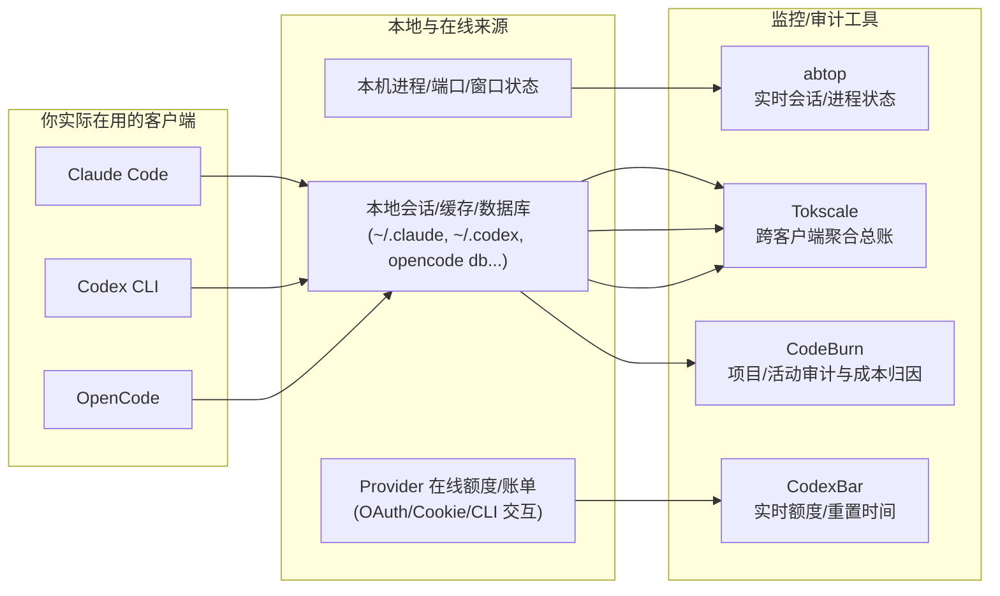

# abtop、CodeBurn、Tokscale、CodexBar：终端 Token 监控/审计工具详解与对比

> 面向你的组合：`Codex CLI / Claude Code / OpenCode`。目标是把「实时看额度」「实时看 agent 状态」「事后对账 + 成本归因」这三件事分开解决，别用一个工具硬扛全部。
>
> 相关素材来源（知识库内）：  
> - [AI token 账单终于能看明白了：这个开源工具把 OpenClaw、Codex、Claude Code 全给你摊平了](/articles/2026-04-28-AI-token-%E8%B4%A6%E5%8D%95%E7%BB%88%E4%BA%8E%E8%83%BD%E7%9C%8B%E6%98%8E%E7%99%BD%E4%BA%86-tokscale-4b529c4b/)  
> - abtop：给 Claude Code 和 Codex CLI 开了一个“任务管理器”  
> - CodexBar × CodeBurn，我找到了追踪 Token 消耗的最佳组合

## 先给结论：4 个工具各回答一个问题

| 工具 | 一句话定位 | 你什么时候用它 |
|---|---|---|
| `CodexBar` | 菜单栏「额度/重置时间」仪表盘（macOS） | 随时瞄一眼：今天还剩多少、多久重置 |
| `abtop` | 终端里的「AI agent 任务管理器」TUI | 你同时跑多个会话/多个 pane 时：哪个在烧、哪个限流、哪个上下文快满 |
| `Tokscale` | 跨客户端 token/成本总账（CLI/TUI/JSON/可视化） | 周/月复盘、做报表、跨工具聚合：到底谁最能吃 |
| `CodeBurn` | 本地会话审计 + 成本归因（偏项目/活动拆分） | 你想追责到“哪个项目/哪次任务/哪类操作”烧得最狠，并顺手找浪费 |

一句话建议（给你当前工具栈）：
- **日常**：`CodexBar + abtop`（实时额度 + 实时会话状态）
- **复盘**：`Tokscale`（总账）→ 再用 `CodeBurn`（项目/活动归因 + optimize 找浪费点）

## 数据从哪来（以及为什么这四个能互补）



关键点就一句：  
**`CodexBar` 偏“在线实时额度”；`abtop` 偏“本机运行时状态”；`Tokscale/CodeBurn` 偏“本地会话数据聚合与审计”。**  
所以它们叠加不是重复，而是互补。

## 安装（按 macOS 为主）

### CodexBar（菜单栏额度仪表盘，macOS 14+）

```bash
brew install --cask steipete/tap/codexbar
```

使用要点：
- 适合常驻：你不用打开终端就能知道“还剩多少、什么时候重置”。
- 它更像“实时额度读数”，不是复盘工具。

### abtop（终端 TUI，实时会话/进程状态）

前置：
- Rust 工具链（你已经有 `cargo` 会更顺）。

安装（偏开发者口味的最短路）：

```bash
cargo install abtop
```

使用要点：
- 推荐搭配 `tmux`：单独开一个 pane 跑 `abtop`，出问题直接切回对应会话 pane。

### Tokscale（跨客户端 token/成本总账）

最短路（不安装到全局）：

```bash
npx tokscale@latest
```

或者用 Bun：

```bash
bunx tokscale@latest
```

轻量模式（先看表格，少点花里胡哨）：

```bash
npx tokscale@latest --light
```

使用要点（和你强相关）：
- 它会聚合多个客户端（包含 Claude Code / Codex CLI / OpenCode）。
- 你要做周/月对账、分模型/分客户端拆账，用它最省心。

### CodeBurn（本地会话审计 + 成本归因）

全局安装：

```bash
npm install -g codeburn
```

不想全局装就直接跑：

```bash
npx codeburn
```

它的两个关键命令（你会常用）：

```bash
codeburn optimize
```

```bash
npx codeburn menubar
```

## 使用（给你一套“今天就能跑”的最常用命令）

### 1) 日常：先把“额度”和“运行状态”看住

- `CodexBar`：常驻菜单栏，解决“还剩多少/多久重置”
- `abtop`：终端常驻，解决“哪个会话在烧/是否限流/上下文是否接近上限”

### 2) 周/月复盘：Tokscale 先出总账，再决定要不要深挖

```bash
# 总览（表格）
npx tokscale@latest --light

# 最近 7 天（如果你更偏周复盘）
npx tokscale@latest --week

# 导出 JSON（想接你自己的报表/自动化）
npx tokscale@latest --json
```

如果你只关心这三类客户端（你现在就是这个情况）：

```bash
npx tokscale@latest --client codex,claude,opencode --week --light
```

### 3) 深挖：CodeBurn 把“钱烧在哪些项目/任务类型”拆出来

典型路径：

```bash
# 先让它把本地会话都扫一遍，出可读报表
npx codeburn

# 再跑 optimize，专门找“浪费模式”
codeburn optimize
```

如果你也喜欢“日常瞄一眼”，就把 CodeBurn 的菜单栏也装起来：

```bash
npx codeburn menubar
```

## 示例对话：

```text
你:
我现在同时跑 Codex CLI、Claude Code、OpenCode，想把 token 花在哪看清楚，但别搞太复杂。

AI:
先分两步：实时看“剩多少”和“谁在烧”；复盘再看“钱花在哪”。

你:
怎么做？

AI:
第一步：装 CodexBar，菜单栏随时看额度和重置时间。
第二步：终端开一个 pane 跑 abtop，看哪个会话在烧、有没有限流、上下文快不快满。
第三步：每周跑一次 tokscale，先出总账；觉得不对劲再用 codeburn 深挖到项目/任务维度。
```

## 对比（按你最关心的维度）

| 维度 | CodexBar | abtop | Tokscale | CodeBurn |
|---|---|---|---|---|
| 核心价值 | 实时额度/重置时间 | 实时会话/进程状态 | 跨客户端总账 + 成本 | 会话审计 + 成本归因 |
| 时间尺度 | 现在 | 现在 | 周/月/年 | 周/月/项目/任务 |
| 数据来源倾向 | 在线（Provider 侧） | 本机进程/端口/状态 | 本地会话/缓存聚合 | 本地会话/JSONL/DB 审计 |
| 适合解决的问题 | “我还剩多少？” | “谁在烧？谁限流？” | “到底是谁最能吃？” | “到底花在哪个项目/任务？” |
| 最适合你当前组合 | ⭐️⭐️⭐️⭐️⭐️ | ⭐️⭐️⭐️⭐️⭐️ | ⭐️⭐️⭐️⭐️⭐️ | ⭐️⭐️⭐️⭐️ |

## 上手成本与边界（别踩坑）

- 别指望一个工具把“实时额度 + 运行时状态 + 事后审计”全部做完：这会逼你要么牺牲实时性，要么牺牲归因粒度。
- Tokscale/CodeBurn 这类“事后聚合”工具，前提是你本地能留住会话数据；有的客户端会自动清理历史（想做长期统计就得关注清理策略）。
- `abtop` 是旁观者风格：更偏“观察你本机上的 agent 会话”，不接管工作流，这正是它的优势。

## 你的推荐组合（最省事的落地路径）

1. `brew install --cask steipete/tap/codexbar`（菜单栏常驻，解决“还剩多少”）
2. `cargo install abtop`（tmux 一个 pane 常驻，解决“谁在烧/谁限流”）
3. 每周五跑一次 `npx tokscale@latest --client codex,claude,opencode --week --light`（总账）
4. 看到异常再跑 `codeburn optimize`（定位浪费点）

## 接入 OpenClaw Cron：每周自动出报表（Tokscale + CodeBurn）

你要的不是“定时跑命令”，而是两件事：
1) 定时把 **原始数据导出**（方便后续追溯）  
2) 定时把 **人能读的报表落盘**（方便回看/归档/进知识库）

OpenClaw 的 cron 本质是“定时触发一次 agent run”。所以推荐做法是：**cron 触发 → agent 执行导出 → 写入 Vault 文件 → 终端再输出一段摘要**。

### 1）先确认你本机能跑这两条导出命令

Tokscale（聚合总账，建议先用你关心的三类客户端）：

```bash
npx tokscale@latest --client codex,claude,opencode --week --json
```

CodeBurn（做审计归因，直接导出 JSON 方便后续二次处理）：

```bash
npx --yes codeburn export -f json --from 2026-05-12 --to 2026-05-18 -o /tmp/codeburn-week.json
```

> 注意：`codeburn export` 的 `--from/--to` 是闭区间日期；你要跑“上周”，就用脚本/agent 先算出日期再填进去。

### 2）创建一个 cron job（每周五 18:10，Asia/Shanghai）

你可以先用 `list` 看现有 job：

```bash
openclaw cron list --all
```

然后新增一个 job（示例命令；`--message` 里把任务写清楚）：

```bash
openclaw cron add \
  --name weekly-ai-usage-report \
  --cron "0 10 18 * * 5" \
  --tz Asia/Shanghai \
  --expect-final \
  --tools exec read write \
  --announce \
  --message "每周生成 AI 用量报表：\n1) 计算上周日期区间（按 Asia/Shanghai）。\n2) 运行：npx tokscale@latest --client codex,claude,opencode --since <YYYY-MM-DD> --until <YYYY-MM-DD> --json\n3) 运行：npx --yes codeburn export -f json --from <YYYY-MM-DD> --to <YYYY-MM-DD> -o <tmp>\n4) 将两份 JSON 摘要成一个 Markdown 报表，落到：00-Inbox/ai-usage-reports/<YYYY-MM-DD>-ai-usage-weekly.md（含 frontmatter：title/aliases/category/created/updated/tags）。\n5) 最终输出 10 行以内摘要：本周总 token / 总成本 / top 模型 / top 客户端 / top 项目（如果能拿到）。"
```

如果你不想 cron 自动往聊天里发（只落盘），把 `--announce` 去掉就行。

### 3）跑一次验证（不用等到周五）

先拿到 jobId（`openclaw cron list` 里能看到），然后手动跑一次：

```bash
openclaw cron run <jobId> --force
```

跑完看执行历史/输出：

```bash
openclaw cron runs --id <jobId> --limit 5 --expect-final
```

### 4）报表写到哪（推荐：先进 Inbox，别自动改正式区）

建议 cron 默认只写到：
- `00-Inbox/ai-usage-reports/`

等你确认格式稳定、内容可信了，再考虑自动整理到：
- `02-Notes/`（周报/复盘型笔记）
- 或者进一步提炼成 `01-Articles/`（可发布文章）

#AI #Token #Codex #ClaudeCode #OpenCode #工程实践 #效率工具 #成本可视化
