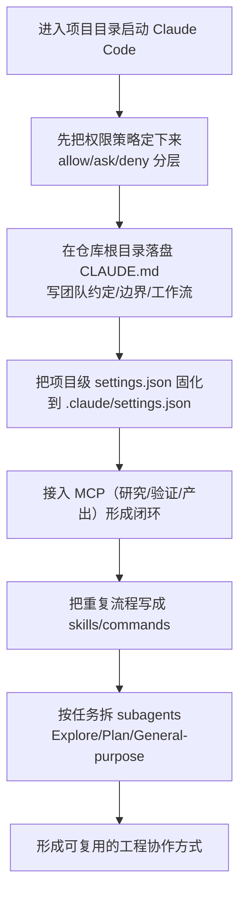

# Claude Code 最佳实践库解读：把“会写提示词”变成“能落地工程协作”

有些团队用 AI 写代码，像在抽奖：灵的时候很爽，不灵的时候越修越乱。  
更糟的是，不灵往往不是模型不行，而是“工程侧的入口”没搭好：规则没落盘、权限没约束、上下文没组织、工具没接上。  
于是每次开新会话都像从零开始。  
最后只能回到“vibe coding”——凭感觉赌输出。  

这次想分享的，是一个把这些坑讲得很实在的项目文档库：`shanraisshan/claude-code-best-practice`。它的价值不在于“多”，而在于把 Claude Code 里一堆容易被忽略、但真能改变产出质量的能力，按工程人能执行的方式梳出来了：`settings.json` 怎么配、权限怎么分层、MCP 怎么接、skills/commands/subagents 怎么组织、CLAUDE.md 怎么写才真有效。

一句人话结论：  
这份资料库的核心，是把 Claude Code 从“聊天式写码”拉回到“可控、可复用、可协作”的工程系统。

## 为什么值得看

项目文档把 Claude Code 里最影响交付质量的三件事讲透了：

- **规则可继承**：用 `CLAUDE.md` 让团队约定变成长期记忆，而不是每次重复解释。
- **行为可约束**：用权限层级（managed / CLI / project / user）把“能做什么”写清楚，避免工具乱跑。
- **能力可扩展**：用 MCP、skills、subagents 把“AI 会什么”从模型能力延伸到工程工具链能力。

换句话说，它关心的不是“怎么让模型更聪明”，而是“怎么让你在真实项目里更少翻车”。

## 项目核心能力拆解（按“工程可落地”的角度）

### 1) 配置不是一个文件，是一套“优先级系统”

项目文档把 Claude Code 配置的优先级讲得很明确（高到低）：**组织托管策略 > 命令行参数 > 项目本地（git ignored）> 项目共享（commit）> 用户全局**。这类层级一旦理清，很多团队争论会立刻消失：到底谁能改、该在哪改、改了为什么没生效。

它还强调了一个容易忽略的点：**managed settings 不能被下层覆盖**，尤其是 deny 规则有最高安全优先级。工程上这很重要——你不可能靠“约定”保证每个人都谨慎，但可以靠策略把危险操作直接锁死。

### 2) 权限：别追求“完全自动”，先追求“可控自动”

如果团队刚把 Claude Code 引入工作流，最常见的翻车点就是两种极端：

- 过度保守：每一步都要确认，节奏断得读者想骂人
- 过度放开：直接跳过权限，短期爽，长期出事

文档的思路更工程化：用 allow/ask/deny 和工具通配命名（尤其是 MCP 的 `mcp__<server>__<tool>`）把“常见的安全调用”放进 allow，把“高风险动作”留在 ask 或 deny。这样既不拖节奏，也不赌运气。

### 3) MCP：工具不是越多越好，关键是“工作链闭环”

文档给了一套很实用的“日用 MCP”组合思路：研究（Context7/DeepWiki）→ 验证（Playwright/Chrome）→ 产出（Excalidraw）。这比“装一堆 MCP”更像工程体系：每个环节都能闭环。

项目文档也给了 `.mcp.json` 的配置示例，并强调：**密钥用环境变量展开，不要写死在仓库里**。

```json
{
  "mcpServers": {
    "context7": {
      "command": "npx",
      "args": ["-y", "@upstash/context7-mcp"]
    },
    "playwright": {
      "command": "npx",
      "args": ["-y", "@playwright/mcp"]
    },
    "deepwiki": {
      "command": "npx",
      "args": ["-y", "deepwiki-mcp"]
    },
    "remote-api": {
      "type": "http",
      "url": "https://mcp.example.com/mcp"
    }
  }
}
```

```json
{
  "mcpServers": {
    "remote-api": {
      "type": "http",
      "url": "https://mcp.example.com/mcp?token=${MCP_API_TOKEN}"
    }
  }
}
```

### 4) skills / commands / subagents：把“会用”变成“可复用的团队资产”

很多人以为 “/xxx” 只是聊天指令。文档把它升级成了“工程资产”：

- **commands**：更像可复用的工作台命令（带参数、允许/禁止自动调用、可 fork 上下文）
- **skills**：更像可复用的流程模板（可约束工具、可指定模型/effort、可绑定 hooks）
- **subagents**：更像团队里的“分工角色”（Explore/Plan/general-purpose 等，附带工具权限与上下文策略）

当你把“调试、批处理、验证、生成测试”这些流程写成 skills/commands，Claude Code 才会从“每次靠嘴讲一遍”变成“团队复用、可审查、可迭代”的工具。

### 5) CLAUDE.md：真正决定输出质量的不是提示词，是“记忆结构”

项目文档强调：写好 `CLAUDE.md` 是最能提升产出的事之一，并且解释了在大型仓库里它是怎么被加载的：

- **向上加载**：从当前目录一路往上，启动时就把沿途的 `CLAUDE.md` 都加载进来  
- **向下懒加载**：子目录的 `CLAUDE.md` 只有当你读取/编辑子目录文件时才会进上下文  
- **兄弟目录不加载**：避免无关指令污染上下文

这个机制一旦理解，你就知道 CLAUDE.md 应该怎么分层：根目录写团队通用约定，子目录写组件特定规则，个人偏好放本地忽略文件里。

## 上手成本到底高不高

这套最佳实践不要求你一次到位。更现实的路径是：  
先把“配置层级 + 权限”弄清楚，再把“记忆（CLAUDE.md）”落盘，最后才是“工具扩展（MCP）”和“流程资产化（skills/subagents）”。

它在“怎么开始”上也给了一个非常低门槛的入口：Power-ups（交互式小课），你可以先把 Claude Code 的关键能力过一遍：

```bash
claude
/powerup
```

## 怎么用：按一条真实使用路径走一遍

下面这条路径，目标不是把功能全用上，而是让团队的协作从第一天就“可控、可复用”。



示例对话：

```text
你:
我们要把 Claude Code 引入这个仓库，先别追求全自动。请你按“安全优先”的思路：
1) 给一个最小可用的权限策略（哪些放 allow，哪些留 ask）
2) 给一份根目录 CLAUDE.md 的骨架（团队约定、边界、默认工作流）
3) 只选 2-4 个 MCP 服务器，保证研究→验证→产出闭环

AI:
可以。先从权限与记忆落盘开始：权限把“日常只读/低风险操作”放 allow，把写入/外部调用留 ask，把高风险动作明确 deny；
CLAUDE.md 用“仓库通用约定 + 组件特定约定”的分层结构；
MCP 先上 Context7（资料）+ Playwright（验证）+ Excalidraw（产出）这条闭环，别一开始装满。
```


## 核心概念

|功能|位置|说明|
|---|---|---|
|**子代理 (Subagents)**| `.claude/agents/<name>.md` |专注于特定功能的 AI 代理|
|**命令 (Commands)**| `.claude/commands/<name>.md` |快速触发的工作流命令|
|**技能 (Skills)**| `.claude/skills/<name>/SKILL.md` |可复用的功能模块|
|**工作流 (Workflows)**| `.claude/commands/` |复杂的多步骤流程|
|**钩子 (Hooks)**| `.claude/hooks/` |事件触发的自动化|
|**MCP 服务器**| `.claude/settings.json` , `.mcp.json` |模型上下文协议集成|
|**设置 (Settings)**| `.claude/settings.json` |项目和全局配置|
|**记忆 (Memory)**| `CLAUDE.md` , `.claude/rules/` |AI 行为和规则定义|

---

## 热门功能

|功能|位置|说明|
|---|---|---|
|**Ultrareview** (测试)| `/ultrareview` |任务跟踪和代码审查|
|**开发容器**| `.devcontainer/` |一致的开发环境|
|**Channels** (测试)| `--channels` |多通道集成|
|**Ultraplan** (测试)| `/ultraplan` |智能规划工具|
|**自动模式** (测试)| `--permission-mode auto` |消除权限提示|
|**Power-ups**| `/powerup` |高级功能增强|
|**快速模式** (测试)| `/fast` |加快处理速度|
|**计算机使用** (测试)| `computer-use` MCP|桌面自动化|
|**Agent SDK**|npm / pip 包|构建自定义代理|

---

## 开发工作流

所有主要工作流都遵循同一架构模式：**研究 → 规划 → 执行 → 审查 → 发布**

|名称|⭐|工作流|
|---|---|---|
| [Superpowers][1] |188 k|头脑风暴 → 规划 → 实现|
| [Everything Claude Code][2] |180 k|计划 → 实现 → 验证|
| [Spec Kit][3] |97 k|宪法 → 规范 → 实现|
| [gstack][4] |95 k|办公时间 → 规划 → 代码|

---

## 技能集合

按星数排序的最受欢迎的技能库：

| 名称                                                                        | ⭐     | 技能数    |
| ------------------------------------------------------------------------- | ----- | ------ |
| [anthropics/skills][5]                 | 133 k | 17     |
| [mattpocock/skills][6]                 | 76 k  | 24     |
| [wshobson/agents][7]                     | 35 k  | 153    |
| [agent-skills][8]                | 27 k  | 21     |
| [awesome-agent-skills][9] | 21 k  | 1,100+ |

---

## 代理集合

最受欢迎的代理定义库：

|名称|⭐|代理数|
|---|---|---|
| [msitarzewski/agency-agents][10] |96 k|198|
| [VoltAgent/awesome-claude-code-subagents][11] |20 k|189|

---

## 技巧和技巧 (83 个)

### 不要过度管理

**提示 (3 个)**

|技巧|来源|
|---|---|
|挑战 Claude——"审视这些变更，直到我通过你的测试才提交 PR"|Boris|
|修复效果不理想后——"了解所有信息后，重新实现优雅的解决方案"|Boris|
|Claude 通常自己修复大多数 bug——粘贴 bug，说"修复"，不要微管理|Boris|

**规划/规范 (7 个)**

|技巧|来源|
|---|---|
|始终从[规划模式][12]开始|Boris|
|用最少的规范开始，让 Claude 通过 [AskUserQuestion][13] 工具采访你|Thariq|
|始终制定分阶段的门控计划，每个阶段有多个测试（单元、自动化、集成）|Dex|
|将 PRD 分解为纵切片（追踪器），跨越所有层（DB + 服务 + UI）|Boris|
|启动第二个 Claude 作为员工工程师审查你的计划|Boris|

**上下文 (5 个)**

|技巧|来源|
|---|---|
|在 1 M 上下文模型上，上下文衰退在~300-400 k tokens 开始——保持会话在那之下|Thariq|
|在~40%上下文时进入"愚蠢区"——保持在 40%以下|Thariq|
|倒回 > 修正——双按 Esc 或使用 [/rewind][14] 返回失败前的状态|Thariq|
| [/compact][15] 提示比让自动压缩运行更好|Thariq|
|使用子代理进行上下文管理——只让 child 的最终结果进入主上下文|Thariq|


---

## 视频/播客

|视频/播客|来源|YouTube|
|---|---|---|
|从感觉编码到智能代理工程 (Andrej) \| 2026 年 5 月 2 日|AI Engineer| [观看][22] |
|AI 编码工作流完整演练 (Matt) \| 2026 年 4 月 24 日|Matt Pocock| [观看][23] |
|构建 Claude Code (Boris) \| 2026 年 3 月 4 日|Pragmatic Engineer| [观看][24] |

---

## 如何使用

按以下步骤充分利用本仓库：

1. **作为课程阅读，不是工作流** — 这是参考资料；稍后运行内容
   
2. **不要将 Claude 作为聊天机器人使用** — 学习原语（agents、commands、skills、hooks）并组装成自己的工作流
   
3. **运行 [`/weather-orchestrator`][25] ** 查看完整的命令 → 代理 → 技能流程
   
4. **在工作时监听自定义钩子声音** — 实现在 [Claude Code 钩子仓库][26]
   
5. **学习高级主题和实现** — 从 [热门](#-%E7%83%AD%E9%97%A8%E5%8A%9F%E8%83%BD)小节了解
   
6. **在你的项目中指向[技巧和技巧](#-%E6%8A%80%E5%B7%A7%E5%92%8C%E6%8A%80%E5%B7%A7-83%E4%B8%AA)部分** — 所有技巧都有来源标注
   
7. **订阅社区** — 在[订阅](#-%E8%AE%A2%E9%98%85)部分查看 Reddit 和 YouTube 频道
   

---

## 其他资源

- [Claude Code 官方文档][27]
  
- [Anthropic 提示工程指南][28]
  
- [Agent SDK 快速开始][29]
  

---


## 哪些地方是真的香（只说三句）

- 把配置层级讲清楚之后，团队不再靠“玄学”解释为什么没生效。  
- 把 CLAUDE.md 分层落盘之后，会话不再从零开始，输出稳定性明显上升。  
- 把 MCP 和 skills 串成闭环之后，AI 才真正从“写代码”走到“做工程”。  

## 哪些人会更适合

- 需要把 Claude Code 变成**团队工具**（而不只是个人玩具）的负责人  
- 在 monorepo 里经常被“上下文污染/指令互相打架”折磨的工程团队  
- 想把“调试/验证/生成测试/批处理”流程**资产化**的开发者  
- 对“权限与合规”敏感、不能接受随意执行命令的团队  
- 需要把 AI 接入真实工具链（浏览器、文档、CI、知识库）的人  

## 使用前最好知道的边界

- 这套最佳实践的前提，是你愿意把“规则、权限、流程”当作工程资产去维护；不维护，效果会快速衰减。  
- MCP/skills/subagents 一旦引入，就会涉及更多“组织治理问题”：谁维护配置、谁评审变更、怎么控制风险。  
- 追求速度可以，但别从“跳过权限”开始；可控自动的收益，远大于一次性的省几次确认。  

## 收尾总结

如果只把 Claude Code 当“更聪明的聊天框”，你会很快回到拼运气。  
但如果你把它当成“可配置、可约束、可扩展、可复用”的工程协作系统，这份最佳实践库能帮你少走很多弯路。  

---

## 链接列表

[1]: https://github.com/obra/superpowers
[2]: https://github.com/affaan-m/everything-claude-code
[3]: https://github.com/github/spec-kit
[4]: https://github.com/garrytan/gstack
[5]: https://github.com/anthropics/skills
[6]: https://github.com/mattpocock/skills
[7]: https://github.com/wshobson/agents
[8]: https://github.com/addyosmani/agent-skills
[9]: https://github.com/VoltAgent/awesome-agent-skills
[10]: https://github.com/msitarzewski/agency-agents
[11]: https://github.com/VoltAgent/awesome-claude-code-subagents
[12]: https://code.claude.com/docs/en/common-workflows
[13]: https://code.claude.com/docs/en/cli-reference
[14]: https://code.claude.com/docs/en/checkpointing
[15]: https://code.claude.com/docs/en/interactive-mode
[22]: https://www.youtube.com/watch?v=...
[23]: https://youtu.be/-QFHIoCo-Ko
[24]: https://youtu.be/julbw1JuAz0
[25]: orchestration-workflow/orchestration-workflow.md
[26]: https://github.com/shanraisshan/claude-code-hooks
[27]: https://code.claude.com/docs
[28]: https://github.com/anthropics/prompt-eng-interactive-tutorial
[29]: https://code.claude.com/docs/en/agent-sdk/quickstart


#ClaudeCode #AIAgent #工程实践 #工具链 #MCP #skills #subagents #权限治理 #团队协作 #上下文管理
